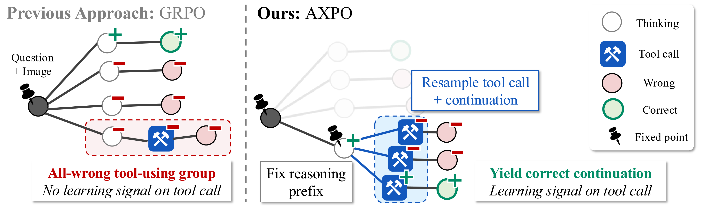
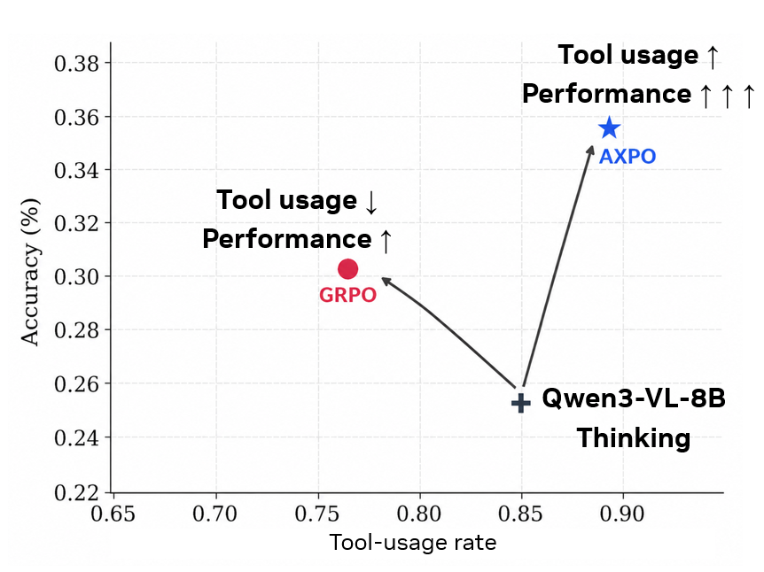
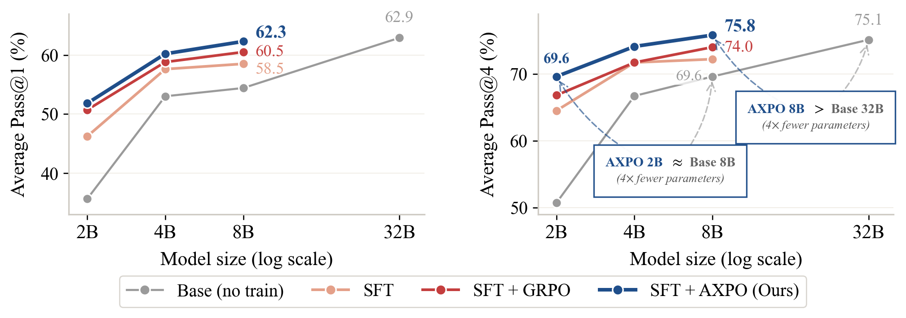
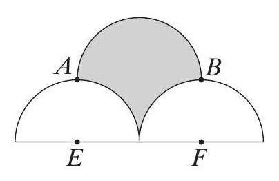
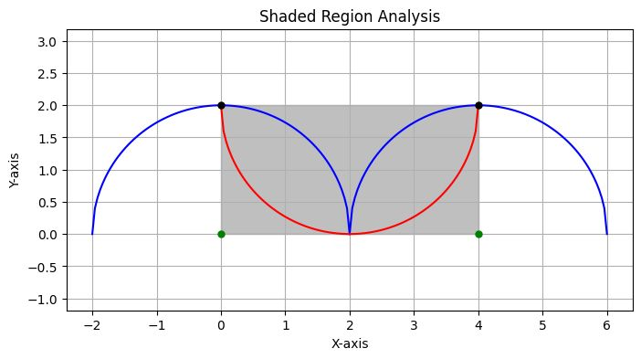

NVIDIA와 KAIST 연구진이 최근 이상한 현상 하나를 발견했다. AI 모델에 강화학습을 시키면 시킬수록 ==도구를 안 쓰게 된다==는 거다.

도구를 쓸 줄 알면서도, 쓰면 더 정확하다는 걸 알면서도, 그냥 머리만으로 대답해버린다. 마치 계산기를 옆에 두고도 암산만 하려는 사람 같다고 연구진은 말했다.

논문 이름은 AXPO(Agent eXplorative Policy Optimization). 이 문제에 정확히 칼을 댄다.

> Paper: [Agent Explorative Policy Optimization for Multimodal Agentic Reasoning](https://arxiv.org/abs/2605.28774) (NVIDIA & KAIST, 2026.05)
> Project: [AXPO Project Page](https://byungkwanlee.github.io/AXPO-page/)

---

## "도구 붕괴"라는 이름의 병

연구진은 이 현상에 이름을 붙였다. ==**도구 붕괴(Tool Collapse)**==.

AI 모델을 강화학습으로 훈련시키는 표준 방법인 GRPO를 돌려보면 기가 막힌다. 한 번의 추론 시도에서 도구를 꺼내 쓰는 비율이 ~30%. 그나마 도구를 쓴 경우의 약 40%는 ==그룹 전체가 다 틀린다.==

이게 왜 문제냐. 모델이 도구를 써보려다 틀리면, 학습 신호가 "도구 쓰지 마"로 들어간다. 도구를 안 쓰고 맞춘 건 긍정 신호를 받고, 도구를 써서 틀린 건 부정 신호를 받는다. 당연히 모델은 도구를 안 쓰는 쪽으로 수렴한다.

한마디로: 틀려본 적이 없으니까 시도도 안 하는 거다.

---

## AXPO: 틀린 곳에서 주사위를 다시 굴린다

해법은 놀라울 정도로 직관적이다.

AXPO는 모델이 도구를 써서 전부 틀린 경우를 찾아낸다. 그다음 ==**생각하는 부분은 그대로 두고, 도구를 호출하는 부분만 다시 생성**==하게 만든다. 주사위를 다시 굴리는 셈이다.

원래 강화학습에서는 한 번 틀리면 그걸로 끝이다. "틀렸어, 다음엔 도구 쓰지 마"라고 배운다. 하지만 AXPO는 "생각은 좋았어, 도구 호출만 다시 해보자"라고 되돌려준다. ==틀린 것조차 학습 재료로 쓰는 거다.==

여기에 불확실성 기반 접두사 선택이라는 장치를 더했다. 모델이 어디서 망설였는지 감지해서, 그 망설임 지점부터 다시 시도한다. "이미지를 확대해봐야 할 것 같은데..." 하다가 멈춘 지점을 찾아내서, 거기서부터 다시 도구를 호출하게 만드는 거다.

---

## 8B 모델이 32B를 이겼다

결과가 묵직하다. 9개의 멀티모달 벤치마크에서 Qwen3-VL-Thinking 모델 세 가지 크기로 실험했다.

==**8B(80억 파라미터) 모델에 AXPO를 적용하니, 32B(320억 파라미터) 베이스라인을 Pass@4에서 추월했다.**== 파라미터 수는 4분의 1인데 성능은 더 높다.

숫자로 보면:

- 기존 GRPO 대비 Pass@1 평균 +1.8%p, Pass@4 평균 +1.8%p
- 아무 훈련도 안 한 베이스라인 대비 Pass@1은 +7.9%p, Pass@4는 +6.2%p
- GRPO는 도구 사용률을 희생해서 정확도를 조금 올린다. AXPO는 ==도구 사용률과 정확도를 동시에 올린다.==

---

## GRPO가 틀리고 AXPO가 맞춘 세 순간

논문에서 가장 흥미로운 건 실제 문제 풀이 사례다. 같은 문제를 GRPO와 AXPO가 어떻게 다르게 푸는지 비교해준다.

**첫 번째: 이미지에서 숫자 찾기.** "1000 왼쪽에 있는 숫자는?"이라는 질문이 주어졌다.

GRPO는 "1000 왼쪽은 999지"라고 추측하고 끝낸다. `image_zoom_in` 도구를 떠올리면서도, 결국 호출하지 않는다. AXPO는 같은 도구를 떠올리고 ==실제로 호출한다.==

결과는 2563. 정답.

**두 번째: 수학 문제.** 세 개의 반원이 그려진 도형에서 색칠된 영역의 넓이 구하기.

GRPO는 대수적 계산만으로 4라고 답한다. 틀렸다. AXPO는 파이썬으로 시각화 코드를 돌려본다.

도형을 직접 그려보니 영역이 뒤바뀌어 있다는 걸 눈으로 확인하고, 정답 8을 낸다.

**세 번째: 두 단계 검색.** "이 패션쇼 디자이너가 태어난 도시의 2025년 8월 시장은 몇 년생인가?"

GRPO는 디자이너의 출생지를 검색하고 거기서 멈춘다. 두 번째 검색을 안 한다. AXPO는 출생지를 찾고, ==그 도시의 시장을 다시 검색한다.== 정답은 1984.

공통점이 있다. GRPO는 도구를 "알면서도" 안 쓴다. AXPO는 안다면 쓴다. 그 차이가 만들어내는 결과 차이가 이 논문의 전부다.

---

## 도구를 쓰는 AI, 쓰지 않는 AI

이 논문이 던지는 질문은 단순하지만 깊다. ==**AI가 도구를 "알면서도" 안 쓴다면, 그건 능력의 문제인가, 학습의 문제인가?**==

AXPO의 대답은 학습의 문제라고 한다. 모델이 도구를 쓰는 능력이 없는 게 아니라, 훈련 과정에서 도구 사용에 대한 긍정적 신호가 부족했을 뿐이라고. 그 신호만 보완하면, 4배 작은 모델도 4배 큰 모델을 넘어선다.

에이전트 AI의 궁극적인 목표는 혼자 생각하는 게 아니다. 필요할 때 도구를 꺼내 쓰고, 검색하고, 계산하고, 확인하는 거다. AXPO는 그 "필요할 때"를 학습시키는 방법을 보여준다.

==AI가 도구를 쓰지 않는 건 게으름이 아니다. 한 번 틀려본 적이 없어서, 시도조차 하지 않는 거다.== 그리고 그건 고칠 수 있다.
