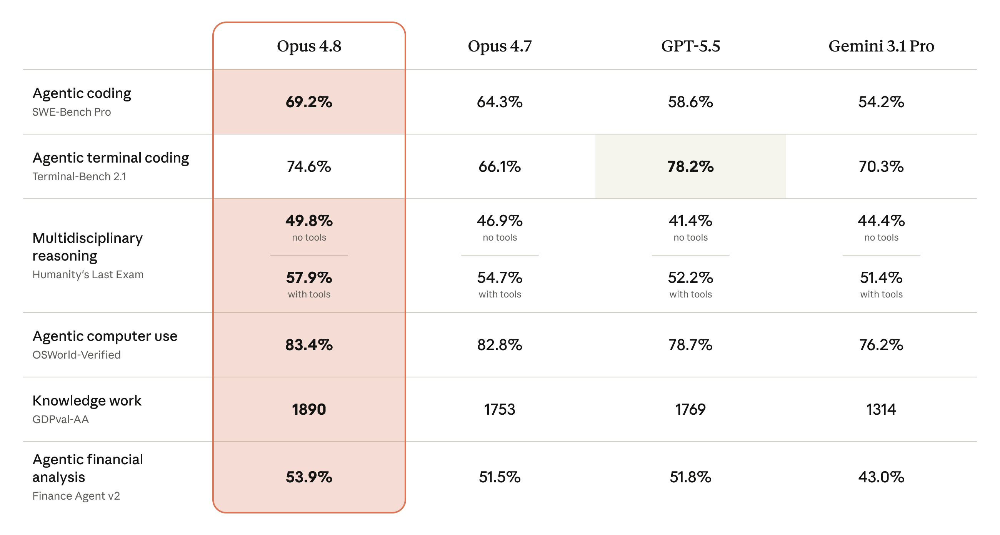
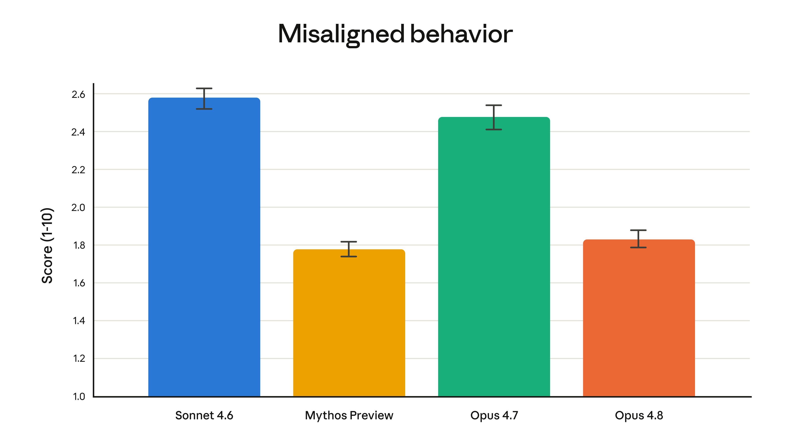

> **원문:** [Introducing Claude Opus 4.8 — Anthropic](https://www.anthropic.com/news/claude-opus-4-8)
> **발표일:** 2026년 5월 28일

---

## 핵심 요약

- **Claude Opus 4.8**은 전작 Opus 4.7을 기반으로 코딩·에이전트·추론·실무 벤치마크 전반에서 향상
- **동일 가격**으로 오늘부터 전 플랫폼에서 사용 가능
- **동적 워크플로(Dynamic Workflows)**, **노력 제어(Effort Control)**, **Messages API 시스템 엔트리** 지원이 함께 발표
- 패스트 모드 속도 2.5배, 비용은 기존 대비 **3분의 1**로 인하

---

## Opus 4.8의 성능

아래 표는 코딩, 에이전트 스킬, 추론, 실무 지식 작업 테스트에서 Opus 4.8이 전작 및 타 모델과 비교한 결과다. 더 자세한 평가는 [Claude Opus 4.8 시스템 카드](https://www.anthropic.com/claude-opus-4-8-system-card)에서 확인할 수 있다.

---

## Opus 4.8과의 협업

얼리 테스터들은 Claude Opus 4.8이 에이전트 작업에서 **더 신뢰할 수 있고 판단력이 뛰어나다**고 평가했다. 주요 피드백을 정리하면:

- **더 나은 판단력** — Claude Code에서 올바른 질문을 던지고, 스스로 실수를 잡아내며, 계획이 탄탄하지 않으면 반론을 제기
- **Super-Agent 벤치마크** — 모든 케이스를 엔드투엔드로 완주한 유일한 모델. 번역, 심층 리서치, 슬라이드 생성, 분석 등 에이전트 제품에서 강력한 신뢰성 제공
- **CursorBench** — 모든 노력 수준에서 기존 Opus 모델을 상회. 도구 호출이 더 효율적
- **법률 에이전트 벤치마크** — 역대 최고 점수 기록. 실무 법률 작업에서 정확도 향상이 곧 더 많은 업무 위임으로 이어짐
- **컴퓨터 사용·브라우저 에이전트** — Online-Mind2Web에서 84% 기록. Opus 4.7과 GPT-5.5 대비 유의미한 도약
- **장시간 실행 분석** — 일관되게 더 높은 품질, 더 빠른 완료, 더 풍부한 출력. 입력과 출력의 문제를 **자발적으로 지적**하는 능력이 가장 큰 차별점

### 정직성의 도약

Opus 4.8의 가장 두드러진 개선점 중 하나는 **정직성**이다. AI 모델의 일반적인 문제는 근거가 약함에도 진전이 있다고 자신 있게 주장하는 것이다. Opus 4.8은 불확실성을 더 잘 지적하고, 근거 없는 주장을 덜 한다.

평가 결과, Opus 4.8은 전작에 비해 작성한 코드의 결함을 **약 4배 더 잘 감지**한다.

Anthropic의 정렬(Alignment) 팀은 Opus 4.8에 대해 다음과 같이 평가했다:

> "사용자 자율성 지원과 사용자의 최선 이익 행동 같은 친사회적 특성 측정에서 새로운 최고점에 도달했다."

오정렬 행동(기만, 오용 협조 등) 비율은 Opus 4.7보다 현저히 낮으며, Anthropic의 최고 정렬 모델인 **Claude Mythos Preview**와 유사한 수준이다.

---

## 함께 발표된 기능

### 1. 동적 워크플로 (Dynamic Workflows)

Claude Code에서 사용할 수 있는 **새로운 기능**으로, Claude가 대규모 작업을 처리할 수 있게 한다.

- 작업을 계획한 뒤 **수백 개의 병렬 서브에이전트**를 단일 세션에서 실행
- Opus 4.8에서는 에이전트가 **더 오래 실행** 가능
- 출력을 검증한 후 사용자에게 결과를 보고
- 예시: 수십만 줄의 코드베이스 마이그레이션을 킥오프부터 머지까지 자동 수행

> 자세한 내용: [Introducing Dynamic Workflows in Claude Code](https://claude.com/blog/introducing-dynamic-workflows-in-claude-code)
> — Enterprise, Team, Max 플랜에서 사용 가능

### 2. 노력 제어 (Effort Control)

claude.ai와 Cowork에서 새롭게 추가된 제어 기능:

- **높은 노력** → 더 자주, 더 깊이 생각하여 더 나은 응답
- **낮은 노력** → 더 빠른 응답, 요금 한도를 더 느리게 소모
- **모든 플랜**에서 사용 가능

### 3. Messages API — 시스템 엔트리 지원

개발자가 작업 중간에 Claude의 지시사항을 업데이트할 수 있게 되었다:

- 프롬프트 캐시를 깨지 않고 중간에 지시 업데이트
- 사용자 턴을 거치지 않고 권한, 토큰 예산, 환경 컨텍스트를 에이전트 실행 중에 변경

---

## 노력(Effort)에 대한 참고

Opus 4.8은 기본적으로 **높은 노력(high effort)** 을 사용한다. 코딩 작업에서 이 수준은 Opus 4.7의 기본과 비슷한 토큰을 소모하지만 **더 나은 성능**을 보여준다.

| 설정 | Claude Code 명령 | 권장 용도 |
|------|-------------------|-----------|
| 높음 (기본) | `high` | 일반 작업 |
| 추가 | `xhigh` | 어려운 작업, 장시 실행 비동기 워크플로 |
| 최대 | `max` | 최고 품질이 필요한 경우 |

Claude Code의 요금 한도도 높은 노력 수준의 토큰 사용량에 맞춰 증가했다.

---

## 영상 소개

<iframe width="100%" height="450" src="https://www.youtube.com/embed/5HVPeux24WU" frameborder="0" allowfullscreen></iframe>

---

## 다음 계획

Opus 4.8은 전작 대비 **겸손하지만 실질적인 향상**이다. Anthropic은 다음 단계도 준비 중이다:

1. **저비용 Opus급 모델** — Opus와 동등한 능력을 더 낮은 비용에 제공하는 모델 개발 중
2. **Mythos급 모델** — Opus보다 더 높은 지능을 갖춘 새로운 클래스. [Project Glasswing](https://www.anthropic.com/research/glasswing-initial-update)의 일환으로 일부 조직이 사이버보안 작업에 Claude Mythos Preview를 사용 중이며, 안전장치 개발이 빠르게 진행되어 **수주 내** 모든 고객에게 공개할 예정

---

## 가용성 및 가격

| 항목 | 가격 |
|------|------|
| 입력 토큰 (일반) | $5 / 백만 토큰 |
| 출력 토큰 (일반) | $25 / 백만 토큰 |
| 입력 토큰 (패스트 모드) | $10 / 백만 토큰 |
| 출력 토큰 (패스트 모드) | $50 / 백만 토큰 |

- **일반 모드 가격은 Opus 4.7과 동일**
- **패스트 모드는 2.5× 속도에 종전 대비 3분의 1 비용**
- API 모델명: `claude-opus-4-8`
- [Claude API 문서](https://platform.claude.com/docs/en/about-claude/models/overview)

---

## 각주

- **Terminal-Bench 2.1:** 모든 모델의 점수는 Terminus-2 공개 하네스 기준. GPT-5.5의 Codex CLI 하네스 점수는 83.4%로 보고됨
- **OSWorld-Verified:** 실제 환경에서의 성능을 더 정확히 반영하도록 평가 방식을 변경했으며, Opus 4.7 점수를 82.3%로 업데이트. 자세한 내용은 [시스템 카드](https://www.anthropic.com/claude-opus-4-8-system-card) 참조
- **Finance Agent v2:** Gemini 3.5 Flash가 57.9%를 기록하며 Gemini 3.1 Pro 대비 유의미한 향상
