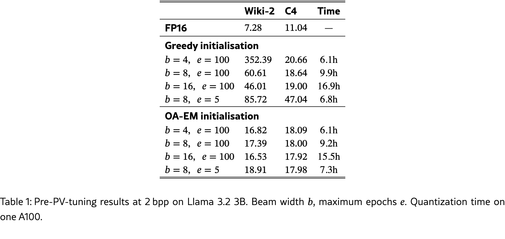
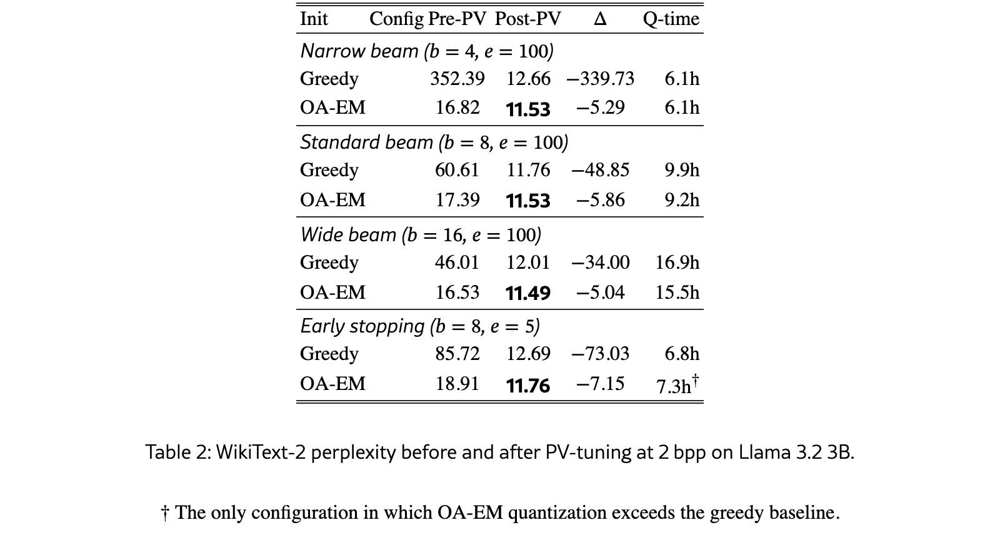

## 들어가며: 왜 2비트 양자화가 중요한가?

LLM(대형 언어 모델)을 로컬에서 돌리고 싶다면, 메모리가 가장 큰 걸림돌이다. Llama 3.1 8B 모델은 FP16 기준 약 16GB가 필요하다. 4비트 양자화(약 4GB)는 거의 손실 없이 동작하지만, 2비트 양자화(약 2GB)에 도전하면 이야기가 달라진다. 스마트폰, 라즈베리파이, 엣지 디바이스에서 LLM을 구동하려면 2비트 양자화가 필수적이다. 하지만 기존 방식으로 2비트 양자화를 적용하면 모델이 완전히 망가지는 경우가 많았다.

셰필드 대학교의 Ian Kennedy와 Nafise Sadat Moosavi가 발표한 논문 *"Initialisation Determines the Basin: Efficient Codebook Optimisation for Extreme LLM Quantization"*은 이 문제의 원인과 해결책을 명쾌하게 제시한다.

## 기존 방식의 치명적 문제: 시작이 반이다

가산 양자화(Additive Quantization)는 가중치를 여러 코드북의 코드워드 합으로 표현하는 방식이다. 예를 들어 8개 가중치를 2개의 코드북(각 256개 항목)으로 표현하면, 2비트/파라미터(bit per parameter, bpp) 압축이 된다.

기존에는 코드북 초기화를 **greedy sequential fitting**(탐욕적 순차 적합)으로 수행했다. 첫 번째 코드북을 먼저 최적화하고, 그 잔차로 두 번째 코드북을 최적화하는 식이다. 문제는 이 초기화가 **최적화의 출발점(basin)을 결정**한다는 것이다. 나쁜 출발점에서 시작하면, 아무리 beam search를 넓히고 fine-tuning을 많이 해도 한계가 있다.

논문의 핵심 발견: **2비트에서 greedy 초기화는 beam width 4에서 perplexity 352, beam width 8에서도 60.61**을 기록했다. FP16 기준이 7.28이니 사실상 사용 불가능한 수준이다.

## ρ(Representational Ratio): 왜 2비트에서만 이렇게 심각한가?

논문은 **ρ = N / K^M**이라는 지표를 제안한다:

- **N**: 레이어당 가중치 그룹 수
- **K**: 코드북 크기 (256)
- **M**: 코드북 개수

ρ가 1보다 작으면(과잉 표현) 초기화 오류가 흡수된다. ρ가 1보다 크면(과소 표현) 가중치 그룹들이 제한된 코드북 용량을 두고 경쟁하게 되어, 초기 배치가 치명적이 된다.

Llama 3.2 3B 모델의 경우:

| 압축률 | ρ 값 | 상태 | 초기화 영향 |
|--------|------|------|-------------|
| **3 bpp** | ρ ≈ 0.07 | 과잉 표현 (여유) | 손실 약 0.65 ppl 포인트 (감당 가능) |
| **2 bpp** | ρ ≈ 18 | 과소 표현 (포화) | 손실 수십~수백 ppl 포인트 (치명적) |

이는 점진적 저하가 아니라 **질적 전환(qualitative change)**이다. 256배의 용량 축소가 일어나는 2비트 체제에서는 근본적으로 다른 접근이 필요하다.

> 아래 표는 논문 원문에서 직접 추출한 자료다. 3 bpp에서는 여유가 있지만, 2 bpp에서는 표현 용량이 급격히 부족해지는 점이 핵심이다.

## OA-EM: 출력을 고려한 EM 초기화

논문이 제안하는 **OA-EM(Output-Aware Expectation-Maximisation)**은 코드북 초기화를 개선하는 방법이다:

1. **Hessian-weighted Mahalanobis distance**를 사용: 가중치 공간의 거리가 아니라, 실제 출력(activation) 공간에서의 재구성 오차를 직접 최소화
2. 반복적 EM 알고리즘으로 코드북을 점진적 개선
3. 기존 AQLM 파이프라인에 **drop-in replacement**로 적용 가능

핵심 아이디어는 간단하다. 가중치 값 자체를 정확히 복원하는 것보다, **모델의 출력에 미치는 영향**을 최소화하는 방향으로 코드북을 초기화하라는 것이다. 이는 "어떤 가중치가 더 중요한가?"를 calibration 데이터로부터 자동으로 학습한다.

## 실험 결과: 압도적 차이

세 가지 모델에서 일관된 결과를 보여줬다:

### Llama 3.2 3B (WikiText-2 Perplexity)

- Greedy 초기화 (beam 8, PV-tuning 후): **11.76**
- OA-EM 초기화 (beam 8, PV-tuning 후): **11.53**
- 더 놀라운 점: beam width를 8→16으로 늘리면 greedy는 12.01로 **악화**, OA-EM은 11.49로 **개선**

> 아래 표는 PV-tuning 전 결과다. 같은 2 bpp 조건에서도 greedy 초기화는 beam width를 아무리 키워도 크게 망가지고, OA-EM은 훨씬 안정적이다.

### Llama 3.1 8B & Qwen 2.5 3B

모든 beam width, epoch budget, 압축률 설정에서 OA-EM이 우위를 유지했다. 특히 Pareto frontier(품질-연산 트레이드오프)에서 완전히 지배적인 성능을 보여줬다.

### Basin Persistence (분지 지속성)

PV-tuning 전에는 43점 차이가 나던 perplexity gap이 PV-tuning 후에도 0.23점까지 줄어들 뿐, OA-EM의 우위는 **모든 설정에서 지속**되었다. 즉, 초기화가 결정한 최적화 분지는 fine-tuning으로도 뒤집을 수 없다.

> 아래 표가 이 논문의 핵심 주장이다. PV-tuning이라는 강한 후처리를 거쳐도, 더 좋은 초기화에서 시작한 모델이 끝까지 더 좋은 위치에 남는다.

## 실제 응용: Apple Silicon에서 70B+ 모델 구동?

2비트 양자화가 안정적으로 동작한다면:

| 모델 | 원본 크기 | 2비트 압축 후 | 구동 환경 |
|------|-----------|---------------|-----------|
| **Llama 3.1 70B** | ~140GB | ~17.5GB | M4 Max 128GB 로컬 구동 가능 |
| **Llama 3.2 3B** | ~6GB | ~750MB | iPhone/iPad 구동 가능 |
| **Qwen 2.5 72B** | ~144GB | ~18GB | M5 Max 192GB 구동 가능 |

추론 속도 면에서도 유리하다. LUT(Look-Up Table) 기반 역양자화는 MAC 연산이 0개, 순수 메모리 읽기만으로 동작하므로 ARM CPU에서 특히 유리하다. 엣지 디바이스에서 ALU 사이클이 병목인 환경(마이크로컨트롤러, 저전력 추론 가속기)에서 OA-EM + AQLM 조합은 매력적인 선택지가 된다.

## 결론 및 시사점

이 논문이 주는 교훈은 단순하지만 강력하다:

1. **초기화가 결과를 결정한다**: 2비트 양자화에서는 코드북 초기화가 beam search나 fine-tuning보다 중요하다
2. **ρ로 위험을 예측할 수 있다**: representational ratio가 1을 넘으면 특별한 주의가 필요하다
3. **더 많은 연산이 답이 아니다**: 잘못된 초기화에서는 더 넓은 beam search가 오히려 결과를 악화시킬 수 있다
4. **자유 형식 코드북도 충분하다**: OA-EM만으로 구조적 코드북(GLVQ 등)과 경쟁 가능한 성능, 그러면서도 LUT 추론의 이점 유지

앞으로 LLM 양자화 연구에서 초기화 전략에 대한 관심이 높아질 것이다. 특히 1비트 양자화나 더 극단적 압축을 시도하는 연구자들에게 ρ 분석과 OA-EM 방법론은 필수적인 도구가 될 것이다.

**논문**: [arXiv:2604.08118](https://arxiv.org/abs/2604.08118) | **코드**: [GitHub](https://github.com/kenno94-IK/aqlm-oaem)
