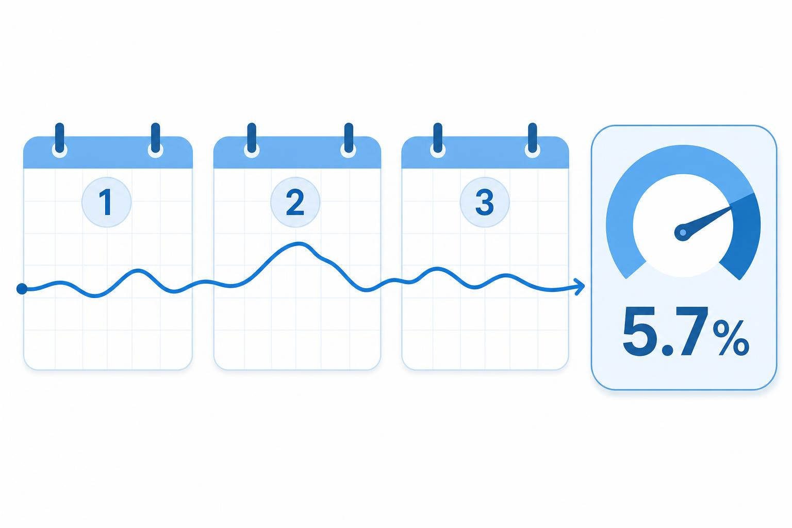

# 40대 당화혈색소 5.7%, 공복혈당이 정상이어도 놓치면 안 되는 이유

40대는 공복혈당 한 번 괜찮게 나오면 마음이 풀림. 근데 HbA1c는 다른 얘기임. 최근 2~3개월 평균을 보니까, 아침 검사 한 번으로는 안 보이던 흐름이 잡힘.

1. 당화혈색소는 지난 2~3개월 평균 혈당을 보는 검사임. Mayo Clinic도 A1C가 평균 혈당을 보여준다고 설명함.

2. 숫자 기준도 꽤 분명함. 5.7% 미만은 정상, 5.7~6.4%는 당뇨전단계, 6.5% 이상은 당뇨 쪽으로 봄. NIDDK와 Mayo Clinic 기준이 같음.

3. 문제는 증상이 거의 없다는 점임. CDC도 당뇨전단계는 몇 년 동안 조용할 수 있다고 적어둠. 몸이 조용하다고 안전한 건 아님.

4. 40대가 더 자주 걸리는 이유도 단순함. 체중은 조금씩 늘고, 운동은 줄고, 저녁은 늦어지고, 술자리와 야식이 붙음. CDC도 45세 이상을 당뇨전단계 검사 위험요인으로 봄. 혈당은 이런 패턴을 오래 기억함.

5. 공복혈당이 정상이어도 안심 끝은 아님. 아침 수치 하나는 그날 컨디션 영향을 많이 받는데, A1C는 좀 더 긴 기간을 봄. 그래서 서로 역할이 다름.

6. 반대로 A1C만 보고 단정하면 안 됨. NIDDK는 당뇨 진단에 다른 혈당검사와 함께 쓰기도 하고, 증상이 없으면 반복 확인이 필요하다고 말함.

7. 제일 현실적인 첫 조치는 겁먹는 게 아니라 패턴을 바꾸는 거임. CDC는 체중의 5~7%만 줄여도 위험을 낮출 수 있다고 봄.

8. 운동도 거창할 필요 없음. 주 150분 빠르게 걷기만 해도 됨. 30분씩 5일이 제일 현실적임.

9. 저녁 식사가 특히 중요함. 밥 양만 줄이는 것보다 늦은 야식, 달달한 음료, 술 안주를 먼저 끊는 게 효과가 큼.

10. 잠도 빠질 수 없음. 수면이 밀리면 식욕과 혈당이 같이 흔들림. 40대는 일이 바쁘다고 수면부터 무너지는 경우가 많음.

11. 검사 준비는 생각보다 편함. Mayo Clinic도 A1C는 금식이 필요 없다고 적음. 그래서 건강검진에서 같이 보기도 좋음.

12. 다만 A1C가 모든 상황에서 완벽한 건 아님. 최근 출혈, 수혈, 임신, 일부 빈혈 같은 상황에서는 덜 정확할 수 있음. 그래서 검사 해석은 같이 봐야 함.

13. 체중이 정상이어도 끝이 아님. 배 둘레, 혈압, 중성지방이 같이 높으면 위험이 더 빨리 쌓임. 숫자는 하나가 아니라 묶음으로 봐야 함.

14. 그래서 건강검진표를 볼 때는 HbA1c만 보지 말고 공복혈당, 허리둘레, 중성지방, 혈압을 같이 적어두는 게 좋음. 그 조합이 40대 몸 상태를 더 잘 말해줌.

15. **Q. A1C 5.7%면 바로 당뇨임?** 아니요. 당뇨전단계임. 지금부터 생활습관을 고치면 되돌릴 여지가 큼.

16. **Q. 공복혈당이 정상이면 안 봐도 됨?** 아니요. 공복혈당과 A1C는 보는 창이 다름. 둘 다 봐야 놓칠 게 줄어듦.

17. **Q. 제일 먼저 할 일은 뭐임?** 야식과 술 빈도부터 줄이고, 주 150분 걷기부터 붙이는 거임. 그다음 3개월 뒤 다시 보는 흐름이 맞음.

18. 같이 보면 되는 자료는 [Mayo Clinic A1C test](https://www.mayoclinic.org/tests-procedures/a1c-test/about/pac-20384643), [CDC prediabetes guide](https://www.cdc.gov/diabetes/prevention-type-2/prediabetes-prevent-type-2.html), [NIDDK A1C Test & Diabetes](https://www.niddk.nih.gov/health-information/diagnostic-tests/a1c-test)임.
