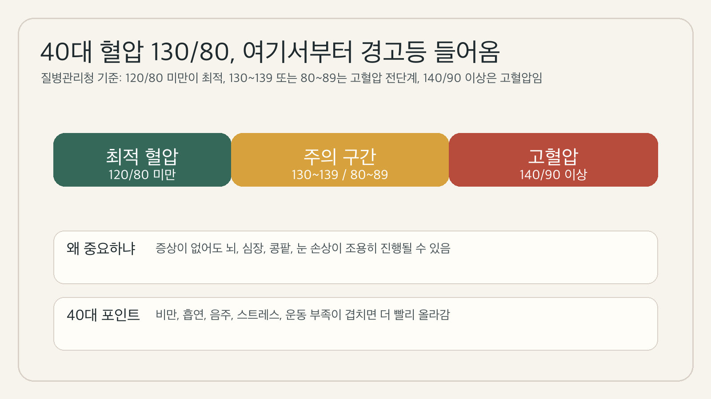
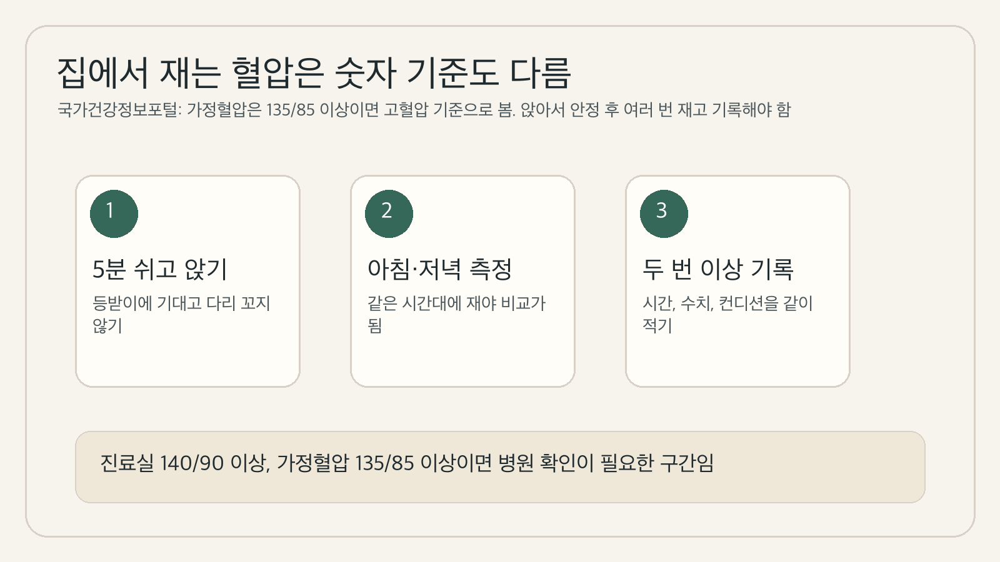
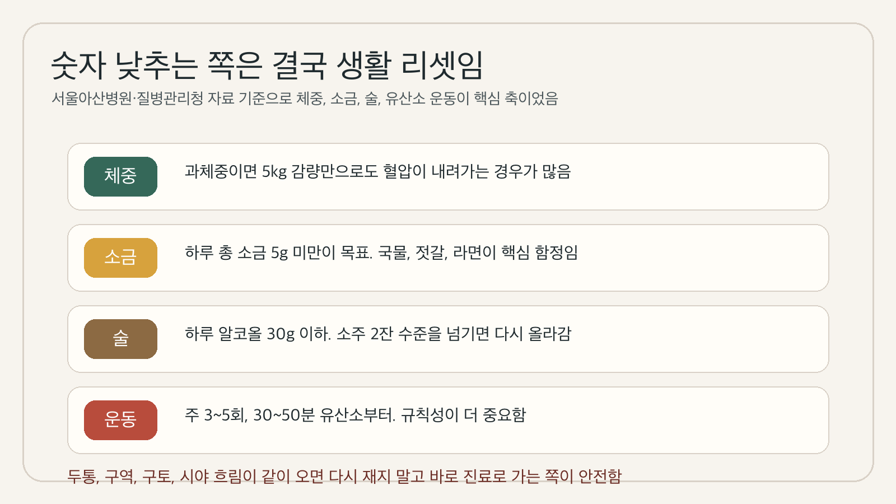

건강검진표에서 혈압이 130/80 근처로 찍히면 애매해서 그냥 넘기기 쉬움. 근데 40대부터는 이 숫자가 정상 끝자락이 아니라 생활을 바로 손봐야 하는 경고등인 경우가 많음.

1. 질병관리청 국가건강정보포털 기준으로 최적의 정상 혈압은 120/80 미만임. 수축기 120~139 또는 이완기 80~89는 고혈압 전단계로 보고, 진료실 혈압이 140/90 이상이면 고혈압으로 판단함. 즉 130/80은 "괜찮은 편"이 아니라 이미 주의 구간 안쪽에 들어온 숫자였음.

2. 40대에서 특히 더 봐야 하는 이유도 분명함. 국가건강정보포털은 비만, 흡연, 음주, 짜게 먹는 식습관, 스트레스, 운동 부족이 겹치면 위험이 커진다고 설명함. 회사 일, 수면 부족, 회식이 붙는 40대 생활이 딱 이 조합에 자주 걸림.

3. 더 문제는 몸이 조용하다는 점임. 질병관리청 자료에는 고혈압이 대부분 뚜렷한 증상이 없어 혈압을 재보지 않으면 놓치기 쉽고, 심장, 뇌, 콩팥, 눈 같은 주요 장기에 손상을 줄 수 있다고 나옴. 느낌이 없다고 안전한 상태는 아니었음.

4. 그래서 숫자 하나보다 흐름을 봐야 함. 검진 때 한 번 130/80이 나온 사람, 집에서 가끔 135/85 근처가 찍히는 사람, 아버지나 어머니가 고혈압인 사람, 복부비만이 붙은 사람은 "다음 검진 때 보자"로 미루기보다 기록을 시작하는 쪽이 맞음.

5. 집에서 재는 혈압은 기준도 다름. 질병관리청 자료에는 가정혈압은 보통 진료실 혈압보다 낮게 나오므로 135/85 이상이면 고혈압 기준으로 본다고 설명함. 앉아서 안정한 뒤 재고, 같은 시간대에 여러 번 측정하고, 결과를 적어 두는 게 중요함.

6. 여기서 많이 하는 오해가 하나 있음. 130/80이면 바로 혈압약 먹어야 하냐는 말임. 서울아산병원 설명을 보면 고혈압 전단계는 우선 약보다 생활습관 교정이 목표임. 식사, 운동, 금연, 절주로 실제 고혈압으로 넘어가는 속도를 늦추는 쪽이 기본 전략이었음.

7. 체중은 생각보다 직접적임. 서울아산병원 자료에는 체질량지수 25 이상이 혈압 상승과 밀접하고, 표준 체중보다 10% 과체중인 경우 5kg 정도 감량만으로도 혈압이 내려가는 경우가 많다고 정리돼 있음. 40대 혈압 관리는 배를 먼저 보는 게 맞는 이유임.

8. 짠 음식도 그대로 걸림. 서울아산병원은 한국인의 소금 섭취가 많고 김치, 찌개, 국, 젓갈, 라면 같은 음식이 핵심 함정이라고 설명함. 질병관리청 자료에는 하루 총 소금 5g 미만을 목표로 제시한 내용도 있음. 밥 양보다 국물 습관이 더 크게 작용하는 경우가 많음.

9. 술도 빼기 어려운 변수임. 서울아산병원 자료 기준으로 하루 알코올 허용량은 30g 정도, 소주 2잔 수준을 넘기지 않는 쪽이 권장됨. 문제는 회식이 한 번으로 안 끝난다는 점임. 주중 음주가 반복되면 평일 혈압이 계속 위로 떠 있음.

10. 운동은 제일 단순하지만 효과가 확실함. 서울아산병원은 주 3~5회, 30~50분 정도 유산소 운동을 권하고 있고, 질병관리청은 규칙적인 운동이 고혈압 환자에서 안정 시 혈압을 5~7mmHg 정도 낮추는 데 도움이 된다고 설명함. 과하게 몰아서 하는 것보다 끊기지 않게 가는 쪽이 중요함.

11. 실전 순서는 복잡하지 않음. 첫째, 아침과 저녁에 며칠만 재서 자기 패턴을 볼 것. 둘째, 국물과 야식부터 줄일 것. 셋째, 일주일에 세 번은 숨이 조금 차는 걷기나 자전거를 넣을 것. 넷째, 체중과 허리둘레를 같이 볼 것. 혈압은 생활 전체의 총합이라 한 가지만 건드리면 잘 안 움직임.

12. 반대로 바로 병원으로 가야 하는 신호도 있음. 질병관리청 자료에는 평소보다 혈압이 높으면서 두통, 구역질, 구토, 시야 흐림이 같이 오면 빨리 병원을 찾아야 한다고 나옴. 이럴 때는 집에서 계속 재보는 쪽보다 진료를 받는 쪽이 안전함.

13. 결론은 단순함. 40대 혈압 130/80은 아직 괜찮다는 뜻이 아니라 지금부터 누적되기 시작했다는 뜻에 가까움. 숫자가 더 오르기 전에 기록하고, 줄이고, 걷고, 필요하면 진료실 확인까지 붙이는 사람이 결국 오래 덜 고생함.

14. 같이 보면 되는 자료는 질병관리청 국가건강정보포털 혈압 안내(https://health.kdca.go.kr/healthinfo/biz/health/ntcnInfo/healthSourc/thtimtCntnts/thtimtCntntsView.do?thtimt_cntnts_sn=28), 주요 고위험군 관리법 중 고혈압 항목(https://health.kdca.go.kr/healthinfo/biz/health/ntcnInfo/healthSourc/thtimtCntnts/thtimtCntntsView.do?thtimt_cntnts_sn=124), 고혈압 예방 Q&A(https://health.kdca.go.kr/healthinfo/biz/health/ntcnInfo/healthSourc/thtimtCntnts/thtimtCntntsView.do?thtimt_cntnts_sn=57), 서울아산병원 가정의학과 고혈압 설명(https://www.amc.seoul.kr/asan/depts/fm/K/bbsDetail.do?contentId=215975&menuId=378), 질병관리청 운동과 혈압 관리 자료(https://health.kdca.go.kr/healthinfo/biz/health/ntcnInfo/healthSourc/thtimtCntnts/thtimtCntntsView.do?thtimt_cntnts_sn=44), 질병관리청 고혈압성 콩팥병 자료(https://health.kdca.go.kr/healthinfo/biz/health/gnrlzHealthInfo/gnrlzHealthInfo/gnrlzHealthInfoView.do?cntnts_sn=6013)임.

---

**같이 보면 좋은 글**
- [[40s-waistline-90-85-metabolic-syndrome-2026-04-26|40대 허리둘레 남자 90·여자 85cm, 대사증후군 기준]]
- [[40s-prediabetes-fasting-glucose-100-2026-04-22|40대 공복혈당 100, 당뇨 전단계 신호 7가지]]
- [[40s-triglycerides-200-not-just-cheat-day-2026-04-27|40대 중성지방 200, 회식 탓만 할 수 없는 이유]]
