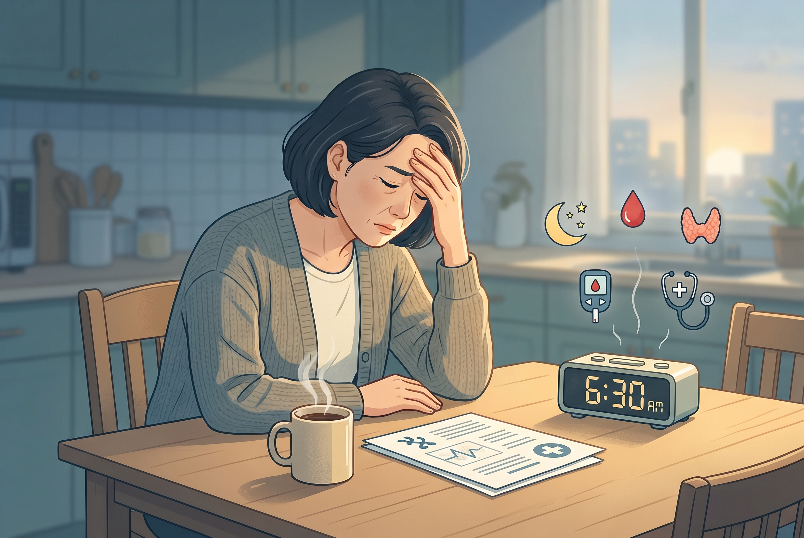

# 40대 만성 피로, 갑상선만 찾으면 놓치는 것들

40대 피로는 그냥 바쁜 탓으로 넘기기 쉬웠음. 근데 피로가 몇 주씩 이어지면 수면, 빈혈, 갑상선, 혈당을 같이 봐야 했음. 커피로 덮어두면 원인만 늦게 잡히는 경우가 많았음.

1. 피로가 계속되면 먼저 생활 탓만 하지 않는 게 맞았음. 며칠 잠을 못 잔 피곤함이 아니라, 쉬어도 회복이 안 되는 느낌이 문제였음. 이때는 몸 어딘가가 계속 에너지를 빼앗고 있었을 가능성을 봐야 했음.

2. 40대에서 제일 흔한 숨은 원인 중 하나가 수면 문제였음. 코를 크게 골거나, 자다가 헐떡이거나, 아침에 입이 마르고 머리가 무거우면 수면무호흡을 의심해야 했음. 낮에 졸리고 집중이 안 되는 것도 같이 오기 쉬웠음.

3. 빈혈도 자주 놓쳤음. 철분이 부족하면 몸이 산소를 덜 실어 나르는 상태가 돼서 쉽게 지치고 숨이 찼음. 얼굴이 창백하거나 어지럽고, 손발이 차고, 계단이 유독 힘들면 같이 봐야 했음.

4. 갑상선 기능저하증도 빼면 안 됐음. 몸이 느려지면서 피곤함, 체중 증가, 추위 민감, 변비, 피부 건조가 같이 올 수 있었음. "그냥 나이 탓"으로 넘기면 검사 시기를 놓치기 쉬웠음.

5. 혈당 문제도 은근히 피로를 만들었음. 공복혈당이나 당화혈색소가 올라가면 몸이 에너지를 쓰는 방식이 흔들릴 수 있었음. 식후에 유난히 졸리거나 물을 자주 찾고 소변이 늘면 같이 봐야 했음.

6. 정신적인 소진도 몸 피로처럼 느껴졌음. 일이 많고 잠이 깨지고 마음이 눌리면, 몸이 먼저 무거워졌음. 흥미가 뚝 떨어지고, 기분이 가라앉고, 아무것도 하기 싫으면 우울이나 불안도 함께 봐야 했음.

7. 약과 술도 변수였음. 감기약, 항히스타민제, 수면제, 일부 혈압약은 졸림과 무기력을 더했음. 술이 잦으면 잠은 잤는데 덜 잔 것처럼 깨기 쉬웠음.

8. 40대는 이 원인들이 한꺼번에 겹치기 쉬웠음. 밤늦게 일하고, 주말에 몰아서 자고, 점심과 저녁이 뒤집히고, 운동은 끊겨 있는 패턴이 많았음. 몸은 그런 생활을 꽤 오래 버티다가 어느 순간부터 피로로 신호를 보냈음.

9. 검사는 순서가 있었음. 보통은 CBC, ferritin, TSH/free T4, 공복혈당, HbA1c, 간기능, 신장기능 정도를 먼저 보게 됐음. 코골이와 낮 졸림이 강하면 수면검사까지 생각해야 했음.

10. 집에서 볼 것도 있었음. 잠드는 시간, 깨어나는 횟수, 코골이, 아침 두통, 낮 졸림, 체중 변화, 허리둘레를 기록하면 원인 추적이 쉬워졌음. 느낌만으로는 헷갈리던 게 숫자로 보이기 시작했음.

11. 바로 진료를 봐야 하는 신호도 있었음. 가슴통증, 숨참, 검은 변, 피 섞인 대변, 이유 없는 체중 감소, 심한 두근거림, 열이 오래 가는 경우는 그냥 피곤함으로 보면 안 됐음. 자해 생각이 스치면 그건 더 미루면 안 되는 신호였음.

12. 같이 보면 되는 자료는 Mayo Clinic fatigue causes(https://www.mayoclinic.org/symptoms/fatigue/basics/causes/sym-20050894), Mayo Clinic fatigue when to see a doctor(https://www.mayoclinic.org/symptoms/fatigue/basics/when-to-see-doctor/sym-20050894), NHS tiredness and fatigue(https://www.nhs.uk/symptoms/tiredness-and-fatigue/), Mayo Clinic sleep apnea(https://www.mayoclinic.org/diseases-conditions/sleep-apnea/symptoms-causes/syc-20377631)였음.

13. **Q. 커피를 많이 마시면 피로가 해결됨?** 아니었음. 잠 부족과 수면 질 문제를 덮을 뿐이라서, 저녁 커피가 늘수록 밤잠은 더 깨질 수 있었음.

14. **Q. 갑상선 검사 정상인데도 계속 피곤하면?** 그럼 수면무호흡, 빈혈, 혈당, 우울/불안, 약물 부작용을 다시 봐야 했음. 한 번 정상이라고 끝내면 안 됐음.

15. **Q. 어느 과로 가면 됨?** 보통은 내과나 가정의학과부터 보면 됐음. 코골이가 심하면 이비인후과나 수면클리닉, 생리 과다나 빈혈 의심이면 산부인과도 같이 연결하면 됐음.
