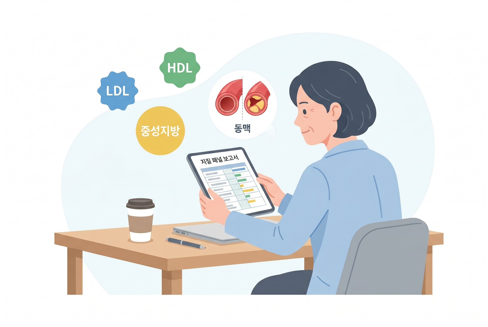
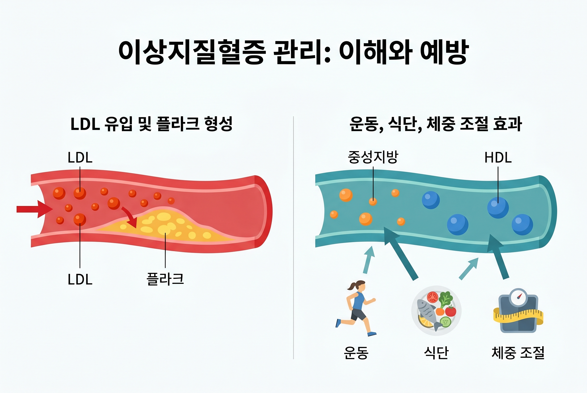

# 40대 이상지질혈증, 총콜레스테롤만 보고 안심하면 안 되는 이유

건강검진표에서 총콜레스테롤 숫자만 보고 그냥 넘기기 쉬움. 근데 40대부터는 LDL, HDL, 중성지방을 같이 봐야 진짜 상태가 보임.

1. 국가건강정보포털은 일반건강검진이 비만, 고혈압, 당뇨병, 이상지질혈증 같은 심뇌혈관질환 위험인자를 조기에 찾는 게 목적이라고 설명함. 즉 이건 단순 참고표가 아니라, 지금 몸의 방향을 보는 검사임. 혈액검사에서 총콜레스테롤, HDL, LDL, 중성지방을 함께 보는 이유도 그 때문임.

2. 총콜레스테롤 하나만 보면 헷갈릴 수 있음. HDL이 높으면 총합이 좀 올라가도 덜 나쁜 경우가 있고, 반대로 LDL이나 중성지방이 문제인데 총합만 보고 넘어가기도 함. 그래서 숫자 하나보다 조합을 봐야 함.

3. CDC는 LDL이 많아지면 혈관 벽에 쌓여 플라크를 만들고, 이게 심장병과 뇌졸중 위험을 키운다고 설명함. 겉으로는 멀쩡해 보여도 안쪽 혈관은 조용히 좁아질 수 있음.

4. 더 무서운 건 증상이 거의 없다는 점임. CDC는 고콜레스테롤이 증상이 없어서 많은 사람이 스스로 모르고 지나간다고 적고 있음. 피곤함이나 어지럼증 같은 감각만으로는 알기 어려움.

5. 40대가 특히 신경 써야 하는 이유는 생활이 딱 겹치기 때문임. 운동은 줄고, 회식은 남고, 허리둘레는 조금씩 늘고, 혈압과 공복혈당도 같이 흔들리기 쉬움. 이상지질혈증은 혼자 오는 경우보다 묶음으로 오는 경우가 많음.

6. 중성지방도 가볍게 보면 안 됨. CDC와 AHA는 중성지방이 높고 LDL이 높거나 HDL이 낮으면 심근경색과 뇌졸중 위험이 더 커질 수 있다고 말함. 즉 "총콜레스테롤은 괜찮네"로 끝내면 위험함.

7. 식사는 생각보다 바로 반응함. 포화지방과 트랜스지방을 줄이고, 튀김·과자·가공육·야식 빈도를 낮추는 쪽이 맞음. 대신 채소, 통곡물, 콩, 생선, 견과류처럼 혈관에 덜 거친 쪽을 늘려야 함.

8. 운동은 LDL과 중성지방을 낮추고 HDL을 올리는 쪽으로 도움 됨. 질병관리청도 이상지질혈증에서 운동이 중성지방을 낮추고 총콜레스테롤과 LDL을 낮추며 HDL을 올리는 데 도움이 된다고 안내함. 결국 몸은 움직일수록 정직하게 반응함.

9. 체중과 허리둘레도 같이 봐야 함. 배에 지방이 붙으면 지질 수치가 같이 흔들리는 경우가 많음. 그래서 검사표만 보지 말고 바지 허리도 같이 봐야 함.

10. 검사 주기도 무심하게 넘기면 안 됨. CDC는 건강한 성인도 정기적으로 콜레스테롤 검사를 받으라고 하고, 당뇨병이나 심장병 가족력이 있으면 더 자주 봐야 한다고 설명함. 40대는 "나중에"보다 "지금 패턴 확인"이 더 유리함.

11. 약을 바로 시작하느냐는 또 다른 문제임. 생활습관 교정으로 충분한 사람도 있고, 가족력이나 기존 질환 때문에 약이 필요한 사람도 있음. 그래서 답은 혼자 추측하는 게 아니라 수치 조합과 위험도를 같이 보는 쪽임.

12. 특히 다음 셋이 같이 있으면 그냥 넘기면 안 됨. 허리둘레가 늘었고, 혈압이 올라가고, 공복혈당이나 중성지방이 흔들리는 경우임. 이 조합은 몸이 이미 방향을 틀고 있다는 신호에 가까움.

13. 실전 순서는 단순함. 첫째, 총콜레스테롤만 보지 말고 LDL/HDL/중성지방을 같이 볼 것. 둘째, 국물과 야식과 과자 빈도를 줄일 것. 셋째, 일주일에 3번이라도 숨이 살짝 찰 정도로 걸을 것. 넷째, 허리둘레를 같이 기록할 것.

14. 결론은 이거임. 40대 이상지질혈증은 숫자 하나로 안심할 문제가 아님. 총콜레스테롤이 애매해 보여도 LDL이 높거나 중성지방이 들썩이면 이미 손볼 구간일 수 있음.

15. **Q. 총콜레스테롤만 정상이어도 괜찮음?** 아니었음. LDL, HDL, 중성지방이 같이 봐야 하는 진짜 핵심임.

16. **Q. 약부터 먹어야 함?** 꼭 그렇진 않음. 생활습관 교정이 먼저인 경우가 많지만, 위험도가 높으면 약이 필요할 수 있음.

17. **Q. 검사에서 뭘 제일 먼저 보면 됨?** LDL, HDL, 중성지방, 그리고 허리둘레와 혈압까지 같이 보는 쪽이 맞음.

18. 같이 보면 되는 자료는 질병관리청 국가건강정보포털 `알아두면 도움이 되는 건강검진`(https://health.kdca.go.kr/healthinfo/biz/health/ntcnInfo/healthSourc/thtimtCntnts/thtimtCntntsView.do?thtimt_cntnts_sn=7), CDC `High Cholesterol Facts`(https://www.cdc.gov/cholesterol/data-research/facts-stats/index.html), CDC `LDL and HDL Cholesterol and Triglycerides`(https://www.cdc.gov/cholesterol/about/ldl-and-hdl-cholesterol-and-triglycerides.html), American Heart Association `HDL (Good), LDL (Bad) Cholesterol and Triglycerides`(https://www.heart.org/en/health-topics/cholesterol/hdl-good-ldl-bad-cholesterol-and-triglycerides)임.
