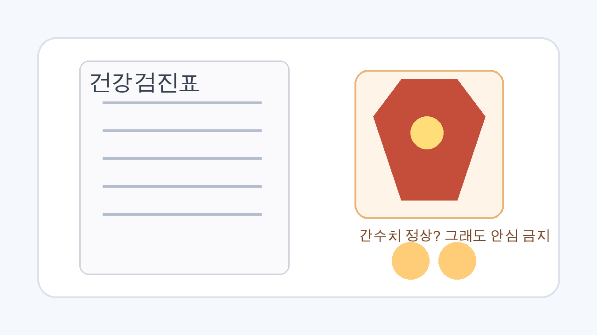
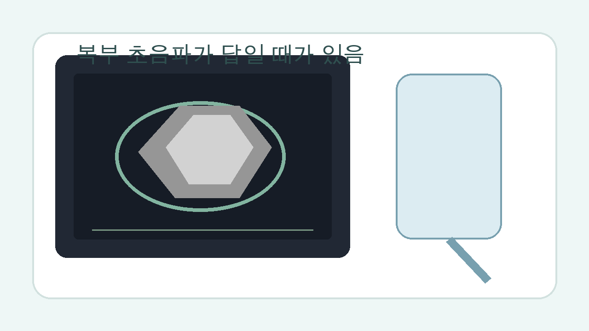
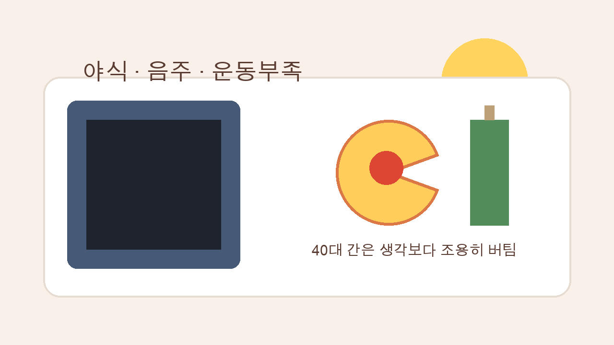

건강검진표에서 AST, ALT가 정상으로 찍히면 일단 안심하게 됨. 근데 40대 간은 생각보다 조용해서, 숫자만 보고 넘기면 지방간을 뒤늦게 발견하는 일이 꽤 흔함.

1. 서울아산병원 자료를 보면 간기능검사는 간 손상 여부를 보는 데 도움이 되지만, 혈액검사 이상만으로 간 질환을 단정할 수는 없고 필요하면 초음파나 CT 같은 추가 검사가 따라가야 함. 즉 간수치 정상은 종료가 아니라 1차 통과에 더 가까움.

2. 질병관리청 국가건강정보포털 자료에도 비슷한 얘기가 나옴. 알코올 지방간 환자는 혈액검사에서 간기능이 정상이거나 약간의 이상만 보이는 경우가 있고, 대신 초음파에서는 지방 침착 때문에 간이 정상보다 하얗게 보인다고 설명함. 숫자는 잠잠한데 영상은 이미 말해주고 있었던 셈임.

3. 서울대병원 설명을 보면 지방간은 간에 지방이 5% 넘게 쌓인 상태임. 원인도 술만이 아님. 비만, 당뇨병, 고지혈증, 약물, 대사증후군이 다 얽혀 들어옴. 그래서 40대 직장인처럼 체중은 조금 늘고 운동은 줄고 회식은 남아 있는 생활에서 잘 걸림.

4. 더 문제는 증상이 애매하다는 점임. 서울대병원은 지방간 환자가 무증상인 경우부터 피로감, 전신 권태감, 오른쪽 윗배 불편감 정도만 느끼는 경우까지 다양하다고 설명함. 근데 이런 건 다들 그냥 "요즘 피곤해서"로 넘기기 쉬움.

5. 여기서 많이 하는 착각이 하나 있음. 간수치가 정상인데 무슨 지방간이냐는 말임. 근데 아산병원 자료에는 만성 간염, 간경화, 간암도 경우에 따라 수치가 소량 증가하거나 정상에 가까울 수 있다고 나옴. 간수치는 중요한 힌트지만 모든 걸 다 보여주는 CCTV는 아니었음.

6. 그래서 검진표에서 봐야 할 건 AST, ALT 한 줄이 아니라 맥락임. 체중이 최근 3~5kg 늘었는지, 허리둘레가 불었는지, 공복혈당이나 중성지방이 같이 흔들리는지, 술이 주 2~3회 이상 고정돼 있는지 같이 봐야 함. 지방간은 혼자 오는 병이라기보다 생활 전체가 밀어 올린 결과인 경우가 많음.

7. 질병관리청 자료를 보면 알코올은 지방 축적을 직접 늘리고, 기름진 안주와 함께 갈수록 간내 지방이 더 심해질 수 있다고 설명함. 40대 회식 패턴이 딱 여기 걸림. 늦은 시간 술, 짠 안주, 수면 부족까지 겹치면 간은 쉬지 못함.

8. 서울대병원은 지방간 진단을 위해 초음파검사와 간섬유화 검사 등을 시행한다고 정리함. 검진에서 간수치가 정상이어도 복부초음파를 한 번 추가하면, 피검사만으로는 안 보이던 지방간이나 다른 복부 이상이 같이 잡히는 경우가 있음. 특히 40대부터는 이 한 번이 생각보다 큼.

9. 치료도 의외로 단순함. 서울대병원 자료 기준으로 핵심은 약보다 생활교정임. 금주, 체중조절, 규칙적 운동, 혈당과 지질 관리가 기본이고 지방간이 있다고 무조건 쉬는 게 아니라 오히려 운동을 많이 해야 도움이 된다고 설명함.

10. 그래서 실전 조치는 세 개면 됨. 첫째, 평일 술을 끊거나 횟수를 확 줄일 것. 둘째, 저녁 식사 후 20~30분이라도 걷기 시작할 것. 셋째, 다음 검진까지 기다리지 말고 복부초음파나 진료 상담으로 한 번 더 확인할 것. 간은 조용하지만 생활이 바뀌면 반응도 꽤 빠른 편임.

11. 특히 이미 비만, 당뇨병, 고지혈증 중 하나가 있으면 미루면 안 됨. 서울대병원은 이런 요인들이 지방간의 원인이 될 수 있다고 분명히 적고 있음. 간수치가 정상이라는 이유로 넘어가면, 실제로는 지방간염이나 간섬유화 쪽으로 한 단계 더 간 뒤에 발견될 수 있음.

12. 결론은 단순함. 40대 건강검진에서 간수치 정상은 좋은 신호이긴 한데 끝난 신호는 아님. 피검사 숫자 하나로 안심하기보다 생활습관과 복부초음파까지 같이 봐야 지방간을 덜 놓침.

13. 같이 보면 좋은 자료도 분명함. 질병관리청 국가건강정보포털 알코올 간질환(https://health.kdca.go.kr/healthinfo/biz/health/gnrlzHealthInfo/gnrlzHealthInfo/gnrlzHealthInfoView.do?cntnts_sn=5310), 서울대학교병원 지방간 안내(https://www.snuh.org/health/nMedInfo/nView.do?category=DIS&medid=AA000321), 서울아산병원 간기능 검사 설명(https://www.amc.seoul.kr/asan/mobile/healthinfo/management/managementDetail.do?managementId=36)임.

---

**같이 보면 좋은 글**
- [[40s-waistline-90-85-metabolic-syndrome-2026-04-26|40대 허리둘레 남자 90·여자 85cm, 대사증후군 기준]]
- [[40s-triglycerides-200-not-just-cheat-day-2026-04-27|40대 중성지방 200, 회식 탓만 할 수 없는 이유]]
- [[40s-prediabetes-fasting-glucose-100-2026-04-22|40대 공복혈당 100, 당뇨 전단계 신호 7가지]]
