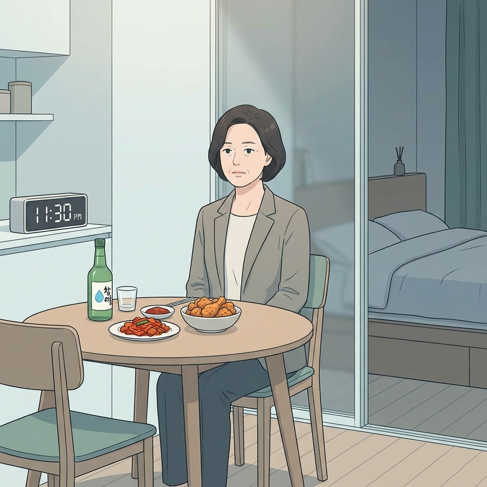

# 40대 속쓰림, 위산 때문만으로 넘기면 안 되는 이유

40대 속쓰림은 그냥 위산이 올라온 날로 끝나는 경우가 많지 않음. 늦은 저녁, 과식, 술, 체중, 수면이 같이 묶여 있는 신호일 수 있음. 제산제만 붙잡고 넘기면 반복되기 쉬웠음.

1. 속쓰림은 보통 가슴 중앙이 타는 듯하고 신물이 올라오는 느낌으로 시작함. Mayo Clinic은 이런 증상이 자주 반복되면 GERD, 즉 위식도역류질환일 수 있다고 설명함. 한두 번의 불편함보다 반복 패턴이 더 중요했음.

2. 40대에서 흔한 트리거는 뻔함. 늦은 저녁, 큰 접시, 기름진 음식, 술, 그리고 바로 눕는 습관임. 위가 아직 일하고 있는데 몸을 눕히면 역류가 쉬워짐.

3. 배가 조금씩 나오는 것도 그냥 외모 문제가 아님. 배 안 압력이 올라가면 위 내용물이 식도로 밀려 올라오기 쉬워짐. 그래서 40대 속쓰림은 허리둘레와 같이 봐야 했음.

4. 밤에 더 불편한 사람도 많음. 누우면 역류가 쉬워져서 잠이 깨고, 자고 일어나도 목이 칼칼하거나 입안이 시큼할 수 있음. 수면이 깨지면 다음 날 식욕과 컨디션도 같이 흔들림.

5. 먼저 손댈 건 약이 아니라 시간표임. 저녁은 늦어도 잠들기 3시간 전에는 끝내는 쪽이 낫고, 양은 한 번에 많이 먹지 않는 게 좋음. 식후 바로 눕는 습관만 줄여도 체감이 꽤 큼.

6. 음식도 제법 가림. 아주 기름진 음식, 매운 음식, 초콜릿, 민트, 커피, 탄산, 술이 증상을 키울 수 있음. 사람마다 다르지만, 자주 걸리는 메뉴는 따로 있었음.

7. 체중이 늘었으면 더 잘 봐야 함. NIDDK는 과체중이나 비만이 있으면 체중 감량이 GERD 증상 완화에 도움이 될 수 있다고 안내함. 무리한 다이어트보다 꾸준한 감량이 더 현실적이었음.

8. 담배도 빼기 어려운 변수임. 흡연은 식도 괄약근을 더 느슨하게 만들 수 있어 역류를 악화시킬 수 있음. 술과 담배가 같이 붙어 있으면 속쓰림은 더 자주 올라옴.

9. 약으로 버티는 패턴도 조심해야 함. 제산제나 위산 억제제를 계속 찾는데도 자꾸 재발하면, 원인이 생활습관인지 다른 질환인지 확인이 필요함. 자꾸 반복되면 그때는 몸이 보내는 경고로 봐야 함.

10. 바로 진료를 봐야 하는 신호도 있음. 삼키기 힘듦, 삼킬 때 통증, 계속 토함, 체중이 이유 없이 줄어듦, 피를 토함, 검은 변이 나옴, 가슴통증이 심하거나 숨이 차면 그냥 넘기면 안 됨. 가슴이 답답한 느낌이 식사와 무관하게 강하면 심장 문제도 같이 봐야 함.

11. 자가관리의 우선순위는 간단함. 저녁을 당기고, 양을 줄이고, 술을 줄이고, 눕는 시간을 늦추고, 필요하면 베개가 아니라 침대 머리 쪽을 살짝 높이는 쪽이 맞음. 몸은 복잡한 말보다 생활 시간표에 더 정직했음.

12. 같이 보면 되는 자료는 Mayo Clinic GERD 증상·원인 안내(https://www.mayoclinic.org/diseases-conditions/gerd/symptoms-causes/syc-20361940), Mayo Clinic GERD 치료·생활수칙(https://www.mayoclinic.org/diseases-conditions/gerd/diagnosis-treatment/drc-20361959), NIDDK GERD 증상·원인(https://www.niddk.nih.gov/health-information/digestive-diseases/acid-reflux-ger-gerd-adults/symptoms-causes), NIDDK 식이·영양 안내(https://www.niddk.nih.gov/health-information/digestive-diseases/acid-reflux-ger-gerd-adults/eating-diet-nutrition), Cleveland Clinic acid reflux 안내(https://my.clevelandclinic.org/health/diseases/17019-acid-reflux-gerd)임.

13. **Q. 커피만 끊으면 속쓰림이 끝남?** 아니었음. 커피가 계기일 수는 있지만, 늦은 식사와 눕는 습관이 같이 있으면 계속 반복되기 쉬움.

14. **Q. 속쓰림이 일주일에 두 번 정도면 괜찮음?** 자주 반복되는 편이라 한번은 확인할 가치가 있음. 특히 밤에 깨거나 신물이 올라오면 그냥 넘기지 않는 쪽이 맞음.

15. **Q. 제산제 먹고 나아지면 병원 안 가도 됨?** 꼭 그렇진 않음. 증상이 반복되면 GERD 여부를 확인하는 게 낫고, 경고 신호가 있으면 더 빨리 봐야 함.
