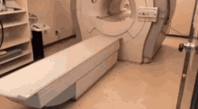
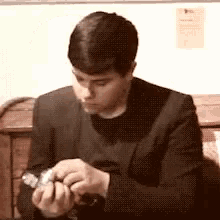

공단이 2년에 한 번씩 보내주는 건강검진표. 그거 하나로 충분한 줄 알고 받아오면, 40대부터는 사실상 절반쯤 눈 감고 검진하는 셈임. 뭐가 빠졌는지 정리해봄.

1. 먼저 공단 기본검진이 뭘 잡아주는지부터. 신체계측(키·체중·허리둘레), 혈압, 혈액검사(공복혈당·콜레스테롤·간수치·신장기능), 소변검사, 흉부 X선, 구강검사. 여성은 자궁경부세포검사. 40~74세는 여기에 B형간염 항원·항체가 추가됨.

2. 보면 큰 틀은 **성인병 조기 발견**에 집중돼 있음. 고혈압, 당뇨, 고지혈증, 간염 이 네 개가 핵심임. 문제는 40대부터 올라오는 위험이 이 네 개만이 아니라는 거임.

3. **첫째, 녹내장 검사**가 빠져 있음. 녹내장은 40대부터 유병률이 가파르게 올라감. 대한안과학회 자료로 40대 2%대, 50대 3~4%, 70대 7% 넘어감. 근데 초기에는 거의 증상이 없음. 시야가 서서히 좁아지는데 본인은 모름. 한번 죽은 시신경은 복구가 안 됨.

4. 그래서 40대 되면 **안압 측정 + 안저 검사**를 2~3년에 한 번은 받는 게 표준임. 공단검진엔 안저 스크리닝이 없음. 안과 가서 3만~5만원이면 됨.

5. **둘째, 복부 초음파**. 간·담낭·췌장·신장·비장을 한 번에 보는 검사임. 공단검진의 혈액검사는 간수치(AST/ALT)만 보여주는데, 이거만으로는 **지방간, 담석, 신장낭종, 췌장 병변**을 제대로 못 잡음.

6. 40대 지방간 유병률이 **30% 이상**임. 근데 초기 지방간은 간수치가 정상으로 찍히는 경우가 많음. 초음파로 봐야 지방이 낀 게 보임. 담석도 마찬가지. 통증 없을 때는 혈액검사 다 정상인데 초음파 대면 주렁주렁 보이는 경우가 흔함.

7. 복부 초음파 비용은 비급여로 **7만~15만원**. 3년에 한 번 정도로도 대부분 커버됨.

8. **셋째, 저선량 폐 CT**. 이게 40대부터 진짜 중요한데 공단검진엔 들어있지 않음. 흉부 X선은 폐암 조기발견용이 아님. X선은 **1cm 이하 작은 결절**을 놓침. 그래서 X선으로 찍혔을 땐 이미 진행된 케이스가 많음.

9. 저선량 폐 CT는 방사선량이 일반 CT의 5분의 1 정도인데, X선보다 민감도가 **3~4배** 높음. 미국 국립폐암스크리닝시험(NLST)에서 저선량 CT군이 X선군보다 폐암 사망률이 20% 낮았음.

10. 특히 **흡연력이 있거나 간접흡연 노출이 길었던 40대**면 꼭 받으라는 게 요즘 흉부외과 의사들 공통된 얘기임. 비급여 **8만~12만원** 선.

11. **넷째, 남자는 PSA, 여자는 유방초음파**. 이건 성별 나누어 봐야 함.

12. 남자 40대부터는 **전립선암 스크리닝**을 위해 PSA(전립선특이항원) 혈액검사를 권장함. PSA는 혈액 한 번 뽑으면 됨. 비용은 **2만~3만원**. 공단검진엔 없음. 50대부터 유병률이 급격히 오르는데, 40대 후반에 한 번 찍어두면 **베이스라인**이 생겨서 추적이 쉬워짐.

13. 여자는 **유방초음파 + 유방촬영(맘모그래피)**. 국가검진은 만 40세부터 2년에 한 번 유방촬영을 보내주는데, **한국 여성은 치밀유방 비율이 높아** 맘모만으로는 병변을 놓치는 경우가 많음. 맘모에서 하얗게 덮여 보이는 부분이 있으면 거기 종양이 숨어 있어도 안 보임.

14. 그래서 **유방초음파를 병행**하는 게 표준임. 유방초음파는 비급여로 **6만~10만원**.

15. **다섯째, 위·대장 내시경**. 공단검진은 대장암 검진으로 **분변잠혈검사**를 보냄. 이건 변에 피가 섞여 나오는지 보는 1차 스크리닝이라 암이 어느 정도 진행되어야 양성이 나옴.

16. 40대부터는 **수면내시경으로 위·대장을 한 번씩** 찍어두는 게 실전 기준임. 위내시경은 만 40세부터 국가검진(암검진)에서 2년에 한 번 지원되는데, 대장내시경은 만 50세 이후부터만 선택 급여임. 40대는 자비임.

17. 대장내시경 수면 기준 **10만~15만원**, 위내시경은 **7만~10만원**. 용종 발견되면 당일 제거까지 해줌. 이게 10년 뒤 대장암 예방으로 환산됨.

18. **여섯째, 비타민D와 NK세포 활성도**. 이건 요즘 많이 하는 검사인데 의외로 의미가 있음.

19. 한국인 **비타민D 결핍 비율은 93%**(2022 국민건강영양조사). 40대 사무직이면 99% 결핍이라고 봐도 됨. 비타민D는 뼈·근육뿐만 아니라 면역, 우울감, 심혈관계까지 연결됨. 혈액검사로 **25(OH)D 수치**를 한 번 재고 30 ng/ml 이하면 보충제로 끌어올리면 됨.

20. NK세포 활성도는 **면역 기능의 간접 지표**임. 수치가 낮으면 스트레스, 만성피로, 수면부족 같은 원인을 의심해볼 수 있음. 암 스크리닝용은 아니고 전반적인 면역 컨디션 체크용임.

21. 둘 다 혈액 한 번 뽑으면 됨. 묶어서 **5만~8만원** 선.

22. 정리하면 40대 종합검진 한 번에 추가로 들어가야 할 **6가지**는 이것임.

23. 녹내장(안압+안저), 복부 초음파, 저선량 폐 CT, PSA 또는 유방초음파, 위·대장 내시경, 비타민D+NK세포.

24. 전부 비급여로 합치면 한 번에 **40만~70만원**. 부담이긴 한데 이걸 3년에 한 번 돌리는 식으로 쪼개면 연 **15만원~20만원** 수준임. 40대 건강보험료 한 달치랑 비슷함.

25. 실전 팁 하나. 종합검진 패키지로 묶으면 이 중 상당수가 묶여서 더 쌈. **40대 남성 패키지, 40대 여성 패키지** 라벨 달린 상품들이 대부분 위 6가지 중 4~5개를 포함함. 단품으로 따로 받는 것보다 보통 **30~40%** 쌈.

26. 마지막으로 기록 관리. 검진 결과지는 **이미징 CD로 받아서 구글드라이브나 아이클라우드**에 넣어두면 다음 검진 때 비교가 쉬움. 담석이 1mm 늘었는지, 간지방이 몇 퍼센트 줄었는지 같은 거. 의사 앞에서 "3년 전 CD 있습니다" 한마디가 진단 속도를 바꿈.

27. 공단에서 보내주는 그 연보라색 안내문. 그거 하나만 받으면 기본은 되지만 40대의 진짜 위험은 거의 못 걸러짐. 40대부터는 검진을 **능동적으로 조립**하는 쪽으로 태도를 바꿀 시간임.

## 관련 링크

- [국민건강보험공단 건강검진 안내](https://www.nhis.or.kr/nhis/healthin/retrieveExmdGdnc.do)
- [국가건강검진 기본 항목 정리 — 윈산부인과](https://winwomenclinic.com/aboutus-health/?bmode=view&idx=144794519)
- [2026년 국가건강검진 변경점 정리](https://blog.naver.com/PostView.naver?blogId=gesu13&logNo=224189731712&redirect=Dlog)
- [40세 이상 필수 건강검진 리스트 — 김훈하 약사](https://www.youtube.com/watch?v=uTtVCJhFVDg)
- [40대 추가 검사 6가지 — 치아/녹내장/복부초음파](https://www.instagram.com/p/DRttUlmEadj/)

---

**같이 보면 좋은 글**
- [[40s-blood-pressure-130-80-warning-2026-04-25|40대 혈압 130/80, 정상 끝자락이 아님]]
- [[40s-male-menopause-signals-2026-04-22|40대 남자 갱년기 신호 7가지]]
- [[40s-prediabetes-fasting-glucose-100-2026-04-22|40대 공복혈당 100, 당뇨 전단계 신호 7가지]]
