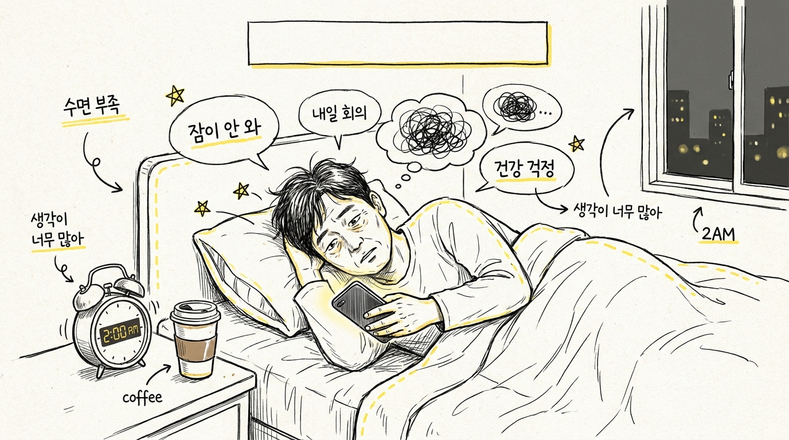
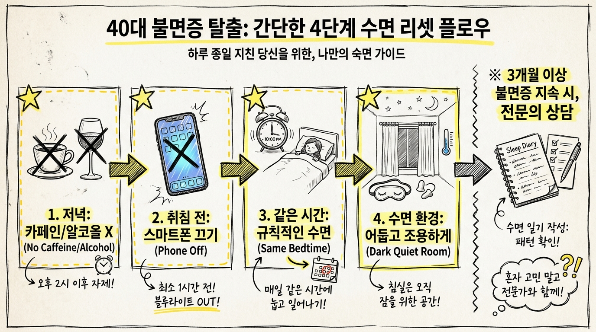

# 40대 불면, 잠 못 드는 밤을 의지 문제로 넘기면 안 되는 이유

40대가 되면 잠이 안 오는 밤을 스트레스 탓으로만 넘기기 쉬움. 근데 잠드는 데 오래 걸리고, 자꾸 깨고, 아침에 개운하지 않은 상태가 이어지면 그냥 피곤한 날이 아니라 불면증 흐름일 수 있음.

1. 국가정신건강정보포털은 불면증을 잠들기 어렵거나, 자는 동안 자주 깨거나, 너무 일찍 깨서 다시 잠들기 어렵고, 자고 일어나도 개운하지 않은 상태로 설명함. 성인은 평균적으로 7-8시간 수면이 필요하다고도 안내함. 잠의 양만이 아니라 잠의 질까지 같이 봐야 함.

2. 40대에서 더 자주 걸리는 이유는 생활이 딱 불면을 만들기 쉬운 구조라서임. 야근, 회식, 늦은 카페인, 술, 스마트폰 빛, 들쭉날쭉한 취침 시간이 한꺼번에 붙음. 잠은 의지로 누르는 게 아니라 리듬으로 들어가는 쪽임.

3. 잠이 잠깐 깨지는 정도와 불면장애는 다름. NIH MedlinePlus는 불면을 충분히 잘 수 있는 조건이 있는데도 잠들거나 유지하는 데 반복적으로 어려움이 있고, 낮 기능이 떨어지는 상태로 설명함. 낮에 멍하고 집중이 안 되는 것까지 같이 봐야 함.

4. 여기서 중요한 기준 하나가 있음. 불면이 3개월 넘게 이어지면 만성 불면증 쪽으로 봐야 함. 순간적으로 잠 못 자는 날과, 몸의 리듬이 무너진 상태는 다르기 때문임. 오래 가면 혼자 버티는 방식이 잘 안 먹힘.

5. 몸은 잠이 부족하면 은근히 티를 냄. 피로, 예민함, 집중력 저하, 기억력 흔들림, 업무 실수 같은 식으로 나타남. 수면은 뇌, 심혈관, 위장관, 호흡, 면역, 내분비, 대사 기능을 안정시키는 시간이라서, 잠이 무너지면 생활 전체가 같이 흔들림.

6. 수면 위생은 단순하지만 효과가 꽤 큼. 기상 시간을 먼저 고정하고, 잠자리는 잠만 자는 공간으로 두고, 오후 늦은 카페인은 끊고, 술로 잠을 억지로 만들지 않는 쪽이 맞음. 운동도 도움이 되지만 잠들기 직전 격한 운동은 오히려 방해가 될 수 있음.

7. 불면은 침실 환경도 많이 탐. 빛, 소음, 온도, 침대에서의 스마트폰 사용이 다 겹치면 뇌가 "여긴 쉬는 곳"으로 인식하지 못함. 불을 끄는 것보다 뇌를 끄는 게 더 어려운 셈임.

8. 그래서 잠이 안 올수록 더 애쓰지 않는 게 중요함. 20분쯤 누워도 잠이 안 오면 잠자리에서 계속 뒤척이기보다 잠시 나와 조용한 활동을 하고 다시 들어가는 쪽이 나음. 침대에서 오래 버티는 습관이 오히려 각성을 학습시킬 수 있음.

9. 다만 불면만 보고 끝내면 안 됨. 코골이, 숨 멎음, 다리 불편감, 우울감, 불안, 만성 통증, 역류 증상이 같이 있으면 원인이 다른 곳에 있을 수 있음. 불면은 종종 다른 문제의 결과로 붙어 나옴.

10. 그래서 병원에 가져가면 좋은 건 감상이 아니라 기록임. 언제 자려 했는지, 몇 시에 깼는지, 카페인과 술을 얼마나 마셨는지, 낮 졸림이 있었는지 적어두면 진료가 빨라짐. 수면일기는 생각보다 유용함.

11. 약부터 바로 찾는 사람도 많은데 순서가 늘 그건 아님. 생활 리듬을 먼저 고치고, 동반 질환을 찾고, 필요하면 약을 붙이는 흐름이 더 안전함. 특히 3개월 넘게 이어지거나 낮 생활이 무너질 정도면 진료를 받는 게 맞음.

12. 결국 40대 불면은 의지 문제가 아니라 구조 문제인 경우가 많음. 잠을 못 자는 몸을 탓하기보다, 왜 자꾸 깨는지와 무엇이 뇌를 깨우는지부터 보는 편이 훨씬 현실적임.

13. **Q. 몇 시간을 자야 괜찮음?** 성인은 평균 7-8시간이 기준이지만, 다음 날 피곤하지 않게 움직일 수 있느냐가 더 중요함.

14. **Q. 잠이 안 오면 술 한 잔이 도움 됨?** 잠드는 느낌은 줄 수 있어도 수면의 질을 깨기 쉬워서 추천하기 어렵음.

15. **Q. 언제 병원 가야 함?** 3개월 이상 이어지거나, 낮 졸림과 집중력 저하가 심하거나, 코골이·우울·통증이 같이 있으면 진료를 받는 쪽이 맞음.

16. 같이 보면 되는 자료는 국가정신건강정보포털 `수면과 수면장애`(https://www.mentalhealth.go.kr/portal/disease/diseaseDetail.do?dissId=32&srCodeNm=%EC%88%98%EB%A9%B4%EA%B3%BC%20%EC%88%98%EB%A9%B4%EC%9E%A5%EC%95%A0), NIH MedlinePlus `What is insomnia?`(https://magazine.medlineplus.gov/multimedia/what-is-insomnia), 질병관리청 `불면증` 자료(https://is.kdca.go.kr/cscdnhfile/health/healthNewDown/fileDown.do?SEQ=c7023c38056127425f29)임.
