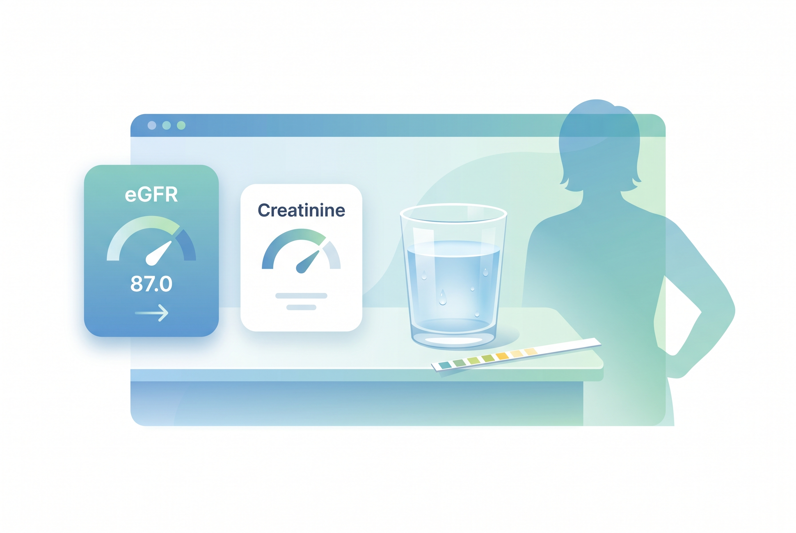

# 40대 신장 수치가 정상이어도 안심하면 안 되는 이유, eGFR보다 먼저 볼 것 3가지

40대는 신장 수치가 진짜 이상해질 때까지 조용한 편임. 그래서 크레아티닌 한 줄, eGFR 한 줄만 보고 끝내면 자주 놓침. 숫자보다 먼저 봐야 할 게 몇 개 있음.

1. 크레아티닌과 eGFR는 지금 상태의 스냅샷에 가깝음. 근육량, 수분 상태, 최근 운동이 같이 섞여 들어감. 그래서 한 번 높게 나왔다고 바로 결론 내리면 안 됨.

2. 그래도 eGFR 60은 그냥 넘길 숫자는 아님. NIDDK와 NKF 둘 다 대체로 60 이상은 정상 범위, 60 미만은 신장질환 가능성을 보라고 말함. 다만 진짜 판단은 3개월 이상 지속되는지 같이 봐야 함.

3. 제일 먼저 볼 건 검사 조건임. 전날 격한 운동, 탈수, 많이 먹은 고기, 크레아틴 보충제, 진통제가 숫자를 흔들 수 있음. 숫자만 재지 말고 그날 몸 상태도 같이 적어야 함.

4. 신장은 혈압이랑 붙어 다님. 혈압이 높으면 신장이 상하고, 신장이 흔들리면 혈압도 더 오를 수 있음. 40대는 이 둘을 따로 보면 자주 헷갈림.

5. 당뇨도 마찬가지임. 혈당이 오래 높으면 콩팥의 미세한 필터가 망가질 수 있음. 그래서 공복혈당, HbA1c, eGFR를 같이 보는 게 맞음.

6. 소변검사는 꼭 같이 봐야 함. 단백뇨, 알부민뇨, 혈뇨는 혈액검사보다 먼저 신호를 줄 때가 많음. 특히 uACR가 있으면 더 좋음.

7. 몸이 보내는 신호는 늦지만 무시하면 안 됨. 발목 붓기, 거품뇨, 소변량 변화, 밤에 자주 깨서 화장실 가는 패턴, 이유 없는 피로가 있으면 체크가 필요함. 증상이 없다고 안전한 건 아님.

8. 약과 보충제도 봐야 함. 진통제, 일부 감기약, 한약과 건강기능식품, 크레아틴, 단백질 과다는 사람에 따라 부담이 될 수 있음. 건강용이라고 다 신장에 좋은 건 아니었음.

9. 생활습관은 거창할 필요 없음. 물을 무리 없이 마시고, 짠 음식 줄이고, 혈압과 체중을 관리하고, 잠을 확보하는 쪽이 기본임. 신장은 급한 이벤트보다 매일의 습관에 더 반응함.

10. 재검은 한 번으로 끝내지 않는 게 핵심임. 이상 수치가 나오면 같은 조건으로 다시 보고, 필요하면 3개월 간격으로 추적함. eGFR이 60 아래로 계속 가거나 소변 이상이 붙으면 진료를 보는 쪽이 맞음.

11. 바로 확인할 자료는 이 정도면 충분함. NIDDK는 eGFR 60 이상을 정상 범위로 보고, 60 미만은 신장질환 가능성을 보라고 안내함. NKF도 같은 방향임. 참고는 https://www.niddk.nih.gov/health-information/professionals/advanced-search/explain-kidney-test-results 와 https://www.kidney.org/kidney-topics/estimated-glomerular-filtration-rate-egfr 임.

12. 지금 할 일은 세 개면 됨. 최근 검사표에서 크레아티닌, eGFR, 소변 단백을 같이 보고, 전날 운동과 수분, 약을 떠올려 보셈. 다음 검사 때는 같은 조건으로 다시 재보는 게 제일 현실적임. 숫자는 한 번보다 흐름이 더 중요함.
