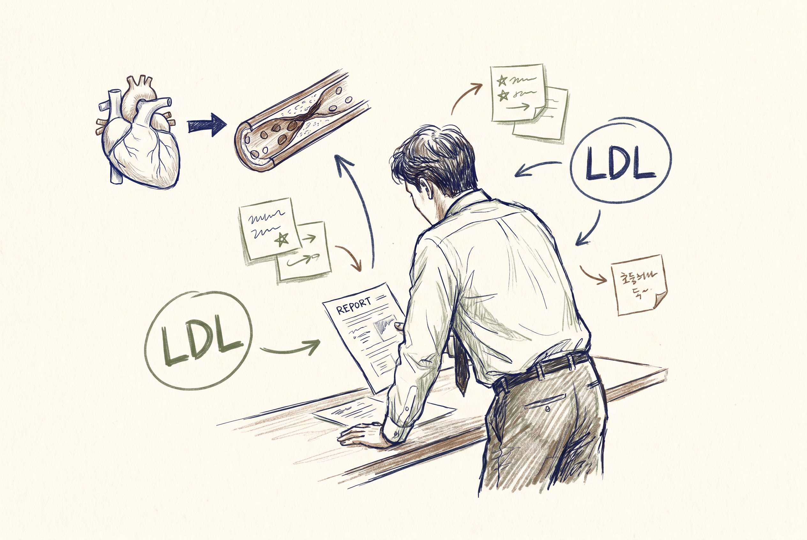
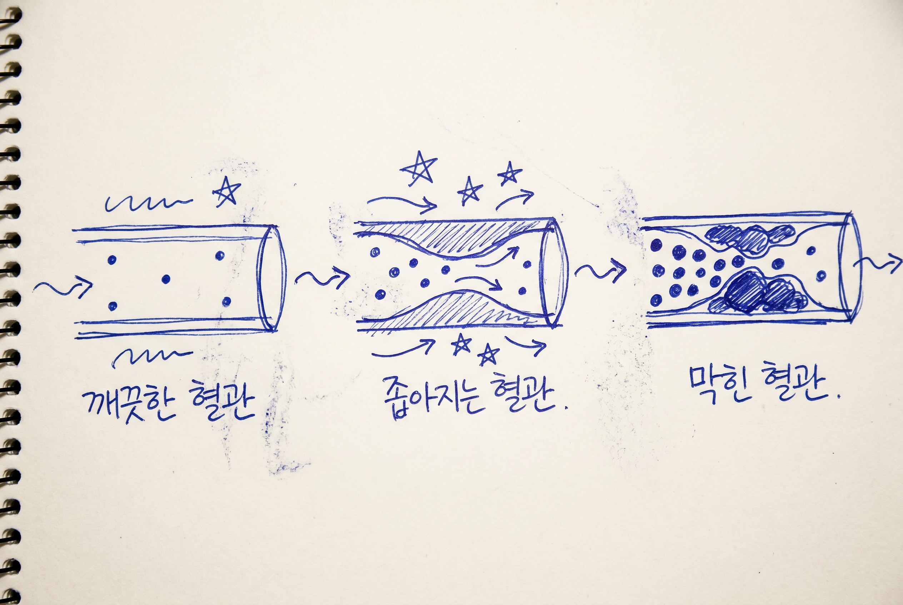

# 40대 LDL 콜레스테롤 130, 그냥 괜찮다고 넘기면 안 되는 이유

40대는 혈압도, 혈당도, 콜레스테롤도 다 숫자가 애매하게 나옴. 근데 애매하다고 해서 안전한 건 아님. LDL 130대는 딱 그런 숫자임.

1. LDL은 혈관에 찌꺼기를 쌓는 쪽으로 작동하는 콜레스테롤임. MedlinePlus도 LDL을 bad cholesterol로 설명함. 수치가 높을수록 동맥 안에 플라크가 쌓일 가능성이 커짐.

2. 무서운 건 증상이 거의 없다는 점임. Mayo Clinic도 고콜레스테롤은 증상이 없고 혈액검사로만 알 수 있다고 말함. 그래서 몸이 조용하다고 넘어가기 쉬움.

3. 40대가 더 위험한 건 생활이 겹치기 때문임. 야근, 회식, 운동 부족, 복부비만, 수면 부족이 붙으면 LDL 관리가 쉽게 밀림.

4. 검진표에서 총콜레스테롤만 보고 안심하면 안 됨. LDL, HDL, 중성지방이 같이 돌아봐야 할 숫자임. LDL은 나쁜 수치라고만 외우는 것보다, 전체 판을 같이 보는 게 맞음.

5. 130이라는 숫자가 무조건 약 뜻은 아님. 다만 가족력, 흡연, 고혈압, 당뇨, 비만이 같이 있으면 같은 130도 무게가 달라짐.

6. 그래서 40대는 한 번 높음보다 반복해서 높음을 봐야 함. 식사 바뀌고, 운동 늘리고, 체중 조금 줄였는데도 계속 높으면 다음 단계로 가야 함.

7. 생활 교정의 우선순위는 의외로 단순함. 포화지방과 트랜스지방을 줄이고, 튀김과 가공육 빈도를 낮추고, 걷기나 자전거 같은 유산소를 넣는 것임.

8. 체중도 같이 봐야 함. LDL은 혼자 놀지 않고, 배둘레와 혈압과 같이 움직이는 경우가 많음. 몸 전체의 위험 묶음으로 봐야 함.

9. 술도 조용한 변수임. 술 자체보다 안주 패턴이 LDL과 중성지방을 같이 흔듦. 회식이 잦은 40대는 숫자가 올라가는 흐름을 잘 봐야 함.

10. 집에서 할 일은 많지 않음. 저녁 늦게 과식하지 말고, 주 3~5회 몸을 움직이고, 3개월쯤 뒤 다시 검사하는 흐름이 가장 현실적임.

11. 약은 실패의 표시가 아님. 위험이 높거나 수치가 계속 높으면 의사가 스타틴 같은 약을 고려할 수 있음. 반대로 모두가 바로 약부터 시작하는 건 아님.

12. 중요한 건 지금 괜찮아 보임이 아니라 10년 뒤 혈관이 버티는가임. LDL 관리는 오늘 기분보다 장기 합병증을 보는 작업임.

13. 다음 검진에서 LDL 130대가 나오면, 그냥 넘어가지 말고 혈압·혈당·허리둘레까지 같이 적어두는 게 맞음. 숫자 하나가 아니라 패턴이 몸을 말해줌.

14. 같이 보면 되는 자료는 MedlinePlus `Cholesterol Levels`(https://medlineplus.gov/lab-tests/cholesterol-levels/), Mayo Clinic `High cholesterol`(https://www.mayoclinic.org/diseases-conditions/high-blood-cholesterol/symptoms-causes/syc-20350800), MedlinePlus `How to lower cholesterol`(https://medlineplus.gov/howtolowercholesterol.html)임.

15. **Q. LDL 130이면 바로 약 먹어야 함?** 꼭 그렇진 않음. 다른 위험요인과 전체 심혈관 위험을 같이 봐야 함.

16. **Q. 증상이 없는데 굳이 신경 써야 함?** 그게 더 문제임. 조용할 때 쌓여서 나중에 혈관 문제가 됨.

17. **Q. 식사만 바꾸면 끝남?** 많은 경우 도움이 되지만, 수치와 위험도에 따라 운동·체중·약까지 같이 봐야 함.
