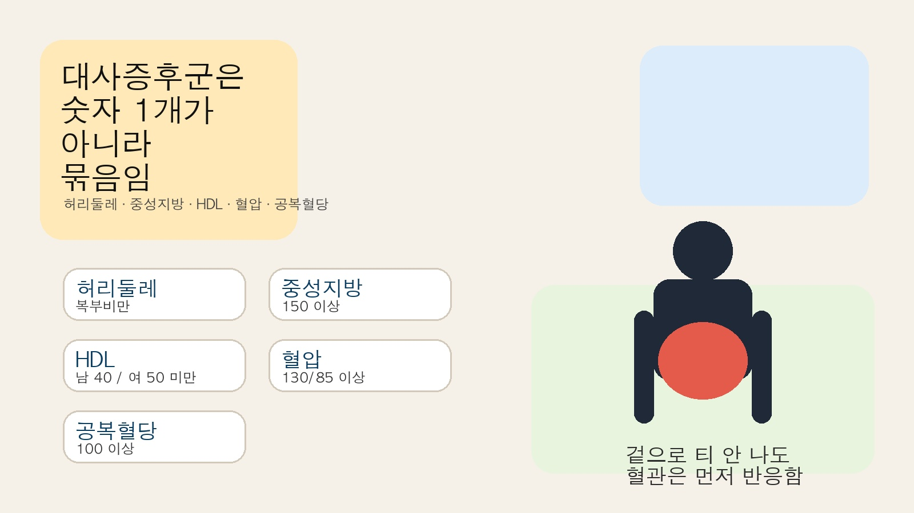
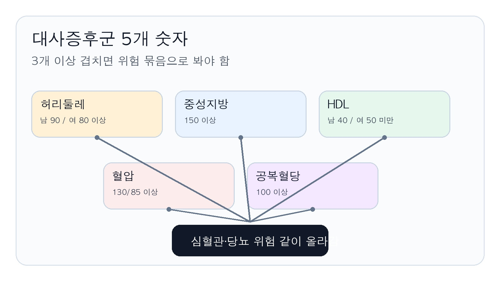

# 40대 대사증후군, 체중보다 먼저 봐야 할 숫자 5개

40대는 몸이 한 번에 무너지기보다 숫자부터 어긋남. 체중은 비슷한데 허리둘레, 혈압, 혈당이 하나씩 밀리기 시작함. 이 조합이 대사증후군임. 조용한데 꽤 위험함.

1. 대사증후군은 병 이름 하나가 아니라 묶음임. 허리둘레, 중성지방, HDL, 혈압, 공복혈당 이 5개 중 3개 이상이 겹치면 진단함.

2. 왜 40대에서 많이 보이냐면 이유는 단순함. 앉아 있는 시간, 술, 야식, 수면 부족, 운동량 감소가 같이 붙기 때문임.

3. 제일 먼저 보는 숫자는 허리둘레임. 한국 기준 남자 90cm, 여자 80cm 이상이면 복부비만으로 봄. 체중계보다 이게 먼저 흔들릴 때가 많음.

4. 근데 허리둘레만 보면 반쪽짜리임. 중성지방 150 이상, HDL 남 40 미만·여 50 미만, 혈압 130/85 이상, 공복혈당 100 이상을 같이 봐야 함.

5. 여기서 무서운 건 증상이 거의 없다는 점임. 몸이 조용해서 더 늦게 알아차림. 그래서 검진표를 안 보면 그냥 지나가기 쉬움.

6. 내장지방은 보기 싫은 배만 뜻하지 않음. 혈압과 혈당 조절을 흔들고, 인슐린 저항성을 키우고, 혈관 염증을 밀어 올림.

7. 그래서 체중만 줄이는 접근은 부족할 수 있음. 체중이 크게 안 줄어도 허리와 혈액 숫자가 같이 내려가야 의미가 있음.

8. 제일 현실적인 첫 조치는 저녁 폭식과 술 빈도를 줄이는 거임. 밥 양보다 안주와 술 조합이 더 세게 박힘.

9. 운동은 거창할 필요 없음. 주 3~5회, 30분 이상 걷기부터 붙이는 게 맞음. 가능하면 근력운동을 같이 넣는 게 더 좋음.

10. 체중 감량 목표도 너무 크면 오래 못 감. 현재 체중의 5~10%만 줄여도 대사증후군 관리에 도움이 됨.

11. 잠도 변수임. 수면이 밀리면 식욕과 혈당이 같이 흔들림. 늦게 자고 늦게 먹는 패턴이 제일 별로임.

12. 건강검진에서는 허리둘레, 공복혈당, 중성지방, HDL, 혈압을 같이 적어두는 게 좋음. 하나만 보면 놓치기 쉬움.

13. 그래도 숫자가 안 내려가면 약을 피할 이유가 없음. 생활습관이 기본이고, 필요하면 혈압약·지질약·혈당약을 따로 봐야 함.

14. 같이 보면 되는 자료는 서울아산병원 `대사 증후군(Metabolic syndrome)`(https://www.amc.seoul.kr/asan/healthinfo/disease/diseaseDetail.do?contentId=32084), Mayo Clinic `Metabolic syndrome - Diagnosis & treatment`(https://www.mayoclinic.org/diseases-conditions/metabolic-syndrome/diagnosis-treatment/drc-20351921), NHLBI `ATP III Guidelines At-A-Glance`(https://www.nhlbi.nih.gov/files/docs/guidelines/atglance.pdf)임.

15. **Q. 증상이 없는데도 꼭 신경 써야 함?** 맞음. 대사증후군은 조용할수록 늦게 잡힘. 증상보다 숫자가 먼저임.

16. **Q. 체중이 정상이어도 생김?** 생김. 체중보다 허리둘레와 혈액 숫자가 더 위험한 경우가 있음.

17. **Q. 영양제만 먹으면 해결됨?** 안 됨. 식사, 활동량, 수면을 같이 바꿔야 하고, 필요하면 약도 봐야 함.
