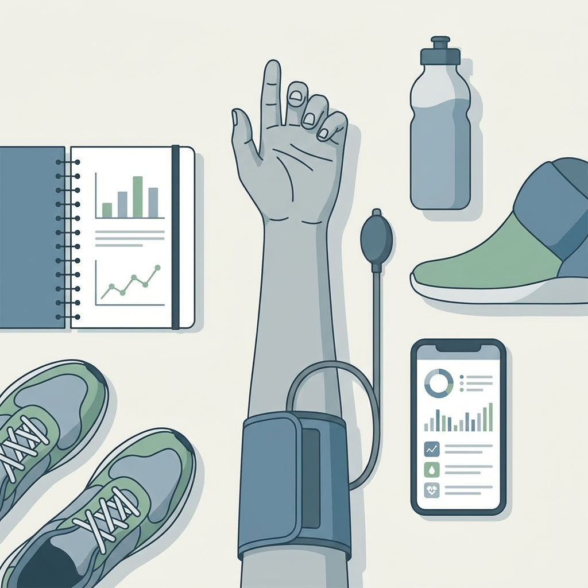

# 40대 야간뇨, 물만 줄여서는 안 되는 이유 4가지

40대가 되면 밤에 한 번씩 깨는 일이 그냥 피곤해서 그런 줄 알기 쉬웠음. 그런데 매일 비슷한 시간에 화장실이 마렵다면 이야기가 달라졌음. 단순히 물을 많이 마신 날인지, 혈당이나 수면 문제가 섞였는지 같이 봐야 했음.

야간뇨는 밤에 소변 때문에 깨는 상태를 말했음. 한 번만 일어나도 잠이 끊기면 다음날 컨디션이 바로 무너졌음. 그래서 이 문제는 수분 섭취 습관만 고치고 끝낼 일이 아니었음.

1. 가장 먼저 볼 건 저녁 습관이었음. 늦은 시간에 물을 몰아서 마시거나, 커피와 술을 같이 마시거나, 짠 음식이 많은 저녁을 먹으면 밤 소변이 늘기 쉬웠음. 특히 카페인은 소변을 자주 보게 만들 수 있었고, 술은 잠은 들게 해도 중간 각성을 늘렸음.

2. 그런데 습관만으로 설명이 안 될 때가 있었음. 밤에 목이 자주 마르고, 낮에도 소변이 많고, 체중이 늘고, 피곤함이 겹치면 혈당을 같이 봐야 했음. 혈당이 높으면 몸이 여분의 당을 빼내느라 소변량이 늘 수 있었음.

3. 수면무호흡도 빠지지 않았음. 코골이가 심하고, 자다가 숨이 막힌 느낌으로 깨고, 아침에 머리가 무겁고, 낮에 졸리면 밤에 화장실 가는 문제와 함께 보아야 했음. 수면이 끊기면 화장실이 먼저 원인처럼 보이지만, 실제로는 숨이 문제인 경우가 있었음.

4. 다리 붓기와 약물도 흔했음. 하루 종일 앉아 있다가 저녁에 다리가 붓는 사람은 밤에 누우면서 몸에 있던 수분이 다시 빠져나와 소변이 늘 수 있었음. 이뇨제 같은 약을 먹는 경우도 패턴을 바꿀 수 있었음. 그래서 "물"만 줄이는 방식은 종종 빗나갔음.

5. 집에서 확인할 건 생각보다 단순했음. 물을 언제 마셨는지, 저녁 커피나 술이 있었는지, 밤에 몇 번 깼는지, 코골이와 다리 붓기가 있는지, 갈증이 심한지 적어두면 됐음. 3일만 적어도 패턴이 보였음.

6. 소변 색도 힌트가 됐음. 너무 진하면 수분이 부족한 쪽이었고, 아주 맑고 양이 많으면 다른 원인을 봐야 했음. 특히 밤에 많이 깨는데도 낮까지 계속 갈증이 심하면 혈당 검사 쪽이 더 중요해졌음.

7. 40대는 여기서 자주 놓쳤음. 몸이 아프지 않으면 대수롭지 않게 넘기기 쉬웠음. 하지만 야간뇨는 잠을 깨워서 피로를 만들고, 피로는 다시 생활습관을 흐트러뜨렸음. 악순환이 생기기 쉬웠음.

8. 바로 진료를 봐야 하는 신호도 있었음. 소변 볼 때 통증이 있거나, 혈뇨가 보이거나, 열이 나거나, 허리 옆 통증이 심하거나, 갑자기 체중이 빠지거나, 숨이 차거나 다리가 심하게 붓는다면 늦추지 않는 편이 맞았음. 야간뇨 하나로 끝낼 문제가 아닐 수 있었음.

9. 검사도 어렵지 않았음. 기본적으로 소변검사와 혈당, 필요하면 당화혈색소, 신장 기능, 복용 약 확인 정도부터 시작했음. 코골이와 주간 졸림이 뚜렷하면 수면 평가를 고려했음.

10. 결론은 간단했음. 40대 야간뇨는 물을 줄이는 문제로만 보면 절반만 본 셈이었음. 혈당, 수면무호흡, 다리 붓기, 약물, 방광 신호를 같이 봐야 했음. 원인을 찾으면 밤잠은 생각보다 빨리 회복될 수 있었음.

**Q. 물을 줄이면 바로 해결되나요?**

가벼운 경우에는 도움이 됐음. 하지만 밤마다 반복되면 물만 줄여서는 부족했음. 혈당이나 수면무호흡이 있으면 습관만 바꿔도 계속 깼음.

**Q. 밤에 한 번 깨는 것도 검사해야 하나요?**

한 번 자체보다 반복 패턴이 더 중요했음. 잠이 끊기고 다음날 피로가 이어진다면 기록을 남기고 진료를 고려하는 편이 맞았음.

**Q. 어느 과로 가면 되나요?**

우선 내과나 가정의학과에서 시작해도 됐음. 통증, 혈뇨, 반복되는 방광 증상이 있으면 비뇨의학과가 더 맞았음.

**Q. 당뇨가 없어도 야간뇨가 생기나요?**

그렇겠음. 수면무호흡, 약물, 다리 붓기, 방광 자극 같은 원인도 있었음. 그래서 밤 소변만 보고 당뇨로 단정하면 안 됐음.

참고로 [NHS의 빈뇨 안내](https://www.nhs.uk/conditions/urinary-incontinence/), [NIDDK의 방광 조절 문제 자료](https://www.niddk.nih.gov/health-information/urologic-diseases/bladder-control-problems/definition-facts), [SleepApnea.org의 야간뇨 안내](https://www.sleepapnea.org/sleep-health/nighttime-urination-and-sleep-apnea/)를 함께 보면 원인 구분이 더 쉬웠음.
