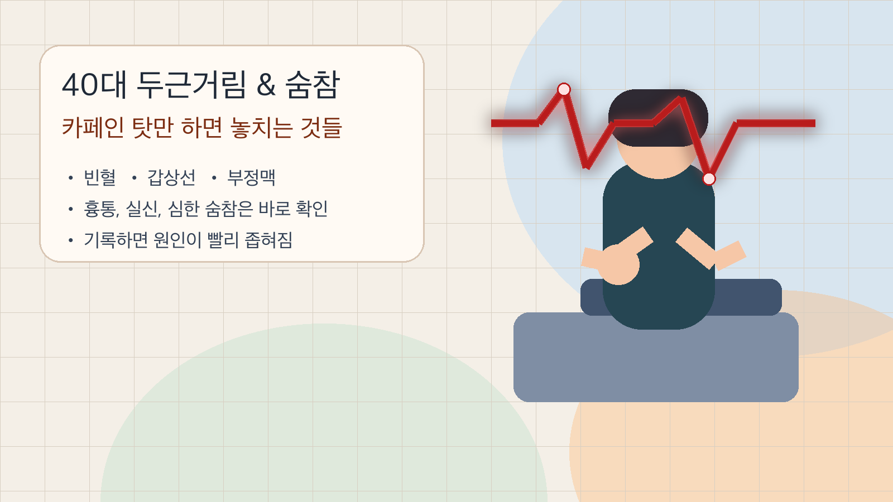
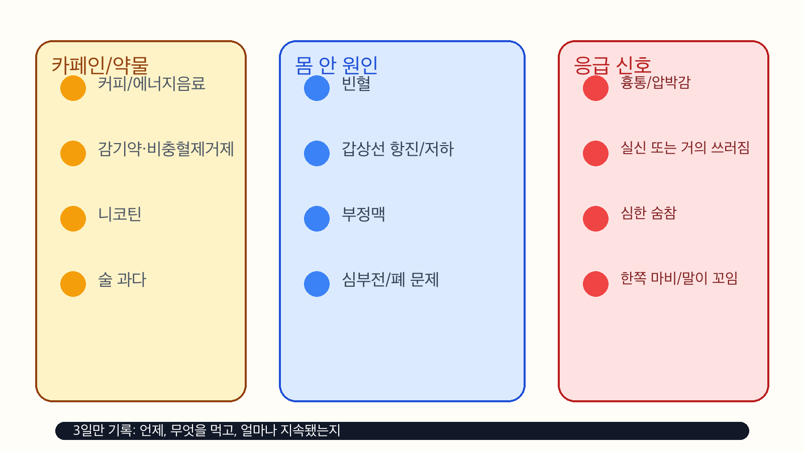

# 40대 심장이 두근거리고 숨이 찰 때, 카페인 탓만 하면 안 되는 이유 4가지

아침 출근길 계단 몇 칸만 올라가도 가슴이 벌렁거리고, 회의 중 갑자기 숨이 답답해지고, 커피를 마신 날 유독 더 심하면 "오늘 컨디션이 별로네" 하고 넘기기 쉬웠음. 그런데 40대 두근거림과 숨참은 카페인만의 문제가 아니었음. 빈혈, 갑상선, 부정맥, 약물, 심장 문제를 같이 봐야 했음.

이런 증상은 가끔 있으면 지나갈 수 있었지만, 반복되면 패턴을 봐야 했음. 특히 숨참이 같이 오면 몸이 단순히 예민한 게 아니라 산소 공급이나 심장 리듬 쪽에서 신호를 보내는 경우가 있었음.

1. 가장 흔한 출발점은 카페인, 니코틴, 스트레스였음. 커피, 에너지음료, 흡연, 감기약, 비충혈제거제, 일부 다이어트 보조제는 심장을 더 빨리 뛰게 만들 수 있었음. Mayo Clinic도 심장 두근거림의 흔한 유발 요인으로 스트레스, 운동, 자극제, 일부 약, 갑상선 문제를 같이 봐야 한다고 안내했음. 한두 번 뛴다고 바로 큰 병은 아니어도, 같은 패턴이 반복되면 원인을 좁혀야 했음.

2. 빈혈은 생각보다 전형적인 원인이었음. 혈액이 산소를 충분히 실어 나르지 못하면 몸은 보상하느라 심박수를 올리기 쉬웠음. 그래서 계단만 올라가도 숨이 차고, 가슴이 빨리 뛰고, 머리가 멍하고, 어지러운 식으로 나타났음. 특히 철결핍성 빈혈은 천천히 와서 그냥 피곤한 날로 착각하기 쉬웠음. 생리량이 많거나, 위장 출혈이 의심되거나, 식사가 부실하거나, 채식 위주이거나, 위장약을 오래 먹는 경우는 더 챙겨 봐야 했음.

3. 갑상선도 빼면 안 됐음. 갑상선호르몬이 너무 많으면 몸 전체 속도가 올라가면서 두근거림, 손 떨림, 더위 민감, 체중 감소, 불안감이 같이 올 수 있었음. 반대로 갑상선 기능저하도 피로와 운동 시 숨참, 맥박 이상 느낌으로 이어질 수 있었음. 몸의 엔진이 너무 빨라도, 너무 느려도 심장이 불편해졌음.

4. 부정맥은 "박동의 리듬" 문제였음. 빠르기만 한 게 아니라, 쿵 하고 건너뛰는 느낌, 불규칙하게 뛰는 느낌, 갑자기 솟았다가 툭 꺼지는 느낌이 있으면 리듬 이상을 의심해야 했음. Mayo Clinic은 이런 경우 ECG나 홀터 모니터 같은 검사로 실제 리듬을 확인한다고 설명했음. 병원에 갔을 때 이미 증상이 사라져도 이상하지 않았기 때문에, 증상을 메모해 두는 게 중요했음.

5. 숨참이 같이 오면 한 단계 더 보수적으로 봐야 했음. AHA는 심부전의 대표 증상으로 숨참을 강조했고, 활동할 때만이 아니라 누웠을 때 더 심해지거나 밤에 숨이 차서 깨는 패턴도 경고 신호로 봤음. 다리 붓기, 갑작스런 체중 증가, 운동 능력 저하가 같이 있으면 단순 피로로 치부하기 어려웠음. 폐 문제도 가능하니 "심장 아니면 끝"으로 단정하면 안 됐음.

6. 바로 응급실로 가야 하는 신호도 분명했음. 흉통이나 압박감, 실신 또는 거의 쓰러질 뻔한 느낌, 심한 숨참, 식은땀, 어지러움, 한쪽 마비, 말이 꼬임, 시야 이상이 같이 오면 기다리면 안 됐음. AHA는 심장마비 경고 신호로 가슴 불편감, 숨참, 식은땀, 빠르거나 불규칙한 심장박동을 같이 보라고 안내했음. 특히 "이번만 좀 심하네" 하고 넘기기 쉬운 순간이 제일 위험했음.

7. 병원 가기 전에 기록하면 진단이 빨라졌음. 언제 시작됐는지, 커피나 술을 얼마나 마셨는지, 감기약이나 다이어트 약을 먹었는지, 계단 오를 때만 그런지 쉬어도 그런지, 맥박이 빠르기만 한지 불규칙한지 적어두면 됐음. 3일만 기록해도 패턴이 보였음. 무엇을 먹었는지, 몇 분 지속됐는지, 동반 증상이 무엇이었는지가 핵심이었음.

8. 검사는 생각보다 순서가 단순했음. 먼저 빈혈 확인을 위한 CBC와 철 상태, 갑상선 기능검사, 심전도부터 보는 경우가 많았음. 증상이 간헐적이면 홀터 모니터로 하루 이상 리듬을 잡아야 했음. 숨참이 뚜렷하면 흉부 사진이나 심장 초음파, 필요하면 추가 검사를 고려했음. 한 번에 모든 걸 다 하는 것보다, 증상 조합에 맞춰 좁히는 게 맞았음.

9. 집에서 할 건 무조건 참는 게 아니었음. 카페인은 갑자기 끊기보다 줄이는 쪽이 낫고, 에너지음료는 아예 빼는 편이 좋았음. 감기약이나 비충혈제거제는 두근거림을 더 심하게 만들 수 있으니 성분표를 봐야 했음. 수면이 부족하면 심박이 더 예민해졌고, 탈수도 두근거림을 키웠음. 물을 적당히 마시고, 밤샘을 줄이고, 운동은 과격하게 몰지 않는 게 기본이었음.

10. 정리하면 단순했음. 40대 두근거림과 숨참은 카페인 한 잔으로 끝나는 경우도 있지만, 빈혈, 갑상선, 부정맥, 심장 문제의 시작점일 수도 있었음. 반복되면 기록하고, 흉통이나 실신 같은 경고 신호가 있으면 바로 진료를 봐야 했음. 몸이 빨리 뛴다는 건 대개 이유가 있다는 뜻이었음.

## 자주 묻는 질문

**Q. 커피를 끊으면 괜찮아지는데 병원 안 가도 되나요?**

그럴 수는 있었음. 하지만 같은 증상이 반복되거나 숨참, 흉통, 어지러움이 같이 오면 검사를 받아보는 게 맞았음. 자극제만의 문제가 아닐 수 있었음.

**Q. 맥박이 빠르기만 하면 괜찮은가요?**

아니었음. 너무 빠른지, 불규칙한지, 중간에 멈칫하는 느낌이 있는지가 더 중요할 수 있었음. 리듬 이상은 "빠르다"보다 "불규칙하다"가 단서였음.

**Q. 어느 과로 가면 되나요?**

우선 내과나 가정의학과에서 시작해도 됐음. 증상이 반복되거나 흉통, 실신, 심한 숨참이 있으면 심장내과나 응급실이 먼저였음.

## 같이 보면 되는 자료

- [Mayo Clinic, Heart palpitations - Diagnosis & treatment](https://www.mayoclinic.org/diseases-conditions/heart-palpitations/diagnosis-treatment/drc-20373201)
- [MedlinePlus, Iron deficiency anemia](https://medlineplus.gov/ency/article/000584.htm)
- [NIDDK, Hyperthyroidism (Overactive Thyroid)](https://www.niddk.nih.gov/health-information/endocrine-diseases/hyperthyroidism)
- [American Heart Association, Heart Failure Signs and Symptoms](https://www.heart.org/en/health-topics/heart-failure/warning-signs-of-heart-failure)
- [American Heart Association, Warning Signs of a Heart Attack](https://www.heart.org/en/health-topics/heart-attack/warning-signs-of-a-heart-attack)
