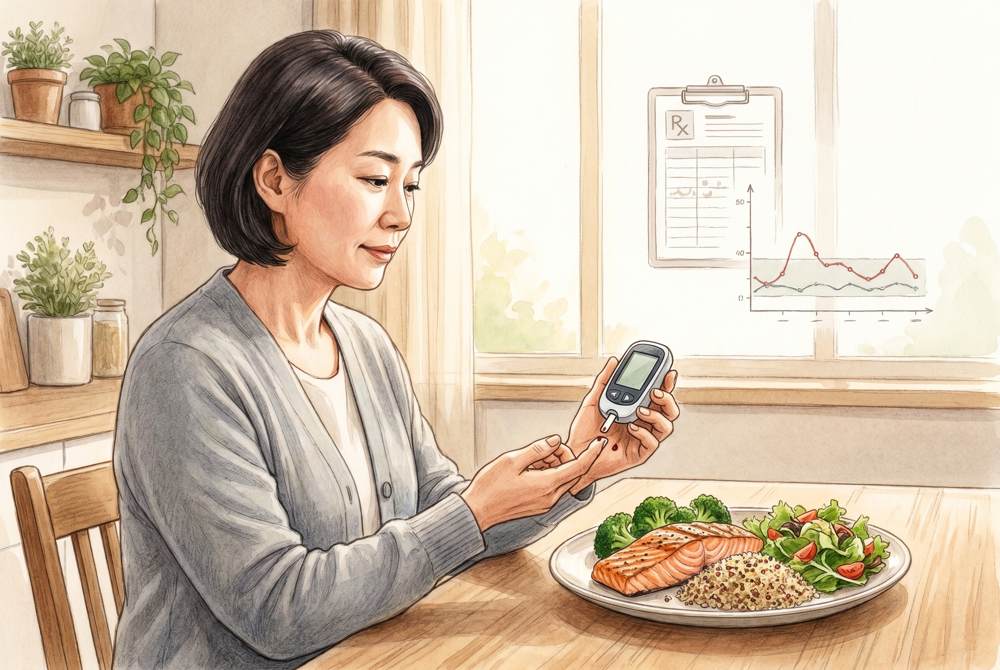

# 40대 식후혈당 140, 공복혈당이 정상이어도 놓치기 쉬운 이유

40대는 공복혈당만 괜찮으면 안심하기 쉬웠음. 근데 밥 먹고 나서 혈당이 먼저 튀는 경우가 꽤 있었음. 아침 숫자 하나로는 안 보이던 흐름이 식후에 드러났음.

1. 식후혈당은 몸이 당을 얼마나 빨리 처리하는지 보여줬음. 공복이 괜찮아도 식후가 먼저 흔들리면 인슐린 저항성이 시작됐을 수 있었음.

2. 식후 2시간 140mg/dL은 자주 기준으로 쓰였음. 140을 반복해서 넘는다면 그냥 한 번의 예외로 넘기기 어려웠음. 숫자보다 패턴이 더 중요했음.

3. 40대에서 이걸 놓치기 쉬운 이유는 단순했음. 아침엔 커피만 마시고, 점심은 급하게 먹고, 저녁은 늦고 많아졌음. 혈당은 이런 리듬을 그대로 기억했음.

4. 식후 혈당이 먼저 튀면 졸림, 멍함, 단것 당김이 같이 올 수 있었음. 밥 먹고 오히려 배가 더 고프다고 느끼는 사람도 있었음. 몸이 에너지를 잘 못 쓰는 신호였음.

5. 공복혈당 정상이라고 안심 끝은 아니었음. 공복은 괜찮아도 식후 처리 능력이 나빠질 수 있었음. 그래서 HbA1c, 공복혈당, 식후혈당을 같이 봐야 했음.

6. 집에서 볼 땐 타이밍이 중요했음. 첫 숟갈 기준으로 1시간, 2시간을 같이 보면 흐름이 보였음. 특히 탄수화물 많은 식사 뒤에 어떻게 움직이는지 확인하면 좋았음.

7. 제일 먼저 바꿀 건 메뉴보다 순서였음. 밥부터 먹는 습관을 줄이고, 단백질과 채소를 먼저 넣는 쪽이 낫았음. 같은 메뉴라도 속도가 달라졌음.

8. 양도 무시 못 했음. 흰쌀밥, 면, 빵, 달달한 음료가 겹치면 식후가 쉽게 튀었음. "조금만"이 쌓이면 수치가 올라갔음.

9. 먹고 바로 앉아 있는 것도 문제였음. 10~20분이라도 걷는 편이 훨씬 나았음. 식후 산책은 생각보다 값싼 처방이었음.

10. 잠이 밀리면 더 흔들렸음. 늦게 자고, 술 마시고, 다음 날 피곤한 패턴이 이어지면 혈당 조절이 더 어려워졌음. 40대는 일이 바쁘다고 수면부터 무너지는 경우가 많았음.

11. 이런 경우는 진료를 서둘러야 했음. 물을 자꾸 찾고, 소변이 늘고, 체중이 빠지고, 시야가 흐려지면 그냥 피곤함으로 보기 어려웠음. 식후만의 문제가 아닐 수 있었음.

12. 건강검진에서 봐야 하는 건 한 줄이 아니었음. 공복혈당, HbA1c, 중성지방, 허리둘레, 혈압을 같이 보면 그림이 더 잘 보였음. 숫자는 묶어서 읽어야 했음.

13. **Q. 식후혈당 140이면 당뇨임?** 바로 당뇨라고 단정하진 못했음. 하지만 반복되면 당뇨전단계나 인슐린 저항성을 의심해 볼 이유가 있었음.

14. **Q. 공복혈당이 정상이면 그냥 둬도 됨?** 아니었음. 공복과 식후는 다른 창이었음. 식후가 먼저 무너지는 사람이 꽤 있었음.

15. **Q. 제일 현실적인 첫걸음은 뭐임?** 밥 양을 조금 줄이고, 단백질을 먼저 먹고, 식후 10분 걷기부터 붙이는 거였음. 그다음 2주만 기록해도 패턴이 보였음.

같이 보면 되는 자료는 [ADA 당뇨 진단 기준](https://diabetes.org/about-diabetes/diagnosis), [NIDDK 인슐린 저항성과 당뇨전단계](https://www.niddk.nih.gov/health-information/diabetes/overview/what-is-diabetes/prediabetes-insulin-resistance), [University of Rochester의 2시간 식후혈당 설명](https://www.urmc.rochester.edu/encyclopedia/content?contenttypeid=167&contentid=glucose_two_hour_postprandial)임.
