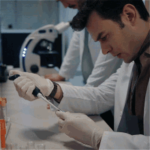
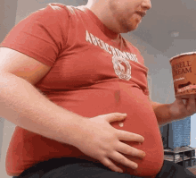

건강검진표에 공복혈당 **100** 하나 찍히면 애매해서 그냥 넘기기 쉬움. 근데 40대부터는 이 숫자가 생활습관 경고등 역할을 하는 경우가 많음.

1. 공복혈당 **100~125mg/dL**은 대한진단검사의학회 기준으로 공복혈당장애 구간임. 정상 상한선에 걸친 정도가 아니라 당뇨병 전단계로 분류되는 숫자라서, 40대라면 "아직 괜찮겠지"로 넘기면 손해임.

2. 국민건강보험공단 자료를 보면 **8시간 공복 후 100 미만**이 정상이고 **126 이상**이면 당뇨병 진단 기준으로 봄. 즉 **100**은 정상과 당뇨 사이의 완충지대가 아니라 이미 관리 시작선에 들어온 숫자였음.

3. 더 무서운 건 증상이 없는 경우가 많다는 점임. 질병관리청도 당뇨병의 대표 증상으로 다음, 다뇨, 다식을 말하지만 실제로는 아무 느낌 없이 건강검진에서 먼저 걸리는 경우가 흔함.

4. 그래도 몸이 보내는 힌트는 있음. 물을 자꾸 찾게 되거나 화장실 가는 횟수가 늘거나 밥을 먹어도 금방 허기지고 이유 없이 피곤하면 그냥 나이 탓만 할 일이 아님.

5. 40대에서 특히 걸리는 이유는 단순함. 근육량은 조금씩 줄고 복부지방은 늘고 수면은 짧아지고 회식과 야식은 남아 있어서 인슐린 저항성이 커지기 쉬운 구간임.

6. 여기서 많이 하는 실수가 "단 거만 줄이면 되지"임. 근데 공복혈당은 야식, 음주, 수면 부족, 운동 부족, 체중 증가가 같이 물려서 올라가는 경우가 많아서 한 가지만 손보면 생각보다 잘 안 내려감.

7. 질병관리청 자료에는 비만한 당뇨병 환자는 체중을 **5% 이상** 줄이는 것이 중요하다고 나옴. 당뇨 전단계도 방향은 비슷해서 80kg인 사람이면 일단 **4kg**만 빼도 몸의 반응이 달라질 수 있음.

8. 실전에서 가장 먼저 볼 건 세 가지임. 첫째는 저녁 늦게 먹는 습관, 둘째는 주 **0회**에 가까운 운동, 셋째는 잠을 줄여가며 버티는 생활임. 이 셋이 공복혈당 **100**을 **110**, **115**로 끌어올리기 쉬움.

9. 검사도 하나로 끝내면 아쉬움. 대한진단검사의학회는 당화혈색소 **HbA1c**가 최근 **2~3개월** 평균 혈당을 반영한다고 설명하고 있어서, 공복혈당이 애매하면 이 수치까지 같이 봐야 흐름이 읽힘.

10. 그리고 혈당만 보면 반쪽짜리임. 대한진단검사의학회 자료에는 당뇨 환자의 약 **50%**에서 지방간이 동반된다고 나와 있고 지질 검사와 간기능 검사도 같이 보라고 함. 40대 건강검진에서 혈당, 간수치, 콜레스테롤이 같이 흔들리면 생활 전체를 바꿔야 한다는 뜻임.

11. 바로 약부터 찾기보다 먼저 생활을 고치는 쪽이 현실적임. 아침 굶고 점심 과식하는 패턴 끊고 저녁 식사 후 **10~20분**이라도 걷고 술 마시는 횟수를 줄이고 주 **3회 이상** 몸을 쓰는 루틴부터 만드는 게 먼저임.

12. 한 번 높게 나왔다고 바로 당뇨병 확정은 아님. 근데 **100**이 나왔는데도 재검을 미루고 예전 생활로 돌아가면 숫자는 생각보다 조용하게 다음 단계로 넘어감.

13. 결론은 간단함. 40대 공복혈당 **100**은 괜찮은 숫자에 걸친 게 아니라 멈춰서 생활을 점검하라는 첫 신호였음.

14. 같이 보면 되는 자료도 분명함. [대한진단검사의학회 공복혈당장애와 HbA1c 검사 안내](https://www.kslm.org/public/content/diagnostic/sub03.html), [질병관리청 국가건강정보포털 당뇨병 기본 정보](https://health.kdca.go.kr/healthinfo/biz/health/gnrlzHealthInfo/gnrlzHealthInfo/gnrlzHealthInfoView.do?cntnts_sn=5305), [국민건강보험공단 건강iN 공복혈당장애 안내](https://www.nhis.or.kr/magazin/mobile/201706/c02.html), [서울시 건강증진 자료실 당뇨병 전단계 안내](https://www.seoulhp.com/seoul/bbs/BMSR00054/view.do?boardId=2615&menuNo=200154)를 같이 보면 흐름이 더 잘 보임.
