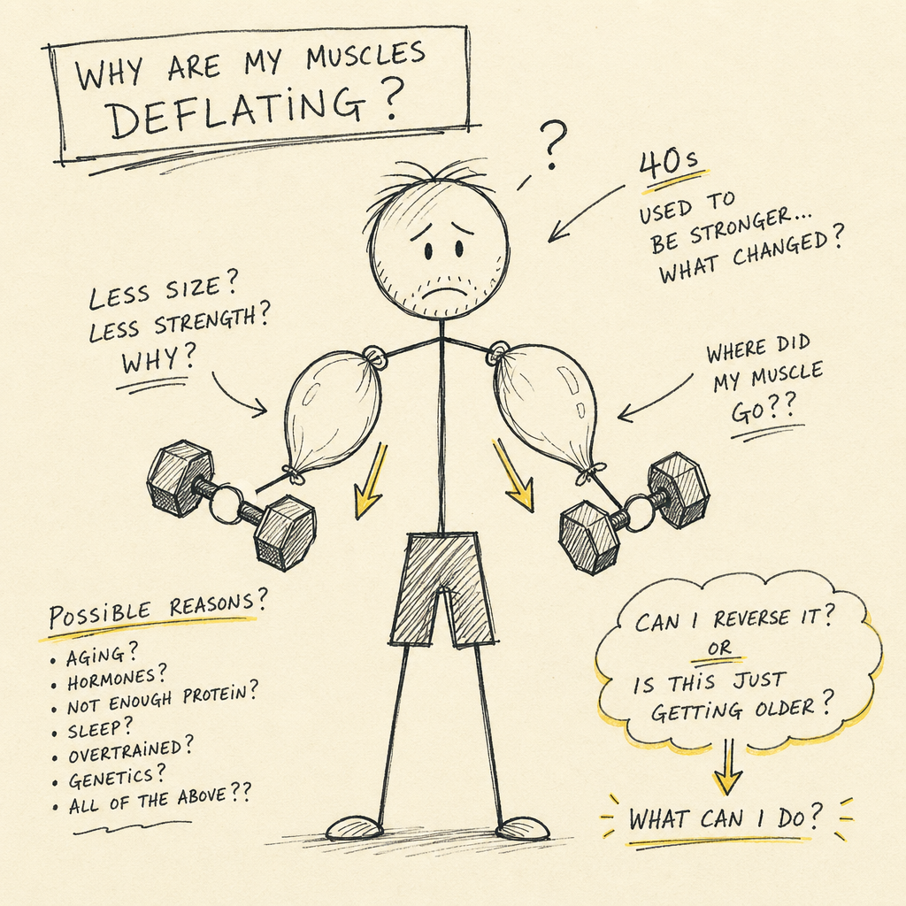
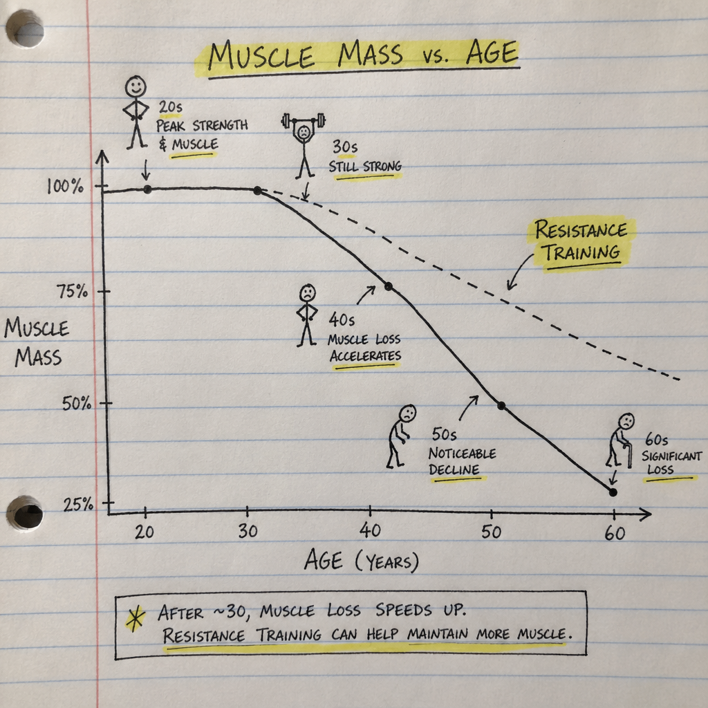
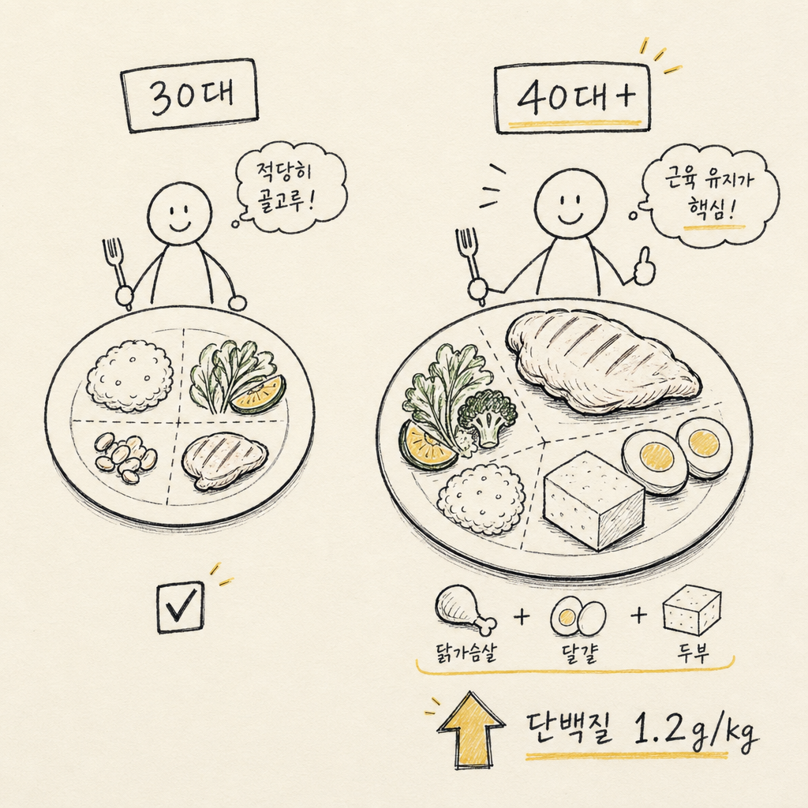

# 40대 근감소증, 운동하는데 근육이 안 붙으면 이미 늦은 것

1. 30대까진 별 생각 안 함. 근육이 알아서 유지됨. 근데 40 넘어서면 뭔가 이상함. 운동을 해도 예전처럼 근육이 붙지 않음. 오히려 빠지는 속도가 더 빠름.

2. 이게 근감소증임. 의학 용어로 사르코페니아. 30대 이후 매년 근육량이 3~8%씩 감소함. 40대 들어서면 그 감소 속도가 가속됨. 모르는 사이에 진행됨.

3. 문제는 대부분 "나는 아직 괜찮아"라고 생각함. 체중계 숫자가 비슷하니까. 근데 체중은 그대로인데 근육은 빠지고 지방이 채우는 구조임. 체지방률만 올라가는 것.

4. 한국인 40대 남성의 약 12%, 여성의 약 18%가 근감소증 전단계임. 대한비만학회 자료. 그런데 본인이 알고 있는 경우는 10명 중 1명도 안 됨. 건강검진에서 근육량을 정식으로 측정하지 않으니까.

5. 근감소증이 무서운 이유는 연쇄 반응임. 근육이 줄면 기초대사량이 떨어짐. 기초대사량이 떨어지면 같이 먹어도 살이 찜. 살이 찌면 인슐린 저항성이 올라감. 인슐린 저항성이 올라가면 근육 합성이 더 안 됨. 악순환의 고리.

6. 자각 증상은 의외로 단순함. 계단 오를 때 숨이 더 차고, 물건 들 때 팔이 더 아프고, 앉았다 일어날 때 무릎이 시큰거리고, 팔뚝이 예전보다 가늘어진 느낌. 이 중 두 개 이상 해당하면 이미 진행 중일 가능성이 높음.

7. 근데 사람들이 많이 하는 실수가 있음. 유산소 운동만 함. 달리기, 자전거, 수영. 심혈관 건강엔 좋은데 근육 늘리는 데는 거의 도움 안 됨. 오히려 장거리 유산소는 근육을 분해하는 카르티솔 분비를 늘림.

8. 필요한 건 저항 운동임. 웨이트, 밴드, 맨몸 운동. 핵심은 점진적 과부하. 매번 같은 강도로 하면 근육이 적응해버림. 40대부터는 의식적으로 무게를 늘리거나 횟수를 늘려야 함.

9. 그리고 단백질. 30대엔 하루 체중 kg당 0.8g이면 충분했음. 40대부턴 1.2~1.5g이 필요함. 체중 70kg면 하루 84~105g. 계란 14개 분량. 닭가슴살 400g. 보통 식사로는 절대 못 채우는 양임.

10. 단백질 타이밍도 중요함. 한 번에 많이 먹는 것보다 20~30g씩 하루 4~5번 나눠 먹는 게 근육 합성에 유리함. 아침을 거르면 이미 하루 1/3을 날리는 것.

11. 비타민 D도 확인해야 함. 40대 한국인의 약 70%가 비타민 D 부족. 비타민 D가 부족하면 근육 합성 호르몬 신호가 약해짐. 건강검진에서 25(OH)D 수치 확인해서 30 ng/mL 이하면 보충제 복용 필수.

12. 수면도 근육과 직결됨. 성장호르몬 분비의 70%가 깊은 수면 단계에서 일어남. 40대에 수면 시간 6시간 미만이면 근육 회복이 제대로 안 됨. 7시간은 자야 함.

13. 그래서 40대가 당장 해야 할 것 세 가지. 첫째, 인바디나 DEXA로 근육량 정확히 측정. 둘째, 주 3회 저항 운동 루틴 시작. 셋째, 단백질 섭취량 계산해서 하루 1.2g/kg 맞추기.

14. 근데 가장 중요한 건 인식임. "나이 들면 근육 빠지는 게 당연하다"가 아니라 "나이 들수록 의도적으로 근육을 지켜야 한다"로 바꿔야 함. 방치하면 50대에 일상생활이 불편해짐. 60대에 낙상 위험이 급증함.

15. 근감소증은 한 번 가면 되돌리기 어려움. 근데 40대에 잡으면 충분히 되돌릴 수 있음. 지금 운동이 안 먹힌다고 느끼면 그게 신호임. 더 미루지 말고 근육량부터 확인해볼 것.
