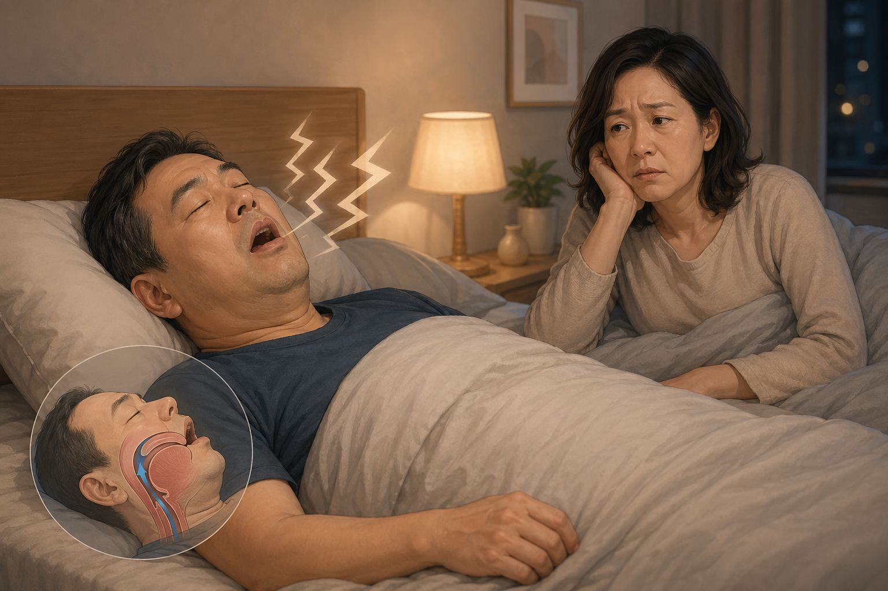
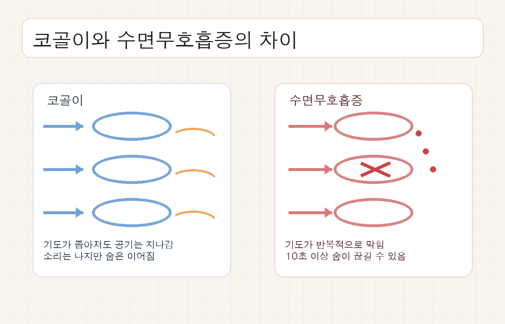
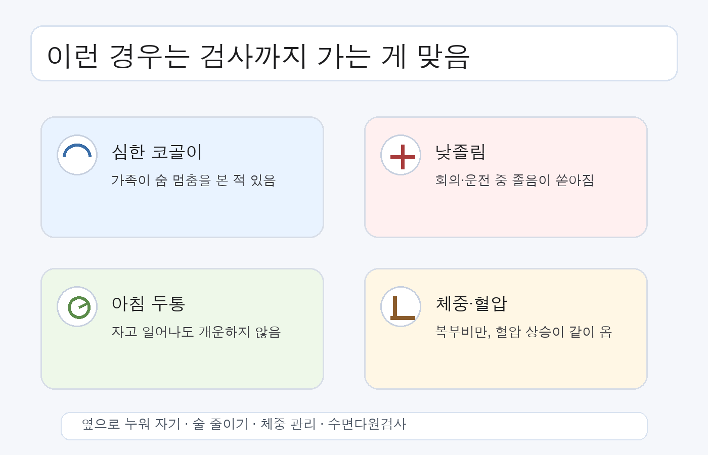

40대가 되면 코골이가 그냥 피곤해서 나는 소리처럼 들릴 때가 많음. 근데 이 시기 코골이는 체중, 목둘레, 술자리, 수면부족이 한꺼번에 쌓인 결과인 경우가 많아서 가볍게 넘기면 안 됨.

1. 국민건강보험공단은 수면무호흡증을 수면 중 호흡이 멈추거나 줄어드는 수면 호흡 장애로 설명함. 특히 수면 중 10초 이상 숨이 멈추는 경우를 기준으로 삼음. 코골이와 달리, 기도가 실제로 막히는 문제라는 뜻임.

2. 코골이 자체는 흔함. 근데 코골이 뒤에 숨 멎음이 붙으면 얘기가 달라짐. NHIS 설명처럼 코골이는 기도가 좁아졌다는 신호일 수 있고, 수면무호흡증은 그 좁아짐이 더 심해진 상태임.

3. 배우자나 가족이 자는 동안 숨이 멎는 걸 봤다면 우선순위가 올라감. 본인은 잠들어 있으니 모르는 경우가 많음. 그래서 옆 사람 말이 진짜 힌트였음.

4. 낮에 졸린 것도 중요함. 회의 중에 멍해지거나 운전 중 졸리면 단순 피곤함으로 보면 안 됨. 서울아산병원은 수면무호흡증에서 낮 졸림과 만성피로가 같이 올 수 있다고 설명함.

5. 아침 두통, 입마름, 잦은 야간뇨도 같이 봐야 함. 이런 조합이 반복되면 잠은 잤는데 회복이 안 된 상태일 가능성이 큼. 잠의 길이보다 잠의 질이 무너진 거임.

6. 40대에서 더 문제인 이유는 합병증 쪽임. NHIS 비급여 정보 포털은 치료하지 않으면 고혈압, 심혈관계질환, 당 대사 이상으로 이어질 수 있다고 설명함. 그냥 코만 고는 문제가 아니었음.

7. 진단은 감으로 안 함. 서울아산병원 수면다원검사는 뇌파, 안구운동, 근육 움직임, 호흡, 심전도, 영상 기록을 같이 봄. 수면 중 어떤 구간에서 숨이 막히는지 실제로 확인하는 검사임.

8. 검사까지 고민해야 하는 신호는 대체로 비슷함. 심한 코골이, 숨 멎음 목격, 낮 졸림, 아침 두통, 혈압 상승, 복부비만이 같이 오면 한 번은 봐야 함. 이 조합이면 "괜찮겠지"가 아니라 "확인해야지"가 맞음.

9. 병원 가기 전에 정리할 것도 있음. 언제부터 코를 골았는지, 술 마신 날 더 심한지, 똑바로 누웠을 때 심한지, 체중이 늘었는지, 혈압이 어떤지 적어두면 진료가 빨라짐. 아무 말 없이 가는 것보다 훨씬 낫음.

10. 생활 쪽 첫 조치는 단순함. 체중을 조금 줄이고, 자기 전 술과 진정제는 피하고, 옆으로 눕는 습관을 만들고, 머리를 약간 높여 자는 쪽이 맞음. NHIS도 운동과 체중 감소, 취침 전 술 피하기를 권함.

11. 그래도 심하면 기구치료로 넘어감. 양압기(CPAP)나 구강장치가 대표적임. 구조적으로 막히는 부위가 뚜렷하면 수술을 고려하는 경우도 있음. 다만 이건 진단 뒤에 정하는 순서임.

12. 코골이를 그냥 소리로만 보면 늦어질 수 있음. 40대 코골이는 피곤한 척하는 몸의 경고일 때가 많음. 숨이 끊기는지, 낮에 졸린지, 혈압이 오르는지까지 같이 보면 방향이 보였음.

13. 같이 보면 좋은 자료는 국민건강보험공단 건강 상식 노트 `코골이와 수면무호흡증은 달라요`(https://www.nhis.or.kr/magazin/137/html/c08.html), 국민건강보험공단 `방치하면 안 되는 수면 무호흡증`(https://www.nhis.or.kr/magazin/160/html/sub3.html), 서울아산병원 수면다원검사 안내(https://www.amc.seoul.kr/asan/mobile/healthinfo/management/managementDetail.do?managementId=40), 서울아산병원 수면 장애 질환백과(https://www.amc.seoul.kr/asan/healthinfo/disease/diseaseDetail.do?contentId=31891)임.
