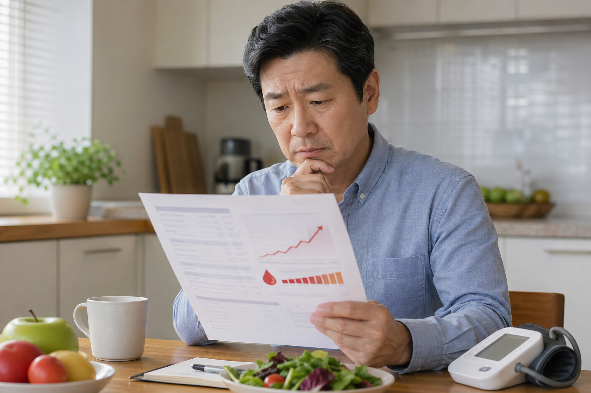
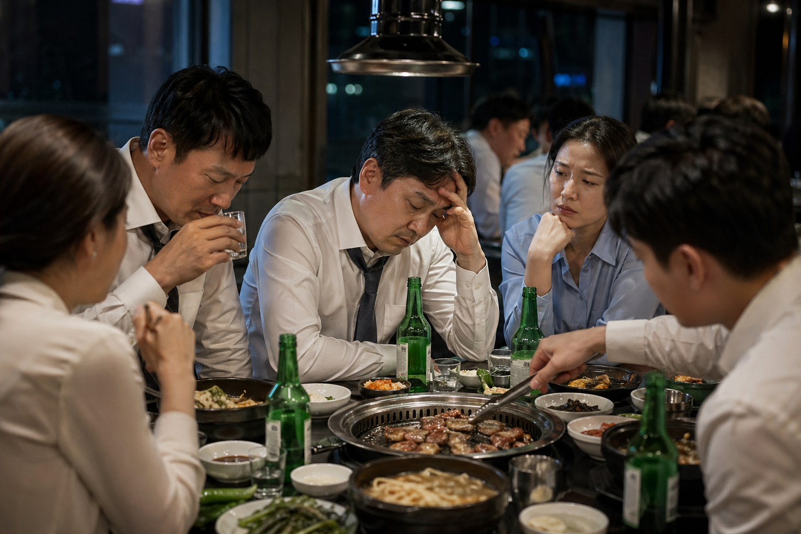

건강검진표에서 중성지방이 200으로 찍히면 제일 먼저 나오는 말이 있음. 전날 고기 먹어서 그런가, 술 마셔서 그런가 하는 말임. 실제로 식사 영향은 큼. 근데 40대에서는 그 한마디로 끝내기엔 숫자가 가볍지 않음.

1. 질병관리청 국가건강정보포털은 이상지질혈증 진단 기준 중 하나로 중성지방 200mg/dL 이상을 제시함. 분류도 150 미만 적정, 150~199 경계, 200~499 높음으로 나눔. 즉 200은 애매한 정상 끝이 아니라 이미 높음 구간에 들어간 숫자임.

2. 이 수치를 그냥 지방만의 문제로 보면 좁게 보는 거임. 국가건강정보포털은 이상지질혈증의 주요 합병증으로 동맥경화증, 협심증, 심근경색증, 뇌경색 같은 심뇌혈관질환을 같이 설명함. 혈액검사 한 줄이 결국 혈관 이야기로 이어진다는 뜻임.

3. 서울아산병원 검사 안내도 같은 방향임. 중성지방 증가는 심혈관질환과 말초혈관질환의 위험요인이 될 수 있다고 설명함. 숫자만 살짝 높다는 정도로 넘기기보다 왜 올라갔는지를 보는 게 먼저였음.

4. 문제는 원인이 너무 익숙하다는 점임. 서울아산병원은 비만, 조절되지 않은 당뇨병, 과다한 알코올 섭취, 일부 약물 사용이 중성지방 증가를 유발할 수 있다고 설명함. 40대 생활에서 자주 겹치는 회식, 체중 증가, 혈당 흔들림이 그대로 연결됨.

5. 그렇다고 전날 회식 핑계가 완전히 틀린 말은 아님. 서울아산병원은 중성지방이 식사 영향을 크게 받아 공복 수치보다 식후 수치가 5~10배 이상 증가할 수 있다고 안내함. 그래서 검사 전 9~12시간 금식이 정확한 결과에 중요함. 즉 재검은 의미가 있지만, 그 말이 처음 숫자를 무효로 만들진 않음.

6. 여기서 많이 놓치는 포인트가 있음. 한 번 높게 나온 사람이 계속 비슷하게 높게 나오는지, 아니면 진짜 일시적이었는지 확인을 안 한다는 점임. 질병관리청은 수치 이상이 있으면 생활습관 조절과 함께 정기적으로 지질 수치를 평가하라고 설명함. 40대는 이 흐름을 놓치면 몇 년이 그냥 지나감.

7. 식사 조정도 방향이 분명함. 질병관리청은 지방, 콜레스테롤, 당류 섭취를 줄이고 식이섬유를 늘리라고 권함. 서울아산병원은 탄수화물 섭취를 줄이고 총 지방과 단백질을 균형 있게 먹으라고 설명함. 결국 기름진 안주만 문제가 아니라 밥, 면, 빵, 술이 같이 얽힌 식사 패턴 전체를 봐야 함.

8. 술은 특히 직접적임. 서울아산병원은 중성지방을 낮추려면 술은 가급적 마시지 않는 것이 좋다고 안내함. 40대는 평일 한두 잔이 습관처럼 붙는 경우가 많은데, 본인은 많이 안 마신다고 생각해도 검사 수치는 솔직하게 반응함.

9. 체중과 복부비만도 같이 봐야 함. 질병관리청은 적정 체중 유지와 복부비만 예방을 강조하고, 비만한 경우 열량을 줄여 감량을 목표로 하라고 안내함. 중성지방 200은 혈액검사 수치이기도 하지만 허리둘레 경고등이기도 함.

10. 운동은 가장 단순한데 가장 자주 미뤄짐. 질병관리청은 주 5회 이상 30~60분 유산소 운동과 주 2회 이상 근력운동을 권함. 서울아산병원도 식이요법과 운동 같은 생활습관이 기본이라고 설명함. 중성지방은 운동을 미루는 사람에게 꽤 정직한 숫자였음.

11. 증상이 없다는 점도 함정임. 서울아산병원 질환백과는 이상지질혈증이 대개 무증상이고 대부분 혈액검사에서 발견된다고 설명함. 몸이 멀쩡하니까 괜찮다가 아니라, 멀쩡할 때 잡으라고 검진을 하는 거였음.

12. 그래도 수치가 훨씬 더 높으면 이야기가 달라짐. 서울아산병원은 중성지방이 1000mg/dL 이상으로 매우 높으면 췌장염 위험이 증가해 빠른 치료가 필요하다고 안내함. 지금 200이라고 해서 당장 그 단계는 아니지만, 계속 올라가면 혈관 문제를 넘어서 급성 합병증 쪽으로도 갈 수 있다는 신호는 알아둘 필요가 있음.

13. 실전 조치는 복잡하지 않음. 첫째, 다음 검사는 반드시 공복 조건을 맞출 것. 둘째, 술과 야식 빈도를 먼저 줄일 것. 셋째, 점심과 저녁의 정제탄수화물 비중을 낮출 것. 넷째, 허리둘레와 체중을 같이 기록할 것. 다섯째, 당뇨병이나 혈압, 지방간이 같이 있는지 확인할 것. 중성지방은 혼자 튀는 숫자보다 생활 전체가 밀어 올리는 숫자인 경우가 많음.

14. 결론은 이 정도임. 40대 중성지방 200은 전날 회식 탓일 수도 있음. 근데 그 말만 믿고 끝내기엔 이미 높음 구간이고, 혈관 위험과 생활습관 문제를 같이 시사하는 숫자임. 재검은 하되 방심은 하지 않는 쪽이 맞음. 한 번의 숫자를 무시하지 않는 사람이 결국 약 먹기 전 구간에서 방향을 바꾸게 됨.

15. 같이 보면 좋은 자료는 질병관리청 국가건강정보포털 이상지질혈증 관리 자료(https://health.kdca.go.kr/healthinfo/biz/health/ntcnInfo/healthSourc/thtimtCntnts/thtimtCntntsView.do?thtimt_cntnts_sn=124), 서울아산병원 중성지방 검사 안내(https://www.amc.seoul.kr/asan/mobile/healthinfo/management/managementDetail.do?managementId=82), 서울아산병원 이상지질혈증 질환백과(https://cancer.amc.seoul.kr/asan/mobile/healthinfo/disease/diseaseDetail.do?contentId=31326)임.

---

**같이 보면 좋은 글**
- [[40s-waistline-90-85-metabolic-syndrome-2026-04-26|40대 허리둘레 남자 90·여자 85cm, 대사증후군 기준]]
- [[40s-fatty-liver-normal-liver-enzymes-2026-04-24|40대 지방간, 간수치 정상인데도 놓치는 이유 7가지]]
- [[40s-prediabetes-fasting-glucose-100-2026-04-22|40대 공복혈당 100, 당뇨 전단계 신호 7가지]]
