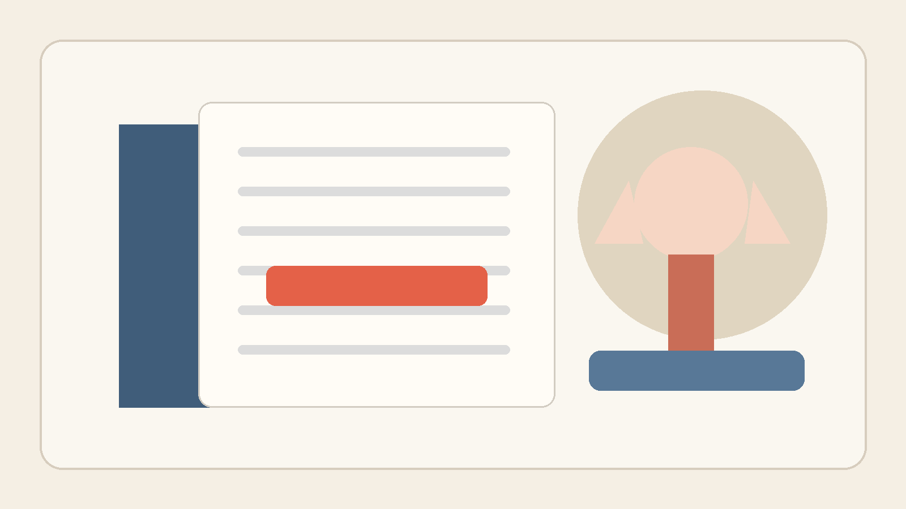
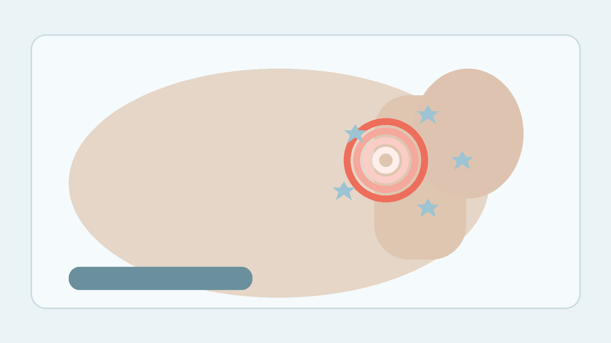
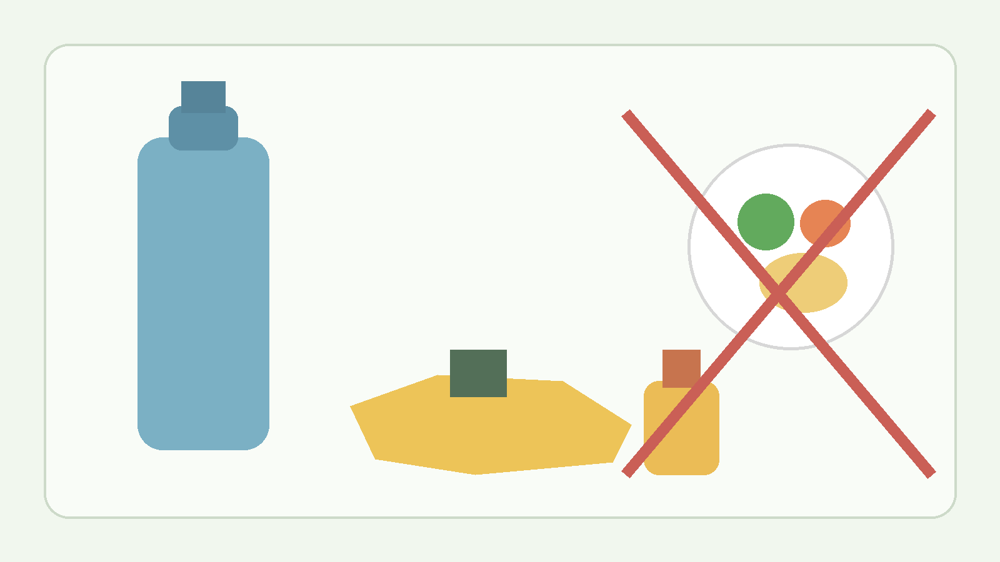

건강검진표에서 요산 수치가 7 근처로 찍히면 애매해서 그냥 넘기기 쉬움. 아픈 데도 없고, 엄지발가락이 붓는 일도 없으면 더 그럼. 근데 40대부터는 이 숫자가 완전한 무의미는 아님.

1. 질병관리청 국가건강정보포털 임상 화학 검사 자료에는 요산 참고범위를 3~7mg/dL로 제시함. 동시에 체내 요산이 과포화 상태가 되면 바늘 모양 결정으로 침착돼 통풍이나 신장질환이 생길 수 있다고 설명함. 즉 7이라는 숫자는 그냥 체크 한 번 하고 끝낼 숫자라기보다 경계선에 가까움.

2. 서울대학교병원 통풍 자료를 보면 혈청 요산이 7.0mg/dL 이상이면 고요산혈증으로 봄. 또 통풍은 나이가 많을수록, 혈중 요산 농도가 높을수록 발병 가능성이 커진다고 정리함. 검진표에 찍힌 숫자 하나가 완전히 따로 노는 정보는 아니라는 뜻임.

3. 여기서 중요한 건 무증상 구간이 꽤 길 수 있다는 점임. 서울대병원은 고요산혈증이 있어도 관절염, 통풍 결절, 요산 콩팥돌증 없이 지내는 무증상 단계가 있고, 실제로 이런 사람이 더 많다고 설명함. 안 아프니까 괜찮다가 아니라 안 아파도 쌓일 수 있다는 쪽이 더 정확했음.

4. 서울아산병원 자료도 같은 방향임. 요산이 높다고 모두 통풍 환자는 아니지만, 고요산혈증이 심할수록 또 오래갈수록 통풍 관절염이 생길 가능성이 커진다고 설명함. 40대에 처음 수치가 흔들리기 시작하면 그냥 평생 같은 상태로 머무는 게 아니라 생활 습관 따라 더 올라갈 수 있음.

5. 특히 남자는 더 봐야 함. 서울아산병원은 통풍 환자가 거의 남자이고 대개 40~50세에 첫 발작적 관절염을 경험한다고 설명함. 딱 건강검진표 숫자 하나가 생활습관 경고등으로 바뀌는 연령대와 겹침.

6. 원인은 생각보다 익숙함. 질병관리청은 요산 생성이 많아지거나 배출이 충분하지 않으면 혈중 농도가 올라간다고 설명함. 서울아산병원은 잦은 음주, 비만, 고콜레스테롤혈증, 당뇨, 고혈압 같은 요소를 같이 보라고 함. 회식 많고 체중 붙고 운동 끊긴 40대가 여기에 잘 걸림.

7. 그래서 통증만 기다리면 늦는 경우가 있음. 서울대병원 자료에는 급성 통풍이 오면 엄지발가락, 발목, 무릎 같은 관절이 갑자기 붓고 매우 아프다고 나옴. 근데 그 전까지는 무증상으로 지내는 사람이 많음. 경고가 아픔으로만 오는 병이 아니었음.

8. 신장 쪽도 같이 봐야 함. 질병관리청은 요산이 침착되면 신장질환이 생길 수 있다고 설명하고, 서울아산병원은 요로결석과 콩팥 손상을 합병증으로 언급함. 발가락만의 문제가 아니라는 얘기임.

9. 그렇다고 요산 7이 찍혔다고 바로 약부터 먹는 얘기로 가면 또 과함. 서울대병원은 통풍성 관절염이나 콩팥돌증이 없는 무증상 고요산혈증 치료는 정해진 원칙 하나로 밀어붙이기보다 의사 판단이 맞다고 설명함. 대신 비만, 고지질혈증, 알코올, 고혈압과 연결된 생활습관 개선이 중요하다고 못 박음.

10. 식사도 방향이 분명함. 서울아산병원 저퓨린 식사요법 자료는 퓨린 많은 음식과 술을 줄이고, 과일·야채·수분을 충분히 섭취하고, 정상 체중을 유지하라고 권함. 다만 무리한 굶기식 감량은 오히려 혈액 속 요산 농도를 올려 통풍을 악화시킬 수 있다고도 설명함. 빼더라도 급하게 빼면 안 됨.

11. 실전 조치는 단순함. 첫째, 맥주와 야식 빈도부터 줄일 것. 둘째, 물을 덜 마시는 습관을 끊을 것. 셋째, 체중과 허리둘레를 같이 볼 것. 넷째, 다음 검진까지 방치하지 말고 재검이나 진료 상담으로 흐름을 확인할 것. 요산은 숫자 하나보다 생활 패턴의 누적 결과에 더 가까움.

12. 반대로 바로 진료를 봐야 할 때도 있음. 엄지발가락이나 발목, 무릎이 갑자기 붓고 뜨겁고 아픈 경우, 밤에 통증이 심해지는 경우, 요로결석이 의심될 만큼 옆구리 통증이나 혈뇨가 있는 경우는 그냥 물 많이 마시고 버티는 쪽보다 병원에서 확인하는 게 맞음.

13. 결론은 이 정도임. 40대 요산 수치 7은 아무 증상 없으니 잊어도 되는 숫자도 아니고, 바로 겁먹고 약부터 찾을 숫자도 아님. 대신 생활습관을 손보기 시작해야 하는 애매한 출발선에 더 가까움. 이 시점에 방향을 바꾸면 통풍 발작 오기 전에 끊을 수 있고, 그냥 넘기면 나중에 발가락이 대신 말해줄 가능성이 커짐.

14. 같이 보면 좋은 자료는 질병관리청 국가건강정보포털 임상 화학 검사(https://health.kdca.go.kr/healthinfo/biz/health/gnrlzHealthInfo/gnrlzHealthInfo/gnrlzHealthInfoView.do?cntnts_sn=5531), 서울대학교병원 통풍 안내(https://www.snuh.org/health/nMedInfo/nView.do?category=DIS&medid=AA000056), 서울아산병원 통풍 질환백과(https://www.amc.seoul.kr/asan/mobile/healthinfo/disease/diseaseDetail.do?contentId=30832), 서울아산병원 저퓨린 식사요법(https://www.amc.seoul.kr/asan/healthinfo/mealtherapy/mealTherapyDetail.do?mtId=96)임.
