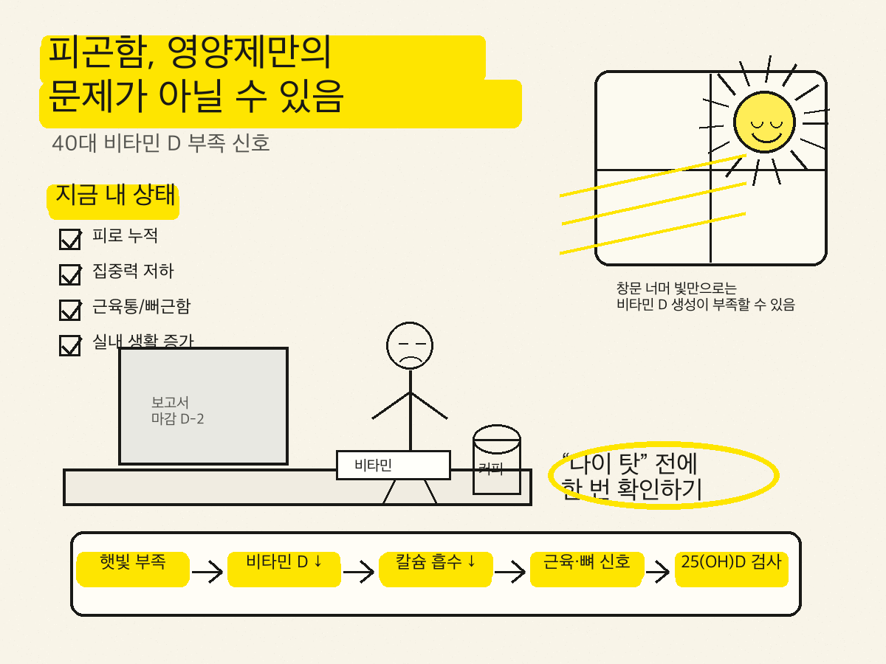
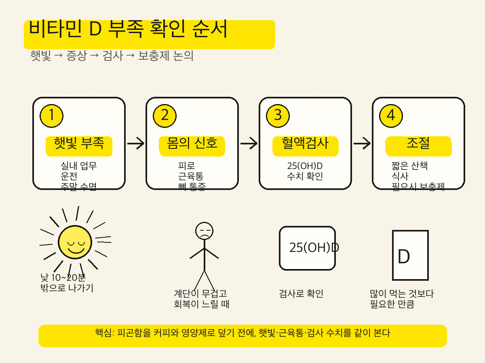

# 40대 비타민 D 부족, 피곤함을 영양제만으로 넘기면 안 되는 이유

40대가 되면 피곤함이 너무 흔해서 원인을 대충 넘기기 쉬움. 근데 햇빛이 줄고 실내 시간이 길어지면 비타민 D 부족이 생각보다 조용히 쌓임.

1. 비타민 D는 뼈만 보는 영양소가 아님. 칼슘 흡수와 뼈 건강, 근육 기능에 같이 걸려 있음. 몸이 버티는 바닥 체력을 받쳐주는 쪽임.

2. 햇빛이 가장 큰 출발점임. MSD는 직사광선에 피부가 노출되면 몸이 비타민 D를 만든다고 설명함. NIH는 창문을 통과한 빛으로는 만들지 못한다고 적었음. 사무실 안에서 빛만 봐서는 부족하기 쉬웠음.

3. 서울아산병원 자료를 보면 비타민 D 결핍 진료 인원이 2010년 3,118명에서 2014년 3만1,225명으로 약 10배 늘었음. 특히 2012년 이후 40대와 50대 진료 인원이 크게 증가했음. 이건 남 얘기가 아니었음.

4. 40대에서 더 문제인 이유는 생활이 딱 맞물리기 때문임. 야근, 회식, 실내 업무, 운전, 주말 수면 보충이 이어지면 밖에 나갈 시간이 확 줄어듦. 햇빛은 중요한데 일정표에서 제일 먼저 밀림.

5. 증상은 의외로 조용함. MSD는 비타민 D 결핍이 근육통, 쇠약, 뼈 통증을 만들 수 있다고 설명함. 피곤함도 같이 붙을 수 있음. 그래서 그냥 나이 탓으로 넘기기 쉬움.

6. 몸이 신호를 주는 방식도 애매함. 계단이 유독 무겁고, 운동 뒤 회복이 느리고, 종아리나 허벅지가 자주 뻐근하면 한 번은 의심해야 함. 단순 과로와 결핍이 겹쳐 있을 수 있음.

7. 검사로 확인하는 게 제일 깔끔함. 병원에서는 혈액검사로 `25(OH)D` 수치를 봄. 영양제부터 시작하기보다, 지금 정말 부족한지부터 보는 순서가 맞음.

8. 반대로 비타민 D를 무조건 많이 먹는다고 끝나진 않음. NIH는 보충제를 과하게 먹으면 메스꺼움, 구토, 근육 약화, 혼란, 신장결석 같은 문제가 생길 수 있다고 적었음. 햇빛은 몸이 스스로 양을 조절하지만, 보충제는 그게 아니었음.

9. 그래서 실전은 단순함. 낮에 10~20분이라도 바깥을 걷고, 팔이나 다리에 빛을 좀 받게 하고, 생선·달걀·강화식품을 챙기고, 부족이 확인되면 그때 보충제를 논의하는 쪽이 맞음.

10. 다만 피부암 걱정 때문에 무작정 햇빛을 오래 쬐라는 뜻은 아님. NIH도 SPF 15 이상 자외선차단제를 권하면서 균형을 강조함. 핵심은 오래 타는 게 아니라, 짧고 꾸준하게 바깥 생활을 넣는 거였음.

11. 40대는 특히 오해하기 쉬움. 피곤하니까 비타민을 먹고, 그래도 피곤하니까 커피를 더 마시고, 결국 몸이 계속 실내에 갇힘. 근데 문제는 영양제 하나가 아니라 생활의 방향이었음.

12. 그래서 확인 포인트는 세 개면 됨. 햇빛을 얼마나 못 봤는지, 근육통이나 뼈 통증이 있는지, 검진에서 25(OH)D를 봤는지임. 이 셋이 같이 보이면 그냥 피곤한 날이 아닐 수 있음.

13. 같이 보면 되는 자료는 서울아산병원 `비타민 D`(https://fm.amc.seoul.kr/asan/depts/fm/K/bbsDetail.do?menuId=378&contentId=254468), MSD 매뉴얼 `비타민 D 결핍`(https://www.msdmanuals.com/ko/home/%EC%98%81%EC%96%91-%EC%9E%A5%EC%95%A0/%EB%B9%84%ED%83%80%EB%AF%BC/%EB%B9%84%ED%83%80%EB%AF%BC-d-%EA%B2%B0%ED%95%8D), NIH ODS `Vitamin D Consumer`(https://ods.od.nih.gov/factsheets/VitaminD-Consumer/)임.

14. **Q. 비타민 D 부족은 피곤함만으로 알 수 있음?** 피곤함만으로는 안 됨. 근육통, 뼈 통증, 햇빛 노출 부족, 검진 수치까지 같이 봐야 함. 몸은 늘 하나의 신호만 주지 않음.

15. **Q. 영양제부터 바로 먹어도 됨?** 무조건 먼저 먹는 건 아님. 부족이 실제로 있는지 확인하고, 필요할 때 용량과 기간을 정하는 쪽이 더 안전함. 과하게 먹는 쪽이 더 문제를 만들 수 있음.

16. **Q. 햇빛은 얼마나 봐야 함?** 정답 하나로 못 박기 어려움. 피부색, 계절, 시간대, 위도에 따라 달라서 짧고 꾸준하게 바깥 활동을 넣는 방식이 현실적임. 창문 너머 빛만으로는 부족하기 쉬웠음.
