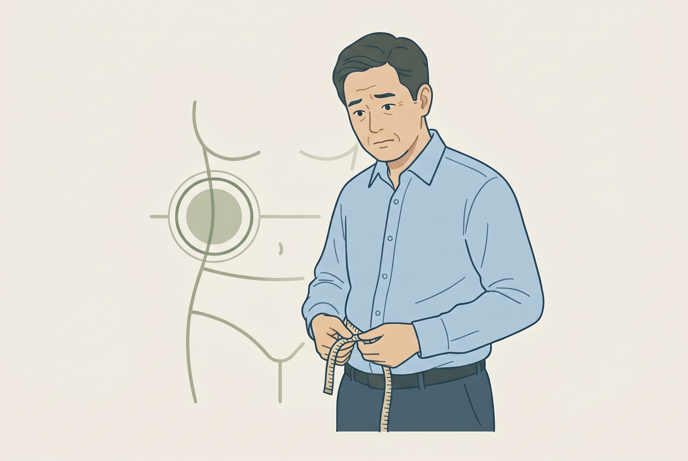
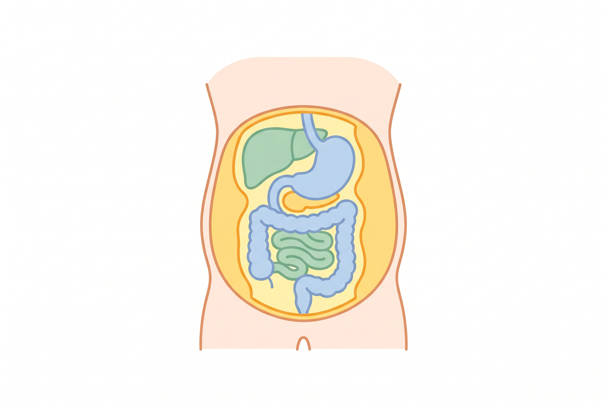

# 40대 복부비만, 체중이 괜찮아도 허리둘레를 먼저 봐야 하는 이유

40대는 체중이 크게 안 늘었다고 안심하기 쉬움. 근데 몸무게보다 먼저 커지는 게 허리둘레일 때가 많음. 그게 제일 조용한 신호임.

1. 복부비만은 그냥 배가 나온 상태가 아님. 배 안쪽 깊은 곳에 쌓이는 내장지방이 문제인 경우가 많고, 이게 혈압·혈당·지질 수치를 건드림.

2. CDC는 허리둘레가 복부의 피하지방과 내장지방을 추정하는 데 쓰인다고 봄. 허리둘레가 커질수록 제2형 당뇨, 고혈압, 심장질환 위험이 같이 올라감.

3. BMI가 정상이어도 끝이 아님. Mayo Clinic은 체형에 따라 BMI가 위험을 덜 잡을 수 있다고 봄. 특히 아시아인은 복부 지방 위험을 더 같이 봐야 함.

4. 그래서 40대는 체중계보다 줄자임. 체중은 비슷한데 허리만 늘면 생활 습관이 이미 바뀌었다는 뜻일 수 있음.

5. 허리둘레가 커지는 속도는 의외로 빠름. 앉아 있는 시간, 회식, 야식, 술, 수면 부족이 붙으면 배부터 반응함.

6. 내장지방이 무서운 이유는 보이는 살보다 조용해서임. 아프지 않아서 방치되고, 방치되면 검진표에서 혈당, 중성지방, 혈압이 같이 흔들림.

7. 집에서 할 일은 복잡하지 않음. 아침 공복이나 같은 시간대에 허리둘레를 재고, 한 달 단위로 기록하면 됨. 숫자가 커지는지 먼저 보는 게 중요함.

8. 줄이는 순서는 굶는 게 아님. 저녁 폭식 줄이고, 단백질과 채소 비율을 올리고, 주 3~5회 걷기부터 붙이는 게 현실적임.

9. 복근 운동만 해서는 안 줄어듦. 배만 조이는 운동보다 총 활동량을 늘리고, 앉아 있는 시간을 줄이는 쪽이 더 중요함.

10. 술은 배를 잘 키움. 술 자체보다 안주와 늦은 시간 식사가 같이 붙을 때 허리둘레가 빨리 커짐.

11. 건강검진에서 같이 봐야 할 건 허리둘레, 공복혈당, 중성지방, 혈압임. 이 네 개가 같이 흔들리면 몸이 이미 경고 중일 가능성이 큼.

12. 결국 40대 복부비만은 미용 문제가 아님. 지금 보기 싫은 배가 아니라, 몇 년 뒤 심혈관 위험을 계산하는 숫자임.

13. 같이 보면 되는 자료는 CDC `Waist Circumference Measurement Methodology Study`(https://www.cdc.gov/nchs/data/series/sr_02/sr02_182-508.pdf), Mayo Clinic `BMI and waist circumference calculator`(https://www.mayoclinic.org/diseases-conditions/obesity/in-depth/bmi-calculator/itt-20084938), 그리고 Mayo Clinic News Network `Large Waist Linked to Poor Health, Even Among Those in Healthy Body Mass Index Ranges`(https://newsnetwork.mayoclinic.org/discussion/large-waist-linked-to-poor-health-even-among-those-in-healthy-body-mass-index-ranges/)임.

14. **Q. 체중이 정상인데 허리만 나오면 괜찮음?** 괜찮다고 보기 어려움. BMI가 놓치는 위험이 허리둘레에 숨어 있을 수 있음.

15. **Q. 허리둘레는 얼마나 자주 재면 됨?** 한 달에 한 번이면 충분함. 중요한 건 같은 조건으로 계속 재는 거임.

16. **Q. 뱃살은 운동만 하면 바로 빠짐?** 바로는 아님. 식사, 수면, 활동량을 같이 바꿔야 줄어듦.
