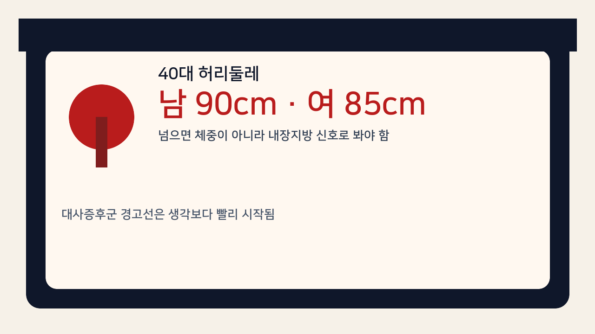
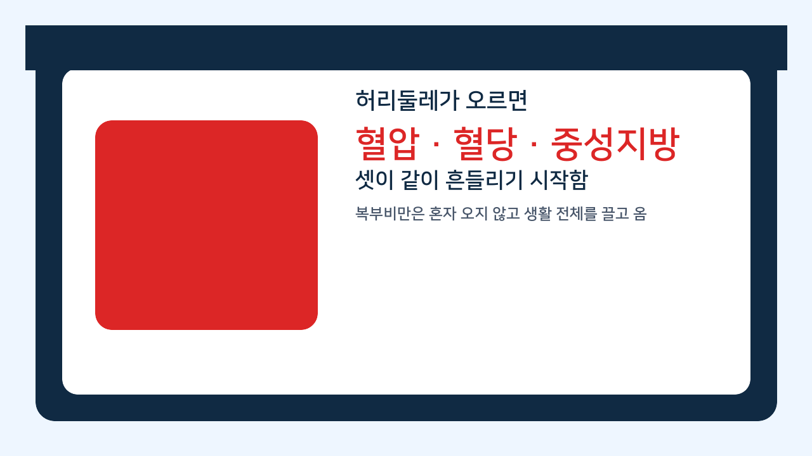
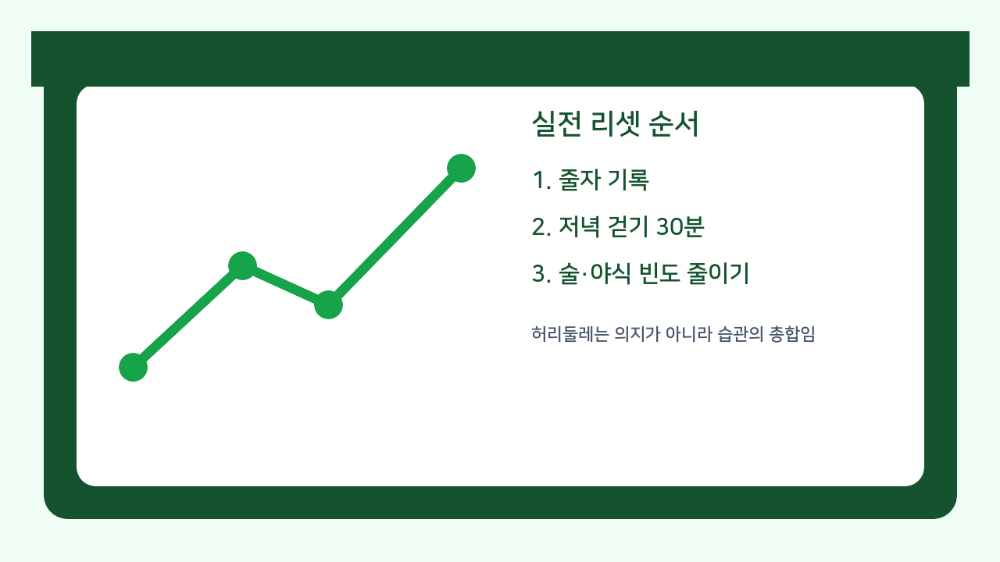

체중은 멀쩡해 보여도 허리둘레가 먼저 올라가는 사람이 있음. 40대에 이게 붙기 시작하면 그냥 살이 조금 찐 게 아니라, 대사 쪽 경고가 먼저 켜진 경우가 많음.

1. 기준부터 단순함. 질병관리청 국가건강정보포털 기준으로 복부비만은 허리둘레가 남성 90cm, 여성 85cm 이상일 때임. 이 숫자는 보기 좋게 정한 선이 아니라, 여기서부터 동반질환 위험이 실제로 올라가는 지점이라서 잡힌 기준임.

2. 서울아산병원 가정의학과 설명도 같은 흐름임. 남성 90cm 이상, 여성 85cm 이상일 때 대사증후군 구성요소가 두 가지 이상 같이 붙을 위험이 급격히 증가한다고 정리함. 즉 허리둘레는 체형 문제가 아니라 혈압, 혈당, 중성지방이 같이 흔들릴 가능성을 보는 지표였음.

3. 질병관리청 자료에 따르면 복부비만 유병률은 연령대가 올라갈수록 커지고, 남자는 40대에서 48.8%로 가장 높았음. 딱 이 나이대에서 배가 먼저 나오는 게 기분 탓이 아니라 통계적으로도 가장 많은 구간이라는 뜻임.

4. 여기서 중요한 건 몸무게보다 배임. 아산병원은 같은 체질량지수라도 허리둘레가 늘어나면 비만 동반질환 위험이 더 높다고 설명함. 숫자상 체중이 크게 안 올랐는데도 건강검진 수치가 갑자기 흔들리는 사람이 있는 이유가 여기 있음.

5. 대사증후군 클리닉 기준을 보면 더 노골적임. 복부비만에 더해 중성지방 150 이상, HDL 저하, 혈압 130/85 이상, 혈당 100 이상 중 몇 개가 같이 붙으면 이미 대사증후군 쪽으로 들어감. 배가 나왔다는 말은 보통 혼자 오는 신호가 아니었음.

6. 그래서 40대 허리둘레는 생활 총합을 보여줌. 오래 앉아 있고, 늦게 먹고, 회식이 끊기지 않고, 잠이 부족하면 지방이 복부 쪽으로 몰리기 쉬움. 체중계 숫자는 며칠 정체일 수 있어도 줄자는 먼저 움직임.

7. 측정도 대충 하면 안 됨. 질병관리청 자료 기준으로 양발을 25~30cm 정도 벌리고 편안히 숨을 내쉰 상태에서, 갈비뼈 가장 아래와 골반 가장 위 사이 중간 지점을 줄자로 재는 게 기본임. 배를 집어넣고 재면 기록만 좋아지고 몸은 안 좋아짐.

8. 여기서 흔한 오해가 하나 있음. 허리둘레만 좀 넘었다고 당장 큰일 난 건 아니지 않냐는 말임. 맞음, 응급상황은 아님. 근데 대사 쪽 문제는 원래 조용히 쌓임. 혈압이 130/85 근처로 오르고, 공복혈당이 100을 넘기고, 중성지방이 애매하게 올라가는 식으로 천천히 붙음. 그래서 허리둘레가 오를 때 잡는 쪽이 제일 덜 힘듦.

9. 반대로 좋은 점도 있음. 질병관리청은 초기 체중의 5~10% 정도 감량이 적절하다고 설명하고, 아산병원도 생활습관 개선을 통한 체중관리를 치료의 시작으로 둠. 즉 이 단계는 아직 약보다 습관이 더 크게 먹히는 구간임.

10. 실전 순서는 복잡하지 않음. 첫째, 아침 공복에 허리둘레를 일주일에 한 번 같은 위치에서 잴 것. 둘째, 평일 저녁 식사 뒤 30분 걷기를 고정할 것. 셋째, 술과 야식 빈도를 줄일 것. 넷째, 다음 검진 때 혈압, 공복혈당, 중성지방을 허리둘레와 같이 볼 것. 이 네 개를 같이 봐야 흐름이 잡힘.

11. 병원이나 검진센터에 바로 물어봐야 할 사람도 있음. 허리둘레가 기준을 넘었고 혈압이 130/85 이상이거나, 공복혈당이 100 이상이거나, 중성지방이 높다고 들은 적이 있으면 더 미루지 않는 쪽이 맞음. 복부비만은 내장지방형 비만과 인슐린 저항성하고 연결돼 있어서 지방간 쪽까지 같이 볼 필요가 생김.

12. 결론은 단순함. 40대 허리둘레 남 90cm, 여 85cm는 아직 괜찮다는 말이 아니라 지금부터 관리하면 늦지 않았다는 신호에 가까움. 체중계보다 줄자를 먼저 꺼내는 사람이 결국 혈압, 혈당, 지방간까지 덜 끌려감.

13. 같이 보면 되는 자료는 질병관리청 국가건강정보포털 비만 관리 자료(https://health.kdca.go.kr/healthinfo/biz/health/ntcnInfo/healthSourc/thtimtCntnts/thtimtCntntsView.do?thtimt_cntnts_sn=65), 서울아산병원 건강증진센터 대사증후군 클리닉(https://health.amc.seoul.kr/health/maintain/clinic.do), 서울아산병원 가정의학과 비만 설명(https://www.amc.seoul.kr/asan/depts/fm/K/bbsDetail.do?contentId=248826&menuId=378), 서울아산병원 뉴스룸 복부비만 측정 안내(https://news.amc.seoul.kr/news/con/detail.do?cntId=7642)임.
