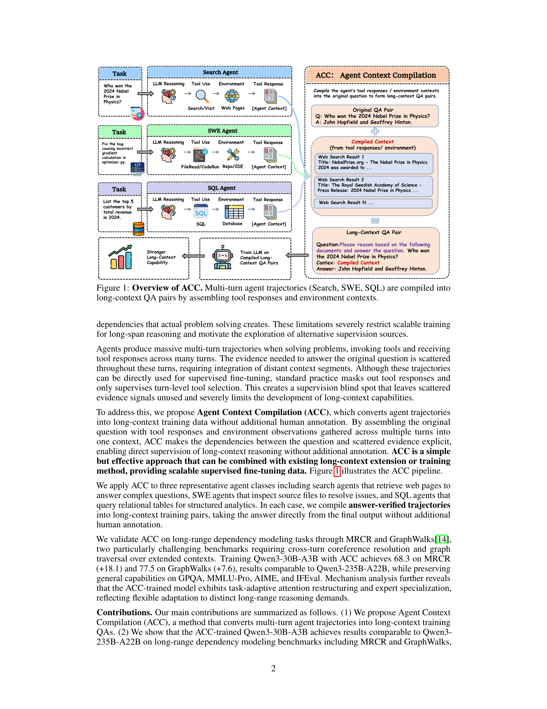
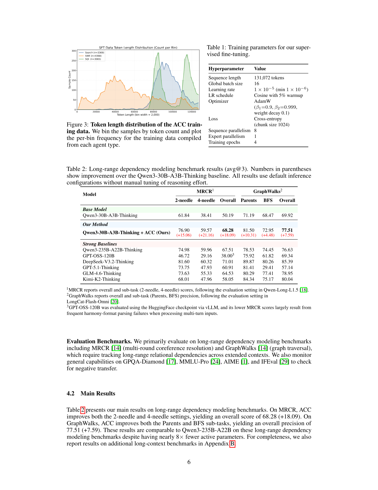
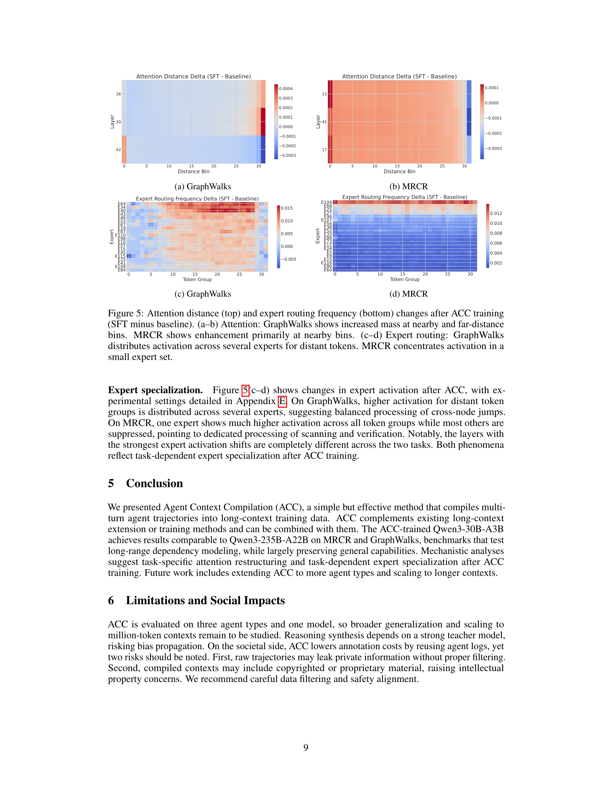

## Q. 에이전트가 남기는 '궤적'이란 게 뭔가요?

에이전트가 문제를 풀 때를 생각해보세요. 검색 에이전트라면 여러 번 웹을 뒤지고, SWE 에이전트라면 파일을 읽고 코드를 실행하고, SQL 에이전트라면 테이블을 쿼리합니다. 이 과정에서 수십 턴에 걸쳐 도구를 호출하고 환경으로부터 응답을 받죠. 이 전체 기록이 바로 **궤적(trajectory)**입니다.

문제의 정답을 찾기 위한 증거가 이 궤적 전체에 흩어져 있습니다. 그런데 기존 에이전트 학습에서는 도구 응답을 손실(loss)에서 마스킹해버립니다. 모델은 "이번 턴에 어떤 도구를 쓸지"만 배우고, 흩어진 증거를 종합해 정답을 도출하는 능력은 길러지지 않죠. 논문은 이걸 **"감독 맹점(supervision blind spot)"**이라고 부릅니다.

## Q. ACC는 이 문제를 어떻게 해결하나요?

핵심 아이디어는 놀라울 정도로 단순합니다. 궤적을 그대로 쓰지 않고, **컴파일**하는 거죠.

구체적으로 이렇게 동작합니다:

1. 에이전트가 문제를 풀면서 수집한 모든 도구 응답과 환경 정보를 모읍니다
2. 원래 질문과 정답은 그대로 두고, 수집된 문서들을 하나의 긴 컨텍스트로 합칩니다
3. 여기에 방해물(distractor)도 섞어 넣습니다 — 검색했지만 방문하지 않은 페이지, 열어보았지만 수정하지 않은 파일 같은 거죠
4. 증거 조각들을 **무작위로 섞어서** 순서 단서를 없앱니다
5. DeepSeek-V3.2-Thinking으로 추론 과정을 생성하고, 정답이 맞는 것만 보존합니다

결과물은 일반적인 장문 QA pairs입니다. 에이전트 학습 데이터가 아니라 그냥 긴 문서를 읽고 답하는 데이터죠. 별도의 인간 주석이 필요 없습니다.

## Q. 세 가지 에이전트에서 각각 어떻게 컴파일하나요?

**검색 에이전트**는 방문한 웹페이지 전문을 추출하고, 방문하지 않은 검색 결과도 방해물로 포함합니다. 실제 검색 환경처럼 노이즈 속에서 핵심을 찾아야 하죠.

**SWE 에이전트**는 패치에 관련된 파일들과 디버깅 과정에서 열어본 추가 파일들을 모읍니다. 코드베이스 전체가 아니라 에이전트가 실제로 탐색한 부분만 들어가서 적절한 길이가 유지됩니다.

**SQL 에이저트**는 쿼리된 모든 테이블의 전체 내용을 가져옵니다. 관계형 구조가 그대로 보존되죠.

총 10,802개 궤적(Search 3,369, SWE 4,368, SQL 3,065)을 컴파일했고, 컨텍스트 길이는 2K에서 128K 토큰까지 분포합니다.

## Q. 성능은 얼마나 올라났나요?

Qwen3-30B-A3B에 ACC를 적용한 결과가 인상적입니다.

**MRCR**(다중 라운드 공참조 해석)에서 50.19 → 68.28로 **+18.09** 상승. **GraphWalks**(그래프 순회)에서 69.92 → 77.51로 **+7.59** 상승. 벤치마크 특성상 단순 검색이 아니라 장거리 의존성 추적이 필요한, 까다로운 테스트입니다.

비교 대상이 더 흥미롭습니다. 235B 파라미터 모델인 Qwen3-235B-A22B가 MRCR 67.51, GraphWalks 76.63인데, ACC로 학습한 30B 모델이 이를 **역전**했습니다. 활성 파라미터 기준으로 약 8분의 1 크기인데도요.

## Q. 일반 능력은 떨어지지 않나요?

장문 학습이 범용 성능을 깎아먹는 경우가 많은데, ACC는 거의 영향이 없었습니다. GPQA-Diamond +2.49, MMLU-Pro +1.50, AIME'25 +3.33까지 약간 올라갔고, 나머지도 안정적이었습니다.

데이터 누출 의혹도 검증했습니다. 학습 질문과 벤치마크 질문의 UMAP 투영이 명확히 분리되고, 최근접 이웃 코사인 유사도가 0.36 이하, 선형 분류기 AUC가 0.9986이라 학습-평가 간 사실상 겹침이 없습니다.

## Q. 방해물(distractor)은 왜 넣나요?

검색에서 방문하지 않은 페이지나, SWE에서 열어보았지만 수정하지 않은 파일을 컨텍스트에 포함하면 모델이 **노이즈 필터링**을 학습합니다. 실제로 방해물을 빼면 MRCR이 3~4포인트 하락합니다. 흥미롭게도 GraphWalks에서는 반대 패턴이 나타나는데, 방해물이 의미적으로 관련 없는 노이즈라 그래프 순회에는 도움이 안 되기 때문입니다. 하지만 SQL 데이터와 섞이면 전체적으로 최적의 결과가 나옵니다.

## Q. 모델 내부에서는 무슨 일이 일어나고 있나요?

여기가 이 논문의 묘미입니다. 어텐션 패턴을 분석해보니, **과제에 따라 완전히 다른 어텐션 구조**가 형성됩니다.

GraphWalks에서는 근거리와 원거리 어텐션 모두 강화됩니다 — 인접 노드 확인과 먼 노드로의 점프가 모두 필요하니까요. 반면 MRCR에서는 근거리 어텐션이 집중적으로 강화됩니다 — 스캔하면서 후보 구간을 정밀하게 검증하는 전략이죠.

전문가(expert) 라우팅도 마찬가지입니다. GraphWalks는 여러 전문가에 걸쳐 균등하게 활성화되지만, MRCR은 특정 전문가 하나가 강하게 집중 활성화됩니다. 그리고 **가장 큰 변화를 보이는 레이어가 두 과제에서 완전히 다릅니다.** 고정된 패턴을 학습한 게 아니라, 과제 특성에 맞게 유연하게 적응하고 있는 거죠.

## Q. 한계는 없나요?

논문도 인정하는 한계가 있습니다. 세 가지 에이전트 타입과 하나의 모델(Qwen3-30B-A3B)에서만 검증했고, 백만 토큰 이상의 초장문으로의 확장은 아직 미지수입니다. 또 추론 합성에 강한 교사 모델(DS-V3.2-Thinking)에 의존하는데, 이 편향이 전파될 수 있습니다. 개인정보나 저작권 문제도 raw 궤적에 포함될 수 있어 필터링이 필수죠.

## Q. 결론은?

ACC는 복잡한 RL 파이프라인이나 새로운 아키텍처 없이, **이미 존재하는 데이터(에이전트 궤적)를 재구성하는 것만으로** 장문 추론 능력을 크게 끌어올렸습니다. 30B 모델이 235B급 성능을 내는 건 시그니피컨트하고, 기존 장문 확장 방법과도 결합 가능하다는 점에서 실용적 가치가 높습니다.

에이전트를 학습시키면서 발생하는 부산물이 장문 이해력 훈련의 보물이 될 수 있다는 통찰이 이 논문의 핵심입니다.
