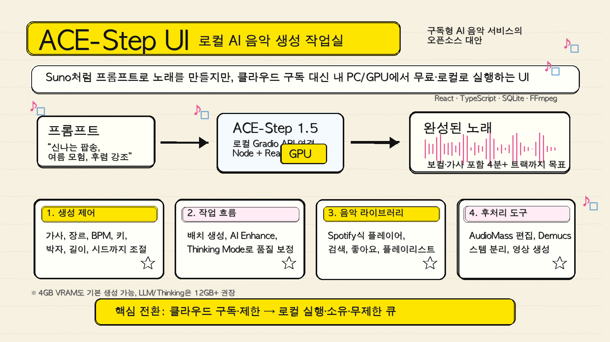

Suno나 Udio가 AI 음악 생성 시장을 꽤 빠르게 대중화했음. 프롬프트 몇 줄만 넣으면 보컬까지 붙은 노래가 나오니까, 음악을 몰라도 결과물을 뽑는 경험 자체가 완전히 달라졌음.

근데 한 가지 불편함이 계속 남음. 구독료, 생성 제한, 클라우드 업로드, 결과물 소유권, 세부 제어 문제임. 많이 만들수록 비용이 붙고, 내 작업 흐름이 서비스 정책 안에 묶임.

[ACE-Step UI](https://github.com/fspecii/ace-step-ui)는 이 지점을 정면으로 건드리는 프로젝트임. 한 줄로 말하면 **ACE-Step 1.5라는 오픈소스 음악 생성 모델을 Suno처럼 쓰게 해주는 로컬 UI**임.



## 1. 본체는 ACE-Step 1.5, ACE-Step UI는 작업실

ACE-Step UI 자체가 음악 생성 모델은 아님. 음악을 실제로 만드는 엔진은 [ACE-Step 1.5](https://github.com/ace-step/ACE-Step-1.5)이고, ACE-Step UI는 그 모델을 쓰기 좋게 감싼 인터페이스임.

구조는 단순함.

1. ACE-Step 1.5를 로컬에서 Gradio API로 띄움.
2. ACE-Step UI가 그 API에 연결됨.
3. 브라우저에서 프롬프트, 가사, 장르, BPM, 키, 길이 등을 넣음.
4. 결과 음악을 라이브러리에서 듣고 관리함.

즉, 모델을 터미널 명령어로만 만지는 게 아니라, 음악 제작 앱처럼 다루게 해주는 껍데기임. README는 스스로를 “The Ultimate Open Source Suno Alternative”라고 소개함.

## 2. 왜 Suno 대안이라고 부르는가

핵심 비교는 비용보다 **통제권**에 가까움.

| 항목 | Suno / Udio류 서비스 | ACE-Step UI |
|---|---|---|
| 실행 위치 | 클라우드 | 내 PC / 로컬 GPU |
| 비용 구조 | 월 구독 또는 크레딧 | 무료 오픈소스 기반 |
| 생성 제한 | 서비스 정책에 따름 | 내 하드웨어 한도에 따름 |
| 데이터 | 외부 서비스로 전송 | 로컬 중심 |
| 커스터마이징 | 제한적 | 파라미터 직접 조절 |
| 작업물 관리 | 서비스 내부 라이브러리 | 로컬 DB와 파일 기반 |

중요한 건 “무료로 Suno를 복제했다”가 아님. 상용 서비스의 편의성을 오픈소스 모델 위에 얹어서, 내 컴퓨터에서 반복 실험할 수 있게 만든 점이 큼.

AI 음악을 교육용으로 써도 이 차이가 큼. 학생들이 프롬프트를 바꾸고, BPM을 바꾸고, 가사 구조를 바꾸면서 결과가 어떻게 달라지는지 실험하려면 생성 횟수 제한이 적을수록 좋음. 로컬 실행은 이런 탐구형 수업과 잘 맞음.

## 3. 음악 생성 기능은 꽤 본격적임

ACE-Step UI가 제공하는 기능은 단순한 “프롬프트 입력창” 수준이 아님.

주요 생성 기능은 다음과 같음.

- 보컬이 포함된 전체 곡 생성
- 인스트루멘털 모드
- 가사 직접 입력 및 구조 태그 작성
- 장르, 분위기, 악기, 템포 태그 지정
- BPM, 키, 박자, 길이 조절
- 시드 고정으로 결과 재현
- 여러 버전 배치 생성
- 기존 오디오를 참고하는 Reference Audio
- 기존 오디오를 다른 스타일로 바꾸는 Audio Cover
- 특정 구간을 다시 만드는 Repainting

특히 Custom Mode가 중요함. 그냥 “신나는 팝송 만들어줘”에서 끝나는 게 아니라, `[Verse]`, `[Chorus]` 같은 구조 태그를 넣고, BPM과 키까지 직접 잡을 수 있음. 음악 이론을 아주 깊게 몰라도 “변수 바꾸기 실험”이 가능해짐.

## 4. AI Enhance와 Thinking Mode

README에서 눈에 띄는 기능이 두 개 있음. **AI Enhance**와 **Thinking Mode**임.

AI Enhance는 사용자가 넣은 짧은 장르 태그를 더 자세한 음악 설명으로 확장해주는 기능임. 예를 들어 `pop, rock` 정도만 넣으면 결과가 밋밋해질 수 있는데, AI Enhance를 켜면 BPM, 키, 박자, 분위기 같은 정보를 더 풍부하게 만들어 모델에 넘기는 식임.

Thinking Mode는 한 단계 더 나아가 LLM이 곡 구조를 더 깊게 추론하고 오디오 코드 생성까지 관여하는 모드로 소개됨. 대신 느리고, 하드웨어 요구사항도 올라감.

정리하면 이렇다.

| 모드 | 역할 | 특징 |
|---|---|---|
| AI Enhance OFF | 입력 태그를 거의 그대로 전달 | 빠름 |
| AI Enhance ON | 장르·분위기 태그를 상세 캡션으로 확장 | 장르 정확도 개선 기대 |
| Thinking Mode | LLM 기반 구조 추론 강화 | 느리지만 품질 지향 |

여기서 조심할 점도 있음. 로컬 AI는 공짜 마법이 아니라 하드웨어를 씀. README 기준으로 기본 생성은 4GB 이상 VRAM에서도 가능하다고 안내하지만, LLM 기능까지 편하게 쓰려면 12GB 이상 GPU를 권장함.

## 5. UI는 음악 앱에 가깝다

ACE-Step UI가 흥미로운 이유는 모델 실행 도구에 머물지 않는다는 점임. README는 Spotify식 인터페이스를 강조함.

제공 기능은 다음과 같음.

- 하단 고정 플레이어
- waveform 기반 재생 진행 표시
- 생성한 곡 라이브러리 관리
- 검색과 정렬
- 좋아요 표시
- 플레이리스트 관리
- 다크/라이트 모드
- 로컬 네트워크 접속

AI 음악 생성 도구는 보통 “생성 → 파일 다운로드 → 폴더에서 찾기” 흐름이 많음. 이 방식은 몇 곡 만들 때는 괜찮은데, 수십 곡을 실험하면 금방 지저분해짐.

ACE-Step UI는 이 과정을 앱 안에 묶으려는 방향임. 생성한 결과물을 바로 듣고, 마음에 드는 버전을 저장하고, 프롬프트를 재사용하고, 다시 변형하는 흐름이 중요함.

## 6. 후처리 도구까지 들어 있음

AI 음악은 생성이 끝이 아님. 잘라야 하고, 보컬을 분리해야 하고, 영상으로 만들어야 할 때도 있음.

ACE-Step UI는 이 부분도 일부 포함함.

- **AudioMass** 기반 오디오 편집
- **Demucs** 기반 보컬·드럼·베이스 등 스템 분리
- **FFmpeg** 기반 오디오 처리
- **Pexels** 배경 영상을 활용한 뮤직비디오 생성
- 인터넷 없이도 쓸 수 있는 그라디언트 앨범 커버 생성

이건 “음악 생성 모델 데모”보다 “로컬 AI 음악 작업실”에 가까운 방향임. 생성, 정리, 편집, 분리, 영상화까지 한 번에 묶으려는 시도임.

## 7. 설치 흐름은 쉬운 편이지만, 완전 초보용은 아님

가장 쉬운 설치 경로는 Pinokio 1-click install로 안내되어 있음. Pinokio가 Python, Node.js, 의존성, 모델 다운로드, 실행을 자동화해주는 방식임.

수동 설치 흐름은 대략 이렇다.

```bash
# ACE-Step 1.5 설치
git clone https://github.com/ace-step/ACE-Step-1.5
cd ACE-Step-1.5
uv venv
uv pip install -e .

# ACE-Step UI 설치
git clone https://github.com/fspecii/ace-step-ui
cd ace-step-ui
./setup.sh
```

실행은 macOS/Linux 기준으로 다음처럼 안내됨.

```bash
cd ace-step-ui
./start-all.sh
```

직접 나눠서 실행한다면 ACE-Step Gradio 서버를 먼저 띄우고, 그다음 UI를 실행함.

```bash
cd /path/to/ACE-Step-1.5
uv run acestep --port 8001 --enable-api --backend pt --server-name 127.0.0.1

cd ace-step-ui
./start.sh
```

접속 주소는 기본적으로 `http://localhost:3000`임. 같은 네트워크의 다른 기기에서도 LAN 접속이 가능하다고 안내되어 있음.

## 8. 기술 스택

저장소 기준 기술 스택은 웹앱 쪽에 익숙한 구성임.

| 레이어 | 기술 |
|---|---|
| 프론트엔드 | React, TypeScript, TailwindCSS, Vite |
| 백엔드 | Express.js |
| 데이터 | SQLite / better-sqlite3 |
| AI 엔진 | ACE-Step 1.5 Gradio API |
| 오디오 도구 | AudioMass, Demucs, FFmpeg |

GitHub 저장소 메타데이터 기준으로 2026년 4월 29일 현재 약 1.8k stars, 267 forks 수준임. 주제 태그도 `ai-music`, `local-first`, `music-generation`, `suno-alternative` 쪽으로 잡혀 있음.

## 9. 한계도 분명함

ACE-Step UI를 볼 때 가장 조심해야 할 지점은 기대치임.

첫째, 로컬 실행은 결국 내 하드웨어 성능을 탄다. 클라우드 서비스처럼 버튼 누르면 항상 같은 속도로 나오는 구조가 아님. GPU VRAM, CUDA, FFmpeg, Python 환경이 영향을 줌.

둘째, 설치 난이도가 완전히 사라진 건 아님. Pinokio가 있긴 하지만, 수동 설치로 가면 Python, Node.js, 모델 다운로드, API 포트, 환경변수 같은 개념을 알아야 함.

셋째, 상용 서비스의 최신 모델 품질과 항상 같다고 보면 안 됨. ACE-Step 1.5가 오픈소스 모델로 강력한 선택지인 건 맞지만, Suno/Udio의 최신 비공개 모델과 품질을 단순 비교하기는 어려움.

넷째, 저작권과 학습 데이터 문제를 사용자가 스스로 신경 써야 함. 로컬에서 만든다고 모든 상업적 사용 문제가 자동으로 사라지는 건 아님.

## 10. 그래도 의미 있는 이유

ACE-Step UI가 좋은 이유는 “Suno를 공짜로 쓴다”보다 큼.

AI 음악 생성을 **구독형 소비재**에서 **로컬 실험 도구**로 바꾸려는 시도이기 때문임.

교육 관점에서도 쓸모가 있음. 학생들이 같은 가사에 BPM만 바꾸거나, 같은 장르에 악기만 바꾸거나, 같은 프롬프트에 시드만 바꾸면서 결과를 비교할 수 있음. 음악, 언어, 확률적 생성, 프롬프트 설계, 저작권 토론까지 한 번에 연결됨.

크리에이터 입장에서도 마찬가지임. 완성곡을 뽑는 것보다 아이디어 스케치, 가이드 보컬, 배경음악 초안, 수업용 예시곡 제작에 잘 맞음. 생성 횟수 제한을 덜 의식하면서 반복 실험할 수 있다는 점이 크다.

결국 ACE-Step UI는 이런 사람에게 잘 맞음.

- Suno류 AI 음악 생성은 좋지만 구독과 제한이 아쉬운 사람
- 로컬 GPU로 AI 음악을 실험해보고 싶은 사람
- 가사, 장르, BPM, 키를 직접 바꾸며 결과를 비교하고 싶은 사람
- AI 음악 생성 수업이나 워크숍 소재를 찾는 사람
- 생성 결과를 라이브러리처럼 관리하고 싶은 사람

AI 음악도 결국 같은 흐름으로 가는 중임. 처음엔 클라우드 서비스가 경험을 열고, 그다음엔 오픈소스가 통제권을 되찾아옴. ACE-Step UI는 그 두 번째 흐름에 있는 꽤 실용적인 프로젝트임.

## 참고 링크

- GitHub: [fspecii/ace-step-ui](https://github.com/fspecii/ace-step-ui)
- ACE-Step 1.5: [ace-step/ACE-Step-1.5](https://github.com/ace-step/ACE-Step-1.5)
- Demo 영상: [YouTube Demo](https://www.youtube.com/watch?v=8zg0Xi36qGc)
- Pinokio 설치: [ACE-Step UI Pinokio App](https://beta.pinokio.co/apps/github-com-cocktailpeanut-ace-step-ui-pinokio)
