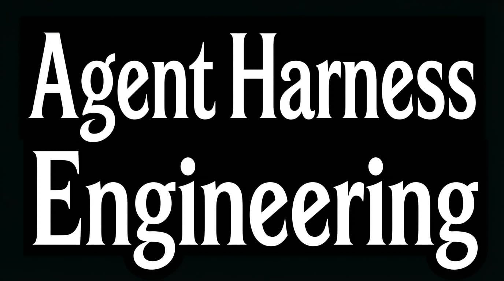
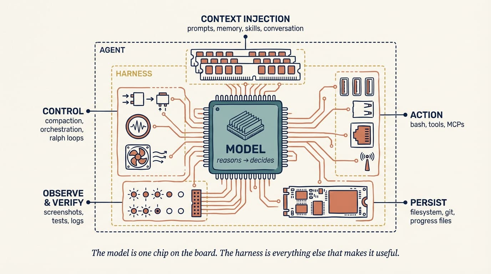
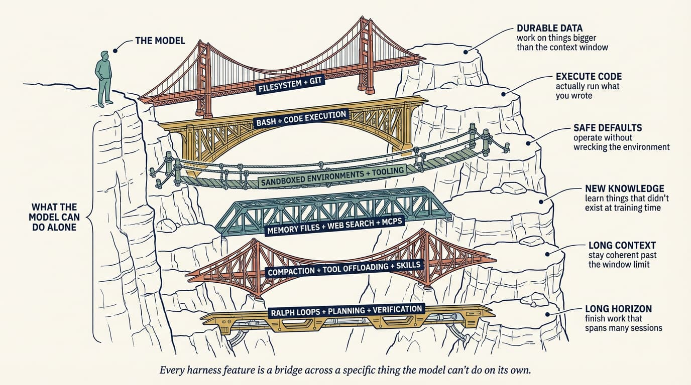
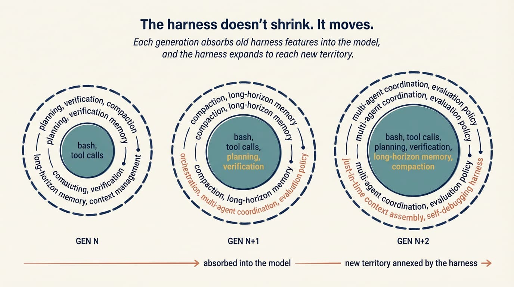
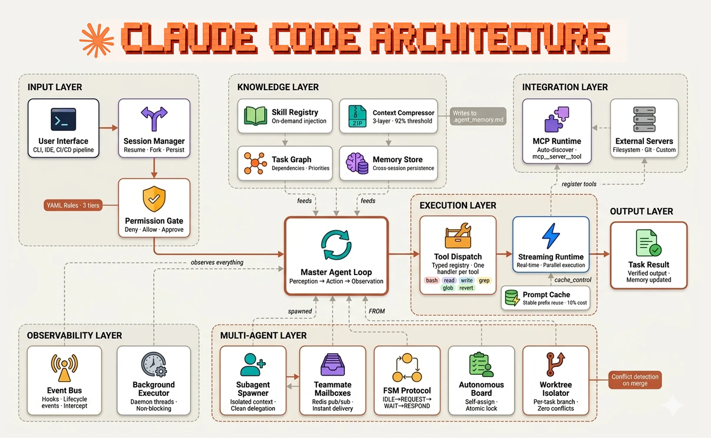

원문: [Agent Harness Engineering - Addy Osmani](https://addyosmani.com/blog/agent-harness-engineering/) (2026.04.19)

요즘 AI 코딩 에이전트 쓰면서 "왜 이 모델은 이걸 못 하지?" 하고 모델 탓하는 경우가 많음.

Addy Osmani는 그 프레임 자체가 틀렸다고 함.

---

1. **에이전트 = 모델 + 하네스**

   Viv Trivedy가 정의한 공식임. `coding agent = AI model(s) + harness`. 모델은 입력값 중 하나일 뿐이고, 나머지는 전부 **하네스**임.

   하네스란: 프롬프트, 툴, 컨텍스트 정책, 훅, 샌드박스, 서브에이전트, 피드백 루프, 복구 경로 — 모델을 감싸서 실제로 일을 끝낼 수 있게 만드는 모든 것.

   Claude Code, Cursor, Codex, Aider, Cline 전부 하네스임. 밑에 깔린 모델이 같아도 동작이 다른 이유가 이거임.

*하네스 구조: 모델을 중심으로 컨텍스트 주입, 제어 흐름, 액션, 영속성, 관찰이 둘러싸고 있다.*

2. **좋은 하네스 > 좋은 모델**

   Osmani가 직접 경험한 사례: Viv 팀이 코딩 에이전트를 Terminal Bench 2.0 순위 Top 30 → Top 5로 올림. 모델 바꾼 게 아님. **하네스만 바꿨음.**

   "다음 버전 기다리면 되지"는 틀린 태도임. 오늘 모델이 보여주는 성능과 실제 가능한 성능 사이의 갭은 대부분 하네스 갭임.

3. **실패는 신호임, 변명이 아니라**

   에이전트가 실수하면 "모델 문제네" 하고 넘기는 게 일반적인 반응임.

   하네스 엔지니어링 마인드셋은 다름. 실패를 보면:
   - 컨벤션 몰랐음 → AGENTS.md에 추가
   - 위험한 커맨드 실행했음 → 훅으로 차단
   - 40단계 작업에서 길 잃음 → 플래너/실행자로 분리
   - 깨진 코드로 "완료" 했음 → 타입체크 백프레셔 루프 추가

   HumanLayer 표현: **"모델 문제가 아니라 설정 문제임."**

4. **래칫(ratchet): 실수가 규칙이 된다**

   하네스 엔지니어링의 핵심 습관은 에이전트 실수를 영구 신호로 취급하는 것임.

   PR에 주석 처리된 테스트가 올라왔다 → AGENTS.md에 "테스트 주석 처리 금지" 추가 → pre-commit 훅에서 .skip()/xit() 검사 → 리뷰어 서브에이전트에서 blocker로 플래그.

   좋은 AGENTS.md의 모든 줄은 실제로 잘못됐던 것에서 나온 것이어야 함. 브레인스토밍으로 만든 게 아니라 **래칫으로 만드는 것**.

5. **하네스 구성 요소들**

   Osmani가 정리한 실전 요소:

   - **파일시스템 + Git**: 가장 기초적인 primitive. 에이전트 상태와 진행 상황을 저장하는 공간
   - **Bash + 코드 실행**: 일반 목적 툴. 사전 정의된 툴보다 bash가 더 유연함
   - **샌드박스**: 격리된 실행 환경. 로컬에서 에이전트 생성 코드 돌리는 건 위험
   - **메모리**: AGENTS.md 같은 파일로 세션 간 지식 유지
   - **컨텍스트 압축**: 윈도우 꽉 차면 요약/오프로딩. 장기 작업엔 컨텍스트 리셋도 필요
   - **훅**: "말한 것"과 "시스템이 강제하는 것"의 차이. 성공은 침묵, 실패는 에러 텍스트 주입

6. **AGENTS.md = 가장 레버리지 높은 설정**

   시스템 프롬프트에 매 턴 들어감. 패키지 매니저, 테스트 프레임워크, 포맷 규칙 여기 씀.

   두 가지 교훈:
   - **짧게 유지**: 60줄 이하 권장. 줄이 많을수록 각 줄의 효과 감소. 파일럿 체크리스트, 스타일 가이드 아님.
   - **줄마다 근거 있어야**: 실제 실패 사례나 외부 제약에서 나온 것만. 그냥 "좋아 보여서" 추가한 건 노이즈임.

   툴도 마찬가지. 10개 집중된 툴 > 50개 중복 툴. 그리고 MCP 서버 설명이 프롬프트에 들어가니 악성 MCP가 프롬프트 인젝션할 수 있음 — 보안 리스크 있음.

*원하는 동작 → 하네스 설계 매핑: 각 구성요소는 모델이 혼자 달성할 수 없는 동작에서 도출된다.*

7. **하네스는 줄어들지 않음, 이동할 뿐임**

   "모델이 좋아지면 하네스 필요 없어지는 거 아님?"

   아님. Opus 4.6이 컨텍스트 불안 문제를 해결하자 해당 scaffolding은 dead code가 됐음. 근데 이제 더 복잡한 작업이 가능해졌고, 그 작업엔 멀티데이 메모리 정책, 전문화된 에이전트 3개 조율, UI 품질 평가자가 필요해짐.

   **가정이 바뀌면 scaffolding도 바뀌는 것이지, 없어지는 게 아님.**

*모델-하네스 트레이닝 루프: 하네스에서 유용한 프리미티브 발견 → 표준화 → 다음 세대 모델 훈련에 활용 → 반복.*

8. **HaaS: 하네스 서비스로서의 에이전트**

   Claude Agent SDK, Codex SDK, OpenAI Agents SDK — 전부 같은 방향임.

   이제 루프, 툴, 컨텍스트 관리, 훅, 샌드박스를 직접 만들지 않아도 됨. 설정하면 됨. 작업 포인트가 "루프 만들기"에서 "도메인 특화 프롬프트/툴 설계"로 이동함.

   Viv의 결론: "좋은 에이전트 개발은 반복의 연속. v0.1 없이는 반복도 없음."

*Claude Code 아키텍처 레이어: 입력층·지식층·통합층·실행층·출력층·관찰층·멀티에이전트층으로 구성된 완성된 하네스 구조.*

---

탑 코딩 에이전트들(Claude Code, Cursor, Codex, Aider, Cline)을 나란히 놓으면, 밑에 깔린 모델보다 서로가 더 닮아있음.

모델은 다름. 하네스 패턴은 수렴하고 있음.

이건 우연이 아님. 생성 모델을 실제로 뭔가를 만들어내는 것으로 바꾸는 load-bearing 요소들을 업계가 서서히 찾아가고 있는 과정임.
