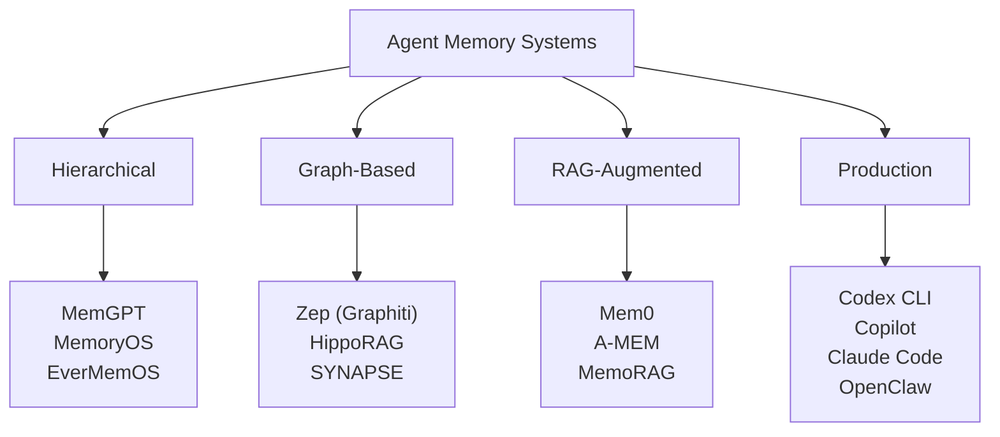
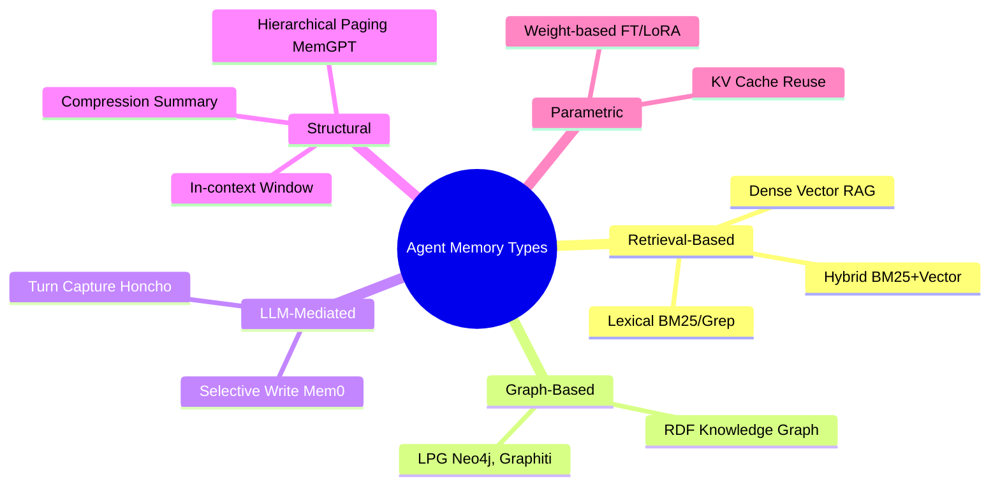

## Q. 에이전트 메모리 시스템이 왜 중요한가요?

AI 에이전트가 실제 업무에 쓰이려면 단일 세션을 넘어서 기억해야 합니다. 사용자의 선호, 과거 결정, 변화하는 상황을 며칠, 몇 주, 심지어 몇 달에 걸쳐 유지해야 하죠. 컨텍스트 윈도우가 아무리 넓어져도, 1M 토큰 너머의 기억은 근본적으로 다른 방식이 필요합니다.

이 서베이는 최근 발표된 주요 벤치마크(LoCoMo, LongMemEval)와 10개 이상의 메모리 시스템, 그리고 실제 프로덕션에서 쓰이는 코딩 도구들의 메모리 아키텍처를 비교합니다.

## Q. 에이전트 메모리를 어떻게 분류할 수 있나요?

에이전트 메모리 시스템은 크게 네 가지 카테고리로 나뉩니다.

- **계층형(Hierarchical)**: MemGPT가 대표적이며, OS의 메모리 관리처럼 메인 컨텍스트 → 리콜 DB → 아카이벌 벡터스토어로 페이징합니다.
- **그래프 기반**: Zep의 Graphiti처럼 시간 인식 지식그래프로 엔티티 관계를 추적합니다.
- **RAG 증강**: Mem0, A-MEM 등이 동적으로 팩트를 추출하고 검색합니다.
- **프로덕션**: 실제 코딩 도구에 내장된 메모리 시스템들입니다.

좀 더 세밀하게 들어가면, 구현 방식에 따라 5가지로 나눌 수도 있습니다.

대부분의 프로덕션 시스템은 두 가지 이상을 조합해서 사용합니다.

## Q. 주요 벤치마크는 어떤 것들이 있나요?

### LoCoMo

LoCoMo는 50개의 초장기 대화(평균 300턴, 9K 토큰, 최대 35세션)로 구성된 벤치마크입니다. 싱글홉 QA, 멀티홉 추론, 이벤트 요약, 멀티모달 대화 생성 등을 테스트합니다. 인간 성능이 LLM을 ~36% 상회하는 것으로 나타났습니다.

### LongMemEval

LongMemEval은 500개 질문을 6개 카테고리(단일 세션, 지식 업데이트, 시간 추론, 멀티세션 리콜 등)로 테스트합니다. 대화당 평균 115K 토큰으로, 검색 정밀도와 시간 추론 모두 압박합니다.

## Q. 벤치마크 성적은 어떤가요?

| System | LoCoMo (LLM-judge) | LongMemEval |
|--------|-------------------:|------------:|
| Mem0 (2026) | **91.6%** | **93.4%** |
| Hindsight | — | 91.4% |
| Zep | 75.1%\* | 71.2% |
| Full-context GPT-4o | ~73% | 60.2% |
| LangMem | 58.1% | — |
| MemGPT | ~48% | — |
| AgentMemory | — | 95.2%† |

> \* Zep 자체 보고 (Mem0 논문에서는 66.0%로 측정)
> † LongMemEval-S Recall@5, LLM-judge 점수와 직접 비교 불가

**핵심 인사이트**: 단일 승자가 없습니다. LoCoMo에서는 Mem0이 1위, LongMemEval에서는 Hindsight가 강세(오픈소스 20B 모델로 GPT-4o 풀컨텍스트를 능가). 재미있는 점은 Mem0가 풀컨텍스트 GPT-4o보다 91% 낮은 레이턴시로 더 높은 점수를 기록했다는 겁니다.

## Q. 시간 추론이 병목이라는데, 얼마나 심각한가요?

매우 심각합니다. OpenAI Memory는 시간 관련 질문에서 **21.7%만 정답**을 맞췄습니다. 모든 시스템에서 시간 인덱싱이 가장 어려운 카테고리였습니다.

Zep의 bi-temporal validity window(양방향 시간 유효 구간) 같은 접근이 부분적으로 도움이 되지만, 일관된 성능을 내는 시스템은 아직 없습니다. "지난달에 어떤 결정을 내렸지?" 같은 질문에 제대로 답하는 게 생각보다 어렵습니다.

## Q. 1M 토큰 이상에서 어떻게 되나요?

성능이 급락합니다. BEAM 벤치마크 기준으로 1M 토큰을 넘어가면 현저한 저하가 관찰됩니다. MemGPT와 MemoryOS 같은 계층형 에빅션(eviction) 전략이 어느 정도 완화하지만, 대규모 코퍼스에서는 검색 레이턴시 패널티가 발생합니다.

컨텍스트 윈도우가 아무리 넓어져도, "모든 것을 넣는" 접근은 근본적으로 스케일하지 않습니다.

## Q. 프로덕션 코딩 도구들은 메모리를 어떻게 다루나요?

Codex CLI, Copilot, Claude Code, OpenClaw가 모두 독립적으로 **동일한 2-레이어 패턴**에 수렴했습니다.

| | Codex CLI | Copilot | Claude Code | OpenClaw |
|---|-----------|---------|-------------|----------|
| **정적 레이어** | AGENTS.md | Steering files | CLAUDE.md | MEMORY.md |
| **생성 메모리** | ~/.codex/memories/ | 없음 | ~/.claude/projects/…/memory/ | SQLite / LanceDB |
| **벡터/RAG** | 없음 | MRL 임베딩 | 없음 | 선택 (하이브리드 70/30) |
| **세션 간 통합** | Lock-gated merge agent | 없음 | 수동 (에이전트 판단) | Dreaming 프로세스 |
| **Compaction 시 Flush** | 문서화 없음 | N/A | 수동 | 있음 (flush pass) |
| **스토리지** | Flat markdown | 독점 인덱스 | Flat markdown | SQLite / LanceDB / Honcho |
| **오픈소스** | 예 | 아니오 | 예 (MIT) | 예 |
| **주요 한계** | Opt-in, 지역 제한 | 요약 없음 | 벡터 검색 없음 | 플러그인 설정 필요 |

**공통 패턴**: 모든 도구가 정적 마크다운 파일을 세션 시작 시 주입하고, 모델이 추출한 팩트를 별도 레이어에서 관리합니다.

## Q. Claude Code의 메모리 구조가 특이하다던데?

Claude Code는 **파일 앵커드(file-anchored)** 방식입니다. `CLAUDE.md`를 디렉토리 순회로 발견해 시스템 프롬프트에 그대로 주입합니다. 벡터 임베딩도, 유사도 검색도 없습니다. 모든 메모리가 사람이 읽을 수 있는 마크다운 파일이고, git으로 버전 관리할 수 있습니다.

장점은 투명성과 감사 가능성입니다. 단점은 스케일입니다 — 메모리가 수백 개가 되면 검색 성능이 떨어질 수밖에 없습니다. Claude Code는 검색 정교성보다 **사람이 읽을 수 있는 메모리**를 우선시한 설계입니다.

## Q. OpenClaw는 어떻게 다른가요?

OpenClaw는 파일 기반이면서도 하이브리드 검색을 결합한 점이 독특합니다.

- **파일 퍼스트**: `MEMORY.md`(장기 기억), `memory/YYYY-MM-DD.md`(일일 노트), `DREAMS.md`(통합 일기)
- **하이브리드 검색**: 임베딩 제공자가 설정되면 70% 벡터 유사도 + 30% BM25 키워드 가중치로 전환
- **Dreaming**: 백그라운드에서 일일 노트의 신호를 평가해 `MEMORY.md`로 승격시키는, 수면 단계 기억 통합의 컴퓨테이션 아날로그입니다
- **Flush pass**: 컨텍스트 압축 전에 에이전트에게 중요한 맥락을 디스크에 쓰도록 알림

4개 백엔드를 교체 가능합니다: 기본 SQLite, QMD(로컬 우선 + 쿼리 확장), Honcho(클라우드 엔티티 중심), LanceDB.

## Q. 로컬 벡터스토어는 뭘 쓰는 게 좋나요?

| Store | 백엔드 | 하이브리드 검색 | 로컬 모드 | p50 레이턴시 |
|-------|--------|:---:|:---:|--------:|
| **LanceDB** | Lance (Rust, columnar) | BM25 + vector | 서버리스 (파일) | 1–5ms |
| Qdrant | Rust, HNSW | Sparse + dense | Embedded / server | 2–8ms |
| Chroma | DuckDB / SQLite | Vector + metadata | In-process | 5–20ms |
| FAISS | C++ / BLAS | 없음 (벡터만) | In-process | <1ms |

**LanceDB가 로컬 에이전트 백엔드로 가장 균형 잡힙니다.** 서버리스(파일 기반), 하이브리드 검색 내장, Lance 컬럼 포맷으로 Arrow 제로카피 읽기까지 지원합니다. FAISS가 순수 속도는 가장 빠르지만, 영속성과 하이브리드 검색이 없어 에이전트 메모리용으로는 래퍼 코드가 필수입니다.

## Q. 아직 해결되지 않은 과제는 무엇인가요?

1. **시간 추론**: 모든 시스템의 약점. "언제"에 관한 질문에 제대로 답하는 건 아직 먼 과제입니다.
2. **스케일 저하**: 1M+ 토큰에서 성능 급락은 현재 아키텍처의 근본적 한계입니다.
3. **벤치마크 커버리지**: LoCoMo와 LongMemEval은 대화형 리콜만 테스트합니다. 코딩 에이전트의 워크플로우 메모리, 툴 경계 핸드오프, 멀티세션 절차적 기억을 평가하는 벤치마크는 아직 초기 단계입니다.
4. **인프라-시스템 공동 설계**: 벡터스토어 선택이 레이턴시와 하이브리드 검색에 큰 영향을 미치는데, 대부분의 논문이 블랕박스로 취급합니다.
5. **통합 충실도**: 자동 통합(Dreaming, merge agent)이 완전성과 컨텍스트 예산 사이의 균형을 잡아야 합니다. 검증 가능한 커버리지 보장이 있는 원칙적 통합은 아직 없습니다.
6. **툴 경계 간 메모리**: `CLAUDE.md`/`AGENTS.md`가 암묵적 공통 규약이지만, 에이전트가 서브에이전트를 생성하거나 툴을 전환할 때 메모리 핸드오프의 표준 프로토콜이 없습니다. MCP 같은 표준 메모리 인터페이스가 필요합니다.
7. **프라이버시와 보안**: 멀티유저 네임스페이싱, 메모리 포이즈닝 공격에 대한 표준 방어가 부족합니다.
8. **평가 표준화**: 논문마다 다른 평가 모델(`gpt-4o-mini` vs `gpt-4.1-mini`)을 사용해 점수 비교가 불가능합니다.

## Q. 결론은?

에이전트 메모리 시스템은 단순 RAG에서 계층형, 그래프 기반 아키텍처로 빠르게 성숙했습니다. 하지만 **단일 승자는 없습니다.** LoCoMo 1위인 Mem0와 LongMemEval에서 강세인 Hindsight는 서로 다른 장점을 가집니다.

프로덕션 도구들은 독립적으로 같은 패턴에 수렴했습니다 — 정적 마크다운 + 생성 메모리 레이어. 이건 시사하는 바가 큽니다. 학계 벤치마크와 실제 필요 사이에 갭이 있습니다: 표준 벤치마크 어느 것도 코딩 에이전트의 워크플로우 메모리를 테스트하지 않습니다.

다음 세대의 에이전트 메모리를 위해 시간 추론, 통합 충실도, 평가 표준화가 핵심 과제로 남습니다.
