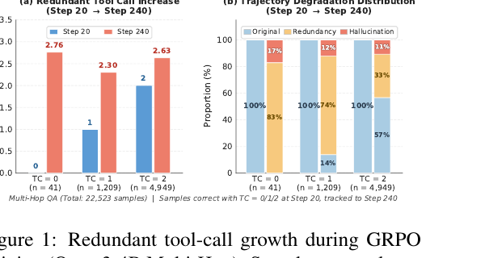
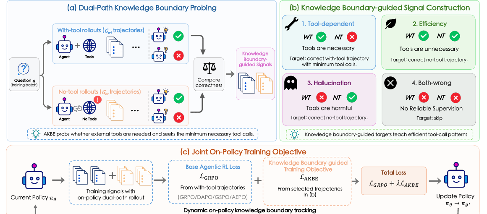
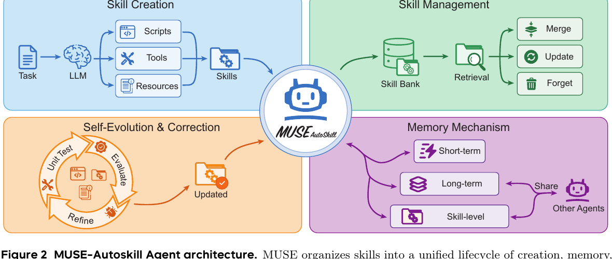
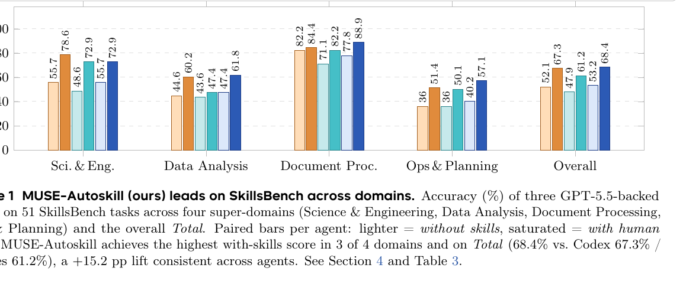

원문:

- [Efficient Agentic Reinforcement Learning with On-Policy Intrinsic Knowledge Boundary Enhancement](https://arxiv.org/abs/2605.26952) (AKBE, 2026.05.26)
- [MUSE-Autoskill: Self-Evolving Agents via Skill Creation, Memory, Management, and Evaluation](https://arxiv.org/abs/2605.27366) (2026.05.26)

두 논문은 모두 "에이전트 학습에 RL을 어떻게 쓰는가"를 다루지만, 보는 지점이 다릅니다.

**AKBE**는 에이전트가 외부 도구를 너무 많이 부르는 문제를 잡습니다. 모델이 이미 알고 있는 문제인데도 검색이나 코드 실행으로 나가면 비용이 늘고, 잘못 검색된 정보가 오히려 정답을 망칠 수 있습니다. 그래서 훈련 중에 "이 문제는 내부 지식만으로 풀 수 있는가, 아니면 도구가 필요한가"를 on-policy rollout으로 계속 재측정합니다.

**MUSE-Autoskill**은 한 번 성공한 해결 절차를 스킬로 남겨 재사용하는 쪽입니다. 단순히 프롬프트 파일 하나를 저장하는 게 아니라, 생성, 메모리, 관리, 평가, 개선이라는 생애주기로 스킬을 다룹니다. 이 관점에서는 RL이 단일 episode 보상을 올리는 장치가 아니라, 에이전트의 장기적 능력 자산을 만드는 운영 체계에 가까워집니다.

짧게 말하면:

> AKBE는 "지금 도구를 불러야 하는가?"를 학습하고, MUSE-Autoskill은 "이번 경험을 다음번에 쓸 수 있는 스킬로 남길 수 있는가?"를 설계합니다.

## 인터뷰 1: AKBE는 무엇을 고치나?

**Q. 에이전트 RL을 하면 원래 더 똑똑해지는 것 아닌가요?**

A. 맞습니다. 그런데 도구 사용이 가능한 에이전트에서는 이상한 부작용이 생깁니다. RL이 정답 보상을 밀어 올리는 과정에서 모델이 "도구를 쓰면 안전하다"는 쪽으로 과하게 기울 수 있습니다. 검색이 필요 없는 질문에도 검색하고, 한 번이면 되는 도구 호출을 여러 번 합니다.

AKBE 논문은 이 현상을 **intrinsic knowledge boundary가 흐려진다**고 표현합니다. 모델 내부 지식으로 충분한 영역과 외부 도구가 필요한 영역의 경계가 무너지는 것입니다.



그림의 핵심은 단순합니다. early step에서 정답을 맞힌 샘플을 late step까지 추적하면, 훈련이 진행될수록 평균 tool call 수가 늘어납니다. 더 나쁜 점은 일부 trajectory가 redundant call을 넘어 hallucination으로 망가진다는 것입니다. 도구가 늘 정답을 보장하는 게 아니라, 잘못된 관측을 끌고 들어와 모델의 원래 추론을 오염시킬 수 있습니다.

**Q. 그럼 tool call에 penalty를 주면 되지 않나요?**

A. 그게 기존 접근의 한계입니다. reward shaping으로 "tool call을 줄여라"라고 하면 모델은 필요한 도구 호출까지 줄이는 reward hacking을 할 수 있습니다. 문제별로 도구 필요성이 다른데, 전체 보상에 뭉뚱그려 penalty를 얹으면 경계가 거칠어집니다.

AKBE의 아이디어는 더 직접적입니다. 같은 질문에 대해 두 경로를 동시에 굴립니다.

1. **with-tool rollout**: 도구를 쓸 수 있는 상태에서 풉니다.
2. **no-tool rollout**: 도구 접근을 막고 내부 지식만으로 풉니다.

그리고 두 경로의 정답 여부를 비교해 네 가지 신호를 만듭니다.



**Q. 네 가지 신호가 뭔가요?**

A. 논문의 분류는 꽤 실용적입니다.

- **Tool-dependent**: with-tool은 맞고 no-tool은 틀림. 도구가 필요합니다. 이때는 정답 trajectory 중 tool call이 가장 적은 것을 target으로 삼습니다.
- **Efficiency**: with-tool도 맞고 no-tool도 맞음. 도구가 불필요합니다. no-tool 정답 trajectory를 학습시켜 redundant call을 줄입니다.
- **Hallucination**: with-tool은 틀리고 no-tool은 맞음. 도구가 해롭습니다. 검색이나 관측이 원래 맞던 답을 망친 경우입니다.
- **Both-wrong**: 둘 다 틀림. 신뢰할 supervised signal이 없으므로 RL objective에 맡깁니다.

이 분류가 중요한 이유는 "도구를 줄여라"가 아니라 **문제별로 필요한 최소 도구 사용 패턴을 학습한다**는 점입니다.

**Q. 결과는 어느 정도인가요?**

A. 일곱 개 QA benchmark에서 AKBE는 standard agentic RL 대비 평균 정확도 +1.85, tool call 18% 감소, tool productivity 25% 향상을 보고합니다. 더 흥미로운 건 plug-and-play 성격입니다. GRPO만을 위한 트릭이 아니라 DAPO, GSPO, AEPO 같은 agentic RL 알고리즘 위에 auxiliary objective처럼 붙일 수 있다고 주장합니다.

제가 보기엔 이 논문의 포인트는 "tool-use RL의 목표는 tool call 수를 줄이는 게 아니라, 도구 사용의 decision boundary를 복원하는 것"입니다.

## 인터뷰 2: MUSE-Autoskill은 무엇을 남기나?

**Q. MUSE-Autoskill은 RL 논문이라기보다 agent framework 논문처럼 보이는데요?**

A. 맞습니다. AKBE가 미시적인 행동 최적화라면, MUSE-Autoskill은 에이전트가 장기적으로 능력을 축적하는 구조를 다룹니다. 핵심 단위는 **skill**입니다.

스킬은 단순한 프롬프트 조각이 아닙니다. 논문은 스킬을 long-lived asset, 즉 장기적으로 관리되는 능력 자산으로 봅니다. 스킬은 생성되고, 메모리에 저장되고, 검색되고, 테스트되고, 실패하면 개선됩니다.



**Q. 기존 AutoSkill류와 뭐가 다르다고 하나요?**

A. 논문이 짚는 기존 방식의 빈틈은 네 가지입니다.

- 스킬 생성이 실제 runtime context와 분리되어 있음
- 개별 스킬에 대한 구조화된 per-skill memory가 없음
- 스킬이 정적 artifact로 남고 unit test 기반 검증/개선이 약함
- 긴 작업에서 context가 flat history로 쌓여 잘리거나 폭발함

MUSE-Autoskill은 이를 다섯 단계 lifecycle로 묶습니다.

1. **Creation**: agent loop 안에서 `skill_create`를 호출해 필요한 순간 스킬을 만듭니다.
2. **Memory**: short-term, long-term, skill-level memory를 분리합니다.
3. **Management**: skill bank에서 retrieve, merge, update, forget을 수행합니다.
4. **Evaluation**: tests 디렉터리와 실행 피드백으로 스킬을 검증합니다.
5. **Refinement**: 실패한 스킬은 수정하거나 재생성합니다.

여기서 제일 눈에 띄는 건 **skill-level memory**입니다. 스킬마다 `.memory.md` 같은 별도 기억을 두고, 그 스킬을 쓸 때마다 관찰한 실패 모드, 입력 형식, edge case, 성능 caveat를 축적합니다. 이건 사람 개발자가 도구 문서 옆에 "이거 쓸 때 여기 조심"이라고 적어두는 습관과 비슷합니다.

**Q. 실험 결과는 어떤가요?**

A. SkillsBench 51개 작업에서 세 에이전트(Codex, Hermes, MUSE-Autoskill)를 비교합니다. 모두 GPT-5.5 backbone을 사용했다고 보고합니다. human skill을 넣었을 때 MUSE-Autoskill은 overall 68.4%로 Codex 67.3%, Hermes 61.2%보다 높습니다.



더 중요한 실험은 self-created skill입니다. MUSE가 자기 성공 trajectory에서 스킬을 생성한 35개 작업만 보면, generated skill 사용 시 accuracy가 87.94%까지 올라가 human skill ceiling을 넘었다고 보고합니다. 또 MUSE가 만든 스킬을 Hermes에 주입하면 Hermes도 +10.51%p 개선됩니다. 이건 스킬이 특정 runtime의 숨은 prompt hack이 아니라, 어느 정도 이식 가능한 외부 지식 자산이라는 주장에 힘을 실어줍니다.

다만 한계도 분명합니다. 전체 94개 SkillsBench 중 51개만 평가했고, backbone은 GPT-5.5 하나입니다. cross-agent transfer도 MUSE에서 Hermes 방향 위주입니다. 그래서 "일반적 결론"보다는 "스킬을 testable artifact로 다루면 이런 방향의 이득이 있다"는 proof-of-concept로 보는 편이 안전합니다.

## 두 논문을 합치면 보이는 그림

두 논문은 층위가 다릅니다.

AKBE는 **행동 순간의 경계**를 다룹니다.

- 이 질문은 내부 지식으로 충분한가?
- 도구가 필요하다면 최소 몇 번이면 되는가?
- 도구 관측이 오히려 정답을 망치는가?

MUSE-Autoskill은 **경험 이후의 축적**을 다룹니다.

- 이번에 성공한 절차를 재사용 가능한 스킬로 만들 수 있는가?
- 그 스킬을 테스트하고 개선할 수 있는가?
- 스킬별 기억을 축적해 다음 실행에 반영할 수 있는가?

에이전트 학습에서 RL을 쓴다고 하면 보통 "모델이 더 좋은 답을 내도록 보상을 준다"는 그림을 떠올립니다. 그런데 이 두 논문을 같이 보면 RL의 역할이 더 넓어집니다.

1. **Tool policy 학습**: 언제 외부 세계로 나갈지 배웁니다.
2. **Cost-aware reasoning**: 정답뿐 아니라 latency, tool call, token을 함께 관리합니다.
3. **Experience distillation**: 성공 trajectory를 다음 작업을 위한 스킬로 압축합니다.
4. **Lifecycle optimization**: 스킬을 생성하고, 평가하고, 메모리와 함께 진화시킵니다.

즉, 에이전트 RL의 핵심은 "더 많이 행동하는 에이전트"가 아니라 **필요할 때만 행동하고, 성공한 행동은 자산으로 남기는 에이전트**입니다.

## 구현 관점에서 가져갈 것

실제 에이전트 시스템을 만든다면 저는 이렇게 나눠 적용하고 싶습니다.

**1. 모든 tool call을 정답 보상 하나로만 보지 않기**

검색 성공/실패, 코드 실행 성공/실패보다 먼저 봐야 할 게 있습니다. "이 호출이 애초에 필요했나?"입니다. AKBE식 dual-path는 훈련 비용이 들지만, inference 로그 분석에도 응용할 수 있습니다. 같은 task를 no-tool baseline으로 replay해보면 redundant tool call 후보를 찾을 수 있습니다.

**2. 스킬은 instruction이 아니라 package로 다루기**

`SKILL.md` 하나만 있으면 편하지만, 장기적으로는 부족합니다. 최소한 다음 구조가 필요합니다.

```text
skill-name/
  SKILL.md
  scripts/
  tests/
  references/
  .memory.md
```

MUSE-Autoskill의 중요한 메시지는 스킬의 성능이 "생성 품질"만으로 결정되지 않는다는 겁니다. 테스트, 실패 기록, 업데이트 정책까지 있어야 스킬이 장기 자산이 됩니다.

**3. agent memory를 전체 기억과 skill 기억으로 분리하기**

모든 경험을 하나의 long-term memory에 넣으면 검색이 흐려집니다. 특정 스킬을 로드할 때 필요한 경험은 그 스킬 옆에 있어야 합니다. 예를 들어 "논문 figure 추출" 스킬이라면, PDF crop 좌표 팁, arXiv source가 없을 때의 fallback, Quartz 이미지 경로 규칙이 해당 스킬 메모리에 붙어야 합니다.

**4. 에이전트 최적화의 단위를 trajectory에서 asset으로 올리기**

AKBE는 trajectory를 잘 고르는 법을 보여주고, MUSE는 좋은 trajectory를 asset으로 남기는 법을 보여줍니다. 이 둘을 합치면 꽤 자연스러운 루프가 됩니다.

1. 여러 trajectory를 생성한다.
2. 도구 필요성 경계를 기준으로 좋은 trajectory를 고른다.
3. 성공 trajectory를 스킬 후보로 압축한다.
4. unit test와 runtime feedback으로 검증한다.
5. 스킬 메모리에 실패/성공 경험을 누적한다.

이 루프가 닫히면 에이전트는 단순히 "한 번 더 잘 푸는 모델"이 아니라 "실행 경험을 재사용 가능한 운영 지식으로 바꾸는 시스템"이 됩니다.

## 결론

AKBE와 MUSE-Autoskill은 서로 다른 질문에서 출발하지만, 같은 방향을 가리킵니다.

에이전트가 강해지는 길은 도구를 더 많이 붙이는 것도, 컨텍스트를 더 크게 만드는 것도 아닙니다. **도구가 필요한 경계를 알고, 성공한 절차를 검증 가능한 스킬로 남기고, 그 스킬에 기억을 붙여 계속 개선하는 것**입니다.

AKBE는 그 경계를 RL 안에서 찾는 방법을 보여줍니다. MUSE-Autoskill은 그 경험을 장기 자산으로 바꾸는 생애주기를 보여줍니다. 둘을 함께 보면, 앞으로의 에이전트 학습은 "정답률 최적화"보다 "행동 경제성과 경험 축적의 최적화"에 가까워질 가능성이 큽니다.
