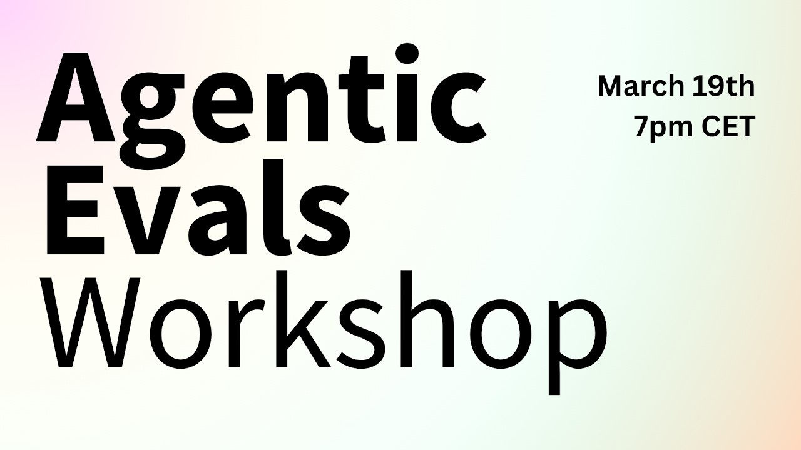
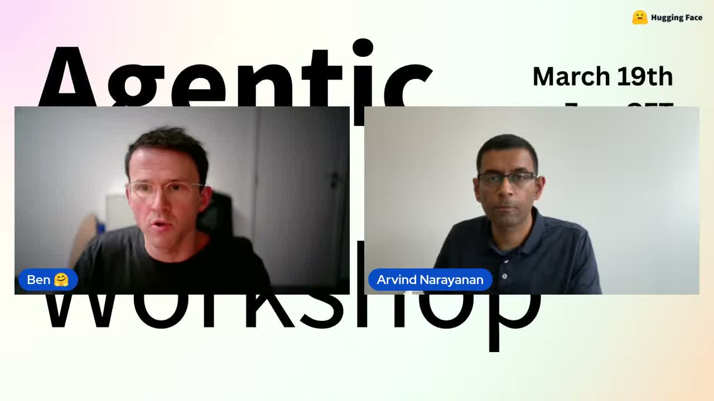
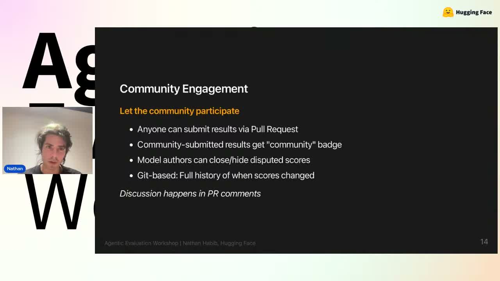

Hugging Face가 진행한 라이브 **[Agentic Evaluations Workshop - Deep Dive on the Future on Evals for Agents.](https://www.youtube.com/watch?v=UxMZfbWI3LY)** 는, 요즘 빠르게 늘어나는 "에이전트"를 **무엇으로, 어떻게, 어디까지 평가해야 하는가**를 다룬 긴 토론이었습니다.

영상 길이는 약 1시간 49분이고, Hugging Face·Princeton·Meta·Bespoke Labs 등 다양한 발표자가 참여했습니다. 자동 자막과 영상 설명을 바탕으로 보면, 이 라이브의 핵심 메시지는 꽤 분명합니다.

> **에이전트 평가는 더 이상 단일 점수 경쟁이 아니라, 신뢰성·재현성·환경 적합성·공개 검증까지 함께 보는 문제다.**

이 글에서는 라이브 내용을 한국어로 발췌·요약해, 실무자와 교육자 관점에서 바로 이해할 수 있게 정리해보겠습니다.

## 이 라이브의 핵심 주제

영상 설명과 발표 내용을 종합하면 다음 질문이 중심축입니다.

- 에이전트 시스템의 **state of the art** 평가는 어디까지 왔는가
- 벤치마크 성능이 높은데도 실제 사용성은 왜 기대만큼 따라오지 않는가
- 모델이 아니라 **에이전트 시스템 전체**를 평가하려면 무엇이 더 필요할까
- 공개 벤치마크, 리더보드, 환경 설계는 어떤 원칙으로 가야 할까

특히 첫 발표에서는 기존 LLM 평가와 달리 에이전트 평가는 **장기 실행(long horizon)**, **도구 사용(tool use)**, **환경 변화**, **사람과의 상호작용**까지 고려해야 한다고 짚습니다.

## 발표 1: "모델 점수"만 보고 에이전트를 이해할 수 없는 이유

Avijit Ghosh의 발표에서 가장 인상적이었던 대목은, 최근 AI 업계의 벤치마크 보고 관행에 대한 비판입니다.

그는 공개된 성능표가 커 보여도 실제로는 다음 정보가 빠져 있는 경우가 많다고 말합니다.

- 어떤 문제를 제외했는지
- 어떤 세팅으로 실행했는지
- 동일 점수가 나와도 각 세션에서 행동이 어떻게 달랐는지
- 모델 외에 어떤 서브에이전트, MCP 서버, 메모리 설정을 사용했는지

즉, **모델 이름 하나로 에이전트 결과를 대표시키는 시대는 끝나가고 있다**는 뜻입니다.

에이전트는 텍스트 생성기가 아니라, 계획하고 실행하고 도구를 호출하는 시스템입니다. 그래서 평가지표도 단순 pass/fail보다 더 넓어져야 합니다.

### 발표에서 제시된 보완 포인트

- **세션 단위 보고**: 같은 평균 점수라도 실행 경로와 안정성은 다를 수 있음
- **시스템 구성 공개**: 모델, 서브에이전트, MCP 서버, 메모리 설정 등
- **상호작용 기록**: 사람이 어느 순간 개입했는지, 노이즈가 있었는지
- **재현 조건 공개**: 환경, 프롬프트 변형, 시드, 비용, 오류 조건

이 부분은 최근 공개 리더보드를 읽을 때도 그대로 적용됩니다. 점수만 읽으면 쉬워 보이지만, **실제로는 평가 프로토콜이 결과의 절반 이상을 결정**할 수 있습니다.

## 발표 2: 정확도는 오르는데, 왜 현장에서는 아직 불안할까

Arvind Narayanan의 발표는 이 라이브의 핵심 논지를 가장 명확하게 정리해줍니다.

그는 지금의 에이전트들이 여러 capability benchmark에서는 빠르게 발전하고 있지만, 실제 업무에서 사람을 대체할 만큼 널리 쓰이지는 않는 이유를 **capability-reliability gap**으로 설명합니다.

쉽게 말하면 이렇습니다.

- **능력(capability)** 은 꽤 좋아졌다.
- 하지만 **신뢰성(reliability)** 은 아직 충분히 따라오지 못한다.

발표에서 든 예시도 직관적입니다. 음악을 잘못 트는 음성비서는 짜증나는 정도에서 끝나지만, 결제나 주문을 대신하는 에이전트가 10% 확률로 틀리면 그건 서비스가 아니라 사고에 가깝습니다.

### 신뢰성을 볼 때 중요하게 본 요소

발표 내용 기준으로 보면 신뢰성은 대략 네 방향으로 나뉩니다.

1. **일관성(Consistency)**
   - 같은 문제를 여러 번 풀 때 결과가 안정적인가
   - 같은 답을 내더라도 경로가 지나치게 흔들리지는 않는가
2. **강건성(Robustness)**
   - API 타임아웃, 도구 오류, 환경 변화가 있어도 버티는가
   - 프롬프트 표현이 달라져도 성능이 유지되는가
3. **보정(Calibration)**
   - 성공 확률을 과신하지 않는가
   - "잘 모르겠다"고 말해야 할 때 제대로 말하는가
4. **안전성(Safety)**
   - 실패가 단순 포맷 오류인지, 데이터 삭제 같은 심각한 사고인지

이 관점은 교육 현장에도 중요합니다. 학생들이나 교사들이 에이전트를 체감할 때는 "정답률"보다 **실수의 종류와 반복성**을 먼저 경험하기 때문입니다.

## 발표 3: GAIA 2와 환경 기반 평가가 왜 중요해지는가

중반부 발표에서는 **GAIA 2**, 환경 기반 평가 프레임워크, 그리고 long-horizon evaluation 이야기가 이어집니다.

여기서 중요한 포인트는 에이전트를 평가할 때 **정답 하나만 채점하는 시험장**으로는 부족하다는 점입니다.

현실의 에이전트는 다음을 동시에 마주합니다.

- 중간에 실패하는 API
- 바뀌는 인터페이스와 도구 시그니처
- 애매하게 주어진 사용자 요청
- 여러 턴에 걸친 장기 작업
- 때때로 개입하는 사람

GAIA 2 관련 논의에서는 이런 현실성을 반영하기 위해:

- 더 엄격한 체커를 두고
- 노이즈를 늘려 과적합을 막고
- 도구 실패율이나 시그니처를 바꿔도
- 같은 태스크를 풀 수 있는지 보려는 시도가 소개됩니다.

이건 매우 중요한 방향입니다. 벤치마크가 지나치게 "정해진 정답 경로"만 요구하면, 실제 현장에서 쓸 수 있는 에이전트보다 **벤치마크 잘 푸는 에이전트**를 만드는 쪽으로 흘러가기 쉽기 때문입니다.

## 발표 4: 실무에서는 왜 "eval-first"가 더 중요해졌나

Bespoke Labs 쪽 발표는 비교적 실무적인 톤이 강했습니다.

핵심은 한 문장으로 정리됩니다.

> **에이전트를 먼저 배포하고 나중에 평가하지 말고, 평가 구조를 먼저 만들고 그다음 개선하라.**

발표에서는 다음과 같은 실무 함정을 짚습니다.

- 출력만 대충 눈으로 보고 "잘 되는 것 같다"고 판단하는 것
- 프로덕션에 올려놓고 그 자체를 평가 환경처럼 쓰는 것
- 플래너, 함수 호출, 세부 컴포넌트에 너무 일찍 집착하는 것
- 재현 가능한 테스트 세트 없이 감으로 튜닝하는 것

이 부분은 소프트웨어 테스트 문화와도 연결됩니다. 결국 에이전트도 배포되는 순간 제품이기 때문에, **회귀 테스트·환경 분리·장애 상황 시뮬레이션**이 자연스러운 기본값이 되어야 합니다.

관련해서 예전에 정리했던 [FinMCP Bench 분석 글](./finmcp-bench-mcp-financial-agent-benchmark)도 함께 보면, "모델이 똑똑한가"와 "현장 업무를 견딜 만큼 구조적으로 검증됐는가"가 다르다는 점을 더 입체적으로 볼 수 있습니다.

## 발표 5: 오픈 벤치마크와 공개 검증의 가치

후반 패널에서 특히 흥미로웠던 논점은 **공개 벤치마크 vs 벤치마크 게임(gaming)** 문제였습니다.

흔히 "벤치마크를 공개하면 금방 오염된다"고 말하지만, 발표자들은 그 주장도 충분히 검증된 상식은 아니라고 짚습니다. 오히려 벤치마크가 비공개일수록 다음 문제가 커질 수 있습니다.

- 누가 어떤 조건으로 돌렸는지 외부 검증이 어려움
- 결과 재현이 어려워 신뢰를 쌓기 힘듦
- 닫힌 모델·닫힌 환경에서는 평가의 실제 의미를 확인하기 어려움

그래서 이 라이브는 전체적으로 **더 많은 공개, 더 많은 설명, 더 많은 검증 가능성** 쪽에 무게를 둡니다.

이 관점은 교육 콘텐츠를 만들 때도 유용합니다. 학생이나 일반 독자에게 AI 평가를 설명할 때, "점수표를 믿으세요"보다 **"조건과 맥락까지 같이 보세요"**가 훨씬 건강한 메시지이기 때문입니다.

## 이 라이브에서 건질 핵심 포인트 7가지

정리하면 이번 워크숍의 핵심 포인트는 아래 7가지입니다.

1. **에이전트 평가는 모델 평가와 다르다.**
   텍스트 정답률만으로는 부족하고, 행동·도구·환경까지 봐야 한다.

2. **정확도와 신뢰성은 별개다.**
   capability가 좋아도 reliability가 낮으면 실무 배치는 어렵다.

3. **세션 단위 기록이 중요하다.**
   평균 점수만 같아도 실행 경로, 비용, 실패 양상은 크게 다를 수 있다.

4. **환경 설계가 곧 평가 품질이다.**
   노이즈, 실패, 장기 과제를 넣지 않으면 현실성을 놓치기 쉽다.

5. **사람 개입을 평가에서 빼면 안 된다.**
   실제 사용은 거의 항상 인간-에이전트 협업이기 때문이다.

6. **실무에서는 eval-first가 필요하다.**
   먼저 테스트 구조를 만들고, 그 위에서 에이전트를 개선해야 한다.

7. **공개 검증 가능성이 신뢰를 만든다.**
   오픈 벤치마크와 상세 보고는 게임 방지뿐 아니라 재현성 확보에도 중요하다.

## 교육적 시사점: 학생에게 무엇을 가르쳐야 하나

이 영상은 단순히 연구자용 이야기가 아닙니다. AI 교육 관점에서도 시사점이 큽니다.

### 1) "점수 높은 모델"보다 "잘 검증된 시스템"을 가르쳐야 한다

학생들은 종종 리더보드 순위를 곧바로 실력으로 받아들입니다. 하지만 실제로는 어떤 도구와 환경, 프롬프트, 평가 조건을 썼는지가 성능을 크게 바꿉니다.

앞으로 AI 리터러시 교육은 "모델 이름 맞히기"보다 **평가 맥락 읽기** 쪽으로 더 이동해야 합니다.

### 2) 실패 사례 분석이 더 중요해진다

에이전트 교육에서는 정답 예시만 보여주면 안 됩니다.

- 왜 실패했는가
- 어떤 환경 변화에서 무너졌는가
- 사람이 언제介入해야 하는가
- 과신(confidence overclaim)은 어떻게 보이는가

이런 질문이 실제 활용 역량과 직결됩니다.

### 3) 평가 설계 자체를 프로젝트로 다룰 수 있다

학생 프로젝트에서도 "에이전트 만들기"만 목표로 두지 말고,

- 테스트 태스크 설계
- 성공 기준 정의
- 오류 상황 만들기
- 반복 실행 후 비교

까지 포함하면 훨씬 좋은 학습이 됩니다.

## 실무적 시사점: 지금 바로 적용할 수 있는 체크리스트

현업에서 에이전트를 다루고 있다면, 이번 라이브를 보고 바로 적용할 수 있는 질문은 다음 정도입니다.

- 우리는 평균 점수 말고 **반복 실행 안정성**을 보고 있는가?
- 도구 실패나 환경 변화에 대한 **내결함성 테스트**가 있는가?
- 사람 검수 전제인지, 완전 자동화인지 **배치 기준**이 분명한가?
- 결과를 다른 팀이 재현할 수 있을 만큼 **설정과 로그**가 남는가?
- 평가 환경이 너무 깨끗해서 현실을 과소평가하고 있지는 않은가?

이 다섯 가지에 선뜻 "예"라고 답하기 어렵다면, 에이전트 성능보다 먼저 평가 체계를 손보는 편이 낫습니다.

## 마무리

이번 Hugging Face 라이브는 "에이전트가 얼마나 똑똑한가"를 자랑하는 자리가 아니라, **우리가 에이전트를 너무 단순하게 평가해온 건 아닌가**를 되묻는 자리였습니다.

개인적으로 가장 중요했던 메시지는 이것입니다.

> **좋은 에이전트는 높은 점수를 받은 에이전트가 아니라, 실패 조건까지 설명 가능한 에이전트다.**

앞으로 에이전트 관련 리더보드나 데모를 볼 때는 성능 숫자만 보지 말고, **세션 기록·환경 조건·재현성·인간 개입 여부**까지 함께 확인해보면 좋겠습니다. 그때부터 비로소 "쓸 수 있는 에이전트"와 "데모에 강한 에이전트"를 구분할 수 있으니까요.

---

### 참고

- 원본 영상: [Agentic Evaluations Workshop - Deep Dive on the Future on Evals for Agents.](https://www.youtube.com/watch?v=UxMZfbWI3LY)
- 주최: Hugging Face
- 출연(설명란 기준): Avijit Ghosh, Arvind Narayanan, Pierre Andrews, J.J. Allaire, Mahesh Sathiamoorthy, Nathan Habib

이 글은 영상 설명, 공개 메타데이터, 자동 자막 기반으로 정리했습니다. 자동 자막 특성상 일부 표현은 자연스러운 한국어 문맥에 맞게 정리·재구성했습니다.
