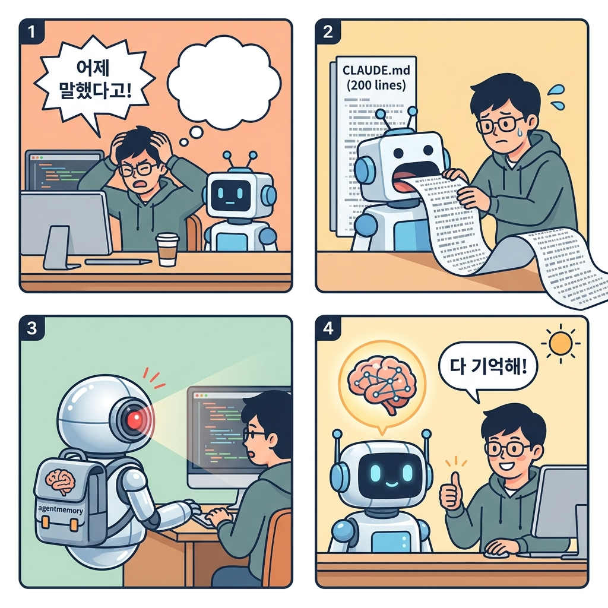

## 🎙️ 인터뷰: "에이전트가 기억을 잃는 건, 치매가 아니라 구조적 문제입니다"

> **로히트(Rohit)** — agentmemory 창작자. [iii-engine](https://github.com/iii-hq/iii) 기반으로 AI 코딩 에이전트를 위한 영구 메모리 시스템을 만들고 있다. GitHub 스타 1,000+.

---

### Q. agentmemory는 뭔가요? 한 문장으로.

**로히트:** "당신의 코딩 에이전트가 모든 걸 기억하게 만드는 시스템이에요. 더 이상 매 세션마다 아키텍처를 다시 설명할 필요가 없죠."

### Q. 왜 만들었어요? 어떤 문제가 있었나요?

**로히트:** "Claude Code, Cursor, Gemini CLI 같은 에이전트를 쓰다 보면, 매번 같은 걸 설명해야 해요. '우리 프로젝트는 JWT 인증을 쓰고, jose 미들웨어를 썼고, Edge 호환성 때문에 jsonwebtoken 대신 jose를 택했어요' — 이걸 세션 1에서 설명하면, 세션 2에서 또 설명해야 하죠."

"CLAUDE.md 같은 내장 메모리가 있지만, 200줄 한계가 있고 금방 낡아버려요. 에이전트가 뭘 했는지, 뭘 결정했는지, 왜 그렇게 결정했는지 — 이 맥락이 매번 날아가는 게 문제였어요."

### Q. 어떻게 작동하나요?

**로히트:** "세 가지 단계로 요약할 수 있어요."

1. **자동 캡처** — 에이전트가 뭘 했는지 12개 훅(hook)이 자동으로 기록해요. 손가락 하나 안 움직여도 돼요.
2. **압축 & 저장** — iii-engine이 기록을 의미 단위로 압축해서 검색 가능한 메모리로 만들어요. 단순 텍스트 저장이 아니에요.
3. **스마트 인젝션** — 다음 세션이 시작되면, 현재 컨텍스트에 맞는 메모리만 골라서 자동으로 주입해요.

"핵심은 **검색**이에요. '인증'이라고 검색하면 단순히 키워드가 아니라, JWT 설정, 테스트 커버리지, jose 선택 이유 — 맥락 전체를 찾아줘야 하죠."

### Q. 검색이 핵심이라면, 어떤 검색을 쓰나요?

**로히트:** "BM25 + Vector + Graph, 세 가지를 RRF(Reciprocal Rank Fusion)로 섞어요."

- **BM25** — 키워드 매칭. 정확한 함수명이나 파일명을 찾을 때 강해요.
- **Vector** — 의미 검색. "데이터베이스 성능 최적화"라고 검색하면 N+1 쿼리 수정 기록을 찾아줘요.
- **Graph** — 관계 검색. "JWT 인증"과 연결된 모든 결정, 파일, 테스트를 추적해요.

"단일 검색만 쓰는 경쟁 제품들과 차이가 커요. LongMemEval 벤치마크에서 R@5 95.2%를 기록했어요."

### Q. 비용은요? 토큰 많이 먹지 않나요?

**로히트:** "오히려 토큰을 아껴줘요. 전체 컨텍스트를 매번 복붙하면 연간 1,950만 토큰이 필요해요. LLM 요약을 써도 65만 토큰. agentmemory는 **17만 토큰**으로 충분해요. 연간 $10 수준이죠."

"로컬 임베딩(all-MiniLM-L6-v2)을 쓰면 $0도 가능해요. API 키 필요 없어요."

### Q. 어떤 에이전트랑 연동되나요?

**로히트:** "MCP나 REST API를 지원하는 에이전트면 뭐든 돼요. Claude Code, Cursor, Gemini CLI, Codex CLI, OpenClaw, Aider, Cline, Windsurf — 현재 15개 이상이고, MCP만 지원하면 104개 엔드포인트에 연결 가능해요."

"핵심은 **하나의 서버에 모든 에이전트가 같은 메모리를 공유**한다는 거예요. Claude Code에서 작업한 걸 Cursor에서도 기억해요."

### Q. 경쟁 제품(mem0, Letta)과 차이점은?

**로히트:** "mem0은 API 레이어예요. 직접 `add()`를 호출해야 하죠. 우리는 자동 캡처예요. Letta는 자체 런타임에 갇혀 있어요. 우리는 어떤 에이전트든 쓸 수 있고요."

"가장 큰 차이는 **메모리 수명주기(lifecycle)** 관리예요. 4단계 통합(consolidation) + 자연 감소(decay) + 자동 삭제(auto-forget). 안 쓰는 메모리가 쌓여서 나중에 검색이 느려지는 걸 방지해요."

### Q. 설치는 얼마나 쉬운가요?

**로히트:** "한 줄이에요."

```bash
npx @agentmemory/agentmemory
```

"MCP 설정만 추가하면 돼요. OpenClaw는 플러그인으로 한 번에 설치돼요. 5분이면 끝나요."

### Q. 앞으로의 계획은?

**로히트:** "에이전트 간 협업 메모리가 다음 단계예요. 에이전트 A가 발견한 버그 패턴을 에이전트 B가 자동으로 피하게 만들고 싶어요. 그리고 더 많은 벤치마크에서 검증하고 있어요."

---

## 🔑 핵심 요약

| 항목 | 내용 |
|------|------|
| **문제** | AI 에이전트가 매 세션마다 컨텍스트를 잃음 |
| **해결** | 자동 캡처 + 압축 + 스마트 인젝션 |
| **검색** | BM25 + Vector + Graph 하이브리드 (R@5 95.2%) |
| **비용** | 연간 ~$10 (로컬 임베딩 시 $0) |
| **연동** | 15+ 에이전트, MCP/REST 지원 시 104개 |
| **엔진** | iii-engine (SQLite, 외부 의존성 없음) |

---

## 🔗 링크

- [GitHub: rohitg00/agentmemory](https://github.com/rohitg00/agentmemory)
- [agent-memory.dev](https://agent-memory.dev)
- [iii-engine](https://github.com/iii-hq/iii)
- [npm: @agentmemory/agentmemory](https://www.npmjs.com/package/@agentmemory/agentmemory)
- [LongMemEval 벤치마크 결과](https://github.com/rohitg00/agentmemory/blob/main/benchmark/LONGMEMEVAL.md)
