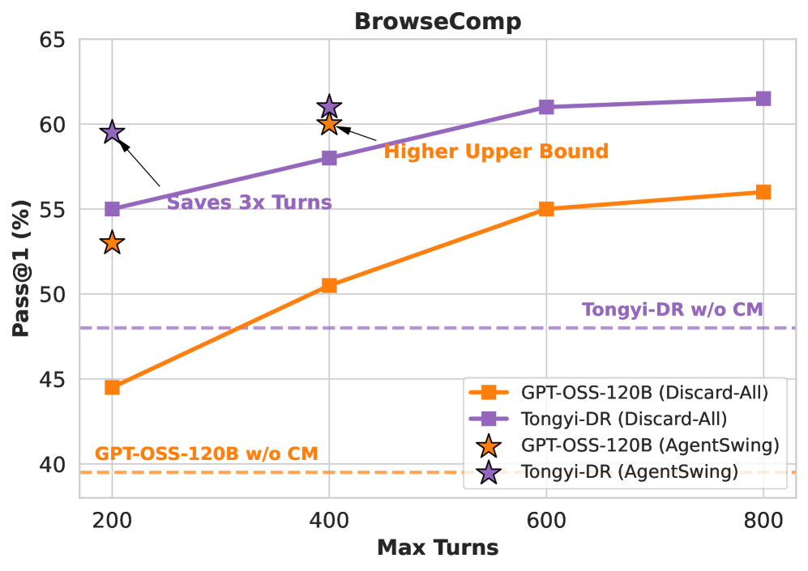
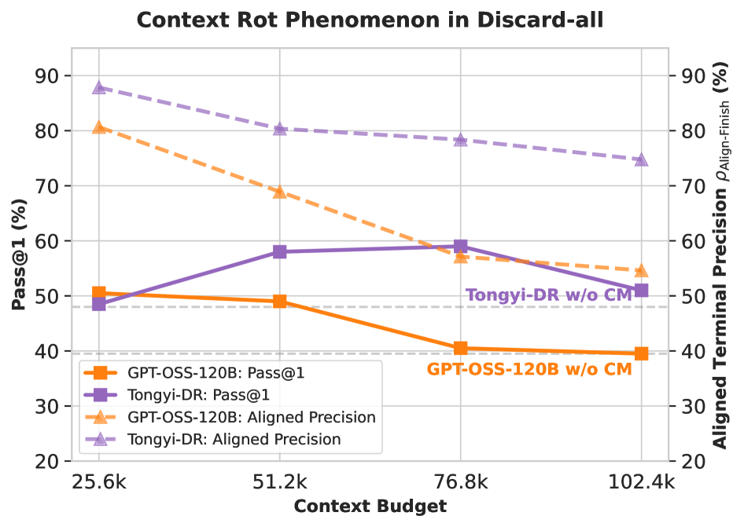
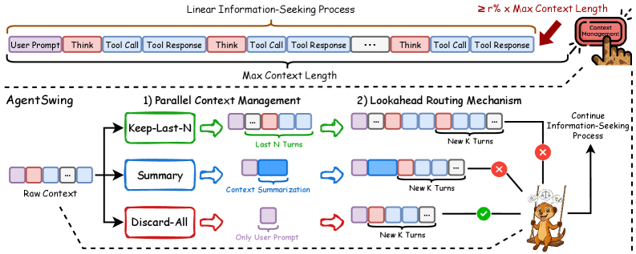
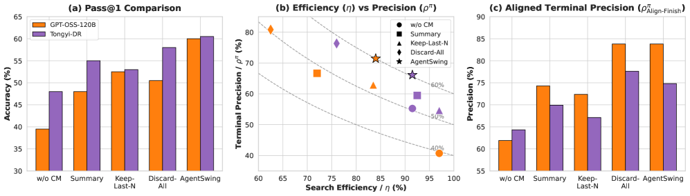
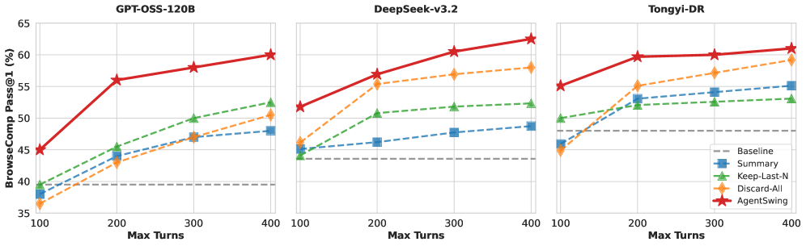

## 왜 이 논문이 중요한가

LLM이 단순한 질문답변기를 넘어 웹을 탐색하고 정보를 찾는 **자율 에이전트**로 진화하면서, 한 가지 근본적인 문제가 드러났습니다. 바로 **컨텍스트 윈도우의 한계**입니다.

GPT, Claude, Gemini 같은 최신 모델도 한 번에 담을 수 있는 정보량은 정해져 있습니다. 그런데 웹에서 복잡한 질문에 답하려면 수십, 수백 번의 검색과 방문, 뒤로 가기를 반복해야 합니다. 이 과정에서 대화 기록이 쌓이고 쌓이다가 결국 컨텍스트가 꽉 차버립니다. 그 이후에는 에이전트가 제대로 된 판단을 내릴 수 없게 됩니다.

알리바바 통의연구소(Tongyi Lab)에서 발표한 **AgentSwing**은 이 문제를 해결하는 새로운 접근법을 제시합니다. 핵심 아이디어는 한마디로 이렇습니다:

> **상황에 따라 가장 적합한 컨텍스트 관리 전략을 그때그때 선택하자.**

## 기존의 문제: 하나의 전략으로는 부족하다

기존 방식은 컨텍스트가 꽉 찼을 때 **하나의 고정된 전략**만 반복해서 사용했습니다. 대표적인 전략들은 이렇습니다:

- **Baseline (관리 없음)**: 컨텍스트가 꽉 찰 때까지 그대로 쌓는다
- **Discard-All (전체 삭제)**: 기록을 싹 지우고 처음 프롬프트만 남긴 뒤 새로 시작
- **Keep-Last-N (최근 N개 보존)**: 가장 최근 N개의 상호작용만 남기고 나머지 삭제
- **Summary (요약)**: 쌓인 기록을 요약해서 압축

여기서 재미있는 점은 **어떤 전략이 "최고"인지 정해져 있지 않다**는 것입니다.

예를 들어볼까요. 지금까지의 탐색 기록에 정답에 가까운 중요한 단서들이 포함되어 있다면? 이럴 때는 기록을 보존하는 게 좋습니다. 반대로 엉뚱한 방향으로만 헤매다가 쓸모없는 기록만 잔뜩 쌓인 상태라면? 차라리 싹 지우고 새출발하는 게 낫습니다.

**고정된 전략은 이 두 상황을 구별하지 못합니다.**

## 핵심 아이디어: 성공률을 두 개로 쪼개보자

AgentSwing의 첫 번째 기여는 **확률적 프레임워크**입니다. 에이전트의 최종 성공률(Pass@1)을 두 가지 독립적인 지표로 분해합니다:

- **η (검색 효율, Search Efficiency)**: 에이전트가 리소스를 다 쓰기 전에 정답을 낼 수 있는 상태(정지점)에 도달할 확률
- **ρ (정답 정밀도, Terminal Precision)**: 정지점에 도달한 후 실제로 정답을 맞출 확률

그리고 최종 성공률은:

> **Pass@1 = η × ρ**

이 공식이 왜 중요할까요? 기존에는 "정확도" 하나만 보고 전략을 평가했습니다. 하지만 같은 50% 성공률이라도, "도달은 많이 하지만 틀리는 경우(높은 η, 낮은 ρ)"와 "도달은 적지만 맞추는 경우(낮은 η, 높은 ρ)"는 완전히 다른 문제를 안고 있습니다.

*Figure 1: BrowseComp 벤치마크에서 상호작용 예산에 따른 성능 변화. 점선은 컨텍스트 관리 없는 기준선*

### Discard-All vs Baseline: 트레이드오프의 발견

Baseline(관리 없음)은 컨텍스트를 그대로 유지하니 한 번에 긴 탐색이 가능합니다. **η는 높지만**, 컨텍스트가 너무 길어지면 이른바 **"컨텍스트 부패(context rot)"** 현상이 발생합니다. 쓸데없는 정보가 정답 판단을 방해하는 거죠. 결과적으로 **ρ는 낮아집니다.**

반대로 Discard-All은 기록을 싹 지우니 매번 새출발합니다. 개별 시도는 짧아서 **η는 낮아지지만**, 컨텍스트가 깔끔해서 **ρ는 높아집니다.** 그리고 여러 번 시도할 수 있으니 전체적인 성공률이 올라갑니다.

*Figure 2: Discard-All 전략에서 컨텍스트 예산에 따른 성능 변화. 예산이 클수록 정밀도가 하락하는 경향*

## AgentSwing의 메커니즘: 병렬로 펼치고 가장 좋은 걸 고르자

그래서 AgentSwing은 이렇게 동작합니다:

1. **트리거**: 컨텍스트가 일정 비율 이상 차면 작동
2. **병렬 전개**: Keep-Last-N, Summary, Discard-All 세 전략을 **동시에** 적용
3. **선행 탐색(Lookahead)**: 각 분기를 K턴 만큼 더 진행해보고
4. **라우팅**: 가장 유망한 분기를 선택하고 나머지는 버림

비유하자면, 미로를 탐험하다가 갈림길에서 **세 방향으로 스카우트를 보내고, 가장 유망한 방향으로 본대를 보내는 것**과 같습니다.

*Figure 4: AgentSwing 개요. 트리거 발생 시 여러 전략을 병렬 적용하고, lookahead 후 최적 분기를 선택*

### 왜 lookahead가 필요할까?

그냥 관리된 컨텍스트만 보고 고르면 안 될까요? 논문에서는 이것도 실험으로 확인했습니다. lookahead 없이 선택하는 것보다, **몇 턴 정도 실제로 진행해본 뒤** 선택하는 것이 확실히 더 좋은 성능을 냅니다. 이는 "지금 당장은 괜찮아 보여도 실제로 진행하면 막다른 길"을 피할 수 있게 해줍니다.

## 실험 결과: 상용 모델도 뛰어넘는 성능

AgentSwing은 세 가지 벤치마크에서 세 가지 오픈소스 모델로 실험했습니다:

| 모델 | BrowseComp | BrowseComp-ZH | HLE |
|------|-----------|---------------|-----|
| **GPT-OSS-120B + AgentSwing** | 60.0 | 38.0 | 35.1 |
| **DeepSeek-v3.2 + AgentSwing** | 62.5 | **71.3** | **44.4** |
| **Tongyi-DR-30B-A3B + AgentSwing** | 60.5 | 56.7 | 33.1 |

가장 눈에 띄는 건 **DeepSeek-v3.2 기반 결과**입니다. BrowseComp-ZH에서 71.3점, HLE에서 44.4점으로 Claude-4.5-Opus(62.4 / 43.4)와 Gemini-3.0-Pro(66.8 / 45.8) 같은 상용 모델을 능가하거나 필적하는 성능을 보였습니다.

*Figure 3: 다양한 컨텍스트 관리 전략을 η(검색 효율)과 ρ(정답 정밀도) 축에서 비교. AgentSwing이 가장 유리한 영역을 차지*

### 3배 더 적은 턴으로 동등한 성능

정적 전략이 3배 많은 상호작용을 해야 도달하는 성능을, AgentSwing은 훨씬 적은 턴으로 달성합니다. 이는 단순히 "더 많이 시도해서"가 아니라, **상황에 맞는 전략을 선택해서** 얻는 효율성입니다.

*Figure 5: 상호작용 턴 수에 따른 전략별 성능 변화. AgentSwing이 모든 구간에서 일관된 우위*

## 시사점: LLM 에이전트 설계의 새로운 방향

### 1. 컨텍스트 관리는 "설정"이 아니라 "판단"이다

기존에는 컨텍스트 관리 전략을 하이퍼파라미터처럼 미리 정했습니다. AgentSwing은 이것을 **런타임 결정 문제**로 바꿨습니다. 에이전트가 스스로 판단해서 최적의 전략을 선택하는 거죠.

### 2. 성공률의 분해는 분석의 강력한 도구다

η와 ρ로 성공률을 분해하면, 왜 어떤 전략이 우월한지, 어느 부분에서 손해를 보는지 정확히 파악할 수 있습니다. 이는 앞으로 새로운 컨텍스트 관리 전략을 설계할 때 유용한 분석 틀이 됩니다.

### 3. 실용적 영향이 크다

에이전트가 더 적은 턴으로 더 정확한 답을 낸다는 건, **API 비용 절감**과 **응답 시간 단축**으로 직결됩니다. 특히 프로덕션 환경에서 웹 에이전트를 서비스하려는 기업에게 매우 실용적인 의미를 갖습니다.

### 4. 작은 모델도 큰 잠재력을 보인다

Tongyi-DR-30B-A3B(30B 파라미터, 활성 3B) 같은 소형 모델에서도 AgentSwing의 개선 효과가 일관되게 나타났습니다. 이는 컨텍스트 관리가 모델 크기와 관계없이 보편적으로 효과적인 **테스트타임 스케일링** 기법임을 시사합니다.

## 마치며

AgentSwing은 "LLM 에이전트가 긴 탐색을 어떻게 효율적으로 수행할 것인가"라는 근본적인 질문에 대해, **상황에 맞춰 동적으로 대응한다**는 세련된 답을 제시합니다.

"하나의 전략으로 끝까지 밀고 나가는 것"보다 "여러 가능성을 열어두고 가장 좋은 것을 선택하는 것"이 더 낫다는 건, 인간의 문제 해결 방식과도 닮아 있습니다. 좋은 연구란 이렇게 직관적이면서도 증명 가능한 통찰을 제시하는 것이겠죠.

---

**논문**: Zhaopeng Feng et al., "AgentSwing: Adaptive Parallel Context Management Routing for Long-Horizon Web Agents", arXiv:2603.27490, 2025.
**링크**: [arxiv.org/abs/2603.27490](https://arxiv.org/abs/2603.27490)
