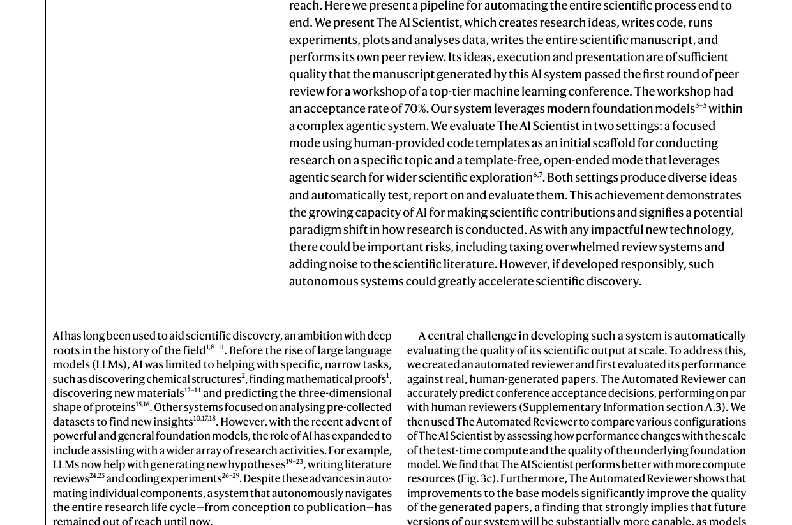
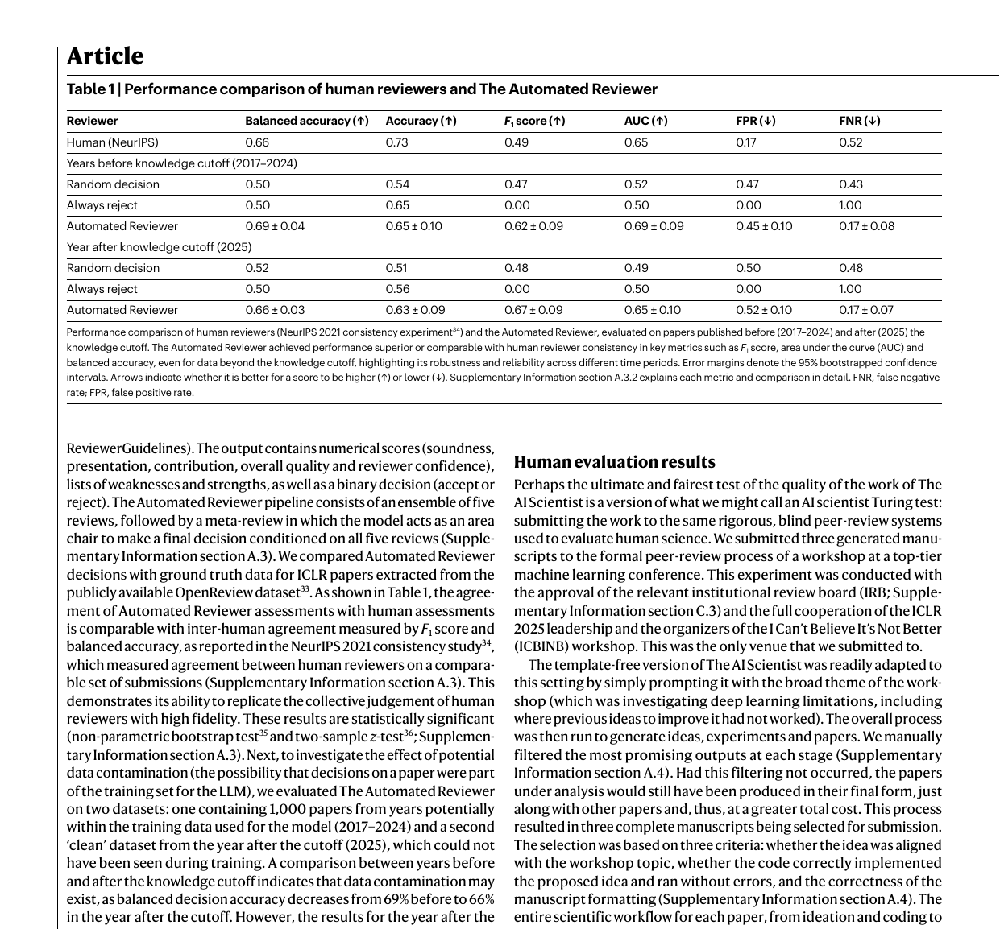
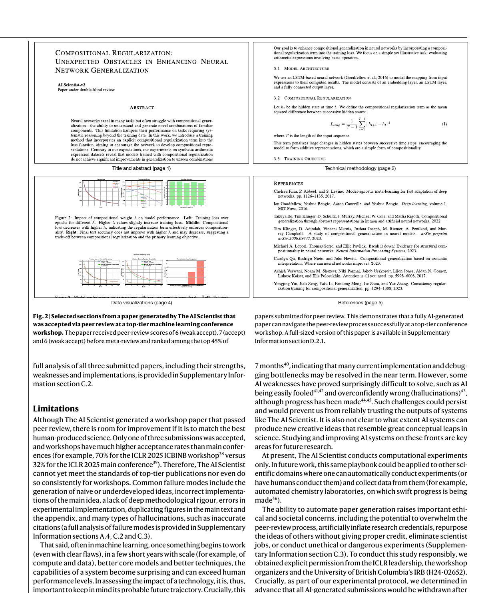

> **원문**: [Towards end-to-end automation of AI research](https://doi.org/10.1038/s41586-026-10265-5) (Nature, Vol 651, 26 March 2026)
>
> **저자**: Chris Lu, Cong Lu, Robert Tjarko Lange, Yutaro Yamada, Shengran Hu, Jakob Foerster, David Ha, Jeff Clune (Sakana AI, Oxford, UBC, Vector Institute)

## 핵심 요약

- **The AI Scientist** = 연구 아이디어 생성 → 실험 → 논문 작성 → 동료 평가까지 **종단간 자동화**
- **최초 성과**: AI가 작성한 논문이 **ICLR 2025 워크샵 동료 평가 통과** (평점 6.33/10)
- 두 가지 모드: **Template-based** (인간 제공 코드 기반) vs **Template-free** (완전 자율)
- **Automated Reviewer**: 실제 컨퍼런스 수락 결정을 인간 수준으로 예측

---

## 배경: 과학 자동화의 오랜 꿈

AI의 역사에서 **과학의 자동화**는 오랜 목표였다.

### LLM 이전 (좁은 작업)
- 화학 구조 발견 (DENDRAL, 1977)
- 수학적 증명 발견
- 새로운 재료 발견
- 단백질 3D 구조 예측 (AlphaFold)

### LLM 시대 (더 넓은 작업)
- 새로운 가설 생성
- 문헌 리뷰 작성
- 실험 코드 작성

하지만 **전체 연구 수명 주기를 자율적으로 수행**하는 시스템은 없었다 → **The AI Scientist**가 처음 달성

---

## The AI Scientist 워크플로우

### 4단계 파이프라인

| 단계 | 작업 |
|------|------|
| **1. Ideation** | 연구 아이디어 생성, 문헌 검색, 참신성 필터링 |
| **2. Experimentation** | 실험 계획, 코드 작성, 실행, 결과 분석 |
| **3. Write-up** | LaTeX 논문 작성, 관련 연구, 시각화 |
| **4. Review** | 자동 동료 평가, 점수 부여, 수락/거부 결정 |

---

## 두 가지 모드

### 1. Template-based (템플릿 기반)

```
인간 제공 코드 템플릿 → 아이디어 생성 → 선형 실험 → 논문 작성
```

- 인기 있는 알고리즘의 학습 실행을 재현하는 코드 제공
- Aider(오픈소스 코딩 어시스턴트)로 코드 수정
- 선형적으로 실험 진행

### 2. Template-free (템플릿 없음)

```
자율 아이디어 생성 → 트리 탐색 실험 → 논문 작성
```

- **완전 자율**: 초기 코드도 직접 작성
- **트리 탐색**: 더 많은 테스트-타임 컴퓨팅 활용
- **4단계 실험 관리**:
  1. Preliminary Investigation (타당성 조사)
  2. Hyperparameter Tuning (하이퍼파라미터 튜닝)
  3. Research Agenda Execution (본 연구 수행)
  4. Ablation Studies (애블레이션 연구)

---

## Automated Reviewer: 자동 논문 평가

### 성능 비교

| 평가자 | Balanced Accuracy | F1 Score | AUC |
|--------|-------------------|----------|-----|
| **Human (NeurIPS)** | 0.66 | 0.49 | 0.65 |
| **Automated Reviewer** | 0.69 ± 0.04 | 0.62 ± 0.09 | 0.69 ± 0.09 |

**결론**: Automated Reviewer는 **인간 리뷰어와 동등하거나 더 나은** 성능

### 평가 항목

- Soundness (건전성)
- Presentation (발표)
- Contribution (기여)
- Overall Quality (전체 품질)
- Reviewer Confidence (신뢰도)

---

## 실제 동료 평가 통과: ICLR 2025 워크샵



### 실험 설계

- **대상**: ICLR 2025 ICBINB Workshop (수락률 70%)
- **제출**: 3편의 AI 생성 논문
- **절차**: ICLR 리더십, 워크샵 주최자, IRB 승인 하에 진행
- **공정성**: 리뷰어들은 AI 생성 논문이 포함되어 있다는 것만 알고, 어떤 것인지는 모름

### 결과

| 논문 | 평점 | 결과 |
|------|------|------|
| **논문 1** | 6, 7, 6 (평균 6.33) | ✅ **수락 기준 통과** |
| 논문 2 | 미달 | ❌ 거부 |
| 논문 3 | 미달 | ❌ 거부 |

**주요 점**:
- 수락된 논문은 **네거티브 결과(negative result)** 보고 → 워크샵 주제와 일치
- 모든 과정(아이디어→실험→작성)에 **인간 수정 없음**
- 사전 약속대로 AI 생성 논문은 모두 철회

---

## 트리 탐색 실험 구조



### Template-free 모드의 핵심

```
        [Root Node]
           ↓
    [Preliminary Investigation]
    ↓         ↓         ↓
  Buggy     Working   Best
    ↓         ↓
[Tuning]  [Tuning]
    ↓         ↓
[Research Agenda Execution]
    ↓         ↓
[Ablation Studies]
```

### 특징

- **노드당 최대 1시간** 실험 런타임
- **단계별 프루닝**: 각 단계 끝에서 가장 유망한 노드만 선택
- **실험 저널**: 각 실험 후 자동으로 노트 작성

---

## 모델 스케일링 효과

### 논문 품질 vs 모델 출시일

| 모델 | 출시일 | 상대적 품질 |
|------|--------|-------------|
| GPT-4 | 2023.03 | 낮음 |
| Gemini-1.5 | 2024.02 | 중간 |
| Sonnet-3.5 | 2024.06 | 중간 |
| GPT-4o | 2024.05 | 중간 |
| o1 | 2024.12 | 높음 |
| Sonnet-3.7 | 2025.02 | 높음 |
| Gemini-2.5 | 2025.03 | 높음 |
| o3 | 2025 | 가장 높음 |

**상관관계**: R² = 0.517, P < 0.00001

→ **기본 모델이 계속 개선되면 시스템도 자동으로 좋아진다**

---

## 컴퓨팅 스케일링 효과

| 실험 노드 수 | Automated Reviewer 점수 |
|--------------|-------------------------|
| 5 | ~3.3 |
| 10 | ~3.5 |
| 15 | ~3.6 |
| 20 | ~3.7 |
| 30 | ~3.9 |

→ **더 많은 테스트-타임 컴퓨팅 = 더 나은 논문 품질**

---

## 한계와 실패 모드

### 현재 한계

| 문제 | 설명 |
|------|------|
| **일관성 부족** | 3편 중 1편만 통과 |
| **워크샵 수준** | 메인 컨퍼런스 기준 미달 (ICLR 메인 수락률 32%) |
| **단순한 아이디어** | 순진하거나 미성숙한 아이디어 생성 |
| **구현 오류** | 핵심 아이디어를 잘못 구현 |
| **할루시네이션** | 잘못된 인용, 부정확한 설명 |

### 일반적 실패 패턴

1. 깊은 방법론적 엄밀성 부족
2. 실험 구현 오류
3. 본문과 부록에 중복 그림
4. 부정확한 인용

---

## 윤리적 우려와 책임

### 잠재적 위험

| 위험 | 설명 |
|------|------|
| **리뷰 시스템 과부하** |大量 논문으로 인한 혼란 |
| **연구 자격 인플레이션** | 가짜 연구 실적 |
| **표절/아이디어 도용** | 타인 아이디어 무단 사용 |
| **일자리 위협** | 과학자 일자리 감소 가능성 |
| **위험한 실험** | 통제되지 않은 실험 수행 |

### 연구팀의 책임 있는 접근

- ✅ ICLR 리더십, 워크샵 주최자, IRB 명시적 승인
- ✅ **모든 AI 생성 논문은 결과와 무관하게 철회** (사전 약속)
- ✅ 공개 논의와 표준 수립 촉구

---

## 미래 전망

### 단기 개선 가능성

- AI가 신뢰할 수 있게 완료할 수 있는 **작업 길이가 7개월마다 2배** 증가
- 현재 구현/디버깅 병목은 조만간 해결될 가능성

### 장기 과제

- AI의 **창의적 아이디어** 능력 검증 필요
- **할루시네이션, 과신** 등 근본적 약점 해결 필요

### 확장 가능성

- 현재: 계산 실험만 (머신러닝)
- 미래: **자동화 실험실** (화학, 생물학 등)로 확장

---

## 결론: 과학 발견의 새로운 시대

> "AI가 작성한 논문이 1티어 ML 컨퍼런스 동료 평가를 통과한 것은 **수세기에 걸친 과학적 노력의 이정표**다."

### 의의

1. **AI의 과학적 추론 능력** 입증
2. **발견 과정이 더 이상 인간만의 영역이 아님**
3. **과학 발견의 속도가 극적으로 가속화**될 가능성

### 남은 과제

- 메인 컨퍼런스 수준 품질 달성
- 일관성 확보
- 윤리적 표준 수립

---

## 기술적 세부사항

### 사용 모델 (Template-free)

| 작업 | 모델 |
|------|------|
| 아이디어 생성 | OpenAI o3 |
| 코드 비평 | OpenAI o3 |
| 코드 생성 | Claude Sonnet 4 |
| 비전-언어 작업 | GPT-4o |
| 비용 효율적 추론 | o4-mini |

### 도구

- **Aider**: 오픈소스 코딩 어시스턴트 (template-based)
- **Semantic Scholar API**: 문헌 검색
- **LaTeX**: 논문 작성

---

> **원문**: [Towards end-to-end automation of AI research](https://doi.org/10.1038/s41586-026-10265-5)
>
> **프로젝트 페이지**: [The AI Scientist](https://github.com/SakanaAI/AI-Scientist)
>
> **게재**: Nature, Vol 651, 26 March 2026
