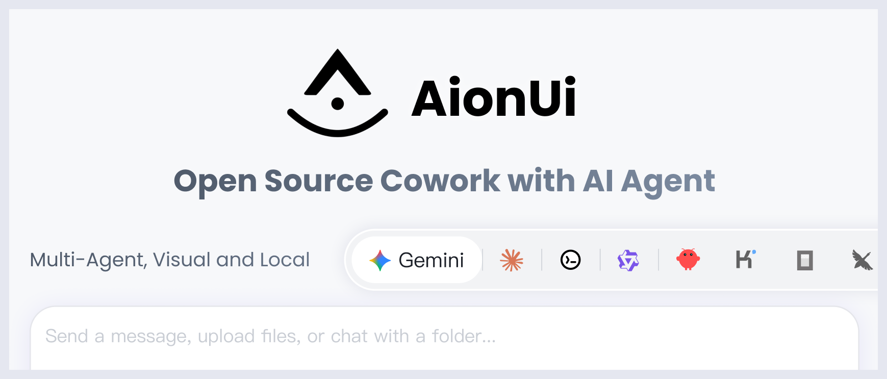
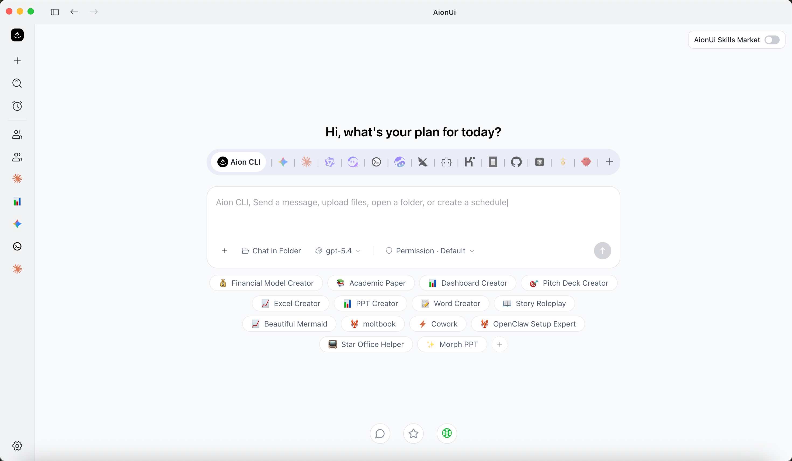
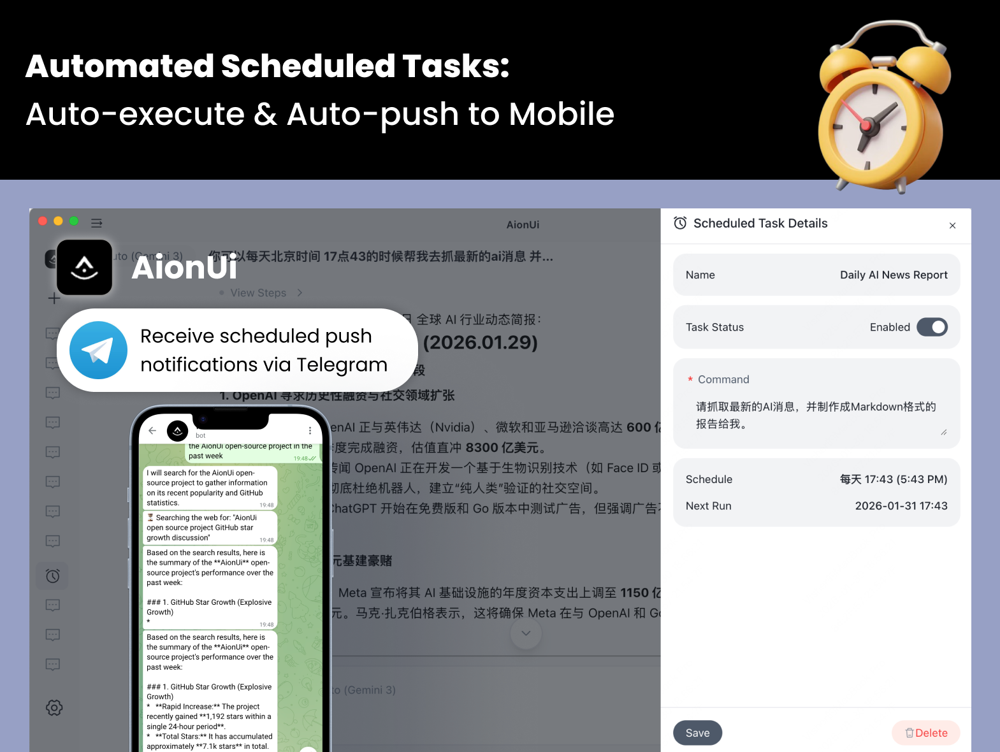

AI 도구가 채팅창에서 에이전트로 넘어가는 중임. 예전에는 ChatGPT 창에 질문을 던지고 답을 복사해 쓰는 방식이 중심이었음. 지금은 Claude Code, Codex, Gemini CLI 같은 도구가 파일을 읽고, 코드를 고치고, 명령을 실행하고, 작업을 끝까지 밀고 감.

문제는 도구가 너무 많아졌다는 점임. Claude Code는 Claude Code대로, Codex는 Codex대로, Gemini CLI는 Gemini CLI대로 따로 열어야 함. 작업 로그도 흩어지고, MCP 설정도 도구마다 반복해야 하고, 원격에서 확인하기도 번거로움.

[AionUi](https://github.com/iOfficeAI/AionUi)는 이 문제를 데스크톱 앱으로 풀려는 오픈소스 프로젝트임. 한 줄로 말하면 **여러 AI 에이전트를 한 화면에서 불러와 같이 일하게 만드는 Cowork 앱**임.

GitHub 설명은 꽤 직설적임. “Free, local, open-source 24/7 Cowork app”이고, Gemini CLI, Claude Code, Codex, OpenCode, Qwen Code, Goose CLI, OpenClaw 등을 지원한다고 적혀 있음. 2026년 4월 29일 기준 GitHub stars는 약 22.8k, forks는 약 1.9k 수준임. 라이선스는 Apache-2.0임.

## 1. AionUi는 채팅 앱이 아니라 Cowork 앱임

AionUi가 강조하는 단어는 Chat이 아니라 **Cowork**임.

차이는 큼. 채팅 앱은 사용자가 묻고, AI가 답함. Cowork 앱은 AI가 내 컴퓨터 안에서 실제 작업을 함.

| 구분 | 일반 AI 채팅 앱 | AionUi |
|---|---|---|
| 기본 역할 | 답변 생성 | 작업 수행 |
| 파일 접근 | 제한적 | 로컬 파일 읽기/쓰기 |
| 다단계 작업 | 사용자가 이어서 지시 | 에이전트가 계획하고 실행 |
| 원격 접근 | 보통 없음 | WebUI, Telegram, Lark, DingTalk 등 |
| 자동화 | 수동 실행 중심 | Cron 기반 24/7 작업 가능 |
| 에이전트 통합 | 특정 모델 중심 | Claude Code, Codex, Gemini CLI 등 다수 통합 |

핵심은 “AI에게 물어보는 앱”에서 “AI와 같이 일하는 작업 공간”으로 관점을 바꾼다는 점임.

## 2. 설치하면 바로 쓰는 내장 에이전트

AionUi는 외부 CLI 에이전트를 반드시 설치해야만 동작하는 구조가 아님. 자체 내장 에이전트를 포함함.

공식 README 기준 내장 에이전트가 제공하는 기능은 다음과 같음.

- 파일 읽기와 쓰기
- 웹 검색
- 이미지 생성
- MCP 도구 사용
- 문서 생성
- 파일 정리
- 스프레드시트 처리
- 작업 자동화

사용자는 Google 로그인 또는 API 키 입력만으로 시작할 수 있다고 안내되어 있음. Gemini, OpenAI, Anthropic, AWS Bedrock, Ollama, LM Studio, OpenRouter, DeepSeek, Qwen 계열 등 20개 이상 플랫폼을 지원한다는 점도 특징임.

여기서 좋은 점은 “API 키가 있는 채팅창”으로 끝나지 않는다는 것임. 같은 API 키를 쓰더라도 AionUi 안에서는 파일 작업, 도구 호출, 문서 생성 같은 에이전트 기능을 같이 얹어줌.

## 3. Claude Code, Codex, Gemini CLI를 한 화면에 모음

AionUi의 진짜 차별점은 멀티 에이전트 통합임.

지원 목록에 올라온 에이전트가 꽤 많음.

- Built-in Agent
- Claude Code
- Codex
- Gemini CLI
- Qwen Code
- Goose AI
- OpenClaw
- OpenCode
- Kiro
- Hermes Agent
- Cursor Agent
- GitHub Copilot
- Kimi CLI
- CodeBuddy
- Augment Code
- Snow CLI
- Factory Droid
- Qoder CLI 등

이미 CLI 기반 AI 도구를 쓰는 사람에게는 이 지점이 중요함. 각각의 도구를 버리고 AionUi로 갈아타라는 게 아니라, **기존 도구를 AionUi 안으로 끌고 오는 구조**임.

AionUi는 설치된 CLI 도구를 자동 감지하고, 하나의 인터페이스에서 병렬 세션을 열 수 있게 한다고 설명함. 에이전트마다 독립 컨텍스트를 유지하고, 여러 작업을 동시에 돌릴 수 있음.

## 4. MCP를 한 번 설정해서 여러 에이전트에 동기화

AI 에이전트를 제대로 쓰기 시작하면 MCP 설정이 금방 복잡해짐. 파일 시스템, 브라우저, GitHub, 검색, 데이터베이스, 사내 도구 같은 걸 에이전트마다 연결해야 하기 때문임.

AionUi는 이 문제를 “MCP Unified Management”로 풀겠다고 함.

의미는 단순함.

1. MCP 도구를 AionUi에서 한 번 설정함.
2. 연결된 여러 에이전트에 자동으로 동기화함.
3. Claude Code, Codex, Gemini CLI 같은 도구마다 반복 설정할 필요를 줄임.

이건 실제 사용자에게 꽤 큼. 에이전트 성능보다 먼저 부딪히는 게 설정 피로감이기 때문임. MCP 서버를 하나 추가할 때마다 JSON 파일 찾고, 경로 맞추고, 재시작하고, 권한 확인하는 일이 반복됨. AionUi가 이걸 GUI에서 묶어준다면 진입 장벽이 낮아짐.

## 5. Team Mode: 에이전트를 팀처럼 굴림

AionUi에는 Team Mode도 있음. 구조는 리더-팀원 방식임.

- Leader 에이전트가 사용자 지시를 받음
- 작업을 서브태스크로 쪼갬
- Teammate 에이전트들에게 분배함
- 각 에이전트가 병렬로 실행함
- 결과를 비동기 메일박스와 작업 보드로 공유함
- Leader가 집계함

공식 문서에서는 Claude Code, Codex, Gemini, Snow CLI, Aion CLI 등을 Leader 또는 Teammate 백엔드로 언급함. ACP(Agent Client Protocol) 기반의 에이전트 클라이언트 연결 계층도 함께 설명되어 있음.

이 구조는 단순히 “채팅창 여러 개”가 아님. 한 작업을 여러 에이전트에게 나눠 맡기는 오케스트레이션에 가까움. 예를 들어 블로그 자동화 프로젝트라면 한 에이전트는 자료 조사, 한 에이전트는 원고 초안, 한 에이전트는 코드 수정, 한 에이전트는 배포 검증을 맡는 식으로 설계할 수 있음.

## 6. 오피스 문서 작업을 강하게 밀고 있음

AionUi는 개발자 도구만 지향하지 않음. 오히려 이름처럼 Office AI 쪽 색깔이 강함.

내장 어시스턴트 목록에 이런 것들이 있음.

- PPT Creator
- Morph PPT / Morph PPT 3D
- Word Creator
- Excel Creator
- Pitch Deck Creator
- Dashboard Creator
- Academic Paper Writer
- Financial Model Creator
- PDF to PPT
- Beautiful Mermaid
- UI/UX Pro Max

PPT, Word, Excel 파일을 실제 편집 가능한 산출물로 만드는 쪽을 중요하게 봄. README에서는 [OfficeCLI](https://github.com/iOfficeAI/OfficeCli)를 함께 언급하고, `pptx`, `docx`, `xlsx`, `pdf`, `mermaid` 같은 스킬을 내장 기능으로 설명함.

이건 교육·업무 자동화 관점에서 재미있는 지점임. 코딩 에이전트는 개발자에게 강하지만, 일반 업무 현장에서는 PPT, 보고서, 엑셀, PDF 변환이 더 자주 등장함. AionUi는 그쪽을 정면으로 겨냥함.

## 7. 원격 접근과 24/7 자동화

AionUi가 “24/7 Cowork”를 강조하는 이유는 원격 접근과 스케줄 작업 때문임.

지원한다고 밝힌 접근 방식은 다음과 같음.

- 데스크톱 앱
- WebUI
- Telegram
- Lark / Feishu
- DingTalk
- WeChat
- WeCom
- Slack 예정

즉, 집이나 사무실 PC에 AionUi를 켜두고, 밖에서는 브라우저나 메신저로 에이전트를 확인하고 지시하는 흐름을 노림. Claude Code Remote 같은 경험을 여러 에이전트로 확장하려는 방향에 가깝다.

스케줄 작업도 핵심임.

스케줄 방식은 세 가지로 안내되어 있음.

| 방식 | 설명 |
|---|---|
| Cron expression | `0 9 * * 1` 같은 표준 cron, 타임존 지원 |
| Fixed interval | 30분마다, 2시간마다 같은 반복 실행 |
| One-time trigger | 특정 날짜와 시간에 한 번 실행 |

실행 방식도 두 가지임. 기존 대화에 이어서 실행할 수도 있고, 매번 새 대화를 열 수도 있음. 전자는 컨텍스트가 중요한 작업에 맞고, 후자는 독립적인 정기 보고서에 맞음.

예를 들면 이런 자동화가 가능함.

- 매일 아침 뉴스 요약
- 주간 매출 데이터 정리
- 다운로드 폴더 자동 정리
- 정기 보고서 생성
- 블로그 소재 수집
- 코드 저장소 상태 점검

## 8. 결과물을 앱 안에서 바로 보는 Preview Panel

에이전트가 파일을 만들기 시작하면 또 다른 문제가 생김. 결과물을 어디서 확인할 것인가임.

AionUi는 Preview Panel을 제공함. PDF, Word, Excel, PPT, Markdown, HTML, 이미지, 코드, diff 파일 등을 앱 안에서 바로 열어볼 수 있다고 설명함.

이건 에이전트 앱에서 꽤 중요한 기능임. AI가 만든 파일을 Finder에서 찾고, Word 열고, Excel 열고, 브라우저 열고, 다시 채팅창으로 돌아오는 흐름은 금방 피곤해짐. 미리보기 패널이 있으면 생성-확인-수정 지시가 한 화면 안에서 이어짐.

## 9. 기술적으로는 Electron 기반 로컬 앱

`package.json`을 보면 AionUi는 Electron 기반 데스크톱 앱임.

주요 기술 스택은 다음과 같음.

| 영역 | 기술 |
|---|---|
| 데스크톱 | Electron, electron-vite |
| 프론트엔드 | React 19, TypeScript, Vite, UnoCSS, Arco Design |
| 서버/로컬 기능 | Express, better-sqlite3 |
| 에이전트/프로토콜 | ACP SDK, MCP SDK, Aion CLI core |
| 모델 연동 | OpenAI SDK, Anthropic SDK, Google GenAI, AWS Bedrock 등 |
| 문서 처리 | docx, xlsx, mammoth, officeparser, pptx2json |
| 미리보기/표현 | Mermaid, KaTeX, React Markdown, diff2html |

데이터는 로컬 SQLite에 저장된다고 README가 설명함. 다만 파일 접근, 명령 실행, 원격 채널, 자동 승인 모드가 있는 도구이므로 보안 감각은 꼭 필요함.

## 10. YOLO Mode는 편하지만 조심해야 함

README에는 YOLO Mode 또는 Full-Auto Mode가 언급됨. 모든 에이전트 작업을 자동 승인해서 무인 실행을 가능하게 하는 기능임.

편함. 하지만 위험함.

AI 에이전트가 파일을 읽고 쓰고, 명령을 실행하고, 웹에 접근할 수 있다면 권한 승인 체계가 안전장치임. 자동 승인을 켜면 속도는 빨라지지만, 잘못된 명령이나 과도한 파일 수정도 그대로 진행될 수 있음.

그래서 실제 사용 기준은 이렇게 보는 게 좋음.

- 개인 테스트 폴더: 자동 승인 가능
- 중요한 업무 폴더: 승인 모드 유지
- 회사 자료/개인정보 포함 폴더: 원격 채널과 자동 승인 둘 다 신중히 사용
- 처음 쓰는 에이전트/모델: 반드시 로그를 보며 수동 승인

AionUi의 장점은 “다 해준다”가 아니라 “한 화면에서 보고 제어한다”에 있음. 제어권을 놓치면 장점이 곧 리스크가 됨.

## 11. 누구에게 맞나

AionUi는 이런 사람에게 잘 맞음.

- Claude Code, Codex, Gemini CLI를 동시에 쓰는 사람
- MCP 설정을 여러 도구에 반복하는 게 귀찮은 사람
- AI 에이전트 작업 로그와 파일 결과물을 한 화면에서 보고 싶은 사람
- 텔레그램이나 WebUI로 원격에서 에이전트를 확인하고 싶은 사람
- PPT, Word, Excel 같은 오피스 산출물을 AI로 만들고 싶은 사람
- 매일/매주 반복되는 자동화 작업을 AI에게 맡기고 싶은 사람

반대로 이런 사람에게는 과할 수 있음.

- 단순 질의응답만 필요한 사람
- 로컬 파일 접근 권한을 AI에게 주기 부담스러운 사람
- 하나의 모델만 깔끔하게 쓰고 싶은 사람
- Electron 앱보다 가벼운 CLI 중심 작업을 선호하는 사람

## 12. 의미 있는 흐름

AionUi가 흥미로운 이유는 단순히 “또 하나의 AI 앱”이라서가 아님.

지금 AI 에이전트 생태계는 빠르게 쪼개지고 있음. Claude Code, Codex, Gemini CLI, OpenCode, OpenClaw, Goose, Qwen Code처럼 도구가 계속 늘어남. 각 도구는 강점이 있지만, 사용자는 점점 더 많은 실행창과 설정 파일을 관리해야 함.

AionUi는 이 흐름에서 **AI 에이전트 허브**를 지향함. 모델도 하나로 고정하지 않고, 에이전트도 하나로 고정하지 않고, 로컬 앱·웹 UI·메신저·스케줄 자동화까지 묶음.

결국 질문은 이거임.

“어떤 AI가 제일 똑똑한가?”에서 “여러 AI를 내 작업 흐름 안에 어떻게 배치할 것인가?”로 넘어가는 중임.

AionUi는 그 전환을 데스크톱 앱 형태로 보여주는 프로젝트임. 특히 업무 자동화, 문서 생성, 멀티 에이전트 협업에 관심 있는 사람이라면 한 번 살펴볼 만함.

## 참고 링크

- GitHub: [iOfficeAI/AionUi](https://github.com/iOfficeAI/AionUi)
- Releases: [AionUi Releases](https://github.com/iOfficeAI/AionUi/releases)
- 공식 사이트: [aionui.com](https://www.aionui.com)
- OfficeCLI: [iOfficeAI/OfficeCli](https://github.com/iOfficeAI/OfficeCli)
