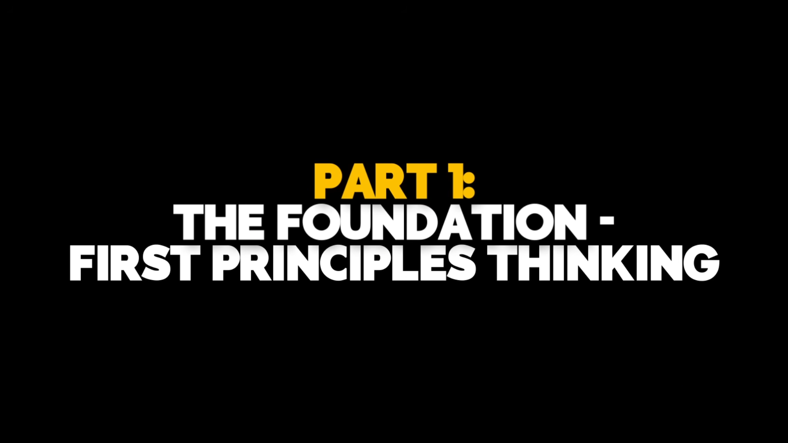
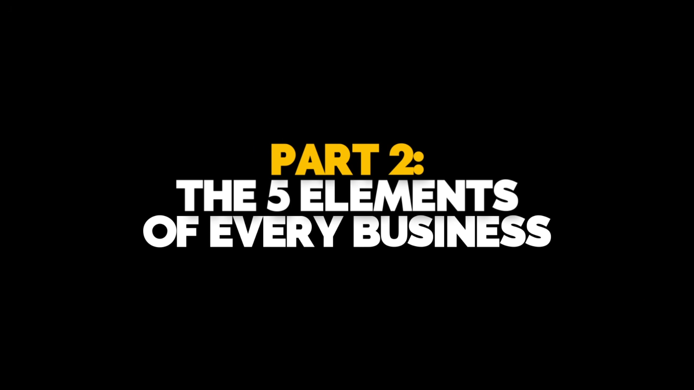
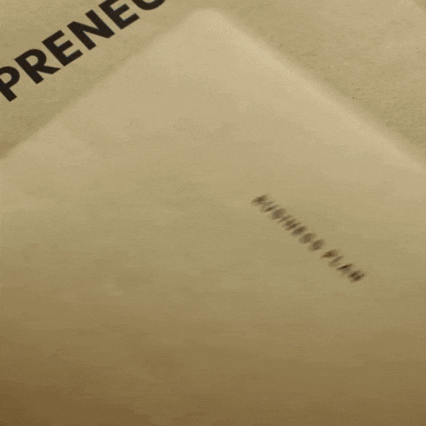
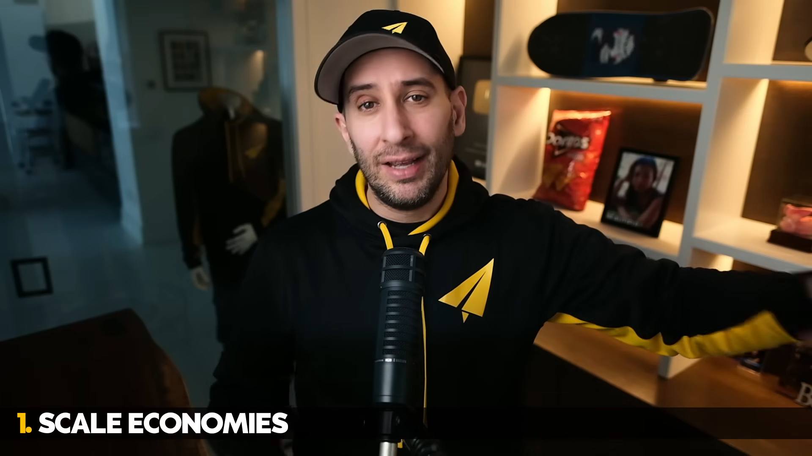
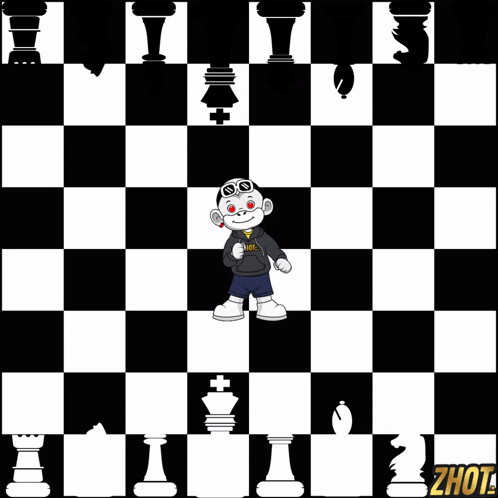
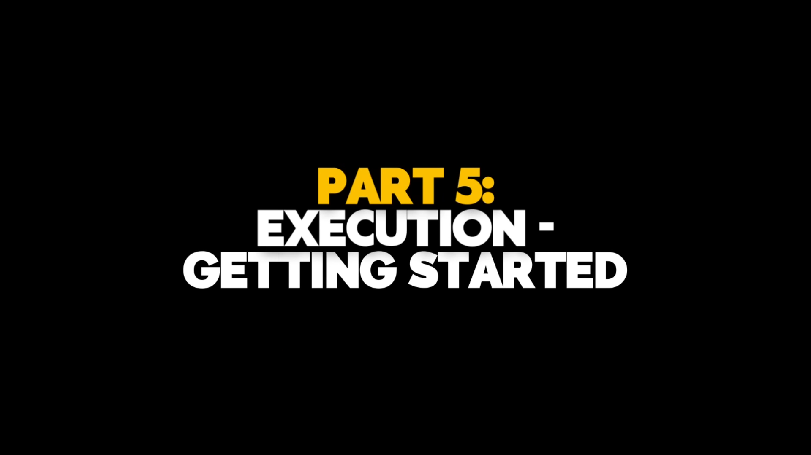
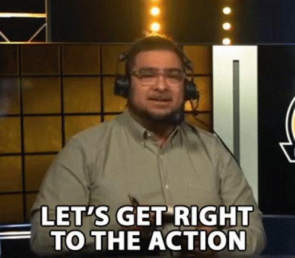

사업은 복잡해 보이는데, 뼈대는 단순함. 58분 영상도 결국 4개로 묶임. 남 따라하지 말고, 구조를 보고, 힘을 만들고, 시작해야 함.

## 1. 첫 원리부터 봐야 함

남이 하는 대로 따라하면 답이 안 나옴. 경쟁사를 복사하면 그 회사의 실수까지 같이 복사함. 문제를 가장 작은 단위로 쪼개야 함.

## 2. 사업은 5요소임

가치 생성이 먼저임. 그다음 마케팅, 세일즈, 가치 전달, 재무임. 하나라도 비면 사업이 아니라 취미임.

## 3. 전략은 힘임

열심히만 하면 지침. 힘이 있어야 함. 규모, 네트워크, 카운터포지셔닝, 스위칭 코스트, 브랜드, 코너드 리소스, 프로세스 파워. 적어도 하나는 가져야 함.

## 4. 결국 시작하는 사람이 이김

완벽해질 때까지 기다리면 영원히 못 감. 30분이라도 시작해야 함. 망한 초안이 쌓여야 실행력이 생김. 마지막은 믿음이고, 그다음은 행동임.

[원문 영상 보기](https://youtu.be/RGT7nNrvSek?si=48lr849Wahv_FQyR)
