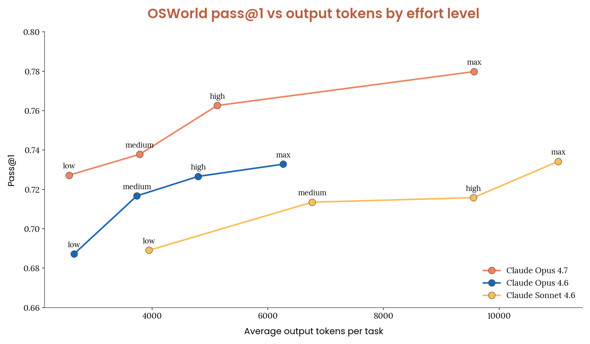
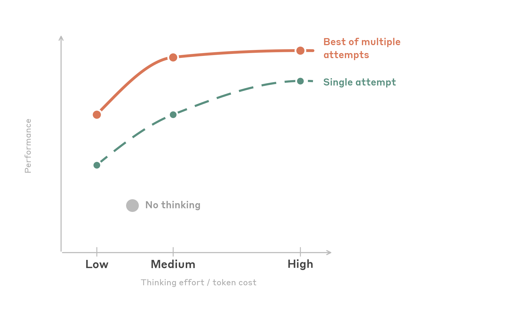

Anthropic이 2026년 5월 23일, Claude 모델 패밀리로 컴퓨터 및 브라우저 자동화를 구축하는 개발자를 위한 **종합 모범 사례 가이드**를 발표했습니다. 단순한 팁 모음이 아니라, 해상도 세팅부터 보안·컨텍스트 관리까지 실전에서 부딪히는 문제들을 체계적으로 풀어낸 문서입니다.

이 글에서는 원문의 핵심을 인터뷰 Q&A 형태로 재구성해봤습니다.

---

## Q: 클릭 정확도를 높이는 가장 중요한 한 가지는?

**A: 스크린샷을 API로 보내기 전에 미리 다운스케일하는 것**입니다. 생각보다 이게 임팩트가 큽니다.

Claude Computer Use API는 내부적으로 이미지 크기 처리 한계를 가집니다. Claude 4.6 패밀리는 긴 엣지 최대 1,568px·1.15MP, Opus 4.7은 2,576px·3.75MP까지 수용합니다. 이 한계를 초과해 보내면 API가 알아서 다운스케일하는데, 그 과정을 개발자가 제어하지 못하면 좌표가 어긋납니다.

그래서 **1280×720을 기본값**으로 추천합니다. 픽셀 예산의 약 80%만 사용해서 안전 마진을 확보할 수 있고, Opus 4.7을 쓸 때는 1080p까지 올려도 의미 있는 품질 향상이 있습니다.

한 가지 더. 메시지 배열에서 **텍스트 지시를 이미지 앞에** 배치하세요. 모델이 스크린샷을 처리하면서 "무엇을 찾아야 하는지" 미리 알 수 있어서 클릭 정확도가 올라갑니다.

---

## Q: 모델마다 클릭 성능이 다른가요?

**A: 꽤 다릅니다.** 용도에 따라 선택하면 됩니다.

- **Sonnet 4.6** — 기계적 클릭 정밀도가 가장 뛰어납니다. 공간 정확도가 높고, 다운스케일이 심한 상황에서도 강건합니다.
- **Opus 4.6** — 클릭보다는 추론 능력이 강점입니다.
- **Opus 4.7** — Sonnet 4.6급 클릭 정밀도에 높은 해상도 예산, 그리고 Opus급 추론력을 결합했습니다.
- **Haiku 4.5** — 레이턴시가 최우선일 때 선택합니다.

**실전 권장:** 대부분의 작업에는 Sonnet 4.6이 클릭·추론·비용의 최적 균형점입니다. 강한 추론이 필요한 복잡한 워크플로우에는 Opus 4.7을 선택하세요.

작은 버튼이나 밀집된 UI에서는 `enable_zoom: True`를 설정하거나, 아예 키보드 단축키·탭 내비게이션으로 대체하는 편이 신뢰도 높습니다.

---

## Q: Thinking effort는 어떻게 설정해야 하나요?

**A: 모델에 따라 다릅니다. 핵심만 정리하면:**

**Opus 4.7은 `high`가 기본값**입니다. OSWorld 벤치마크에서 Opus 4.7은 4.6 패밀리 전체를 동등한 토큰 사용량에서 능가했는데, 특히 `low` 노력 설정에서조차 Sonnet 4.6의 `max`와 비슷한 성능을 내면서 토큰은 약 1/10만 소모합니다. 비용에 민감하다면 `low`도 강력한 선택지입니다.

**4.6 패밀리는 `medium`이 스위트 스팟**입니다. `high`와 비슷한 성공률을 내면서 토큰은 절반만 씁니다. 재시도를 포함하면 `medium`과 `high`는 같은 성능으로 수렴합니다. 놀랍게도 `low`도 사고를 아예 끄는 것보다 토큰을 적게 쓰면서 정확도는 같거나 더 높습니다. 오류가 줄어 재시도 사이클이 감소하기 때문입니다.

주의할 점: **`max`는 비추천**입니다. UI 작업은 주로 지각적·기계적이라서, 깊은 논리 사고를 늘리는 것보다 올바른 요소를 식별하고 클릭하는 게 핵심입니다. 테스트에서 `max`는 `high` 대비 정확도 향상 없이 토큰만 더 먹었습니다.

---

## Q: 프롬프트 인젝션 공격은 어떻게 방어하나요?

**A: 공식 `computer_20251124` 도구를 쓰면 분류기가 자동으로 켜집니다.** 추가 설정·레이턴시·비용 없이요.

컴퓨터 사용 에이전트는 본질적으로 신뢰할 수 없는 콘텐츠와 상호작용합니다. 웹페이지의 숨겨진 텍스트, 조작된 이미지, 기만적 UI 요소 등이 에이전트 동작을 탈취하려 할 수 있습니다.

Anthropic의 방어는 다층 구조입니다:

1. **훈련 시 강건성** — 강화학습으로 프롬프트 인젝션 저항성을 모델 자체에 내장
2. **실시간 분류기** — 컨텍스트 창에 들어오는 콘텐츠를 스캔해 잠재적 공격을 플래그
3. **지속적 레드팀** — 보안 연구자가 방어를 지속 점검

분류기 외에도 권장하는 추가 조치가 있습니다. 고위험 작업(폼 제출, 구매, 메시지 전송 등)에는 반드시 **Human-in-the-Loop**을 구현하고, 에이전트 권한 범위를 최소화하며, 모든 행동을 로깅하세요.

---

## Q: 스크린샷이 컨텍스트 창을 빠르게 채우는데, 어떻게 관리하나요?

**A: 이게 사실 장기 실행 에이전트에서 가장 큰 과제입니다.** 해상도에 따라 스크린샷 하나당 약 1,000~1,800 토큰을 소모합니다. 200k 컨텍스트 창이 100개 미만의 스크린샷으로 꽉 찹니다.

Anthropic이 권장하는 세 가지 전략을 조합해서 쓰라고 합니다.

### 캐시 브레이크포인트 배치

API는 최대 4개의 캐시 브레이크포인트를 지원합니다. 1개는 안정적인 접두사(시스템 프롬프트, 도구 정의)에, 나머지 3개는 **최근 이력**에 배치하세요. 최근 이력이 무효화 리스크가 가장 높고, 캐시 절감 효과가 복리로 쌓이기 때문입니다.

### 롤링 버퍼

오래된 스크린샷을 최근 N개만 유지하고 나머지는 `"[Image omitted]"` 플레이스홀더로 교체합니다. 핵심은 **배치로 정리**하는 것 — 하나씩 지우면 캐시가 계속 깨집니다. 기본값으로 `keep_n=3`, `interval=25`에서 시작해보세요.

### LLM 컴팩션

이미지를 조용히 지우는 대신, 전체 대화를 **요약한 뒤 삭제**합니다. 요약에는 사용자 원래 지시, 완료한 행동, 실패한 접근법(재시도 방지용), 현재 상태, 다음 단계 등을 포함해야 합니다.

서버 사이드 컴팩션(베타)도 제공됩니다. `compact-2026-01-12` 베타를 활성화하면 API가 자동으로 컴팩션을 수행하고, 임계값과 요약 프롬프트를 커스텀할 수도 있습니다.

---

## Q: Teach Mode가 뭔가요?

**A: 텍스트로 설명하는 대신 직접 보여주는 방식**입니다. 사용자가 작업을 수행하는 걸 녹화하면(스크린샷, 행동, 음성 내레이션), Claude가 그 데모를 참고해서 같은 워크플로우를 실행합니다.

중요한 점은 엄격한 리플레이가 아니라는 것입니다. Claude는 데모를 가이드로 사용하면서 실시간 환경에 맞게 추론합니다. 버튼 위치가 바뀌었거나 메뉴가 재구성됐어도, 현재 UI에서 동등한 요소를 찾아냅니다.

세 가지 플레이백 모드가 있습니다:

- **Strict** — 단계를 정확히 따르고, UI가 크게 변경되면 중지. 컴플라이언스 민감 워크플로우에 적합.
- **Adaptive** — 데모를 가이드로 쓰되 UI 변경에 적응. **대부분의 기본값.**
- **Goal-oriented** — 최종 결과에 집중하고 단계는 힌트로만 활용. UI가 자주 변하지만 목표가 같을 때 유용.

---

## Q: 실험적 기능도 소개해주세요

**A: 두 가지가 있습니다.**

**배치 도구(`computer_batch` / `browser_batch`)** — 여러 하위 행동을 하나의 도구 호출로 실행합니다. N번의 라운드 트립을 단 한 번으로 줄여줍니다. 서로 독립적인 행동(폼 필드 여러 개 작성, 키보드 단축키 체인 등)에 적합하고, 탐색이나 오류 복구 같은 순차적 시퀀스에는 비추천합니다.

**어드바이저 도구(베타)** — 실행자 모델(예: Sonnet 4.6)과 고지능 어드바이저(예: Opus 4.7)를 페어링합니다. 실행자가 깊은 추론이 필요한 순간에 어드바이저를 호출해 계획이나 수정을 받고 계속 진행합니다. 비용 효율적으로 Opus급 판단을 활용하는 방식입니다.

---

## 한 줄 요약

해상도는 1280×720 기본, 모델은 Sonnet 4.6이 달인 클릭·Opus 4.7이 고수 추론, thinking은 4.6은 medium·4.7은 high, 공식 도구 쓰면 인젝션 분류기 자동 켜짐, 컨텍스트는 캐시+롤링 버퍼+컴팩션 삼위일체로 관리. 이것만 기억하시면 됩니다.

---

> 원문: [Best practices for computer and browser use with Claude](https://claude.com/blog/best-practices-for-computer-and-browser-use-with-claude) — Lucas Gonzalez, Luca Weihs (Anthropic), 2026-05-23
