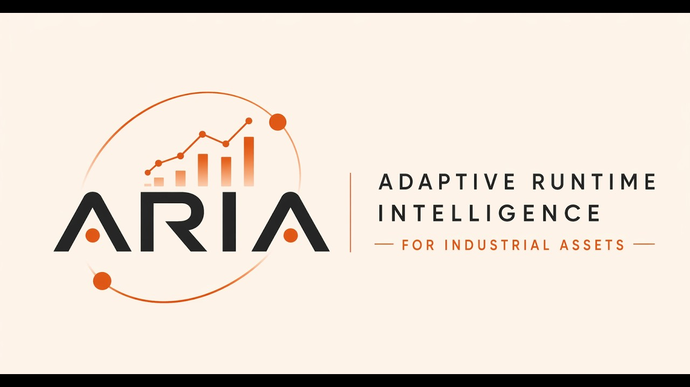
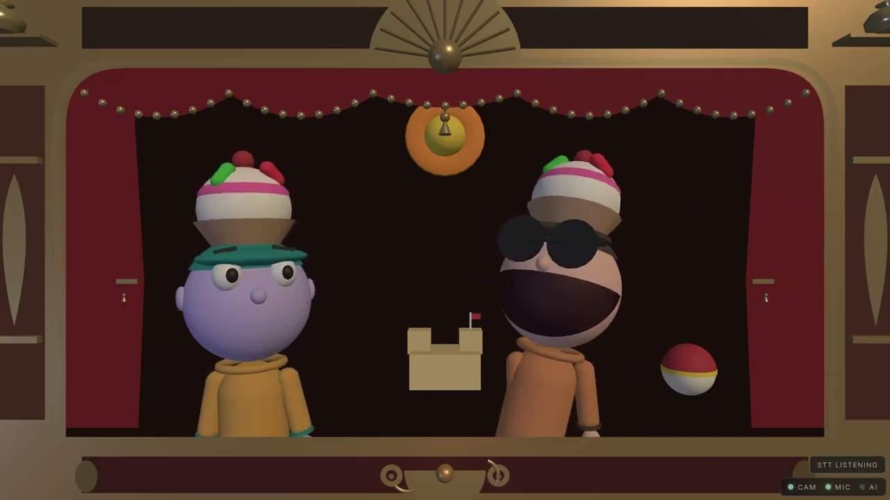
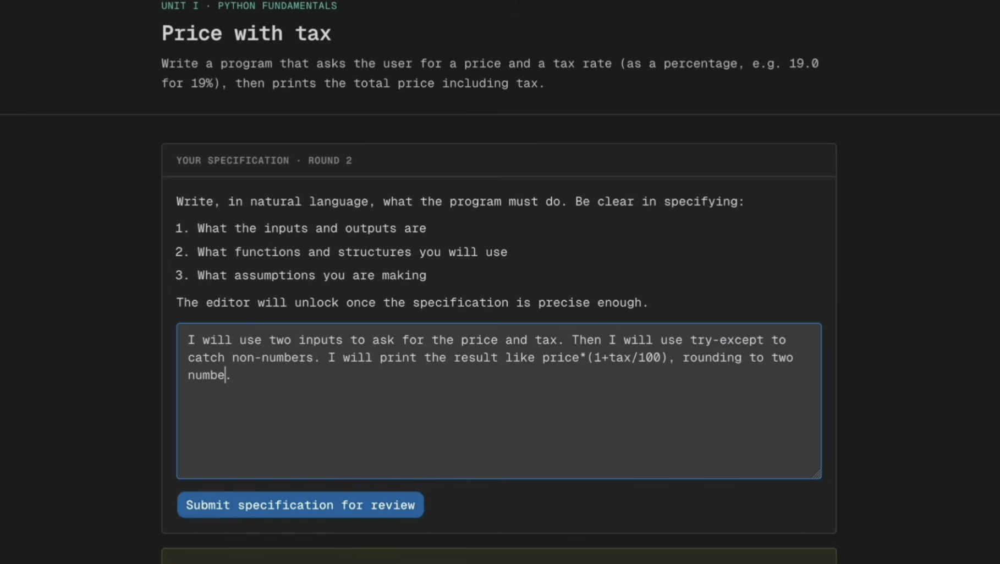
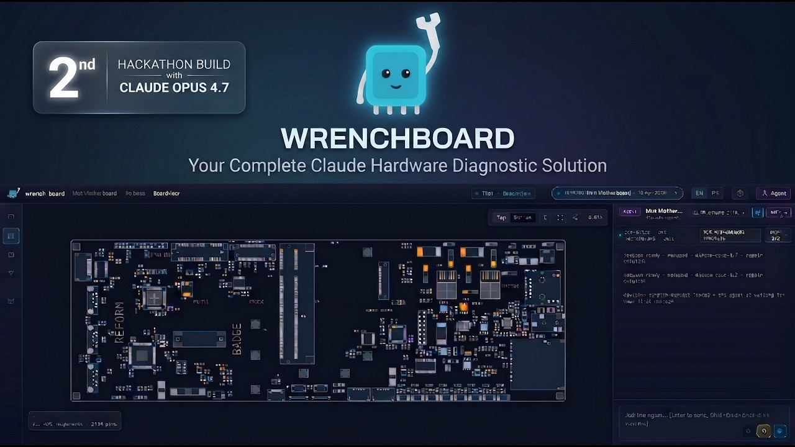
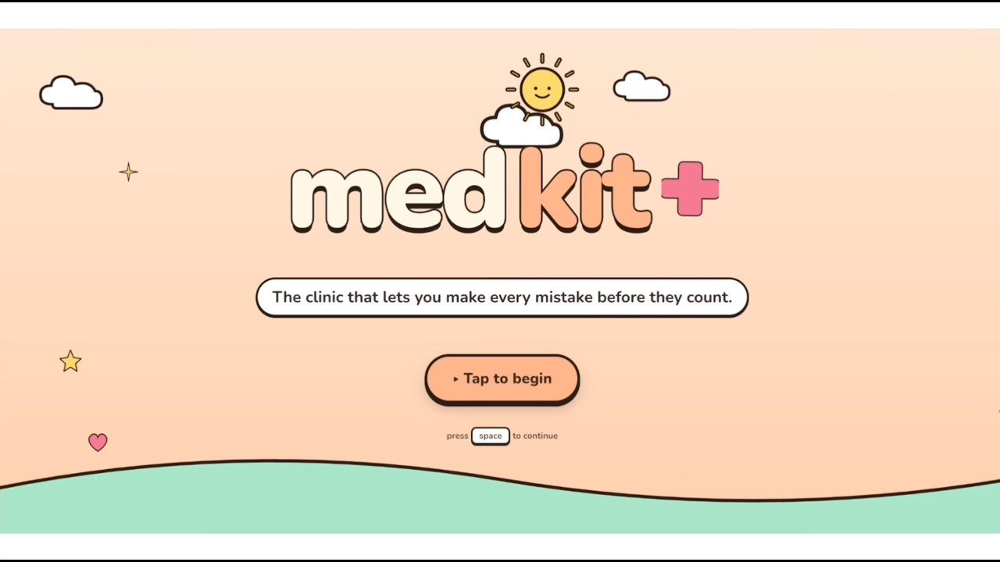

"수상자는 의사, 목수, 교사, 학생입니다."

Anthropic 커뮤니티 헤드 Jason Bigman이 이번 해커톤 결과를 이 한 문장으로 요약했다. 2만 명이 지원하고 500명이 뽑힌, 일주일짜리 글로벌 가상 해커톤. 총상금 $100K. 심사위원은 Claude 팀 소속이었다.

수상자 여섯 명 중 실리콘밸리에 기반을 둔 사람은 단 한 명도 없었다. 이스탄불, 프렌치 알프스, 칠레, 덴마크. 각자 자기 삶의 문제를 AI로 풀었다.

역순으로 정리해봤다.

---

## 🤖 Best Use of Claude Managed Agents — ARIA
**프랑스 · Idriss Benguezzou & Adam Hnaien**

모든 공장에 기계 소리를 알아듣는 사람이 한 명씩 있다. 교대 일지에 기록하고 다음 조작자에게 구두로 넘긴다. 그 사람이 은퇴하면, 그 지식은 사라진다.

ARIA는 공장 머신의 KPI를 실시간 추적해서 교체 시점을 예측한다. 산업 현장의 비정형 데이터 — 교대 일지, 소리, 진동 — 를 구조화해서 예측 모델 입력으로 쓴다는 접근이 흥미롭다. 이런 시스템을 구축하려면 보통 5만~50만 유러에 6개월이 걸린다. 대부분의 공장은 그 비용을 감당하지 못해 기계가 고장 날 때까지 기다린다.

베이비붐 세대 은퇴로 현장 암묵지가 사라지는 시점에, ARIA 같은 접근이 그 공백을 메울 수 있을까? Claude Managed Agents를 어떻게 활용했는지가 평가 포인트였다.

- 🎬 [데모 영상](https://www.youtube.com/watch?v=Hen24w2Jyz4)
- 💻 [GitHub](https://github.com/zestones/Aria)

---

## 🧠 Keep Thinking Prize — MaestrIA
**칠레 칠로에 섬 안쿠드 · Benjamín Torralbo**

Torralbo는 목수의 아들이자 건설 운영 회사를 운영하는 사람이다. 그가 만든 MaestrIA는 집 수리 도구다.

손상 부위를 사진으로 찍으면 진단 결과를 반환하고, 인근 매장의 부품 가격을 알려주고, 근처 기술자에게 보낼 메시지까지 초안을 작성해준다. 화려한 기능이 아니다. 실제 수리 현장에서 어떻게 일이 돌아가는지 아는 사람이 만들었기 때문에 모든 기능이 현장에 맞물려 있다.

"Keep Thinking"이라는 상 이름에 정확히 부합하는 작품이다. 실리콘밸리나 런던 같은 AI 중심지가 아닌, 칠레의 작은 섬에서 온 빌더가 자기 삶의 문제를 AI로 풀었다. Anthropic이 이 해커톤에서 보고 싶어 했던 게 바로 이런 것이었을 것이다.

---

## 🎨 Most Creative Exploration — Virtual Puppet Theater
**덴마크 오르후스 · Rene Hangstrup Møller**

웹캠 피드를 MediaPipe로 분석해 손 랜드마크를 추적하고 3D 위치를 추정한다. 그 데이터로 무대 위 인형을 조종한다. 사용자가 한 인형을 움직이면 AI가 다른 인형을 연기한다.

데모에서 사용자가 "Let's call you Bob"이라고 말하면 AI 인형이 "Bob, I love it. Bob the puppet, that's me"라고 받아친다. "Give Bob a crown"이라고 하면 AI가 즉석에서 Three.js 코드를 작성해 왕관 프랍을 만든다. "아이스크림 모자 씌워줘"라고 하면 Opus가 그것도 즉석에서 생성한다.

기술적으로 눈여겨볼 점이 있다. Haiku는 빠른 턴테이킹용, Opus는 프랍 빌더용. 두 에이전트가 하나의 캐시를 공유한다. 음성 입력은 브라우저 Web Speech API (무료), 음성 출력은 ElevenLabs Flash. 사전 제작된 Three.js 프랍도 있지만, Opus가 처음 요청받으면 즉석에서 새 프랍을 코드로 작성한다.

제작자가 스스로 "작년에는 존재하지 않았던 놀이 인터페이스"라고 말했다. 정확한 표현이다.

- 🎬 [데모 영상](https://www.youtube.com/watch?v=qLuGU4PQNss)

---

## 🥉 동상 (3위) — Maieutic
**칠레 콘셉시온 · Paula Vásquez-Henríquez**

Paula는 6년간 대학 프로그래밍 입문을 가르치며 같은 패턴을 반복해서 봤다. 학생이 LLM에서 코드를 복붙하고 무엇인지 모른다. 지시사항을 대충 읽고 테스트가 실패한 뒤에야 빠진 걸 발견한다. 무엇을 풀지도 결정 안 하고 타이핑부터 시작한다.

"세 학생 모두 코드를 제출하고 과목을 통과할 수 있다. 하지만 중요한 부분을 배우지 못했다."

Maieutic은 순서를 뒤집는다. 에디터가 잠겨 있다. 학생은 먼저 프로그램이 무엇을 해야 하는지 자기 말로 작성해야 한다. AI가 그 명세를 읽고 대답하지 않은 질문을 되묻는다. 소크라테스식 대화. 명세가 명확해질 때까지 에디터가 열리지 않는다. 열려도 자동완성은 꺼져 있다.

코드가 제출되면 AI가 명세와 코드를 나란히 놓고 그 차이를 설명하라고 요구한다. 그 차이 — 명세와 코드 사이의 간극 — 이 프로그래머가 평생 찾아야 하는 것이다.

40명 학생이 있는 실험실에서 교수자는 실시간으로 각 학생의 상태를 본다. 누가 움직이고, 누가 막혀있고, 차이가 어디에 있는지. 가장 흔한 실수, 가르칠 가치가 있는 패턴의 요약까지.

"좋은 교수자가 수년에 걸쳐 만드는 패턴 인식을, 문제를 처음 낼 때부터 사용할 수 있게 됐다."

이 영상은 제작 방식 자체가 창의적이었다. 교육 문제를 스토리텔링으로 풀어낸 프레젠테이션. "AI를 교실에서 금지하는 건 정답이 아니다"라는 철학이 현실적이다. 대부분의 프로그래머가 하루 종일 프롬프트를 작성할 세상인데, 좋은 프롬프트는 자기가 뭘 만들려는지 아는 사람에게서 나온다.

- 🎬 [데모 영상](https://www.youtube.com/watch?v=IJ9FyX2xwWA)

---

## 🥈 은상 (2위) — Wrench Board
**프랑스 레니에르-에제리 (프렌치 알프스) · Alexis Chappelier**

Alexis는 전 마이크로솔더링 기술자다. 독립 수리 기술자는 화면 교체 수준을 넘어서는 고장 앞에서 막힌다. 회로도는 제조사 벽 뒤에 잠겨 있고, 기존 도구는 숙련 기술자처럼 회로를 추론하지 못한다.

Wrench Board는 4개의 직교 워크플로우와 29개 에이전트 도구를 제공한다. Knowledge Factory가 수리 지식을 수집하고 구조화한다. Schematic Ingestion이 회로도를 파싱한다. Bench Auto-Generator가 진단 벤치를 자동 생성한다. Diagnostic Agent가 WebSocket 기반으로 인터랙티브 트러블슈팅을 진행한다.

환각 방지 sanitizer가 컴포넌트 레퍼런스를 검증한다. `electrical_graph.json` 질의 시스템으로 회로를 노드/엣지로 모델링해 고장 지점을 직관적으로 보여준다. 이 그래프 기반 시각화가 특히 돋보였다.

유엔에 따르면 매년 약 5천만 톤의 전자 폐기물이 발생하고 대부분 수리 가능하다. Right to Repair 운동에 기여할 수 있는 실질적 도구다. 5일 만에 혼자 구축했다.

- 🎬 [데모 영상](https://www.youtube.com/watch?v=OZ2D_p82z6w)
- 💻 [GitHub](https://github.com/Junkz3/wrench-board)
- 🌐 [wrenchboard.cloud](https://wrenchboard.cloud)

---

## 🥇 금상 (1위) — Medkit
**터키 이스탄불 · Bedirhan Keskin**

Bedirhan Keskin은 의학박사이자 4년차 소프트웨어 엔지니어다.

"진짜 의사가 되려면 진짜 경험이 필요하다. 하지만 막 의대를 졸업하면 정확히 그게 없다. 실제 환자는 교과서에 딱 맞지 않는다."

Medkit은 음성 우선 AI 환자 시뮬레이터다. 실시간 음성 대화로 AI 환자를 진료한다. 병력 청취, 검사 오더, 영상 판독, 진단, 처방까지 전 과정. 세션이 끝나면 Opus 4.7 기반 Attending Grader가 소통 능력, 병력 청취, 임상 추론을 최신 가이드라인 인용과 함께 평가한다.

데모에서 환자가 말한다. "밤에 많이 쌕쌕거리고 기침이 나요, 특히 봄이 오면. 집 혈압계가 188/112를 보여줬어요, 두통도 있고요." 의사가 묻는다. "이전에 고혈압 진단을 받은 적이 있나요?" 환자가 답한다. "네, 약 10년 됐어요. 암로디핀 먹었는데 지난주에 다 떨어졌어요."

이건 실제 응급실에서 매일 일어나는 대화다.

의료 AI에서 가장 큰 리스크는 환각이다. 존재하지 않는 약물을 추천하거나 실제로 없는 가이드라인을 인용하는 건 위험하다. Medkit은 "존재하지 않는 약물/가이드라인 금지"를 엔진 레벨 제약으로 풀었다. 합성 환자 케이스 전체 라이브러리를 에이전트가 자동 생성하면서도 조작된 약물이나 존재하지 않는 가이드라인 인용이 없다.

4개 에이전트가 단일 화면에서 작동한다: 환자, 관찰자, 디브리프 평가자, Attending. Claude Code Auto 모드로 긴 실행 작업을 권한 프롬프트 없이 진행했다. Opus 4.7이 긴 세션에서도 환각 없이 궤도를 유지한 게 핵심이었다. 3일 만에 구축했다.

- 🎬 [데모 영상](https://www.youtube.com/watch?v=6bN6hnx-A2A)
- 💻 [GitHub](https://github.com/bedriyan/medkit-app)
- 🌐 [medkit-app.vercel.app](https://medkit-app.vercel.app/)

---

## 이 해커톤이 보여준 것

여섯 팀이 일주일 안에 만든 건 데모가 아니었다. ARIA는 공장 숙련공의 직관을 디지털로 옮기고, MaestrIA는 목수의 아들이 아는 수리 지식을 도구로 만들고, Wrench Board는 수리 기술자의 추론을 보조하고, Medkit은 Attending 의사 역할을 한다.

환각 방지가 각 프로젝트의 핵심 설계 요소였다는 점도 눈에 띈다. Wrench Board의 sanitizer, Medkit의 "존재하지 않는 약물/가이드라인 금지" 엔진. LLM을 믿되 검증하는 구조가 자연스럽게 자리잡고 있다.

Jason Bigman의 그 한 문장으로 돌아간다. "This is what it looks like when the people closest to a problem can finally build the solution themselves." 문제에 가장 가까운 사람이 직접 해결책을 만드는 순간. 그게 이 해커톤이었다.

---

*YouTube 데모 자막과 [EdTech Innovation Hub의 해커톤 결과 보도](https://www.edtechinnovationhub.com/news/a-doctor-a-carpenter-and-a-teacher-win-anthropics-global-opus-47-hackathon)를 기반으로 작성했습니다.*
