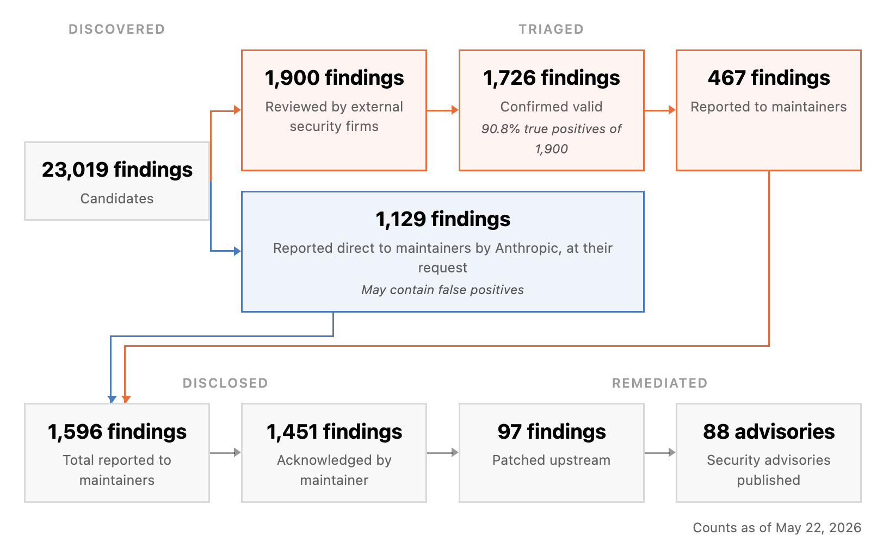

> **Project Glasswing**은 Anthropic이 약 50개 파트너와 함께 핵심 소프트웨어의 고위험 취약점을 AI가 악용되기 전에 선제 탐지하는 사이버보안 이니셔티브입니다. Claude Mythos Preview를 투입한 첫 성과가 2026년 5월 22일 공개됐습니다.

## 인터뷰: "취약점을 찾는 건 해결됐다, 이제 패치 속도가 문제다"

---

**Q. Project Glasswing이란 어떤 프로젝트인가요?**

Anthropic이 약 50개 파트너 기관과 협력해서, 전 세계적으로 시스템적으로 중요한 소프트웨어의 고위험 취약점을 AI가 악용자보다 먼저 찾아내는 이니셔티브입니다. 방어자가 공격자보다 먼저 강력한 AI 도구를 갖추는, 소위 '비대칭 우위'를 확보하는 게 핵심 목표예요.

**Q. 첫 성과가 상당하다고 들었습니다. 숫자로 정리해주시겠어요?**

Claude Mythos Preview를 활용해 **10,000개 이상의 고위험·치명적 취약점**을 발견했습니다. 그중 오픈소스 프로젝트 1,000개에서만 **6,202개**의 고위험 취약점을 탐지했고, 독립 연구자들이 검증한 결과 **90% 이상이 실제 취약점**으로 확인됐습니다.

파트너 사례를 몇 가지 꼽자면 이렇습니다.

- **Cloudflare**: 버그 2,000개 발견 (그중 400개가 고위험/치명)
- **Mozilla**: Firefox에서 271개 취약점 탐지 — 이전 AI 모델 대비 **10배 이상**의 성과

**Q. 10배라는 숫자가 인상적이네요. 어떻게 가능했던 건가요?**

기존 AI 모델은 오탐이 너무 많아서 보안팀이 오히려 시간을 낭비하는 경우가 많았습니다. Claude Mythos Preview는 정밀도가 근본적으로 다릅니다. 진짜 위험한 것과 아닌 것을 구분하는 능력이 비약적으로 올라간 덕분에, 파트너들이 실제로 조치 가능한 수준의 결과를 받을 수 있었어요.

**Q. 이제 취약점은 충분히 찾아낸 건가요?**

아뇨, 오히려 **새로운 병목**이 드러났습니다. 취약점을 '찾는 것'은 해결됐지만, '패치하는 속도'가 못 따라가고 있어요. 보고된 530개 고위험 버그 중 **75개만 패치 완료**됐습니다. 오픈소스 메인테이너들의 역량 한계가 뚜렷하게 나타나는 대목입니다.

**Q. 그 병목 문제에 대한 대책은 있나요?**

**Claude Security 베타**를 출시했습니다. 기업 고객의 코드베이스를 스캔해서 취약점을 찾고, 자동으로 수정 코드까지 생성해주는 도구입니다. 실제로 Claude Opus 4.7이 기업 환경에서 **3주 만에 2,100개 취약점을 패치**했습니다. 탐지뿐 아니라 수정까지 AI가 가속화하는 구조예요.

**Q. 보안 연구자들을 위한 프로그램도 있다고?**

**Cyber Verification Program**을 통해 합법적인 보안 연구자들에게 세이프가드 없이 Mythos급 모델에 접근할 수 있도록 허용하고 있습니다. 연구자들이 더 많은 취약점을 찾을 수 있도록 지원하는 채널이에요. 다만 Mythos급 모델은 현재 검증된 파트너에게만 제한적으로 제공되고 있습니다.

**Q. 앞으로의 방향은?**

탐지→패치→검증 사이클을 계속 빠르게 돌리는 게 목표입니다. 오픈소스 생태계의 패치 병목을 해소하는 것이 당장 가장 중요한 과제고, Claude Security 같은 도구가 그 갭을 줄여줄 거라고 봅니다. 방어자가 먼저 움직이는 시스템을 만드는 게 결국 이 프로젝트의 존재 이유니까요.

---

*원문: [Project Glasswing: Initial Update — Anthropic Research](https://www.anthropic.com/research/glasswing-initial-update) (2026-05-22)*
