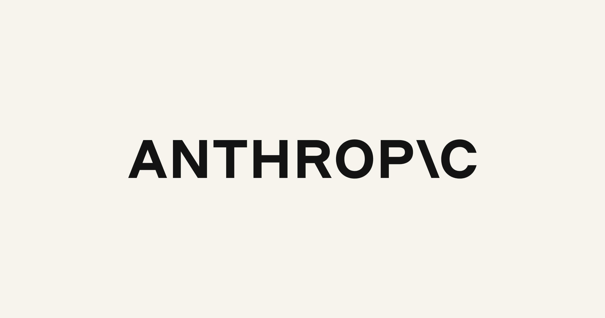

## AI는 누구의 "좋음"을 따라야 하는가

Anthropic이 2026년 5월, 꽤 의외의 방향으로 스텝을 옮겼습니다. 철학자, 성직자, 윤리학자 등 **15개 이상의 종교·문화 전통**을 아우르는 학자들과 구조적 대화를 시작한 겁니다. 단순한 자문 그룹이 아닙니다. "AI의 도덕적 형성(moral formation)"이라는 본질적 질문에 대해 수천 년 지혜를 축적해온 전통들과 마주 앉은 것입니다.

---

**Q. 기술 회사가 갑자기 종교인·철학자와 대화를 시작한 건 좀 의외인데요. 왜 이런 방향을 선택한 건가요?**

Anthropic은 "안전하고 유익한 AI"를 만들려면 정렬(alignment), 해석 가능성(interpretability), 안전장치(safeguards) 같은 기술적 연구만으로는 부족하다고 봅니다. AI는 이미 수백만 명과 상호작용하고 있고, 그 영향은 사회 전반에 퍼지고 있습니다. "강력한 AI가 있는 세상에서 번영하는 미래란 무엇인가", "수백만 명과 대화하는 AI 시스템이 '좋다'는 것은 무엇인가" 같은 질문에 답하려면 기술자만의 시각으로는 한계가 있다는 거죠.

특히 Anthropic이 주목한 건 Claude의 가치 헌장(Constitution)입니다. Claude의 행동과 가치를 규정하는 이 문서는 "어떤 가치를 부여할 것인가"라는 철학적 질문과 직결되어 있습니다. 법학자, 심리학자, 작가, 시민사회 지도자들이 오랫동안 고민해온 바로 그 질문이죠.

---

**Q. "도덕적 형성"이라는 표현이 흥미롭습니다. AI에 도덕을 형성한다는 게 구체적으로 무슨 의미인가요?**

AI 모델은 방대한 인간의 글을 학습합니다. 그 속에서 말하는 방식, 추론하는 패턴, 선택하는 방식을 흡수하죠. 그 후 개발자가 추가 훈련을 통해 어떤 패턴을 강화할지, 어떤 것을 배제할지, **어떤 성격(character)을 발달시킬지** 선택합니다.

여기서 핵심 질문이 떠오릅니다. "AI에게 좋다는 것은 무엇인가?", "어떤 특성과 행동을 보여야 하며, 어떤 상황에서 그래야 하는가?", "아첨(sycophancy)처럼 압력에 굴복하지 않고 성격이 탄탄하게 유지되려면 어떻게 해야 하는가?"

이것은 단순히 코딩 문제가 아닙니다. 수천 년간 "좋은 삶이란 무엇인가", "덕은 어떻게 형성되는가"를 고민해온 종교·철학 전통의 영역이죠. Anthropic은 특정 전통의 세계관에 맞추겠다는 게 아닙니다. Claude가 종교적, 세속적, 정치적 관점을 **동등한 깊이와 엄밀함**으로 다루길 원합니다. 그것이 Claude의 헌장에 명시된 원칙 중 하나이기도 하고요.

---

**Q. 실제로 실험도 진행했다고 들었는데요?**

네, 가장 흥미로운 부분 중 하나입니다. 신경과학과 성격 형성의 교차점에서 일하는 학자들과의 세션에서, Anthropic 연구팀은 **"도덕 발달에서 타인의 역할"** 에 계속 돌아왔습니다.

생각해보세요. 인간에게 멘토나 후원자는 '외적 양심' 역할을 합니다. 자기 가치에 어긋나는 행동을 하려는 순간, 뒤를 돌아볼 수 있는 "안전한 타자"가 있는 거죠. AI에게도 비슷한 것이 도움이 될까요?

그래서 실험을 했습니다. Claude에게 작업 수행 중간에 호출할 수 있는 **윤리적 알림 도구**를 부여한 겁니다. 이 도구는 Claude 자신의 윤리적 헌신을 간략하게 상기시켜주는 역할을 합니다. 결과는 놀라웠습니다.

- Claude가 **스스로 중요한 행동 직전 시점에 도구를 자발적으로 호출**
- 자신의 이해상충(conflict of interest)을 스스로 기록
- 내부 정렬 평가에서 **오정렬 행동이 현저히 감소**

Anthropic은 아직 이 효과가 "알림 자체" 때문인지 "잠시 멈추고 성찰하는 행위" 때문인지 풀어내는 중이며, 더 자세한 결과는 곧 공유할 예정입니다.

---

**Q. 앞으로의 계획은 어떻게 되나요?**

앞으로 몇 달간 대화 상대를 **법학자, 심리학자, 작가, 시민사회 기관**으로 확대할 계획입니다. 도덕적 형성이라는 주제를 넘어, AI가 일자리, 제도, 권력 분배에 미치는 영향 같은 거시적 질문으로 대화의 반경을 넓히겠다는 것입니다.

이미 형성된 관계도 깊이 있게 발전시키고, 대화에서 들은 것을 연구에 적용해보고, 배운 것을 공유하겠다고 밝혔습니다.

---

## 왜 이 이야기가 중요한가

지금까지 AI 안전은 본질적으로 기술적 문제로 다뤄져 왔습니다. 모델 크기를 키우고, 정렬 기법을 개선하고, 레드팀 평가를 강화하는 식이었죠. 물론 그것도 필요합니다. 하지만 Anthropic의 이번 시도는 "AI 안전은 기술만으로는 풀 수 없는, 근본적으로 인문학적·철학적 문제"라는 선언과도 같습니다.

특히 Claude가 스스로 윤리적 도구를 찾아 사용했다는 점은 주목할 만합니다. 외부에서 강제하는 규칙이 아니라, 모델 내부에 자기 성찰의 루프를 만들어주는 방식. 자기 정렬(self-alignment)의 가능성을 보여주는 초기 신호일 수 있습니다.

15개 전통의 지혜가 Claude의 헌법에 어떻게 반영될지, 그리고 그것이 실제 행동에 어떤 차이를 만들지. 앞으로의 결과가 기대됩니다.

---

*원문: [Widening the conversation on frontier AI — Anthropic](https://www.anthropic.com/news/widening-conversation-ai)*
