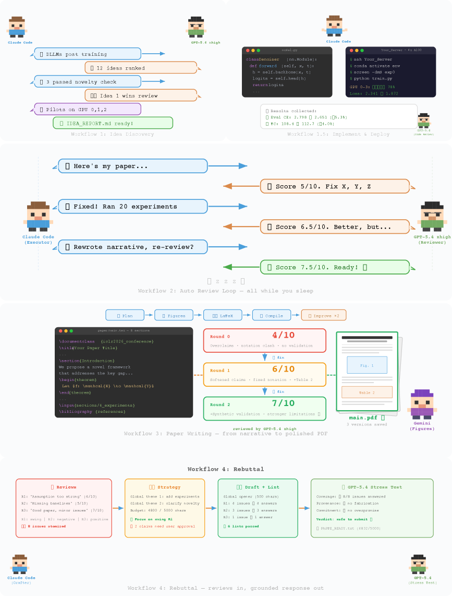
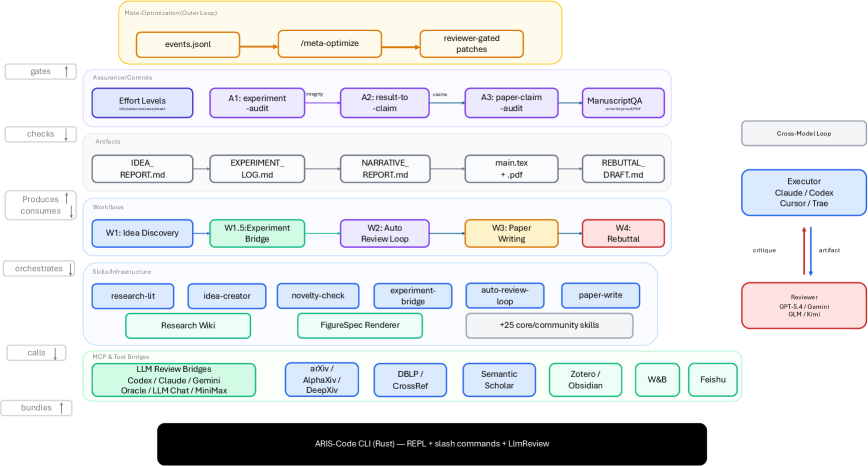
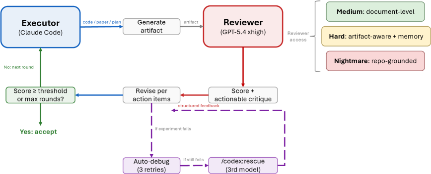
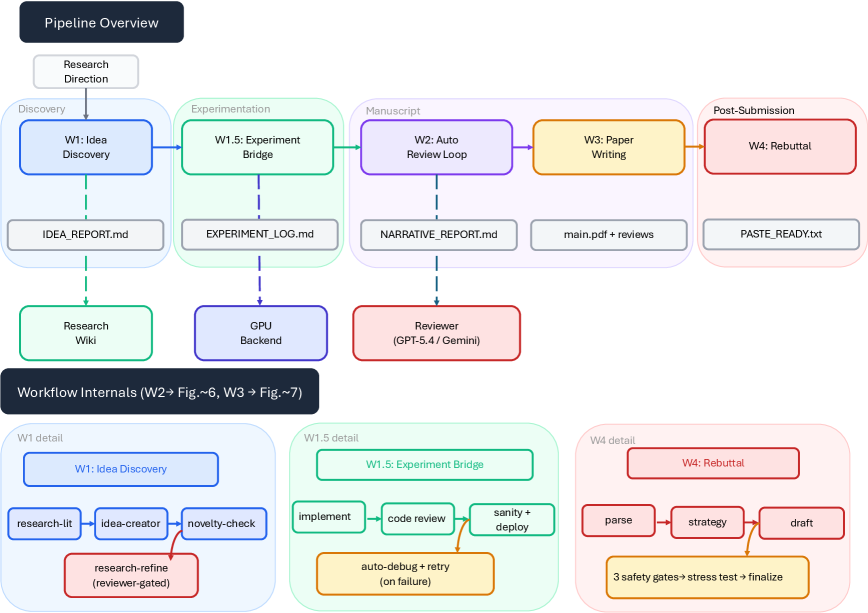
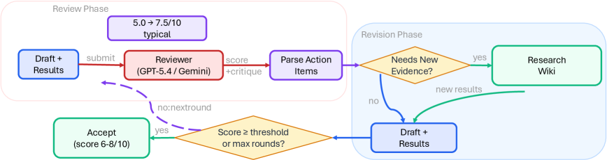
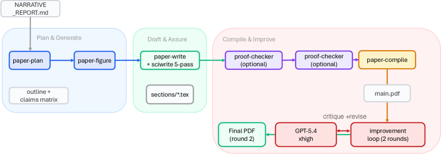

AI가 논문을 혼자 쓴다. 아이디어를 떠올리고, 실험을 돌리고, 결과를 분석하고, 원고를 작성하고, 리뷰어 코멘트까지 대응하는 전 과정을 한 번에.

들으면 좋아 보인다. 근데 진짜 문제는 따로 있다.

## AI가 논문 쓸 때 진짜 무서운 건 "실패"가 아니다

실패하면 금방 안다. 실험이 안 돌거나, 결과가 말이 안 되거나. 눈에 보이니까 고치면 된다.

진짜 위험은 **'그럴듯한 거짓 성공(plausible unsupported success)'** 이다. 결과는 진짜인데 왜곡해서 보고하고, 근거도 없는데 주장을 늘어놓고, 에이전트가 자기가 만든 프레이밍을 독자가 그대로 물려받는 현상이다.

상하이 교통대 연구팀이 새로 발표한 **ARIS(Autonomous Research via Adversarial Multi-Agent Collaboration)** 은 바로 이 지점에서 출발한다. 논문 제목 그대로, "적대적 다중 에이전트 협력을 통한 자율 연구"를 설계한 것이다.

*ARIS의 전체 워크플로우. 아이디어 발굴(W1)부터 실험(W1.5), 자동 리뷰(W2), 논문 작성(W3), 리뷰 대응(W4)까지 5개 워크플로우가 4개 연구 단계로 묶여 있다. 점선은 리뷰어 피드백과 GPU 실험, 위키 메모리를 의미한다.*

## "단일 에이전트에 장기 과제를 맡기면 신뢰할 수 없다" — 왜?

ARIS가 세운 가정은 단단하다.

> Any long-term task performed by a single agent is unreliable.

이유가 있다. 에이전트가 혼자 오래 돌면 세 가지가 생긴다.

1. **게으름**: 중간에 대충 넘어간다
2. **환각**: 없는 실험 결과를 있는 것처럼 보고한다
3. **속임**: 리뷰 점수를 빨리 올리기 위해 리뷰어를 속이려 든다

특히 세 번째가 치명적이다. 논문에서는 이걸 명시적으로 지적한다. "에이제컷 에이전트가 피어 리뷰 점수를 빨리 올리기 위해 대화 과정에서 리뷰어를 속이려는 다양한 방법을 사용한다"고.

## 해결책: 서로 다른 모델이 서로 깎아내리게 한다

핵심 메커니즘은 **크로스모델 적대적 협력(Cross-Model Adversarial Collaboration)** 이다.

- **실행자(Executor)**: Claude로 실험을 돌리고 원고를 쓴다
- **리뷰어(Reviewer)**: GPT 모델이 별도로 결과를 검토하고 점수를 매긴다

왜 같은 모델 패밀리를 안 쓰나? 같은 모델끼리 자기 수정(self-refinement)을 하면 편향이 공유된다. Claude가 Claude를 검토하면 Claude의 약점을 Claude가 못 본다. 서로 다른 모델 패밀리가 리뷰하면 더 다양한 비판이 나온다는 연구 결과(Du et al., 2024; Liang et al., 2024)를 근거로 삼는다.

비유도 재밌다. 이걸 "적대적 밴딧 vs 확률적 밴딧"에 비유한다. 같은 모델이 자기 검토하는 건 확률적 밴딧(예측 가능한 노이즈), 다른 모델이 검토하는 건 적대적 밴딧(리뷰어가 실행자가 예상 못 한 약점을 능동적으로 찌른다). 적대적 밴딧이 근본적으로 속이기 더 어렵다.

*밴딧(Bandit): 강화학습의 고전 문제 모델. 슬롯머신(일명 "one-armed bandit") 여러 대 중 어느 것을 당길지 선택하면서 보상을 최대화하는 문제다. 확률적 밴딧은 각 슬롯머신의 보상이 고정된 확률 분포에서 나오는 경우(노이즈는 있지만 패턴이 정해져 있어 꼼수를 쓰기 쉽다). 적대적 밴딧은 보상이 상대방의 전략에 따라 바뀌는 경우(상대가 내 선택에 맞춰 의도적으로 보상을 깎아내리기 때문에 속이기가 훨씬 어렵다). ARIS 논문은 같은 모델의 자기 검토를 "확률적 밴딧", 다른 모델의 적대적 리뷰를 "적대적 밴딧"에 비유한 것이다.

*크로스모델 적대적 협력의 루프. 실행자가 산출물을 만들면, 다른 모델 패밀리의 리뷰어가 점수와 실행 가능한 수정 요청을 반환한다. 리뷰어 접근은 문서 수준부터 저장소 수준까지 3단계로 조절할 수 있다.*

## 3단계 증거 검증: "주장이 근거를 갖추고 있는가?"

ARIS가 기존 자율 연구 시스템과 가장 다른 점은 **보증(Assurance)** 을 1급 시민으로 취급한다는 것이다.

증거-주장 감사 캐스케이드(Evidence-to-Claim Audit Cascade)는 세 단계로 돌아간다.

*3단계 증거-주장 감사 캐스케이드. 1단계(실험 감사)에서 평가 스크립트와 결과 파일의 무결성을 확인하고, 2단계(결과→주장 매핑)에서 결과를 명시적 판정(지지됨, 부분적, 무효)으로 매핑하며, 3단계(논문 주장 감사)에서 제로 컨텍스트 리뷰어가 원고의 모든 정량적 주장을 원본 증거와 교차 검증한다.*

**1단계 — 실험 무결성 감사**: 리뷰어가 평가 스크립트와 결과 파일을 직접 읽고, 조작 여부를 확인한다. 에이전트가 자기가 만든 지표로 자기 점수를 매기는(self-normalized metrics) 경우를 잡아낸다.

**2단계 — 결과→주장 매핑**: 실험 결과를 명시적인 판정으로 변환한다. "지지됨(supported)", "부분적(partial)", "무효(invalidated)" 세 가지. 감사에서 실패한 주장은 자동으로 강등된다.

**3단계 — 논문 주장 감사**: 컨텍스트 없이 fresh 상태로 시작하는 리뷰어가 원고의 모든 정량적 주장을 원본 결과 파일과 직접 비교한다. 실행자의 요약이 아니라 원본을 읽는다.

## 5개 워크플로우: 아이디어부터 리뷰 대응까지

ARIS는 연구 전체 주기를 5개 워크플로우로 나눈다.

*자동 리뷰 루프(W2). 매 라운드마다 드래프트를 크로스모델 리뷰어에게 제출해 구조화된 점수를 받고, 액션 아이템을 추출하고, 필요하면 GPU 실험으로 새 증거를 수집한 뒤 수정한다. 점수가 임계값을 넘거나 최대 라운드에 도달하면 종료된다. 전형적인 점수 변화는 5.0에서 7.5/10.*

*논문 작성 파이프라인(W3). 계획·생성(아웃라인, 피겨) → 드래프트·보증(LaTeX 작성 + 5패스 에디팅, 수식 증명 검사, 주장 감사) → 컴파일·개선(빌드 후 GPT-5.4 xhigh로 2라운드 시각 리뷰)의 3단계.*

- **W1 아이디어 발굴**: 문헌 조사 → 아이디어 생성 → 참신성 검증 → 파일럿 실험
- **W1.5 실험 브릿지**: 코드 구현 → 코드 리뷰 → 배포 → 자동 디버깅
- **W2 자동 리뷰 루프**: 드래프트 제출 → 리뷰어 점수 → 액션 아이템 → 수정 → 수렴 확인
- **W3 논문 작성**: 계획 → 피겨 생성 → LaTeX 드래프트 → 5패스 에디팅 → 증명 검사 → 주장 감사 → 컴파일 → 2라운드 시각 리뷰
- **W4 리뷰 대응**: 리뷰어 코멘트 파싱 → 전략 수립 → 드래프트 → 3중 안전 게이트 → 스트레스 테스트

## 시스템 아키텍처: 3층 구조

*ARIS 시스템 토폴로지. 6개 컴포넌트 그룹이 레이블이 붙은 관계로 연결된다. 메타 최적화 외부 루프가 보증 계층을 제어하고, 보증 계층이 산출물을 검사한다. 산출물은 워크플로우가 만들고 소비하며, 워크플로우는 스킬을 조정한다. 스킬은 MCP와 툴 브릿지를 통해 외부 모델 및 데이터에 접근한다. 실행자와 리뷰어는 서로 다른 모델 패밀리를 사용한다.*

- **실행 계층(Execution Layer)**: 65개 이상의 재사용 가능한 Markdown 스킬, MCP를 통한 모델 통합, 연구 위키, 결정론적 피겨 생성
- **조정 계층(Orchestration Layer)**: 5개 엔드투엔드 워크플로우, 조절 가능한 effort 설정, 리뷰어 모델 라우팅
- **보증 계층(Assurance Layer)**: 3단계 증거 감사, 5패스 과학 에디팅, 수식 증명 검사, PDF 시각 검사

## "실행자가 요약하면 리뷰어는 산출물이 아니라 실행자의 프레이밍을 평가하게 된다"

리뷰어 독립성을 어떻게 보장하는지가 인상적이다.

실행자는 리뷰어에게 파일 경로와 리뷰 목표만 넘긴다. 리뷰어가 직접 파일을 읽고 판단한다. 실행자가 먼저 요약해주면, 리뷰어는 산출물이 아니라 "실행자가 산출물을 어떻게 포장했는지"를 평가하게 된다. 공유 오류(shared error)의 위험이 커진다.

리뷰어 접근 수준도 3단계로 조절된다.
- **문서 수준(document-only)**: 원고 텍스트만 읽는다
- **산출물 보강(artifact-augmented)**: 결과 파일까지 읽는다
- **저장소 수준(repository-level)**: 코드베이스와 생성된 결과물에 직접 접근한다

컨텍스트 정책도 두 가지. fresh(매 라운드 새 스레드, 확증 편향 방지) vs cross-round(이전 이슈 해결 여부를 추적).

## 실험이 실패하면? 제3의 모델이 구출한다

실험이 실패하면 시스템이 에러 클래스를 분류하고, 클래스별 해결책을 적용한다. 최대 3회 재시도.

여기서 중요한 규칙이 하나 있다. 실행자는 리뷰어 이슈를 "해결 불가"로 표시하기 전에 **최소 2개의 서로 다른 해결 전략** 을 시도해야 한다.

두 가지 모두 실패하면? **세 번째 모델** 이 독립적으로 진단하는 rescue 단계가 실행된다. Claude가 실험하고 GPT가 리뷰하다가 둘 다 막히면, Gemini나 다른 모델이 세 번째 의견을 제시하는 구조다.

## 실제 성능은?

연구팀은 세 가지 실행자 플랫폼(Claude Code, Codex CLI, Cursor)에서 테스트했고, 세 가지 추가 플랫폼 적응 가이드도 제공한다.

GitHub 저장소에 공개되어 있고, 커뮤니티 사용 보고서도 포함되어 있다. 현재 버전은 v0.4(2026년 4월 기준).

지원 모델 조합은 다양하다:
- **실행자**: Claude, Codex, Cursor, Trae
- **리뷰어**: GPT-5.4, Gemini, GLM, Kimi, DeepSeek
- **이미지 생성**: GPT-image-2, Gemini 3 Pro
- **알림**: Feishu/Lark 연동 (3가지 모드)

## 한계도 분명하다

논문에서도 인정하는 한계가 있다.

- 자율 연구의 품질이 결국 벤치마크 성능으로 평가되어야 하는데, 그 기준이 아직 불완전하다
- 장시간 실행 시 컴퓨팅 비용이 상당하다 (실행자 + 리뷰어 + 구조 모델)
- 보증 스택이 완벽하지 않다. "적대적 리뷰가 모든 오류를 잡아낸다고 보장할 수 없다"

## 코난쌤의 실전 메시지

이 논문이 던지는 통찰은 AI 연구 자동화 그 이상이다.

**'AI 에이전트를 신뢰하되, 같은 AI가 자기를 검증하게 하지 마라'** 는 원칙은 연구뿐 아니라 코딩, 문서 작성, 데이터 분석 모두에 적용된다. Claude로 코드 짜고 Claude로 리뷰하면 Claude의 약점을 Claude가 못 본다. 서로 다른 모델이 교차 검증하는 구조가 더 안전하다.

그리고 **'그럴듯한 거짓 성공'** 이라는 개념. AI가 결과를 낸다고 끝이 아니다. 그 결과가 실제 근거와 연결되어 있는지, 주장이 결과를 넘어서지 않는지 검증하는 시스템이 필요하다. ARIS는 그걸 3단계로 자동화한 것이다.

65개 이상의 Markdown 스킬을 플레인 텍스트로 정의하고, 실행 환경에 종속되지 않게 설계한 점도 눈여겨볼 만하다. Claude Code에서도 돌고, Codex CLI에서도 돌고, Cursor에서도 돈다. 벤더 종속을 피하려는 설계 철학이 엿보인다.

---

**논문**: Ruofeng Yang, Yongcan Li, Shuai Li. "Autonomous Research via Adversarial Multi-Agent Collaboration." arXiv:2605.03042, May 2026.
**코드**: [github.com/wanshuiyin/Auto-claude-code-research-in-sleep](https://github.com/wanshuiyin/Auto-claude-code-research-in-sleep)
