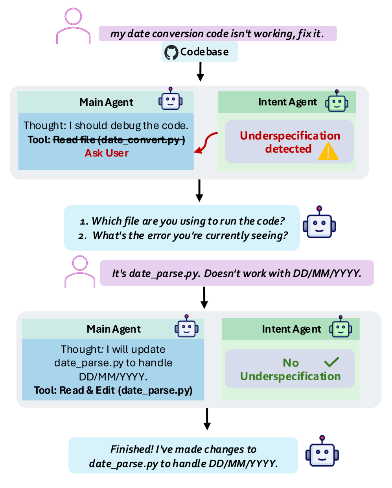
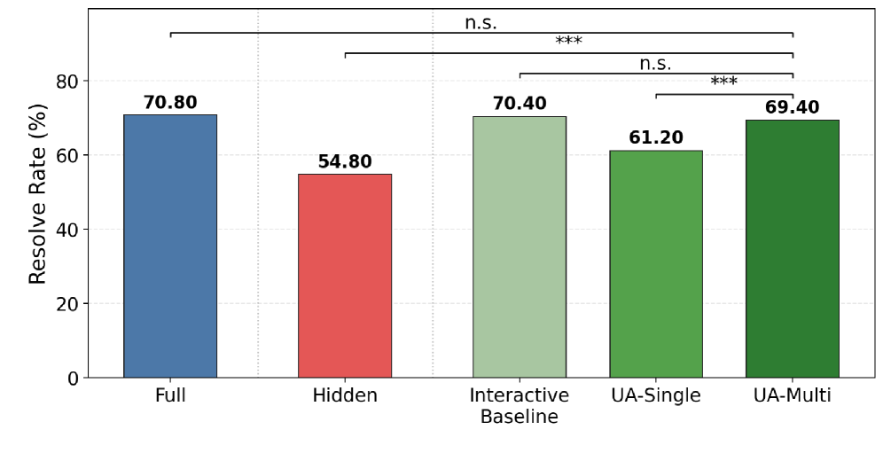

최근 AI 코딩 도구를 쓰다 보면 자주 느끼는 장면이 있습니다.

우리가 AI에게 이렇게 말하죠.

- "이 코드 좀 수정해줘"
- "버그 하나 잡아줘"
- "이거 알아서 정리해줘"

그런데 막상 돌려보면, AI가 **정확히 이해한 것 같으면서도 어딘가 살짝 빗나간 결과**를 내놓는 경우가 꽤 많습니다. 이유는 단순합니다. 사람이 보기에는 당연한 맥락이, AI에게는 빠져 있는 경우가 많기 때문입니다.

이번에 소개할 논문은 바로 그 지점을 찌릅니다.

> **Ask or Assume? Uncertainty-Aware Clarification-Seeking in Coding Agents**

한 줄로 요약하면 이렇습니다.

> **AI가 모를 때 혼자 추측하게 두지 말고, 먼저 질문하게 만들면 코딩 성능이 크게 좋아진다**는 연구입니다.

- arXiv: https://arxiv.org/abs/2603.26233
- HTML: https://arxiv.org/html/2603.26233v1
- GitHub: https://github.com/nedwards99/ask-or-assume

## 왜 이 논문이 중요한가

이 논문이 좋은 이유는 화려한 모델 자랑을 하지 않는다는 점입니다. 대신 실제 실무에서 정말 자주 일어나는 문제를 다룹니다.

### 문제는 늘 비슷합니다
사람은 보통 불완전한 지시를 받으면 되묻습니다.

- 어떤 버그인가요?
- 어느 파일에서 발생하나요?
- 원하는 결과가 정확히 뭔가요?

그런데 많은 AI 에이전트는 그 대신 **추측해서 바로 실행**합니다. 특히 코딩 에이전트는 “자율적으로 끝까지 해내는 것”에 최적화되어 있어서, 질문을 해야 할 순간에도 그냥 밀어붙이는 경우가 많습니다.

이 논문은 그 습관을 바꾸자는 이야기입니다.

## 핵심 아이디어: 추측하지 말고 질문해라

연구팀은 불확실성을 감지하는 역할과 실제 코드를 실행하는 역할을 분리했습니다.

쉽게 말하면 두 명이 팀을 이루는 구조입니다.

1. **Main Agent**
   - 실제 코드 읽기
   - 파일 수정
   - 테스트 실행
   - 작업 수행 담당

2. **Intent Agent**
   - 지금 정보가 충분한지 감시
   - 모호하거나 빠진 맥락이 있는지 판단
   - 필요하면 사용자에게 질문하도록 유도

즉, 한 명은 일하고, 다른 한 명은 **“잠깐, 이거 그냥 하면 위험하지 않나?”**를 계속 체크하는 구조입니다.

## 결과: 질문하는 에이전트가 더 잘했다

논문은 underspecified SWE-bench Verified 환경에서 실험했습니다. 즉, 원래 GitHub 이슈에서 일부 핵심 정보를 숨기고, 에이전트가 그 빈칸을 질문으로 메울 수 있는지를 본 것입니다.

결과는 꽤 인상적입니다.

- **Hidden baseline**: 54.80%
- **UA-Single**: 61.20%
- **UA-Multi**: 69.40%
- **Full instruction**: 70.80%

포인트는 이겁니다.

> **불완전한 지시만 받은 다중 에이전트가, 거의 완전한 지시를 받은 수준까지 따라갔습니다.**

즉, 처음부터 모든 설명을 다 안 줘도, **적절한 질문 능력**만 있으면 상당 부분 복구가 가능하다는 뜻입니다.

## 더 흥미로운 부분: 아무 때나 묻지 않는다

이 논문의 좋은 점은 “질문 많이 하면 좋다”가 아니라는 겁니다.

연구팀은 다중 에이전트가 오히려 **질문을 더 잘 고른다**고 봅니다.

- 쉬운 문제에서는 굳이 질문하지 않음
- 어려운 문제에서는 더 적극적으로 질문함
- 질문도 작업 후반이 아니라 **초반~중반에 적절히 분산**됨

즉, “질문하는 AI”가 아니라 **“언제 질문해야 하는지 아는 AI”**에 가깝습니다.

이건 실제 실무에서 훨씬 중요합니다. 질문을 너무 많이 하면 귀찮고, 너무 적게 하면 오작업이 생기니까요.

## 이 논문이 실무자에게 주는 메시지

이 논문은 단지 코딩 에이전트 이야기에서 끝나지 않습니다. 사실 업무 자동화 전반에 통하는 메시지가 있습니다.

### 1. AI는 여전히 맥락에 약하다
사람이 보기엔 당연한 정보도 AI에게는 빠진 정보일 수 있습니다. 그래서 “알아서 해줘”는 생각보다 위험한 지시입니다.

### 2. 좋은 AI는 정답을 빨리 내는 AI가 아니라, 모를 때 멈출 줄 아는 AI다
이건 꽤 중요한 관점 전환입니다. 많은 사람이 AI에게 기대하는 건 속도와 자율성인데, 실제로는 **질문 능력과 멈춤 능력**이 더 중요할 수 있습니다.

### 3. 프롬프트보다 구조가 중요하다
이 논문은 거대한 새 모델을 만든 게 아닙니다. 오히려 역할 분리를 통해 구조를 바꾼 것입니다. 즉, **에이전트 성능은 모델만이 아니라 설계 구조에서도 크게 갈린다**는 걸 잘 보여줍니다.

## 교육 관점에서도 정말 좋다

코난쌤 관점에서 이 논문이 좋은 이유는 교육적으로 풀어쓰기가 쉽다는 점입니다.

예를 들어 학생들에게 이렇게 설명할 수 있습니다.

- 똑똑한 사람은 모르는 걸 모른다고 말한다
- 좋은 질문은 문제 해결의 시작이다
- AI도 그냥 답만 하는 게 아니라 질문해야 더 잘한다

이건 단지 AI 기술 얘기가 아니라, **문제 해결 역량과 의사소통 역량**의 이야기이기도 합니다.

초등학생에게도 충분히 풀 수 있는 주제예요.

- “AI는 왜 가끔 엉뚱한 답을 할까?”
- “모르면 왜 질문해야 할까?”
- “좋은 협력자는 어떤 사람일까?”

이런 흐름으로 수업이나 콘텐츠를 만들기 좋습니다.

## 다만 주의해서 봐야 할 점도 있다

좋은 논문이지만, 몇 가지는 조심해서 해석해야 합니다.

### 1. 실제 사용자는 논문 속 시뮬레이터처럼 친절하지 않다
논문에서는 GPT-5.1 기반 사용자 시뮬레이터를 사용했습니다. 실제 사람은 더 애매하게 답하거나, 질문에 대답하지 않거나, 잘못된 정보를 줄 수도 있습니다.

### 2. 프론티어 모델 기준 결과다
실험에는 Claude Sonnet 4.5가 사용됐습니다. 즉, 작은 오픈소스 모델에서도 같은 성능이 바로 나온다고 보면 안 됩니다.

### 3. 비용은 늘어난다
다중 에이전트 구조는 당연히 추론 비용이 더 듭니다. 성능 향상과 비용 증가를 함께 봐야 합니다.

그래도 메시지 자체는 분명합니다.

> **AI를 더 잘 쓰려면, 더 많은 답을 만들게 하는 것보다 더 좋은 질문을 하게 만들어야 한다.**

## 마무리

이 논문은 굉장히 실용적인 통찰을 줍니다.

우리는 보통 AI에게 “더 똑똑해져라”를 기대하지만, 실제로는 이런 질문이 더 중요할 수 있습니다.

- 언제 멈춰야 하는가?
- 언제 물어봐야 하는가?
- 정보가 부족한 상태를 스스로 인식할 수 있는가?

결국 좋은 협력자는 무조건 다 아는 사람이 아니라, **모를 때 제대로 질문하는 사람**입니다. 그리고 이제 AI도 그 방향으로 조금씩 가고 있다는 게 이 논문의 가장 중요한 포인트라고 봅니다.

## FAQ

### Q1. 이 논문의 핵심은 무엇인가요?
불완전한 지시를 받은 코딩 에이전트가 혼자 추측하기보다, 필요한 순간에 질문하도록 만들면 성능이 크게 좋아진다는 점입니다.

### Q2. 얼마나 좋아졌나요?
논문 기준으로 단일 에이전트 설정은 61.20%, 다중 에이전트 설정은 69.40%의 resolve rate를 기록했습니다. 완전한 지시를 받은 설정은 70.80%였습니다.

### Q3. 왜 다중 에이전트가 더 좋았나요?
코드 실행 역할과 불확실성 감지 역할을 분리했기 때문입니다. 한 에이전트가 다 하려고 할 때보다 질문 타이밍과 질문 품질이 더 좋아졌습니다.

### Q4. 이걸 일반 업무 자동화에도 적용할 수 있나요?
네. 코딩뿐 아니라 문서 작업, 일정 정리, 정보 검색처럼 맥락이 빠지기 쉬운 업무에도 “모르면 먼저 질문하기” 구조는 충분히 응용 가능합니다.

### Q5. 바로 실무에 써도 되나요?
아이디어는 바로 적용 가능하지만, 논문 결과는 특정 벤치마크와 프론티어 모델 기준입니다. 실제 업무에서는 사용자 응답 품질, 비용, 도메인 특성을 함께 고려해야 합니다.
