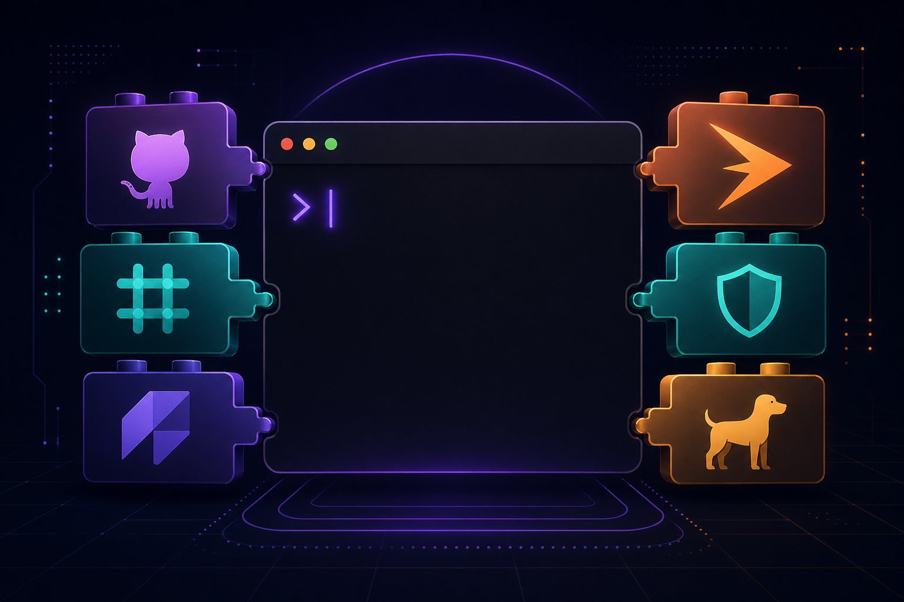

1. ComposioHQ가 awesome-codex-skills라는 큐레이션 레포를 정리해서 올렸음. 누적 **1,500스타**, 132 forks 찍힘. 운영 주체는 에이전트랑 외부 앱 1,000개 이상 연결하는 Composio 플랫폼사임.

2. Codex Skill이 뭐냐면 — OpenAI Codex CLI에 붙이는 모듈식 명령 번들임. 폴더 하나에 `SKILL.md` 파일 하나 두고 메타데이터(이름, 설명) + 실행 단계 적어두면 됨. Codex가 자연어 요청 보면 SKILL.md의 메타만 먼저 훑음. 매칭되는 게 있으면 그때서야 본문 로드함.

3. 구조 자체가 컨텍스트 절약형임. 매번 같은 프롬프트 치던 사람들 입장에선 한 번 묶어두면 재사용성이 확 올라감.

4. Claude Code의 Skill이랑 거의 같은 컨셉임. OpenAI도 결국 따라옴. Skill 시스템이 Claude Code → Codex로 퍼지는 중인데, 결국 "프롬프트 라이브러리의 표준화"가 진행되는 중임.

5. 카테고리는 5개로 나뉘어 있음. Development & Code Tools, Productivity & Collaboration, Communication & Writing, Data & Analysis, Meta & Utilities.

6. 개발자용으로 쓸만한 거 몇 개 있음. `gh-fix-ci`는 GitHub Actions 깨진 거 보고 원인 요약 + 수정안 제시함. `sentry-triage`는 스택 프레임을 로컬 소스랑 매핑해서 에러 진단함. `pr-review-ci-fix`는 PR 리뷰 + CI 자동 수정. 그 외에 `codebase-migrate`, `webapp-testing` 같은 것도 들어감.

7. 협업용도 있음. `meeting-notes-and-actions`는 회의록을 요약 + 액션아이템(담당자 태그)으로 변환함. `notion-spec-to-implementation`는 Notion 스펙을 구현 계획 + 진행률 트래킹으로 풀어줌. `support-ticket-triage`는 고객 이슈 분류 + 우선순위 + 답변 초안 자동화임.

8. 글쓰기/콘텐츠도 있음. `email-draft-polish`는 이메일 초안/리라이팅. `content-research-writer`는 출처 인용 포함 콘텐츠 작성. `changelog-generator`는 체인지로그 자동 생성.

9. 설치는 두 가지 방법임.

10. 첫 번째는 install-skill 스크립트 쓰는 방법.

```bash
git clone https://github.com/ComposioHQ/awesome-codex-skills.git
python skill-installer/scripts/install-skill-from-github.py \
  --repo ComposioHQ/awesome-codex-skills \
  --path meeting-notes-and-actions
```

11. 두 번째는 그냥 폴더를 `~/.codex/skills`에 복사하는 방법. 둘 다 설치 후엔 Codex 재시작 필요함.

12. 실제 사용은 자연어로 작업 설명만 하면 됨. Codex가 메타데이터 매칭해서 알아서 활성화함. Slack 메시지 정리해달라고 하면 Slack 관련 Skill이 트리거됨.

13. 근데 짚어야 할 지점 세 개 있음. **첫째, ComposioHQ는 그냥 봉사하는 게 아님.** 에이전트랑 Slack/GitHub/Notion 같은 데 진짜 액션 보내는 인프라를 파는 회사임. awesome-codex-skills의 절반은 Composio CLI 연결 전제로 동작함.

14. **둘째, Composio 안 써도 독립적으로 도는 스킬도 있긴 함.** 근데 Slack/Linear/Datadog/Sentry처럼 외부 SaaS에 액션 보내는 종류는 결국 Composio 같은 통합 레이어가 필요함. 그냥 큐레이션 레포 같지만 사실은 **Composio 플랫폼 유입 깔때기**임.

15. **셋째, 트리거 정확도가 핵심임.** Skill이 너무 많아지면 메타데이터 충돌하거나, 엉뚱한 게 트리거될 위험 있음. `SKILL.md`의 description을 얼마나 명확히 쓰느냐가 곧 사용성임. 큐레이션 레포가 이 부분에서 표준안 노릇을 해주는 셈.

16. 아직 22 commits에 PR 17개 열려있음. 시작 단계임. Claude Code의 superpowers처럼 거대한 생태계 되려면 시간 좀 더 걸릴 것 같음.

17. 그래도 Codex CLI 쓰는 사람이면 일단 `gh-fix-ci`, `sentry-triage` 정도는 깔아둘 만함. CI 깨졌을 때 한 줄로 해결되는 경험이면 학습비용 회수가 빠름.

18. 한국 개발자 입장에서 흥미로운 포인트 하나. Skill 표준이 잡히면 **사내 표준 워크플로우를 Skill로 묶어서 팀 전원에 배포**하는 게 가능해짐. PR 리뷰 체크리스트, 배포 전 검증, 사내 코딩 가이드라인 같은 거 전부 SKILL.md 하나에 박아두고 공유하면 됨.

19. 결국 이 레포가 던지는 메시지는 단순함. **"좋은 프롬프트는 코드처럼 버전관리되어야 한다"**. 그동안 노션·Confluence에 박혀있던 사내 프롬프트 자산이 git 리포로 옮겨갈 시점이 왔다는 신호임.

20. 레포 링크: https://github.com/ComposioHQ/awesome-codex-skills
