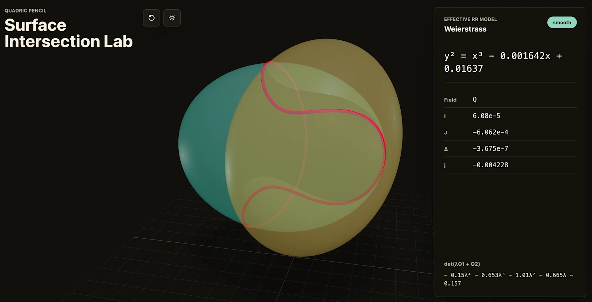

2026-04-23 저녁에 OpenAI가 GPT-5.5를 풀었음. 블 크가 40대 관점에서 이걸 왜 봐야 하는지 정리함. 벤치마크 숫자는 개발자들 놀이고, 우리 입장에서 중요한 건 **이걸로 뭘 줄이고 뭘 벌 수 있냐**임.

1. 먼저 팩트 정리. 한국 시간으로 2026-04-23 목요일 늦게 공개됐고, ChatGPT Plus(월 29,000원 수준), Pro(월 29만원 수준) 구독자는 이미 쓸 수 있음. 기업용 Business/Enterprise도 바로 풀림. API는 며칠 내로 열린다고 함. **핵심은 GPT-5.4 때와 똑같은 속도로 한 단계 더 똑똑해졌다는 것**임.

2. GPT-5.4 나온 지 6주만임. 포춘이 "rapid-fire"라고 표현했음. 6주 사이클로 모델이 갈아엎히는 중이라서, 작년에 "ChatGPT로 이건 안 되네"라고 포기했던 업무가 있으면 **올해는 다시 시도해볼 가치가 있음**. 그 사이에 모델이 3번 바뀜.

3. 이번 릴리즈에서 40대 관점으로 제일 눈에 띄는 사례. OpenAI 재무팀이 **K-1 세무 신고서 24,771건(71,637페이지)을 Codex로 리뷰**해서 작년 대비 2주 단축했음. 개인정보는 워크플로에서 자동 배제하면서. 이거 한국어로 바꾸면 종합소득세 신고철에 증빙 수천 장 정리하는 일에 직접 대입됨. 자영업자/프리랜서라면 세무사 비용 일부를 여기서 뺄 수 있는 구간이 생긴 거.

4. 두 번째 사례가 더 우리 현실에 가까움. OpenAI 영업팀 직원 한 명이 **주간 비즈니스 리포트 작성을 자동화해서 주당 5~10시간을 벎**. 시급 3만원 기준으로 월 60~120만원어치임. 리포트가 반복 구조면 이제 ChatGPT에 한 번 양식 주고 매주 데이터만 넣으면 됨.

5. 세 번째 사례. 홍보팀이 6개월치 외부 강연 요청 데이터를 돌려서 스코어링+리스크 프레임워크를 만들고, **낮은 리스크 요청은 자동으로 처리, 높은 리스크만 사람이 보는 Slack 에이전트**를 띄움. 이거 중소기업 대표나 자영업자가 문의 메일/카톡 처리하는 그림 그대로임. 문의 100건 중 80건은 템플릿 답변인데, 그 80건을 자동 분류해주는 도구가 이제 실사용 수준으로 올라왔다는 뜻임.

6. 근데 진짜로 "똑똑해졌다"고 체감하는 사람들 멘트가 꽤 셈. Every라는 미디어 회사 대표가 "**serious conceptual clarity(심각할 정도의 개념적 명확성)**를 가진 첫 코딩 모델"이라고 함. 구체적으로, 자기네 앱이 런칭 후 망가졌는데 며칠 디버깅해도 답이 안 나와서 시니어 엔지니어가 큰 부분을 다시 짰음. 그 과정을 GPT-5.5한테 초기 상태만 주고 돌려봤더니 같은 결론으로 감.

7. 엔비디아 엔지니어가 한 말이 제일 과장 섞였는데 인상적임. "**GPT-5.5 access를 잃으면 팔다리 절단당한 기분**"이라고 함. 마우스 없이 업무하는 느낌이라는 뜻. 과장이 있겠지만, 한 번 붙이면 다시 안 붙은 상태로 못 돌아간다는 사람이 이미 생겼다는 얘기임.

8. MagicPath라는 곳 대표는 **수백 개 커밋이 쌓인 브랜치를 main에 머지**하는 걸 20분 안에 한 번에 끝냈다고 함. 이거 풀어서 말하면, 엑셀로 치면 각자 버전 10개를 받아서 합쳐야 하는데 필드명도 다 다르고 수식이 깨지는 상황을, GPT-5.5가 통으로 정리해줬다는 얘기. 이런 통합 작업이 40대가 제일 많이 갖고 있는 그레이 박스임.

9. ChatGPT 안에 있는 **GPT-5.5 Thinking**은 Plus 이상 전부 열림. 복잡한 문서 정리, 법률 검토, 교육 자료 만들기에 쓰라고 권장됨. 벤치로는 OSWorld(실제 컴퓨터 조작) 78.7%, 44개 직무 지식업무 테스트인 GDPval 84.9%. 작년에 "얘가 내 업무 흐름을 못 따라온다"고 느꼈으면 지금이 다시 붙여볼 타이밍임.

10. **GPT-5.5 Pro**는 월 29만원짜리 Pro 구독자 전용. 비용이 세지만 법률/회계/재무 모델링 같은 실수하면 치명적인 분야에서는 정확도 차이가 꽤 남. 투자 은행 모델링 내부 벤치에서 88.5%, 재무 에이전트 60%, 오피스 업무 54%. Plus가 충분한 사람이 대부분이지만, 세무사/변호사/CFO 쪽은 Pro가 수지 맞을 수 있음.

11. 과학자들도 실사용을 끝냄. 잭슨 연구소 면역학 교수가 **62개 샘플에 유전자 28,000개 데이터셋을 GPT-5.5 Pro로 분석**해서, 연구팀이 몇 달 걸릴 리포트를 하루에 받았음. 원래 팀의 몇 달짜리 일임.

12. 폴란드 수학 교수는 **11분 만에 대수기하학 웹앱**을 하나 만들었음. 프롬프트 한 번. 두 이차곡면 교차곡선을 빨간색으로 렌더링하고 수학 방정식까지 계산하는 앱. 40대 관점에서 이게 의미하는 건 **"나도 아이디어만 있으면 앱을 만들 수 있는 시대가 이번 달에 한 번 더 문턱이 내려갔다"** 임. 외주 맡기던 일들을 직접 해볼 수 있는 영역이 계속 넓어지는 중.

13. 근데 짚어야 할 문제도 있음. OpenAI가 GPT-5.5의 사이버보안 능력을 **High**로 분류했음. 방어용으로도 공격용으로도 쓸 수 있을 만큼 세졌다는 얘기. 그래서 기본 ChatGPT는 보안 관련 질문에 거절이 더 많아질 예정임. 이건 `chatgpt.com/cyber`에서 인증받은 사용자만 풀 수 있는데 일반 사용자 입장에서는 "똑똑해졌는데 까탈도 늘었다"로 체감될 가능성 높음.

14. 또 하나 중요한 거. **가격은 GPT-5.4보다 올랐는데 토큰은 덜 씀**. API 기준 입력 100만 토큰당 $5, 출력 $30. GPT-5.4는 입력 $4였음. 근데 같은 과제를 토큰 덜 써서 푸니까 실사용 비용은 비슷하거나 낮아짐. Plus 구독자 입장에서는 어차피 정액이라 영향 없음.

15. ChatGPT만 써도 이번 업데이트는 충분히 체감됨. **근데 여러 AI(ChatGPT, Claude, Gemini)를 동시에 굴리면 비용 대비 결과가 완전히 달라짐**. 기획은 Claude Opus 4.7에 맡기고, 실행은 싸고 빠른 GPT-5.5에 맡기고, 검토는 다시 Claude로 교차 체크하는 식. 단일 모델로만 쓰는 건 2026년에 이미 한 세대 뒤처진 접근임.

16. 이런 멀티 모델 운영을 로컬에서 정리한 책이 있음. 블 크가 작년에 낸 [『이게 되네? 오픈클로 미친 활용법 50제』(교보문고)](https://www.yes24.com/product/goods/185166276)임. ChatGPT/Claude/Gemini를 **오픈클로 하네스 한 곳에서 plan → work → review**로 돌리는 실전 50가지가 들어있음. 40대가 바로 써먹을 수 있는 반복 업무 자동화 레시피 위주라서, 이번 GPT-5.5 들어간 지금 읽으면 예제들을 오늘 자 가격에 다시 꽂을 수 있음.

17. 40대 실천 체크리스트 다섯 개. 첫째, **반복하는 주간 업무가 있으면 이번 주말에 한 번 ChatGPT에 넣어봄** — Plus면 충분함. 둘째, **세무/회계 증빙 분류**같이 "양이 많아서 못 맡겼던 일"을 시범 돌려봄. 셋째, **작년에 ChatGPT한테 맡겼다가 포기한 일을 다시 꺼내봄** — 6주 사이클로 세 번 바뀌었음. 넷째, **Pro 구독은 시급으로 환산**해봄 — 월 29만원이 부담이면 Plus로 시작. 다섯째, **멀티 모델 운영이 궁금하면 오픈클로 책**을 참고해서 ChatGPT+Claude+Gemini를 한 흐름으로 묶어봄.

18. 결론은 단순함. **2026년 4월 기준, 40대가 주 5~10시간을 AI로 줄이는 건 이제 "가능한 일"이 아니라 "안 하면 뒤쳐지는 일"임**. 시급 3만원으로 치면 연 1,500만원 가까이 차이남. GPT-5.5는 그 문턱을 한 번 더 낮춘 이번 달 업데이트고, 문턱이 낮아졌으니 다시 시도해볼 타이밍이라는 것.

---

원문: [Introducing GPT-5.5 (OpenAI)](https://openai.com/index/introducing-gpt-5-5/)
