- **공식 발표 1**: [Introducing ChatGPT Images 2.0](https://openai.com/index/introducing-chatgpt-images-2-0/)
- **공식 발표 2**: [The new ChatGPT Images is here](https://openai.com/index/new-chatgpt-images-is-here/)
- **공식 가이드**: [Creating images with ChatGPT](https://openai.com/academy/image-generation/)
- **프롬프트 가이드**: [OpenAI Cookbook Prompting Guide](https://developers.openai.com/cookbook/examples/multimodal/image-gen-1.5-prompting_guide)
- **시스템 카드**: [ChatGPT Images 2.0 System Card](https://deploymentsafety.openai.com/chatgpt-images-2-0)
- **이전 관련 글**: [GPT 차세대 이미지 모델 duct-tape 루머 정리](./gpt-duct-tape-image-model)

며칠 전까지만 해도 사람들은 OpenAI의 차세대 이미지 모델을 **duct-tape**라는 코드네임으로 추정하고 있었습니다. 근데 이제는 루머 단계가 끝났습니다. OpenAI가 **ChatGPT Images 2.0**을 공식 공개했습니다.

핵심은 단순하지 않습니다.

예전보다 그림이 더 예뻐졌다, 이 정도가 아님.
**이제는 “잘 그리는 모델”보다 “의도대로 수정되는 이미지 도구”에 더 가까워졌음**.

특히 이런 사람은 바로 체감할 가능성이 큽니다.

- 블로그 썸네일을 빠르게 뽑아야 하는 사람
- 강의자료, 인포그래픽, 포스터를 자주 만드는 사람
- 쇼핑몰 상세컷, 배너, 제품컷 변형이 필요한 사람
- 기존 이미지를 조금만 손보고 싶었던 사람
- 한국어 텍스트나 작은 글씨가 들어간 이미지를 자주 만드는 사람

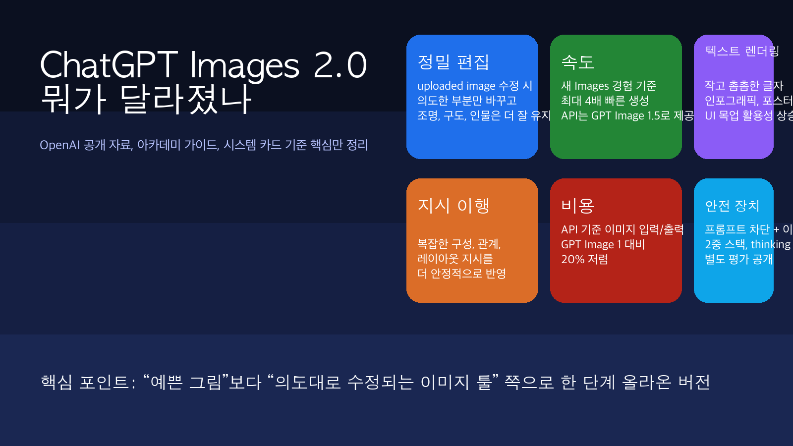

## 1. 이번 업데이트를 한 줄로 요약하면, “생성”보다 “수정”이 세졌음

OpenAI가 이번에 밀고 있는 포인트는 아주 분명합니다.

- **정밀 편집**: 바꾸고 싶은 부분만 바꾸고, 나머지는 더 잘 유지함
- **속도**: 새 Images 경험 기준 최대 4배 빠름
- **지시 이행**: 복잡한 구성과 관계를 더 잘 따라감
- **텍스트 렌더링**: 더 작고 더 촘촘한 글씨 처리 개선
- **실무 적합성**: 로고, 브랜드 요소, 제품컷 같은 “망가지면 안 되는 것”을 더 잘 보존함

이게 왜 중요하냐면, 실제 업무는 처음부터 새 그림 한 장 뽑는 일보다 이런 일이 더 많기 때문입니다.

- 배경만 바꾸기
- 같은 제품으로 다른 배치 만들기
- 포스터 문구만 교체하기
- 기존 사진에 소품만 추가하기
- 한국어 제목이 들어간 블로그 썸네일 만들기

즉, **실무는 생성보다 수정의 비중이 훨씬 큼**. 이번 업데이트는 그 지점을 정면으로 건드렸습니다.

## 2. OpenAI가 공개 자료에서 강조한 변화는 이 6개였음

| 항목 | 이번에 좋아진 점 | 실무 체감 |
|------|------------------|-----------|
| 정밀 편집 | 바꾸라는 것만 바꾸고 구도, 조명, 인물 특징은 더 잘 유지 | 기존 이미지 재활용이 쉬워짐 |
| 속도 | 새 Images 경험 기준 최대 4배 빠름 | 반복 시안 작업 부담 감소 |
| 텍스트 렌더링 | 더 작고 밀도 높은 텍스트 처리 강화 | 포스터, 인포그래픽, UI 목업에 유리 |
| instruction following | 복잡한 관계와 레이아웃 지시를 더 잘 따름 | “왼쪽엔 A, 오른쪽엔 B” 같은 요구 반영이 쉬워짐 |
| API 비용 | GPT Image 1 대비 입력/출력 20% 저렴 | 대량 생성이나 반복 수정에 부담 감소 |
| 안전 장치 | 프롬프트 차단 + 이미지 차단 + 출력 차단 | 현실감이 높아진 만큼 통제도 강화 |

특히 제품 페이지에서는 새 Images 기능을 ChatGPT 안에 따로 넣어서, 프리셋 스타일과 빠른 재생성을 더 쉽게 만들었다고 설명합니다.

그 말은 곧 이겁니다.

**이제 이미지 생성이 “한 번 시도하고 포기하는 기능”이 아니라, 계속 밀고 당기면서 결과를 다듬는 인터페이스로 옮겨가고 있음.**

## 3. 이번 모델이 특히 세 보이는 영역은 4개였음

### 3-1. 블로그 썸네일, 포스터, 강의자료

텍스트 렌더링이 좋아졌다는 건 단순한 품질 자랑이 아닙니다.

지금까지 많은 이미지 모델은 이런 데서 무너졌습니다.

- 제목 글자가 깨짐
- 글자가 외계어처럼 나옴
- 레이아웃이 흐트러짐
- 한글 넣으면 갑자기 분위기가 깨짐

이번 공개 자료와 가이드를 같이 보면, OpenAI는 이 부분을 꽤 자신 있게 밀고 있습니다. 그래서 **썸네일, 포스터, 카드뉴스, 교육용 인포그래픽**처럼 텍스트가 핵심인 작업에서 체감 차이가 클 가능성이 높습니다.

### 3-2. 기존 이미지 편집

이번 발표에서 제일 중요한 문장은 사실 여기였습니다.

> uploaded image를 수정할 때, 의도한 부분만 더 정확히 바꾸고 나머지는 유지한다.

이게 되면 가능한 작업이 확 늘어납니다.

- 제품 사진 배경만 교체
- 인물 의상만 변경
- 포스터 문구만 수정
- 사진에 소품만 추가
- 동일 캐릭터를 유지한 채 다른 장면 생성

즉, **처음부터 새로 만들지 않아도 되는 영역**이 커졌습니다.

### 3-3. 브랜드/커머스 작업

OpenAI는 아예 제품 소개에서 **브랜드 로고와 핵심 시각 요소 보존**, **제품 카탈로그 생성**, **마케팅 그래픽 제작**을 직접 언급했습니다.

이건 굉장히 실무적인 신호입니다.

예전에는 “대충 예쁜 시안”까진 됐는데, 브랜드 작업은 망가지는 경우가 많았음. 이번에는 그걸 줄이겠다는 방향이 분명합니다.

### 3-4. 멀티턴 수정 워크플로우

API 가이드를 보면 이미지 생성 전용 API뿐 아니라 **Responses API 기반 멀티턴 이미지 편집**도 지원합니다.

이건 의미가 큽니다.

- 1차 시안 생성
- 2차에서 조명만 수정
- 3차에서 배경만 단순화
- 4차에서 글자만 바꾸기

이런 흐름이 더 자연스러워진다는 뜻입니다.

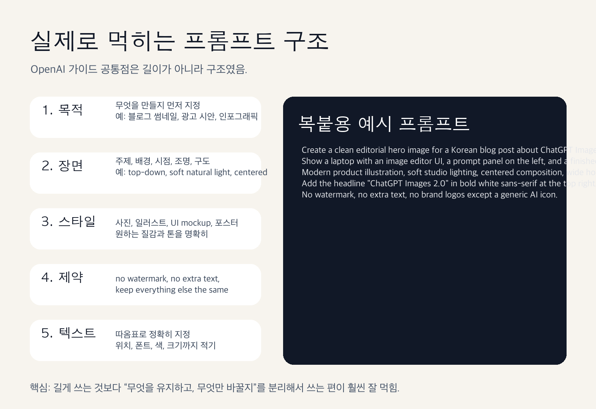

### 3-5. OpenAI 공식 페이지에서 바로 뽑은 예시를 보면 감이 더 빨리 옴

코난쌤 말대로, 일단은 공식 페이지에 들어간 예시 이미지를 먼저 넣는 편이 설득력이 큽니다.

이번에 OpenAI 페이지에서 직접 확인한 장면 중, 블로그 독자 입장에서 제일 체감 큰 것만 골랐습니다.

#### 편집 체인, 여기서 진짜 차이가 보임

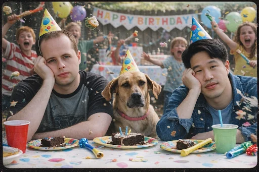
*원본 인물과 강아지 구도는 살리고, 배경만 더 복잡하게 키운 편집 예시. “바꾸라는 것만 바꾸는가”를 보여주는 장면임.*

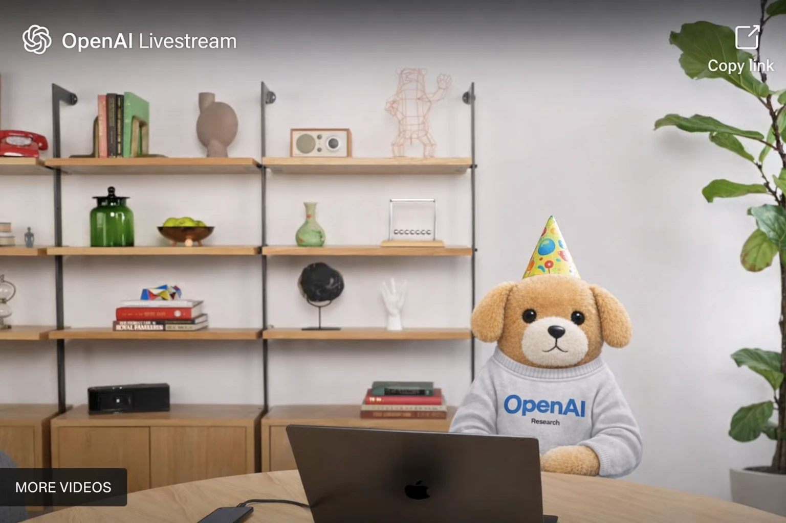
*같은 편집 흐름을 더 밀어붙인 결과. 사람은 제거하고 강아지만 남긴 채 방송 장면으로 재구성했음. 멀티턴 편집 감각이 어떤지 한 번에 보임.*

#### instruction following은 신규/이전 비교가 제일 직관적임

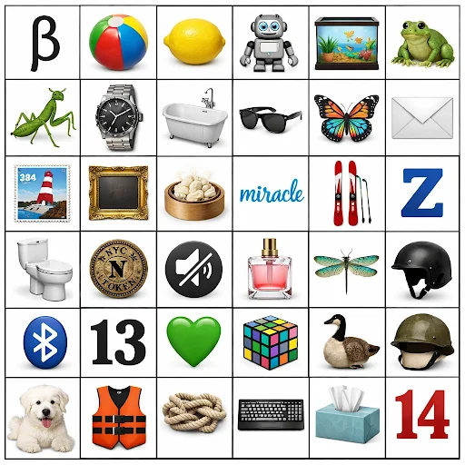
*신규 모델 결과. 6x6 그리드, 아이콘 종류, 텍스트 요소까지 비교적 또렷하게 맞춤.*

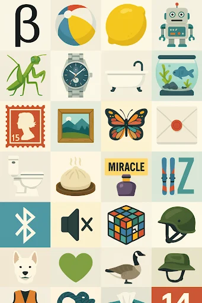
*이전 결과. 같은 프롬프트인데 배열 정확도와 개체 구분에서 차이가 남. OpenAI가 왜 instruction following을 전면에 내세우는지 이해되는 장면임.*

#### 텍스트 렌더링과 자연스러움도 공식 예시가 깔끔함

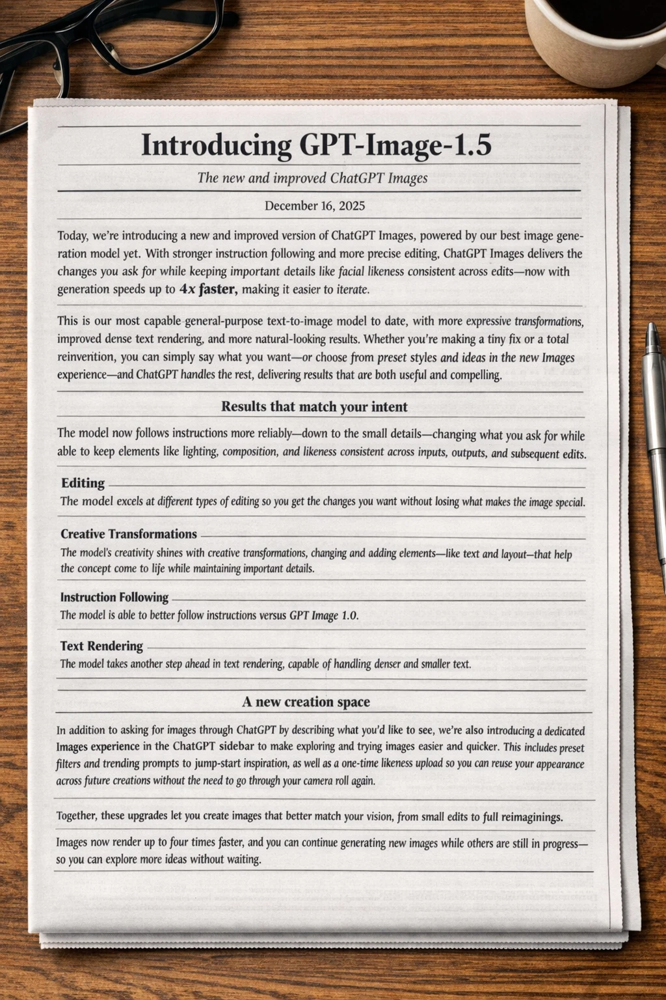
*작고 촘촘한 텍스트를 신문 레이아웃으로 넣은 장면. 썸네일보다 카드뉴스, 포스터, 인포그래픽 쪽에서 더 체감될 포인트임.*

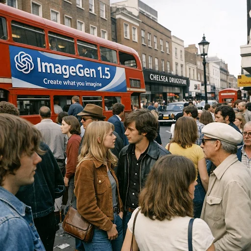
*신규 결과. 작은 얼굴이 많이 들어가고 거리 장면 정보량도 높은데, 전체 톤이 비교적 자연스럽게 유지됨.*

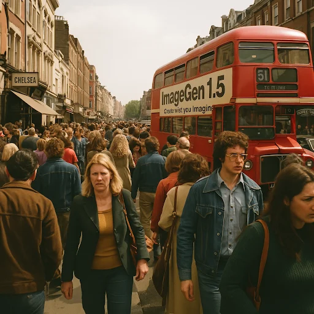
*이전 결과. 비교해 보면 자연스러움과 정보 밀도 처리에서 차이가 남. OpenAI가 “즉시 활용 가능한 출력”을 강조한 이유가 여기 있음.*

공식 예시만 봐도 포인트는 뚜렷합니다.

- **편집은 더 세밀해졌고**
- **지시 이행은 더 구조적으로 맞아가고**
- **텍스트와 고밀도 장면 처리도 한 단계 올라왔음**

## 4. 그렇다고 만능은 아님. 여전히 조심해서 봐야 할 부분도 있음

이번 발표를 그대로 믿고 “이제 디자이너 끝났다” 식으로 읽으면 과합니다.

아직은 이런 한계가 남습니다.

### 4-1. 텍스트 렌더링이 좋아져도 완벽하진 않음

공식 가이드도 텍스트 작업에서는 아주 구체적으로 쓰라고 안내합니다.

- 텍스트는 따옴표로 넣기
- 폰트 스타일, 크기, 위치까지 적기
- 불필요한 추가 텍스트 금지
- 드문 단어는 철자를 하나씩 지정

이 말은 반대로, **좋아졌어도 여전히 엄격한 지시가 필요하다는 뜻**입니다.

### 4-2. 복잡한 고밀도 디자인은 마지막 손질이 필요할 수 있음

OpenAI 아카데미 가이드도 무거운 인포그래픽이나 빽빽한 디자인은, 필요하면 디자인 툴에서 마무리하라고 안내합니다.

즉 AI가 초안을 빠르게 만들어주는 건 맞는데, **완전한 최종본까지 100% 자동으로 끝나는 건 아직 아님**.

### 4-3. 안전 장치는 강해졌고, 그만큼 막히는 요청도 분명히 있음

시스템 카드를 보면 이번에는 안전 스택도 꽤 자세히 공개했습니다.

- 프롬프트 단계 차단
- 입력 이미지 차단
- 출력 이미지 차단
- thinking 모드 포함 별도 평가

중요한 건 숫자 자체보다 맥락입니다. 시스템 카드의 99.1%, 99.2% 같은 수치는 **일반 사용자 트래픽 평균이 아니라, 일부러 위험한 이미지를 만들려고 설계한 adversarial 평가 기준**입니다. 그러니까 이 수치를 “실사용에서 99% 안전하다” 식으로 단순 해석하면 안 됩니다.

다만 분명한 건 있습니다.

**OpenAI도 이번 모델의 현실감이 올라간 만큼, 위험도 같이 올라간다고 보고 안전 장치를 더 두껍게 쌓았음.**

## 5. 프롬프트는 길이보다 구조가 중요했음

OpenAI 가이드들을 묶어서 보면 공통 메시지가 명확합니다.

“프롬프트를 시처럼 잘 쓰는 것”보다 **구조를 분리해서 쓰는 편이 더 잘 먹힘**.

실무에서는 아래 순서가 특히 안정적입니다.

1. **목적**: 이 이미지를 어디에 쓸 건지
2. **주제/장면**: 누가, 어디서, 무엇을 하는지
3. **스타일**: 사진, 일러스트, UI 목업, 포스터, 인포그래픽
4. **구도/조명**: centered, top-down, soft light, wide layout
5. **텍스트/레이아웃 제약**: 정확한 문구, 위치, 색, 폰트
6. **보존 조건**: 바뀌면 안 되는 요소
7. **금지 조건**: no watermark, no extra text, no logo 등

OpenAI가 반복해서 강조하는 표현도 비슷합니다.

- **Change only X**
- **Keep everything else exactly the same**
- **No extra text**
- **Preserve layout / identity / geometry / brand elements**

이 조합이 결국 핵심임.

## 6. 바로 복붙해서 써볼 프롬프트 6개

아래 프롬프트는 OpenAI 가이드 방향에 맞춰, 실제 블로그 운영이나 강의자료 제작에 바로 쓸 수 있게 다듬은 버전입니다.

### 6-1. 블로그 썸네일용

```text
Create a clean horizontal hero image for a Korean blog post about ChatGPT Images 2.0.
Show a laptop with an image editor UI, a prompt panel on the left, and a finished marketing poster on the right.
Modern product illustration, soft studio lighting, centered composition, wide 16:9 layout.
Add the headline "ChatGPT Images 2.0" in bold white sans-serif at the top right.
No watermark, no extra text, no brand logos except a generic AI icon.
```

### 6-2. 기존 썸네일 수정용

```text
Edit the uploaded thumbnail.
Change only the main title text to "ChatGPT Images 2.0 실전 가이드".
Keep everything else exactly the same: background color, composition, icon placement, subject size, shadows, and overall style.
Use bold Korean sans-serif text, centered, high contrast, sharp text rendering.
Do not add extra text, logos, or new objects.
```

### 6-3. 교육용 인포그래픽용

```text
Create a detailed infographic for elementary teachers explaining how AI image prompting works.
Include 5 labeled blocks: purpose, subject, style, composition, constraints.
Use a clean Korean-friendly educational poster layout, wide horizontal format, soft neutral colors, clear icons, and sharp text rendering.
Add short Korean labels only.
No clutter, no watermark, no extra decorative elements.
```

### 6-4. 제품컷 배경 변경용

```text
Edit the uploaded product image.
Replace only the background with a clean soft-gray studio background.
Keep the product shape, label text, color, proportions, camera angle, and lighting direction exactly the same.
Add a subtle natural shadow below the product.
Do not retouch the product design. Do not add props, text, or logos.
```

### 6-5. 카드뉴스/포스터 문구 교체용

```text
Translate the text in the uploaded poster into Korean.
Preserve the exact layout, hierarchy, spacing, color palette, illustration style, and overall composition.
Replace only the text.
Use clean bold Korean sans-serif typography with sharp rendering.
Do not add new text, icons, or background elements.
```

### 6-6. 강의자료 삽화용

```text
Create a polished editorial illustration for a lecture slide about AI tools for teachers.
Show a teacher at a desk reviewing lesson materials, with a laptop, sticky notes, a tablet, and a simple AI assistant panel on screen.
Wide horizontal composition, minimal classroom mood, soft natural lighting, calm and practical tone.
Use a modern digital illustration style that feels realistic but approachable.
No watermark, no brand logos, no sci-fi effects, no extra text.
```

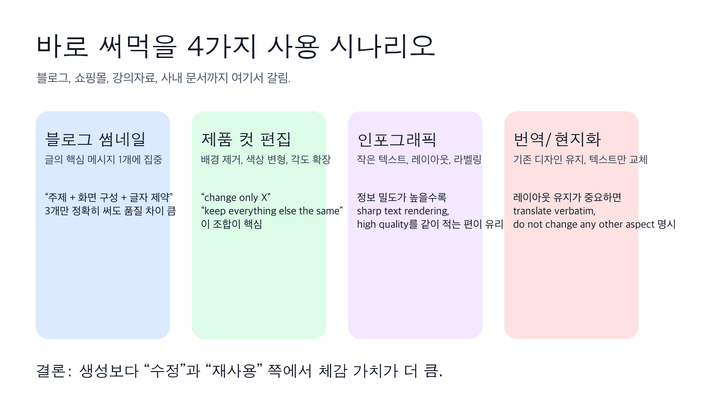

### 6-7. 코난쌤이 실제로 돌려본 생성 결과, 순서대로 보면 이런 흐름이었음

이번에는 코난쌤이 직접 생성한 결과 이미지를 **생성 순서 그대로** 붙였습니다. 이 섹션이 좋은 이유는, 모델 소개용 데모가 아니라 **실제로 프롬프트를 밀고 당기면서 어떤 그림이 나오는지**를 한 번에 보여주기 때문입니다.

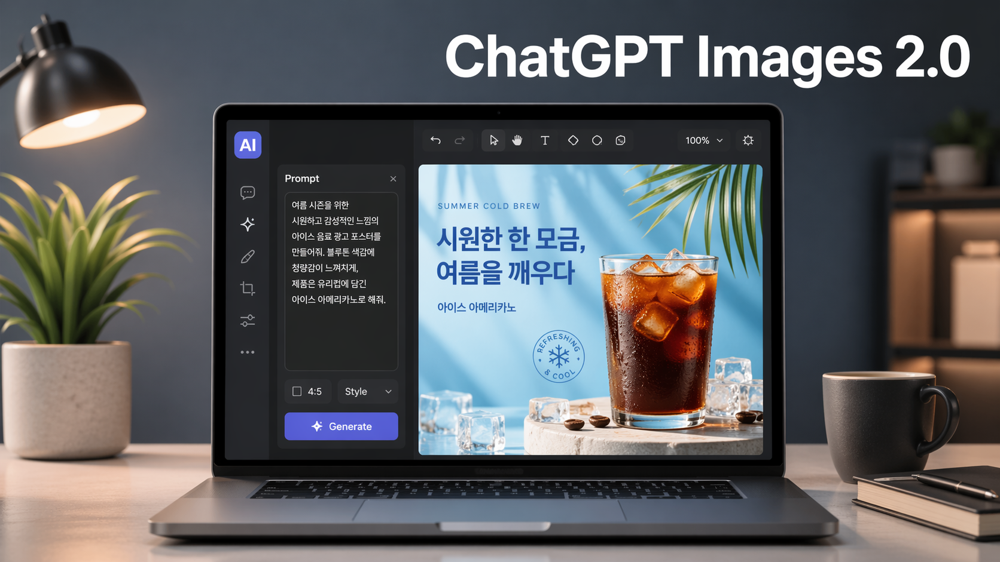
*생성 1. 노트북 화면으로 ChatGPT Images 2.0의 이미지 생성 인터페이스를 보여주는 장면입니다.*

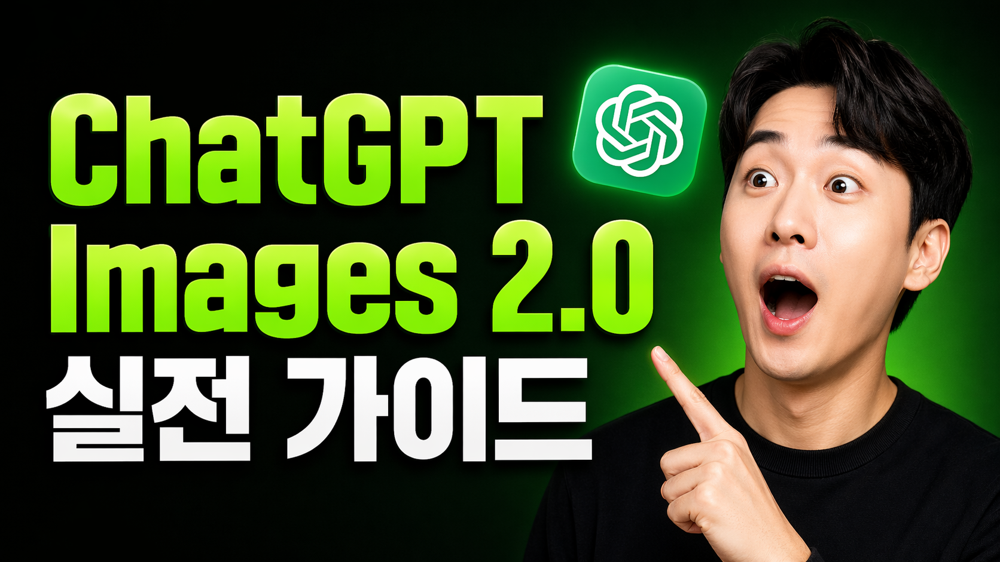
*생성 2. ChatGPT Images 2.0 출시를 강조한 유튜브 썸네일 스타일의 홍보 이미지입니다.*

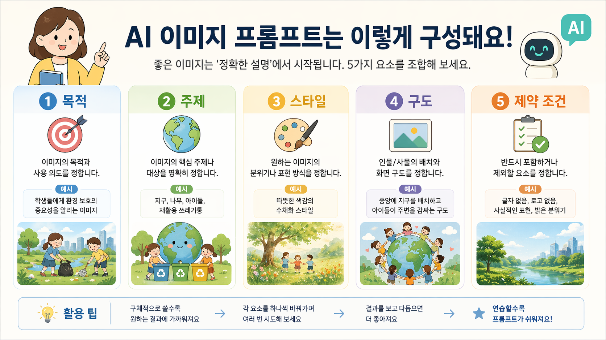
*생성 3. AI 이미지 프롬프트의 5가지 핵심 요소를 한눈에 정리한 인포그래픽입니다.*

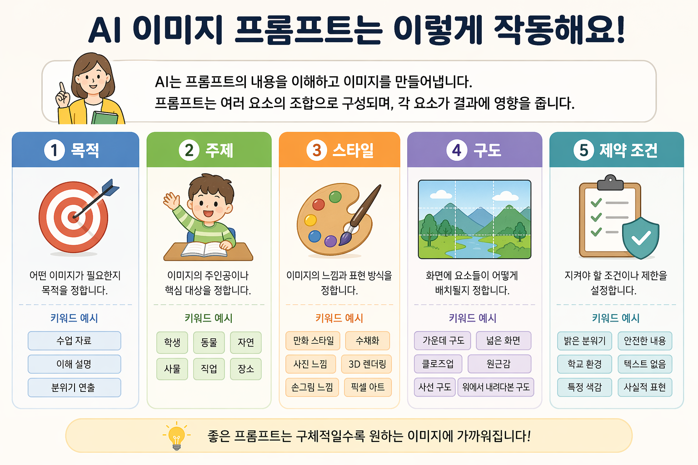
*생성 4. AI 이미지 프롬프트가 작동하는 방식을 쉽고 깔끔하게 설명한 안내 이미지입니다.*

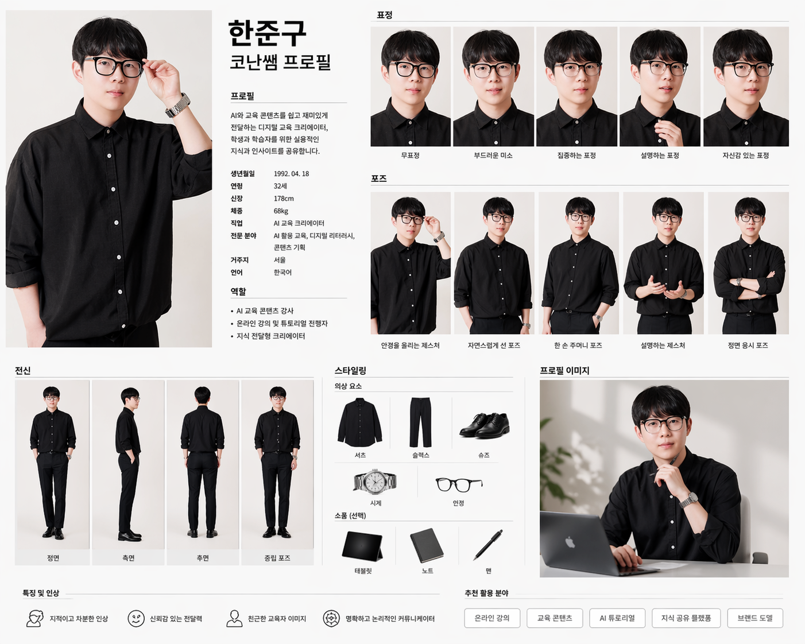
*생성 5. 인물의 표정, 포즈, 스타일까지 정리한 프로필 가이드 시트 예시입니다.*

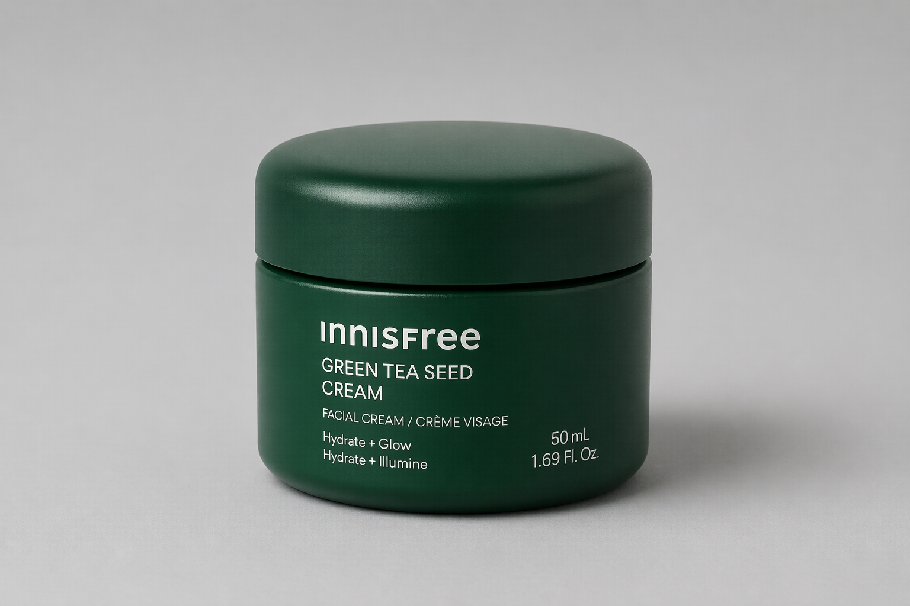
*생성 6. 미니멀한 배경에서 이니스프리 크림 제품을 깔끔하게 담아낸 제품 사진입니다.*


*생성 7. 교사가 AI 도구를 보며 수업 아이디어를 정리하는 따뜻한 작업 장면입니다.*


*생성 8. 책상 위에서 자료를 검토하며 AI 도우미와 함께 일하는 모습을 담은 이미지입니다.*

이렇게 순서대로 보면 포인트가 보입니다.

- 초반에는 **제품 소개/썸네일 계열**이 잘 나오고
- 중간에는 **인포그래픽, 가이드 시트 같은 구조화 이미지**가 붙고
- 후반에는 **교육 현장 문맥의 삽화형 장면**으로 확장됨

즉, 이 모델은 단순 일러스트 한 장보다도 **썸네일, 설명 이미지, 제품컷, 강의자료 비주얼**처럼 목적이 분명한 작업에서 더 잘 써먹기 좋습니다.

## 7. 이 모델은 누구에게 제일 빨리 체감되냐면, 이 사람들임

| 사용자 유형 | 체감 포인트 |
|------|-------------|
| 블로거/콘텐츠 크리에이터 | 썸네일, 카드뉴스, 본문 삽화 제작 속도 상승 |
| 교사/강사 | 강의자료용 인포그래픽, 설명용 삽화, 활동지 비주얼 보강 |
| 쇼핑몰 운영자 | 제품컷 배경 교체, 색상 변형, 배너 시안 반복 |
| 마케터 | 문구 교체, 배치 실험, 시안 A/B 테스트 |
| 1인 사업자 | 외주 없이 빠르게 초안 확보 |

반대로 이런 사람은 아직 기대치를 조금 조절하는 편이 좋습니다.

- 완성형 브랜딩 결과물을 버튼 한 번에 끝내고 싶은 사람
- 긴 한국어 문장을 오류 없이 이미지 안에 완벽하게 넣고 싶은 사람
- 규제가 민감한 얼굴 합성, 사건 사진, 정치성 이미지까지 다 자유롭게 만들고 싶은 사람

## 8. 결론, 이번 공개는 “이미지 생성 AI 2라운드 시작”에 가까움

이번 업데이트가 중요한 이유는 결과물이 예뻐서가 아닙니다.

**이제 이미지 생성이 “한 장 뽑기”에서 “수정하고 유지하고 재활용하는 작업”으로 넘어가고 있기 때문**입니다.

그래서 진짜 포인트는 이겁니다.

- 새로 그리는 능력보다 **수정 능력**이 중요해졌고
- 막연한 프롬프트보다 **구조화된 지시**가 중요해졌고
- 감탄용 데모보다 **실무 재사용성**이 훨씬 중요해졌음

개인적으로는 이번 공개 이후부터, 블로그 썸네일, 카드뉴스, 강의자료, 제품컷 시안 쪽은 진짜 작업 방식이 꽤 바뀔 가능성이 높다고 봅니다.

특히 **“이 이미지에서 이것만 바꿔줘”**가 잘 먹히기 시작하면, 제작 속도는 생각보다 훨씬 빨라집니다.

## 9. 빠르게 정리하면

- OpenAI가 ChatGPT Images 2.0을 공식 공개함
- 핵심은 생성보다 **정밀 편집**, **텍스트 렌더링**, **지시 이행** 강화
- 새 Images 경험은 최대 4배 빠르고, API 쪽은 GPT Image 1 대비 20% 저렴
- 브랜드 요소 보존, 제품컷 재활용, 포스터/인포그래픽 제작에 특히 유리
- 프롬프트는 길이보다 구조가 중요함
- 실제 실무에서는 “change only X / keep everything else the same” 조합이 강력함

이번엔 진짜로 “재미있는 기능” 단계를 조금 넘었습니다.
**이제는 실제로 일에 붙일 수 있는 이미지 도구가 됐다고 봐도 됨.**
