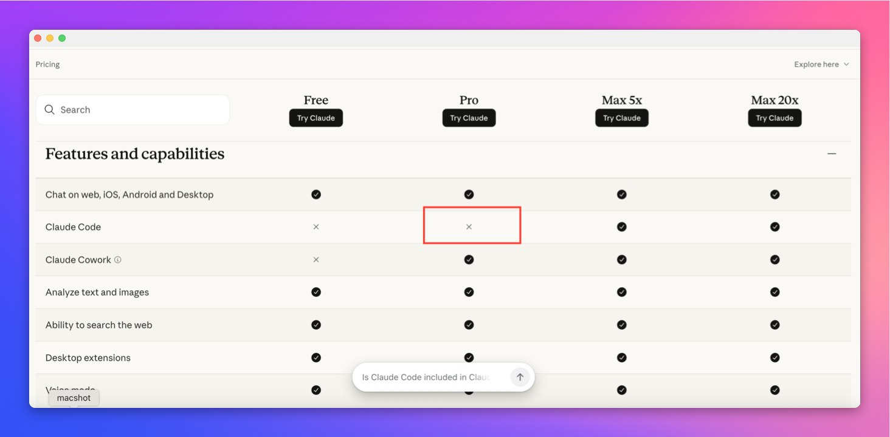
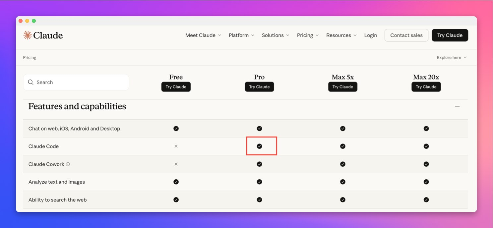

- **가격 페이지**: [claude.com/pricing](https://claude.com/pricing)
- **도움말 1**: [Using Claude Code with your Pro or Max plan](https://support.claude.com/en/articles/11145838-using-claude-code-with-your-pro-or-max-plan)
- **도움말 2**: [Choosing a Claude plan](https://support.claude.com/en/articles/11049762-choosing-a-claude-plan)
- **직전 글**: [Claude Pro에서 Claude Code 빠지나, Anthropic 가격 페이지에 뜬 이상 신호](./claude-code-pro-pricing-confusion-2026-04-22)

Anthropic 가격 페이지가 오늘 꽤 시끄럽습니다.

몇 시간 전만 해도 `claude.com/pricing` 비교표에서 **Pro 플랜의 Claude Code가 X처럼 보이는 화면**이 퍼졌습니다.
그래서 다들 "이제 Pro에서는 Claude Code 못 쓰는 거냐"고 반응했습니다.

근데 지금은 또 다릅니다.
이번에는 같은 자리에서 **Pro 플랜의 Claude Code가 다시 체크**로 보입니다.

그러면 질문은 하나로 줄어듭니다.
**이게 실수였나, 잠깐 넣었다 뺀 테스트였나, 아니면 반응 보고 바로 철회한 건가.**

먼저 문제를 키운 장면은 이거였습니다.

*이전 캡처. Claude Code 행의 Pro 칸이 X로 표시되어 있었음.*

그리고 지금은 이렇게 다시 보입니다.

*현재 캡처. Claude Code 행의 Pro 칸이 다시 체크로 보임.*

## 1. 지금 핵심은 “정책 변경”보다 “가격 페이지가 흔들렸다”는 점임

오늘 흐름을 시간순으로 보면 이렇습니다.

1. Pro 칸의 Claude Code가 X처럼 보이는 화면이 확인됨
2. 사용자들은 "Pro에서 Claude Code 빼는 것 아니냐"고 해석함
3. 공식 도움말 문서는 여전히 **Pro 또는 Max** 지원이라고 적혀 있었음
4. 그런데 다시 가격 페이지를 보니 이번엔 **Pro 칸이 체크**로 돌아와 있음

즉 지금 확정된 건 하나입니다.

**Anthropic 가격 페이지 표기가 짧은 시간 안에 흔들렸고, 그 과정에서 사용자 혼선이 실제로 발생했다는 것.**

이건 꽤 큽니다.
가격표는 그냥 디자인 요소가 아니라, 사용자가 상품 정책을 이해하는 가장 직접적인 문서이기 때문입니다.

## 2. 그래서 지금 가능한 해석은 세 가지 정도임

### 1) 단순 오표기였고, 뒤늦게 바로 수정했을 가능성

이 해석이 가장 깔끔합니다.

- 도움말 문서는 계속 Pro 지원으로 남아 있었고
- 가격 페이지 상단 요약도 Pro에 Claude Code 포함처럼 읽혔고
- 지금은 비교표도 다시 체크로 보임

이 흐름이면 그냥 **비교표 한 칸이 잘못 들어갔다가 수정된 것**일 수 있습니다.

### 2) 실제로 정책 조정을 검토하다가 바로 되돌렸을 가능성

이 경우가 더 흥미롭습니다.

- 한때는 Max 중심으로 재편하려는 UI가 올라왔고
- 커뮤니티 반응이 즉시 퍼졌고
- 문서 정합성이 안 맞는 상태가 드러나자 빠르게 원복했을 수 있음

즉 완전한 실수라기보다 **내부 검토 흔적이 외부에 먼저 노출된 시나리오**입니다.

### 3) A/B 테스트나 롤아웃 차이가 잠깐 섞였을 가능성

이것도 SaaS 서비스에서는 자주 나옵니다.

- 국가별 표기 차이
- 로그인 상태 차이
- 실험군/대조군 차이
- 캐시 반영 지연

이런 조건이 겹치면 같은 날에도 서로 다른 화면 캡처가 돌 수 있습니다.

## 3. 왜 다들 민감하게 반응했냐면 이유가 너무 분명함

Claude Code는 그냥 부가 기능이 아닙니다.
많은 사람에게는 **Claude 구독의 핵심 이유**에 가깝습니다.

만약 Pro에서 Claude Code가 진짜 빠지면 가격 구조가 이렇게 바뀝니다.

- Pro: 월 20달러
- Max 5x: 월 100달러
- Max 20x: 월 200달러

즉 개발자 입장에서는 사실상 **입장권이 5배 뛰는 변화**가 됩니다.

그러니까 사용자들이 예민하게 반응한 건 과장이 아닙니다.
그 표 하나가 진짜라면, Anthropic의 상품 전략이 완전히 달라지는 신호였기 때문입니다.

## 4. 지금 시점에서 오히려 더 강해진 포인트도 있음

재미있는 건, 이번에 체크로 다시 돌아오면서 오히려 한 가지가 더 선명해졌다는 점입니다.

**적어도 지금 시점에서는 “Pro에서 Claude Code가 완전히 빠졌다”라고 말하면 안 됨.**

왜냐하면:

- 가격 페이지는 현재 다시 체크로 보이고
- 도움말 문서도 계속 Pro 지원이라고 적고 있고
- Max 안내 역시 "더 많은 사용량" 중심으로 설명하지, Pro 차단 확정처럼 쓰지 않기 때문입니다.

그러니까 지금 맞는 문장은 이쪽입니다.

**“Anthropic이 Pro의 Claude Code를 막았다고 확정하기는 어렵다. 다만 가격 페이지가 실제로 흔들렸고, 그 흔들림 자체가 의미 있는 신호다.”**

## 5. 실수인지 철회인지, 저는 이쪽이 더 의심됨

제 느낌은 단순합니다.

완전한 실수일 수도 있습니다.
근데 그냥 실수라고 보기엔 파장이 너무 큰 칸이었습니다.

Claude Code는 지금 Anthropic 상품 전략에서 제일 민감한 축 중 하나입니다.
그런데 하필 그 칸이 Pro에서 X로 보였다가 다시 체크로 돌아왔다면, 사용자 입장에서는 이런 의심을 하게 됩니다.

- 내부에서 Max 중심 재편을 검토한 것 아닌가
- 가격 페이지 실험이 외부에 잠깐 노출된 것 아닌가
- 반응이 커지니까 일단 되돌린 것 아닌가

물론 지금은 확정 증거가 없습니다.
하지만 적어도 **“아무 일도 없었다”라고 넘길 상황도 아닙니다.**

왜냐하면 가격표는 사용자의 결제 판단에 직결되고, 이번 혼선은 실제로 구독 의사결정에 영향을 줄 수 있었기 때문입니다.

## 6. 지금 사용자들이 확인해야 할 건 오히려 더 명확함

### 첫째, 내 Pro 계정에서 Claude Code 인증이 실제로 붙는가

제일 중요한 건 가격표보다 실사용입니다.
실제 Pro 계정으로 Claude Code 로그인과 사용이 계속 되는지 먼저 보는 게 맞습니다.

### 둘째, 도움말 문서 제목과 문구가 바뀌는가

정책이 진짜 바뀌면 결국 도움말 문서도 따라옵니다.
특히 아래 문서가 바뀌면 거의 확정 신호에 가깝습니다.

- Using Claude Code with your Pro or Max plan
- Choosing a Claude plan
- What is the Max plan

### 셋째, pricing 페이지가 다시 또 바뀌는가

이건 오늘의 핵심입니다.
지금 한 번 흔들렸기 때문에, 앞으로 며칠은 pricing 페이지 변화 자체가 중요한 신호가 됩니다.

## 7. 한 줄 결론

지금 상황을 제일 정확하게 요약하면 이겁니다.

**Claude Pro에서 Claude Code를 막는다고 확정하기엔 이르다. 그런데 가격 페이지가 실제로 X에서 체크로 다시 바뀌었다면, 이건 단순 해프닝이라기보다 Anthropic 내부 메시지 관리가 흔들렸다는 신호일 가능성이 크다.**

쉽게 말하면 이렇습니다.

- 아까는 "빼는 거 아냐?"였고
- 지금은 "어? 다시 있네?"가 됐고
- 그래서 남은 질문은 **실수였나, 철회였나**로 좁혀졌음

이 질문 자체가 이미 꽤 큰 뉴스입니다.
