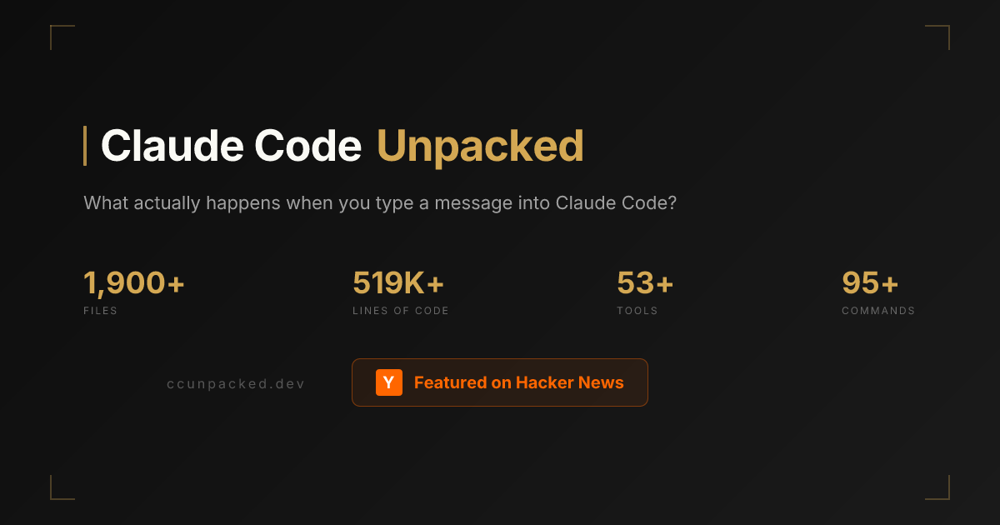

최근 AI 개발자 커뮤니티에서 꽤 흥미로운 링크 하나가 돌고 있습니다. 바로 **[ccunpacked.dev](https://ccunpacked.dev)** 입니다.

이 사이트는 Claude Code를 이루는 내부 구조를 **시각적으로 풀어 보여주는 비공식 가이드**입니다. 단순히 “툴이 많다” 수준이 아니라, 사용자가 메시지를 입력한 뒤 응답이 화면에 그려질 때까지 어떤 흐름을 거치는지, 어떤 종류의 도구와 명령어가 들어 있는지, 아직 공개되지 않은 기능 힌트까지 한 화면에서 탐색할 수 있게 정리해두었습니다.

개인적으로는 이런 사이트가 단순한 구경거리를 넘어서, **요즘 코딩 에이전트가 왜 강력하게 느껴지는지 이해하는 학습 자료**로도 꽤 좋다고 봤습니다.

## ccunpacked.dev가 뭔가요?

사이트 제목은 **Claude Code Unpacked**입니다. 이름 그대로 Claude Code를 “뜯어서” 보여주는 방식입니다.

첫 화면에서 바로 이런 정보를 압축해 보여줍니다.

- 약 **1,900개+ 파일**
- 약 **519K+ 라인** 규모
- **53개+ 도구**
- **95개+ 명령어**

그리고 아래로 내려가면 크게 다섯 축으로 내용을 구성합니다.

1. **The Agent Loop**  
   사용자가 입력한 요청이 어떤 단계를 거쳐 처리되는지
2. **Architecture Explorer**  
   코드베이스가 어떤 영역으로 나뉘어 있는지
3. **Tool System**  
   Claude Code가 쓸 수 있는 도구를 기능별로 정리
4. **Command Catalog**  
   슬래시 커맨드 전체를 범주별로 정리
5. **Hidden Features**  
   아직 정식 노출되지 않았거나 feature-gated 상태로 보이는 기능들 소개

즉, 이 사이트는 단순한 소개 페이지가 아니라, **코딩 에이전트 제품을 구조적으로 읽게 해주는 인터랙티브 아카이브**에 가깝습니다.

## 왜 이 사이트가 재미있나

저는 이 사이트의 가치가 단순히 “Claude Code에 이런 기능이 있대”를 보여주는 데서 끝나지 않는다고 봅니다.

핵심은 오히려 이런 질문에 답을 준다는 점입니다.

- 코딩 에이전트는 실제로 어떤 루프로 움직일까?
- 파일 읽기, 실행, 검색, 서브에이전트 같은 기능은 어떤 구조로 묶일까?
- 좋은 개발용 AI 도구는 모델 말고 무엇이 중요할까?

요즘 많은 분들이 GPT, Claude, Gemini 같은 **모델 이름** 위주로 비교합니다. 물론 중요합니다. 하지만 실제 사용감은 모델만으로 설명되지 않는 경우가 많습니다.

같은 계열 모델이어도 어떤 도구는 훨씬 유능하게 느껴지고, 어떤 도구는 답답하게 느껴지는 이유가 있죠. ccunpacked.dev는 그 차이를 **하네스(harness)**, 즉 모델을 감싸는 소프트웨어 구조 관점에서 생각하게 만들어 줍니다.

## 1. Agent Loop: “메시지 하나” 뒤에 있는 실제 흐름

제가 가장 먼저 눌러본 영역은 **The Agent Loop**였습니다.

이 섹션은 사용자가 입력한 메시지가 실제로 어떤 단계를 거치는지 순서대로 보여줍니다. 사이트 기준으로 보면 대략 이런 흐름입니다.

- User Input
- Message Creation
- History Append
- System Prompt Assembly
- API Streaming
- Token Parsing
- Tool Detection
- Tool Execution Loop
- Response Rendering
- Post-Sampling Hooks
- Await Next Input

이걸 보고 있으면 중요한 포인트가 하나 보입니다.

> 코딩 에이전트는 “질문하면 답하는 챗봇”이 아니라, **입력 → 조립 → 추론 → 도구 호출 → 결과 반영**의 반복 루프를 가진 시스템에 가깝다는 점입니다.

즉, 진짜 차별점은 모델 응답 한 줄이 아니라, **그 응답 전후를 어떻게 설계했는가**에 있습니다.

## 2. Tool System: 에이전트는 결국 도구 설계의 싸움

세 번째 섹션인 **Tool System**도 아주 흥미롭습니다. 도구를 단순 나열하지 않고 카테고리로 보여주는데, 대략 이런 식입니다.

- File Operations
- Execution
- Search & Fetch
- Agents & Tasks
- Planning
- MCP
- System
- Experimental

예시로 보이는 도구도 꽤 구체적입니다.

- 파일 읽기/수정/쓰기
- Bash 실행
- 웹 검색 / 웹 가져오기
- 서브에이전트 생성
- 태스크 생성/조회/업데이트/중지
- 계획 모드 진입
- MCP 리소스 읽기
- 사용자 질문 / 투두 관리 / 설정 수정

이걸 보면 요즘 에이전트가 왜 강해 보이는지 더 명확해집니다.

**에이전트의 성능은 모델만의 성능이 아니라, 도구를 얼마나 구조적으로 연결했는지의 결과**이기 때문입니다.

특히 코딩 작업은 원래부터 이런 일들의 조합입니다.

- 파일 열기
- 심볼 찾기
- 명령 실행
- 결과 해석
- 작업을 쪼개기
- 다시 합치기

그래서 코딩 에이전트는 본질적으로 **“말 잘하는 모델”** 이 아니라 **“도구를 잘 쓰는 작업 시스템”** 으로 봐야 합니다.

## 3. Command Catalog: 생각보다 제품이 깊다

네 번째 섹션은 **Command Catalog**입니다. Claude Code의 슬래시 명령어를 범주별로 정리해 둡니다.

카테고리만 봐도 범위가 꽤 넓습니다.

- Setup & Config
- Daily Workflow
- Code Review & Git
- Debugging & Diagnostics
- Advanced & Experimental

눈에 띄는 명령어들도 많습니다.

- `/config`, `/permissions`, `/model`
- `/compact`, `/memory`, `/context`, `/summary`
- `/review`, `/commit`, `/diff`, `/issue`
- `/status`, `/stats`, `/cost`, `/usage`
- `/voice`, `/ide`, `/plugin`, `/remote-control`

이걸 보면 Claude Code가 단순히 “코드 수정기”가 아니라, **세션 운영, 컨텍스트 관리, 작업 추적, 디버깅, 협업 흐름**까지 포함한 하나의 작업 환경으로 확장되고 있다는 걸 알 수 있습니다.

즉, 사용자는 채팅창 하나를 보고 있지만, 실제 제품은 **IDE + 터미널 + 태스크 시스템 + 세션 메모리 + 권한 관리**가 합쳐진 구조에 더 가깝습니다.

## 4. Hidden Features: 제품의 미래 방향이 살짝 보인다

가장 구경하는 재미가 있는 구간은 역시 **Hidden Features** 입니다.

여기에는 정식 공개 전이거나 feature-gated로 보이는 항목들이 정리되어 있습니다. 예를 들면 이런 이름들이 보입니다.

- Buddy
- Kairos
- UltraPlan
- Coordinator Mode
- Bridge
- Daemon Mode
- UDS Inbox
- Auto-Dream

물론 이런 항목은 실제 출시 여부나 최종 형태가 바뀔 수 있습니다. 그래서 그대로 확정 정보처럼 받아들이는 건 조심해야 합니다.

그럼에도 불구하고 방향성은 읽을 수 있습니다.

예를 들면 이런 흐름이 보이죠.

- **더 긴 계획 세션**
- **여러 에이전트의 분업**
- **원격 제어와 모바일 연결**
- **세션 간 기억 정리**
- **백그라운드 실행**

이건 결국 코딩 에이전트가 앞으로 **단일 응답형 도구**에서 **지속형 작업 환경**으로 이동하고 있다는 신호로 읽힙니다.

## 이 사이트를 어떻게 보면 좋을까

ccunpacked.dev는 그냥 “와 기능 많네” 하고 끝내기엔 아깝습니다. 저는 세 가지 관점으로 보면 좋다고 생각합니다.

### 1) 개발자라면: 에이전트 제품 설계 참고 자료

에이전트 제품을 만들거나 MCP, 툴콜링, 워크플로우 자동화에 관심 있다면 꽤 좋은 참고 자료입니다.

특히 아래 같은 질문에 도움이 됩니다.

- 도구 카테고리는 어떻게 나누는가?
- 세션 기능은 어디까지 제품으로 넣는가?
- 서브에이전트와 태스크 시스템은 어떤 식으로 엮는가?

### 2) 사용자라면: “왜 어떤 도구는 더 똑똑하게 느껴지는가” 이해

좋은 에이전트는 모델만 좋은 게 아니라,

- 컨텍스트를 잘 모으고
- 도구를 잘 구조화하고
- 작업을 계속 이어가고
- 명령과 상태를 잘 관리합니다.

이 사이트는 그걸 아주 직관적으로 보여줍니다.

### 3) 교육자라면: AI 에이전트 구조를 설명하는 사례

코난쌤처럼 AI를 교육적으로 설명해야 하는 입장에서는, 이 사이트가 꽤 좋은 사례가 될 수 있습니다.

왜냐하면 “에이전트”라는 말을 추상적으로 설명하는 대신,

- 입력
- 프롬프트 조립
- API 호출
- 도구 감지
- 실행 루프
- 결과 렌더링

처럼 **실제 구조**로 풀어 설명할 수 있기 때문입니다.

## 아쉬운 점도 있다

물론 이 사이트를 볼 때 주의할 점도 있습니다.

첫째, **비공식 정리**입니다. 사이트 하단에도 공식 소속이 아니고, 공개적으로 확인 가능한 소스 기준이며 일부는 틀리거나 오래됐을 수 있다고 적혀 있습니다.

둘째, 이런 구조 해설은 어디까지나 **큐레이션된 해석**입니다. 즉, 전체 맥락을 모두 보여준다기보다, 흥미로운 부분을 사람이 읽기 좋게 재배열한 결과물에 가깝습니다.

셋째, 숨겨진 기능 섹션은 특히 더 조심해서 봐야 합니다. “있다”와 “곧 나온다”는 전혀 다른 이야기이기 때문입니다.

그래도 저는 이런 한계까지 포함해서, 이 사이트가 충분히 볼 가치가 있다고 생각합니다. 오히려 공식 문서보다 더 빠르게 감을 잡게 해주는 면도 있습니다.

## 한 줄 정리

**ccunpacked.dev는 Claude Code의 내부 구조를 구경하는 사이트가 아니라, 현대 코딩 에이전트가 어떤 방식으로 설계되는지 감각적으로 이해하게 해주는 시각 자료**입니다.

AI 코딩 도구를 그냥 “성능 좋은 챗봇” 정도로 보고 있었다면, 이 사이트를 보면 생각이 조금 바뀔 수 있습니다. 진짜 차이는 모델 이름 하나보다, 그 위에 얹힌 **도구·상태·메모리·작업 루프 설계**에서 더 많이 나오기 때문입니다.

관심 있으시면 직접 둘러보세요.

- 사이트: <https://ccunpacked.dev>
- Hacker News 반응도 함께 보면 흐름 읽기에 좋습니다.

## FAQ

### Q1. ccunpacked.dev는 공식 Anthropic 사이트인가요?
아닙니다. 비공식 시각 가이드입니다. 공개적으로 확인 가능한 소스 기준으로 정리된 사이트로 보는 편이 맞습니다.

### Q2. 이 사이트에서 가장 볼만한 섹션은 무엇인가요?
개인적으로는 **The Agent Loop**와 **Tool System**이 가장 좋았습니다. 코딩 에이전트가 왜 단순 챗봇과 다른지 바로 감이 옵니다.

### Q3. Hidden Features는 믿어도 되나요?
재미있게 볼 수는 있지만, 출시 확정 정보처럼 받아들이면 안 됩니다. 기능 플래그나 실험 흔적 수준으로 보는 게 안전합니다.

### Q4. 교육 자료로 활용할 만한가요?
그렇습니다. 에이전트 구조를 추상적으로 설명하는 대신, 입력→프롬프트 조립→도구 호출→응답 생성 흐름으로 구체적으로 보여줄 수 있어서 설명용 사례로 좋습니다.

### Q5. 이 사이트를 보면 결국 무엇을 배우게 되나요?
요즘 강한 코딩 에이전트는 모델 하나로 설명되지 않고, **하네스와 도구 체계, 메모리와 태스크 구조**까지 포함한 시스템 설계로 이해해야 한다는 점입니다.
