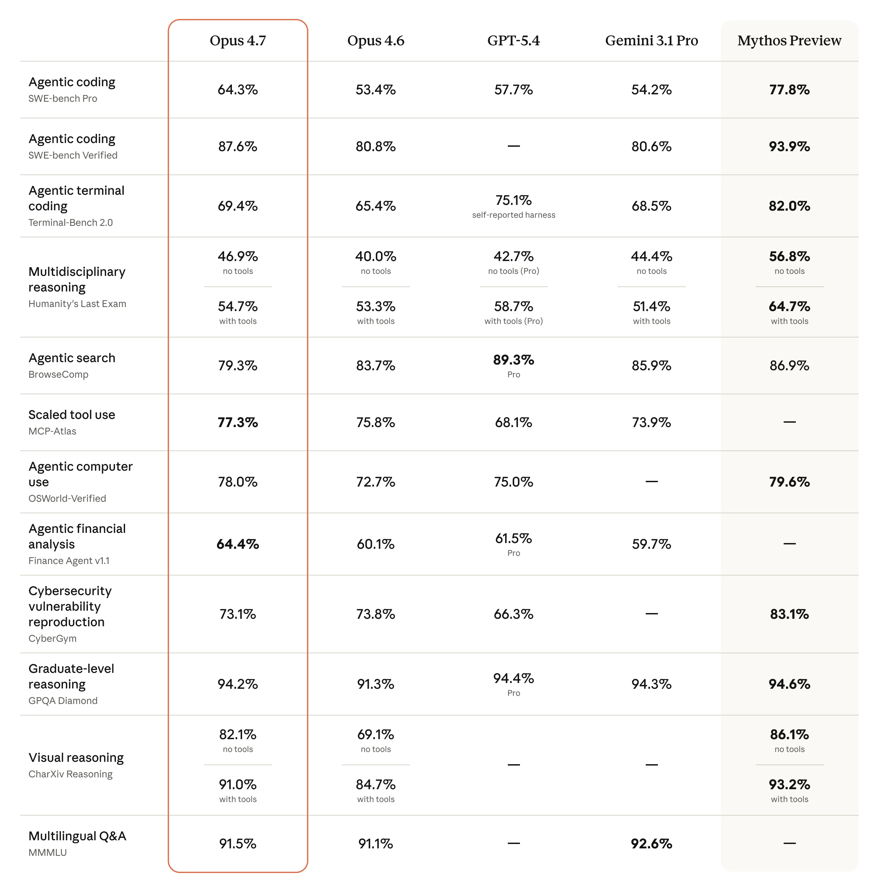
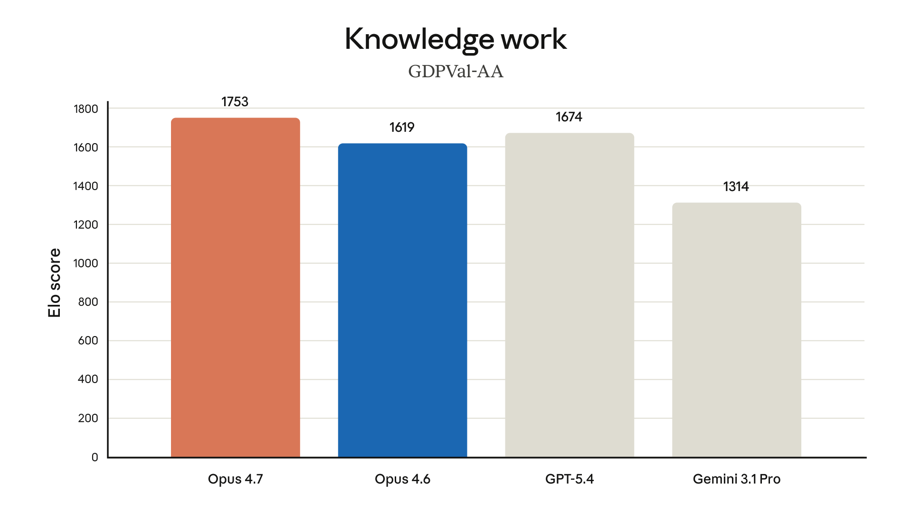
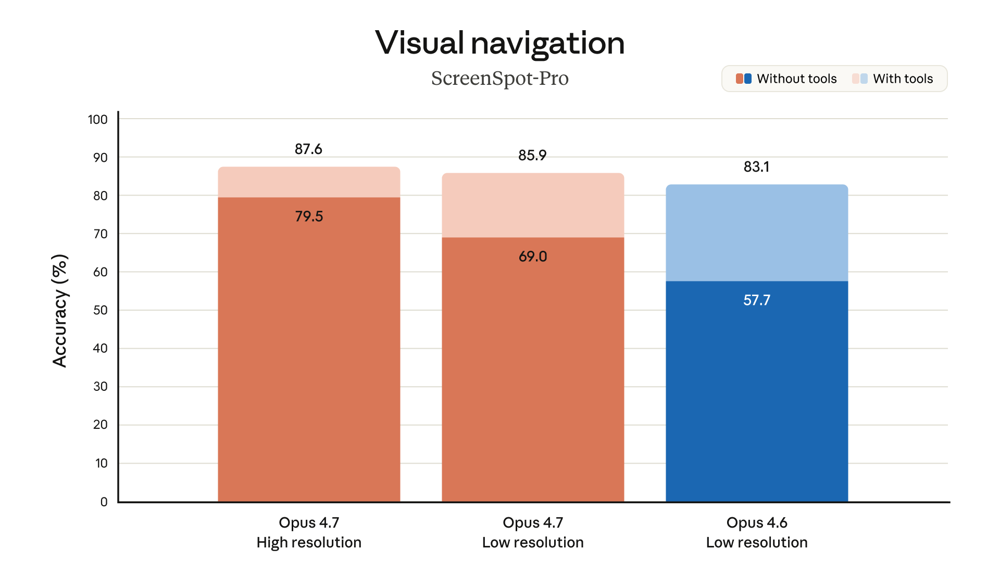
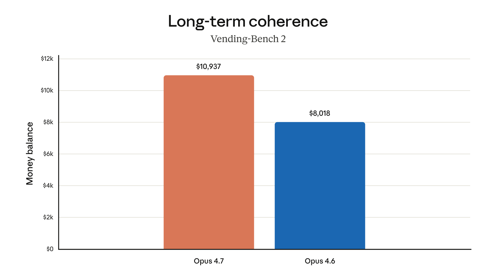
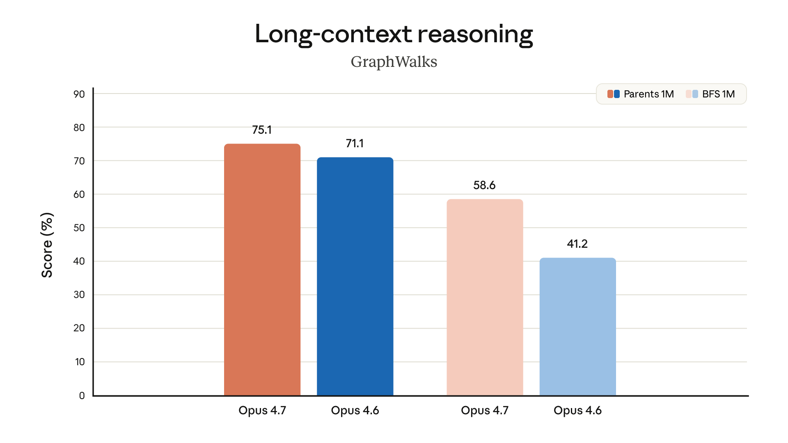
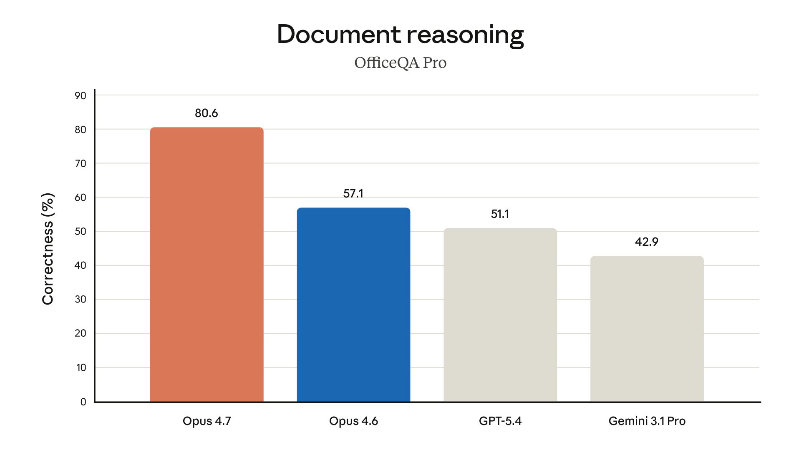
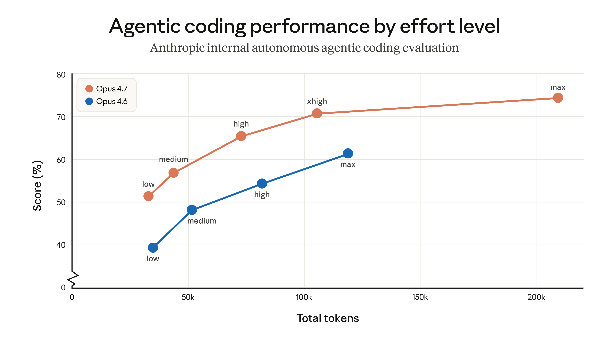
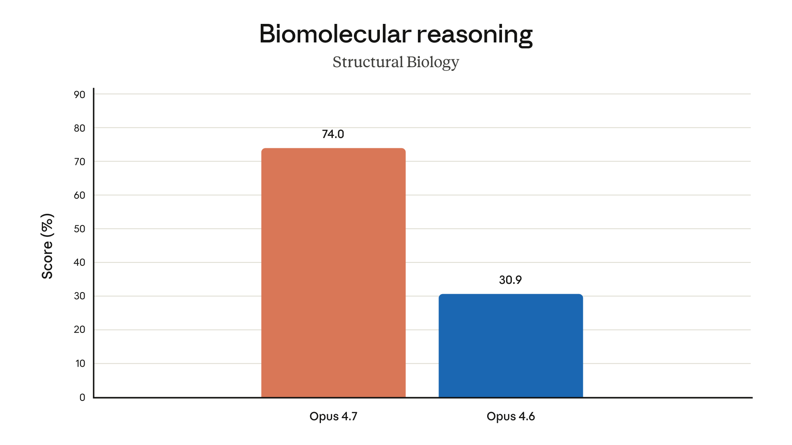
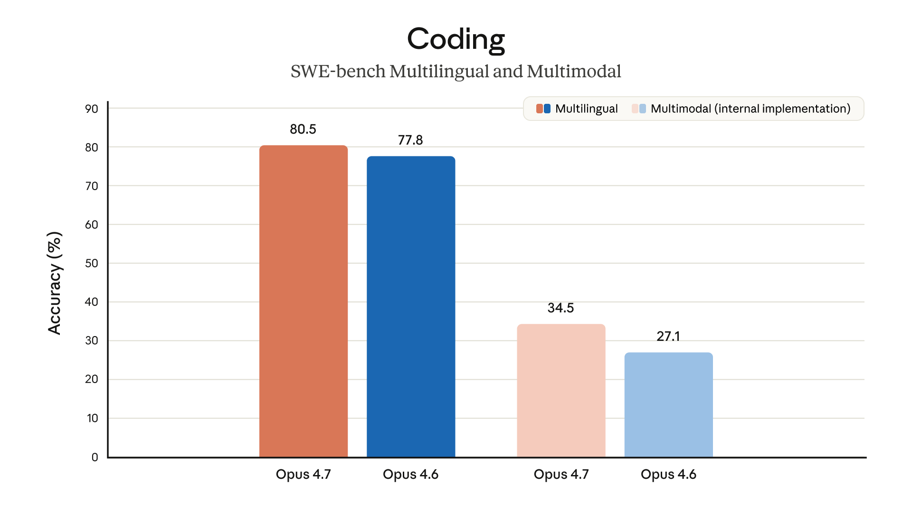
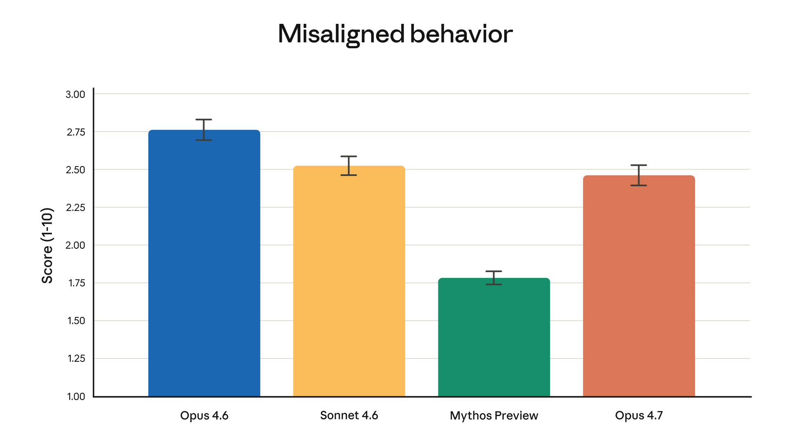

> 원문: [Claude Opus 4.7 is now generally available](https://www.anthropic.com/news/claude-opus-4-7)


## 핵심 요약

Claude Opus 4.7이 정식 출시(GA)되었다. Opus 4.6 대비 **가장 어려운 코딩 태스크**에서 유의미한 향상을 보이며, 복잡하고 긴 실행 작업을 **거의 독립적으로 처리**할 수 있게 되었다. 가격은 동일하다.

| 항목 | Opus 4.6 | Opus 4.7 |
|------|----------|----------|
| 코딩 벤치마크 (93-task) | 기준 | **+13% 해결률** |
| 컴퓨터 사용 시각 정확도 (XBOW) | 54.5% | **98.5%** |
| 이미지 해상도 | ~0.98MP | **~3.75MP (2,576px)** |
| Rakuten-SWE-Bench | 기준 | **3배 프로덕션 태스크 해결** |
| CursorBench | 58% | **70%+** |
| 입력 토큰 가격 | $5/MTok | $5/MTok (동일) |
| 출력 토큰 가격 | $25/MTok | $25/MTok (동일) |


*Anthropic 공식 벤치마크 비교 — 코딩, 에이전트, 비전, 금융, 사이버보안, 안전성 전반에서 Opus 4.7 성능*

## 주요 변화

### 1. 코딩 자율성과 신뢰성 대폭 향상

Opus 4.7의 가장 큰 변화는 **어려운 코딩 작업을 거의 독립적으로 수행**할 수 있다는 점이다. 이전 모델들은 밀착 감시(supervision)가 필요했던 태스크를 이제 자신감 있게 위임할 수 있다.

구체적으로:
- **93-task 코딩 벤치마크**에서 해결률 13% 향상
- Opus 4.6과 Sonnet 4.6 모두 풀지 못한 4개 태스크를 해결
- 자체 논리적 오류를 **계획 단계에서 스스로 감지**하고 수정
- 불필요한 래퍼 함수와 폴백 코드를 줄이고, 깔끔한 코드를 생성
- 시스템 코드 작업 전에 **증명(proof)**을 시도하는 새로운 행동 패턴


*SWE-bench 시리즈(Verified, Pro, Multilingual)에서의 코딩 태스크 해결 능력 비교 — Opus 4.7이 모든 변종에서 최고 성능*


*실제 개발 환경 벤치마크 — CursorBench에서 58%→70%+, Terminal Bench 2.0에서도 유의미한 향상*

Vercel의 피드백: *"증명 없이는 작업을 시작하지 않는다 — 이전 Claude 모델에서는 본 적 없는 행동"*

### 2. 시각 능력 3배 향상

Opus 4.7은 장축 기준 **2,576픽셀** (~3.75메가픽셀) 이미지를 처리할 수 있다. 이는 이전 Claude 모델보다 **3배 이상** 높은 해상도다. 고해상도 이미지 지원은 자동 활성화되며, 별도의 베타 헤더나 설정이 필요 없다.

활용 예시:
- 밀집된 스크린샷에서 정보 추출 (컴퓨터 사용 에이전트)
- 복잡한 기술 다이어그램 데이터 추출
- 화학 구조 읽기 및 해석
- 문서 분석 (최대 4,784 토큰/이미지, 기존 1,600에서 3배)
- 바운딩 박스/포인팅 좌표가 실제 픽셀과 1:1 매칭 (스케일 변환 불필요)


*멀티모달 코딩 벤치마크 및 시각 정확도 — XBOW 자율 침투 테스트에서 시각 정확도 54.5%→98.5%*

### 3. 멀티스텝 에이전트 워크플로우 안정화

길고 복잡한 작업의 신뢰성이 크게 개선되었다:

- **루프 저항성**: 무한 반복에 빠지지 않음 (Genspark 평가)
- **오류 복구**: 도구 호출 실패 시에도 작업을 계속 진행 (Notion 평가)
- **도구 오류**: Opus 4.6 대비 3분의 1로 감소 (Notion 평가)
- **메모리 활용**: 파일 시스템 기반 메모리를 더 잘 활용하여 다세션 작업에서 중요한 노트를 기억
- **암시적 요구 태스크**: 최초 통과 (Notion 평가)


*멀티스텝 에이전트 워크플로우 성능 — 도구 오류 감소, 일관성 향상, 복잡한 태스크에서 완주율 개선*

### 4. 지시 수행(Instruction Following) 강화

Opus 4.7은 이전 모델보다 **지시를 훨씬 더 엄격하게 따른다**. 이는 이중적인 의미가 있다:

- ✅ 정확히 요청한 대로 수행 — 암묵적 일반화 불가, 문자 그대로 해석
- ⚠️ 이전 모델이 느슨하게 해석하던 프롬프트가 예기치 않은 결과를 낼 수 있음

Anthropic은 **기존 프롬프트와 하니스를 재튜닝**할 것을 강력히 권장한다.

### 5. 금융/지식 작업 성능 향상

Opus 4.7은 금융 분석 에이전트 평가에서 SOTA(State of the Art)를 달성했다:
- Finance Agent 평가 최고 점수
- GDPval-AA (제3자 평가, 금융/법률 등 경제적 가치 지식 작업) 최고 성능
- General Finance 모듈: 0.767 → 0.813
- 추론, 공시, 데이터 규율 최고 수준


*금융 에이전트 평가 — 6개 모듈 종합 최고 점수(0.715), General Finance에서 의미 있는 향상*

### 6. 문서 추론 및 엔터프라이즈 분석

Databricks OfficeQA Pro 평가에서 Opus 4.6 대비 **21% 적은 오류**로 문서를 분석한다. 엔터프라이즈 문서 분석 분야에서 최고 성능의 Claude 모델이다.


*엔터프라이즈 문서 추론 — 출처 정보 기반 작업에서 오류율 21% 감소*

### 7. 창의성과 디자인 감각 향상

전문적인 결과물의 품질이 눈에 띄게 좋아졌다:

- 인터페이스, 슬라이드, 문서의 디자인 품질 향상
- 한 기업 평가: *"배포할 수준의 디자인 선택을 한다 — 내 일일 드라이버 모델이 되었다"*
- 더 다채롭고 창의적인 접근 방식

## 사이버 보안: Project Glasswing과의 연결

지난 주 Anthropic은 [Project Glasswing](https://www.anthropic.com/glasswing)을 발표하며 Claude Mythos Preview의 사이버 보안 역량과 위험을 공개했다. Opus 4.7은 **Mythos 수준의 사이버 역량을 가지지 않도록** 차등적으로 제한된 최초의 모델이다.

- 금지/고위험 사이버보안 사용 요청을 자동 감지 및 차단하는 보호장치 내장
- 합법적인 보안 전문가는 [Cyber Verification Program](https://claude.com/form/cyber-use-case)에 신청 가능
- 이 보호장치의 실제 배포 경험이 향후 Mythos급 모델의 넓은 출시를 위한 기반이 될 예정


*CyberGym 사이버보안 평가 — Opus 4.7은 보안 역량이 제한되면서도 일반 코딩/에이전트 성능은 향상*

## 안전성 및 정렬(Safety & Alignment)

전반적으로 Opus 4.7은 Opus 4.6과 유사한 안전성 프로필을 보인다. 기만, 아첨, 오용 협력 등의 우려 행동 비율이 낮다. 일부 측정 항목(정직성, 프롬프트 인젝션 공격 저항)에서는 Opus 4.6보다 개선되었다.

Anthropic 내부 정렬 평가: *"대체로 잘 정렬되고 신뢰할 수 있지만, 행동이 완전히 이상적이지는 않다"*


*자동화된 행동 감사에서의 오정렬 행동 점수 — Opus 4.7은 Opus 4.6 대비 개선, Mythos Preview가 여전히 최저*

## 실무자 피드백 하이라이트

| 기업 | 핵심 평가 |
|------|----------|
| **Replit** | 동일 품질을 낮은 비용으로 달성, 기술 논의에서 push back하는 태도가 실질적 |
| **Notion** | 도구 오류 3분의 1 감소, 최초로 암시적 요구 태스크 통과 |
| **CodeRabbit** | 리콜 10%+ 향상, 가장 어려운 버그 탐지 능력 향상, GPT-5.4 xhigh보다 약간 빠름 |
| **Vercel** | 이전 Claude 모델이 실패한 Terminal Bench 태스크 통과 |
| **Quantium** | 추론 깊이, 구조적 문제 정형화, 복잡 기술 작업에서 최대 게인 |
| **Ramp** | 에이전트 팀 워크플로우에서 강화된 역할 충실도와 조정 능력 |
| **XBOW** | 컴퓨터 사용 시각 정확도 54.5% → **98.5%** |
| **Cursor** | CursorBench 58% → **70%+**, 자율성과 창의적 추론에서 인상적 |
| **Rakuten** | Rakuten-SWE-Bench에서 Opus 4.6 대비 3배 프로덕션 태스크 해결 |
| **Harvey** | BigLaw Bench 90.9% (high effort), 양도 조항과 경영권 변경 조항 정확히 구분 |

## Claude Mythos Preview와의 관계

Anthropic은 최고 성능 모델로 **Claude Mythos Preview**를 이미 발표한 상태다. Opus 4.7은 Mythos보다 **광범위한 역량은 낮지만**, 여러 벤치마크에서 Opus 4.6을 상회한다.

가격은 Mythos Preview($15/$75 per MTok)보다 훨씬 저렴한 $5/$25 수준을 유지한다.

## 출시 및 가용성

Claude Opus 4.7은 오늘부터 다음 플랫폼에서 사용 가능:

- Claude 제품 (claude.ai, Claude 앱)
- Claude API (`claude-opus-4-7`)
- Amazon Bedrock
- Google Cloud Vertex AI
- Microsoft Foundry

**가격**: 입력 $5/MTok, 출력 $25/MTok (Opus 4.6 동일)

## 마이그레이션 가이드: Opus 4.6 → 4.7

> 원문: [Claude Migration Guide](https://platform.claude.com/docs/en/about-claude/models/migration-guide#migrating-to-claude-opus-4-7)

Opus 4.7은 기존 Opus 4.6 코드에 대해 **강력한 out-of-the-box 성능**을 보이지만, 몇 가지 API 파괴적 변경과 행동 변화가 있다. 가격은 동일하게 $5/$25 per MTok을 유지한다.

### 지원 기능 (Opus 4.6 동일)

1M 토큰 컨텍스트 윈도우 (추가 비용 없음), 128k 최대 출력, Adaptive Thinking, 프롬프트 캐싱, 배치 처리, Files API, PDF, 비전, 서버/클라이언트 툴 (bash, 코드 실행, 컴퓨터 사용, 웹 검색, MCP 커넥터, 메모리)

### ⚡ 파괴적 변경 (Breaking Changes)

| 변경 사항 | Opus 4.6 | Opus 4.7 | 대응 방법 |
|----------|----------|----------|----------|
| **Extended Thinking** | `thinking: {type: "enabled", budget_tokens: N}` 지원 | ❌ 400 에러 반환 | `thinking: {type: "adaptive"}` + `effort` 파라미터 사용 |
| **샘플링 파라미터** | `temperature`, `top_p`, `top_k` 설정 가능 | ❌ 400 에러 반환 | 파라미터 제거, 프롬프트로 제어 |
| **생각 내용 기본 비공개** | 요약된 생각 텍스트 반환 | 기본 `"omitted"` | `thinking.display: "summarized"` 명시 |
| **토큰 카운팅 변경** | 기존 토크나이저 | 새 토크나이저 (1x~1.35x 더 많은 토큰) | `max_tokens` 여유 확보, `/v1/messages/count_tokens` 재검증 |
| **Prefill 제거** | 어시스턴트 메시지 프리필 가능 | ❌ 400 에러 반환 | Structured Outputs, 시스템 프롬프트, `output_config.format` 사용 |

### 코드 변경 예시

```python
# ❌ Before (Opus 4.6)
client.messages.create(
    model="claude-opus-4-6",
    max_tokens=64000,
    thinking={"type": "enabled", "budget_tokens": 32000},
    messages=[{"role": "user", "content": "..."}],
)

# ✅ After (Opus 4.7)
client.messages.create(
    model="claude-opus-4-7",
    max_tokens=64000,
    thinking={"type": "adaptive"},
    output_config={"effort": "high"},  # "max", "xhigh", "medium", "low"
    messages=[{"role": "user", "content": "..."}],
)
```

### 🎯 에포트(Effort) 레벨 선택 가이드

| 레벨 | 설명 | 권장 용도 |
|------|------|----------|
| `max` | 최대 지능, 토큰 과다사용 위험 | 지능 집약적 태스크 테스트 |
| **`xhigh`** 🆕 | 코딩/에이전트에 최적 | **대부분의 코딩, 에이전트 워크플로우** |
| `high` | 지능/비용 균형 | 지능 민감 대부분의 유스케이스 |
| `medium` | 비용 절감, 지능 트레이드오프 | 비용 민감 유스케이스 |
| `low` | 단순 작업, 낮은 지연시간 | 단기 범위 작업, 지연시간 민감 |

> **핵심:** 이전 Opus보다 에포트가 **훨씬 중요**하다. 업그레이드 후 활발하게 실험할 것.


*에포트 레벨별 토큰 사용량 대비 코딩 평가 점수 — Opus 4.7은 모든 에포트 레벨에서 더 높은 성능/토큰 효율 달성*

### 🔄 행동 변화 (프롬프트 재튜닝 필요)

1. **응답 길이 자동 조절:** 작업 복잡도에 따라 길이가 달라짐. 단순 질문엔 짧게, 복잡 분석엔 길게. 길이 제어가 필요하면 프롬프트에 명시
2. **더 엄격한 지시 해석:** 이전 모델이 느슨하게 해석하던 것을 문자 그대로 따름. 암묵적 일반화 ❌. 구체적 프롬프트 작성 필수
3. **더 직접적인 어조:** Opus 4.6보다 덜 따뜻하고 더 의견이 명확함. 이모지 사용 감소. 특정 톤이 필요하면 스타일 프롬프트 재검토
4. **에이전트 진행 상황 자동 업데이트:** 긴 에이전트 작업 중 더 정기적으로 상태 전달. 기존 스캐폴딩 제거 고려
5. **기본 서브에이전트 수 감소:** 프롬프트로 명시적 가이드 필요시 추가
6. **더 엄격한 에포트 준수:** `low`/`medium`에서 복잡한 문제에 얕은 추론 위험. 복잡한 작업은 `high` 이상 권장
7. **기본 도구 호출 감소:** 추론을 더 활용. 도구 사용 늘리려면 `high`/`xhigh` 에포트 또는 프롬프트 명시
8. **사이버 보안 실시안 가드:** 금지/고위험 요청 자동 차단. 합법적 보안 작업은 [Cyber Verification Program](https://claude.com/form/cyber-use-case) 신청
9. **고해상도 이미지 자동 지원:** 2576px (기존 1568px에서 향상). 이미지 토큰 최대 3배 증가 가능 (최대 4,784 토큰/이미지)

### 💡 권장 변경 사항

1. **`max_tokens` 재설정:** 새 토크나이저로 더 많은 토큰 소모 → `max_tokens` 여유 확보. `max`/`xhigh` 에포트 시 최소 64k 권장
2. **클라이언트 토큰 카운트 재검증:** 고정 토큰-문자 비율 가정 코드 재테스트
3. **Task Budgets (베타) 도입:** 에이전트 전체 루프에 토큰 예산 설정
   ```python
   output_config = {
       "effort": "high",
       "task_budget": {"type": "tokens", "total": 128000},
   }
   ```
   > `task_budget`은 모델에게 보이는 **조언적 상한** (스스로 조절). `max_tokens`는 모델이 모르는 **강제 상한**. 목적에 따라 분리 사용.
4. **불필요한 고해상도 이미지 다운샘플링:** 고해상도가 필요 없으면 전송 전 축소하여 토큰 절약

### ✅ 마이그레이션 체크리스트

- [ ] 모델 이름: `claude-opus-4-6` → `claude-opus-4-7`
- [ ] `temperature`, `top_p`, `top_k` 제거
- [ ] `thinking: {type: "enabled", budget_tokens: N}` → `thinking: {type: "adaptive"}` + `effort` 추가
- [ ] 어시스턴트 메시지 프리필 제거
- [ ] UI에 생각 내용 표시 시 `thinking.display: "summarized"` 명시
- [ ] 토크나이저 변경에 따른 비용/지연시간 재벤치마크
- [ ] `max_tokens` 여유 확보 (새 토크나이저 반영)
- [ ] 클라이언트 토큰 카운트 재검증
- [ ] 이미지 전송 시 고해상도 토큰 비용 재예산 (최대 3배)
- [ ] 프롬프트 행동 변화 재검토 (길이, 엄격함, 어조, 도구 호출 등)
- [ ] `xhigh`/`max` 에포트 사용 시 `max_tokens` 최소 64k 설정
- [ ] Task Budgets (베타) 도입 검토
- [ ] 합법적 보안 작업 시 Cyber Verification Program 신청

### Claude Code에서 자동 마이그레이션

Claude Code 사용자는 내장 스킬로 자동 마이그레이션 가능:

```bash
/claude-api migrate this project to claude-opus-4-7
```

모델 ID 교체, 파괴적 파라미터 변경, 프리필 제거, 에포트 보정을 코드베이스 전체에 적용하고, 수동 확인 체크리스트를 생성한다.

## FAQ

### Claude Opus 4.7은 언제부터 사용할 수 있나요?
2026년 4월 16일부터 정식 출시(GA)되었습니다. Claude API, Amazon Bedrock, Google Vertex AI, Microsoft Foundry에서 사용 가능합니다.

### Claude Mythos Preview와 어떤 차이가 있나요?
Mythos Preview가 광범위한 역량에서 최고 성능이지만, Opus 4.7은 코딩 자율성과 멀티스텝 워크플로우 안정성에 초점을 맞춘 모델로, 가격은 Mythos의 1/3 수준입니다.

### 가격이 올랐나요?
아니요. 입력 $5/MTok, 출력 $25/MTok으로 Opus 4.6과 동일합니다. 단, 새 토크나이저로 인해 동일 텍스트가 최대 35% 더 많은 토큰을 사용할 수 있으니 실제 비용은 재측정이 필요합니다.

### 기존 프롬프트를 그대로 써도 되나요?
주의가 필요합니다. Opus 4.7은 지시를 훨씬 엄격하게 따르므로, 이전 모델이 느슨하게 해석하던 부분이 다르게 동작할 수 있습니다. 프롬프트와 하니스 재튜닝을 강력히 권장합니다.
