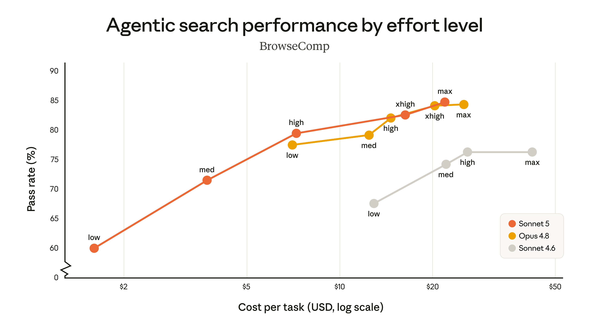
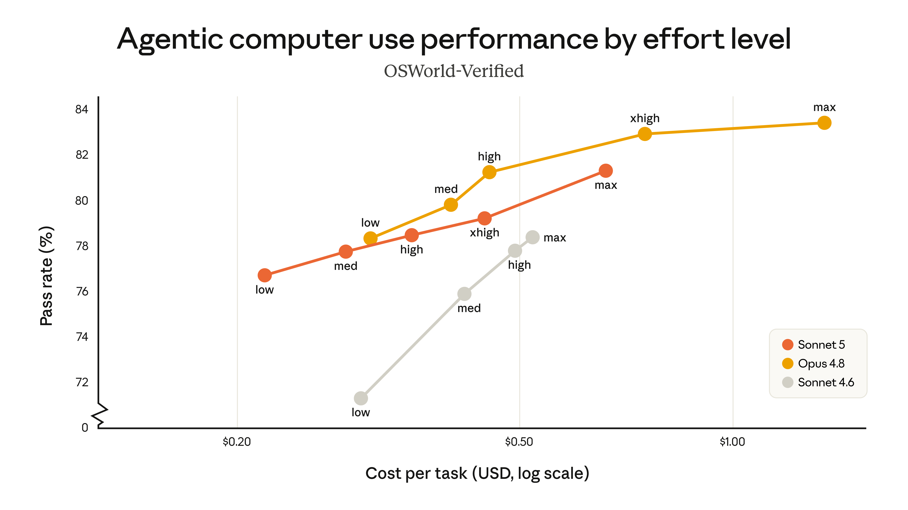
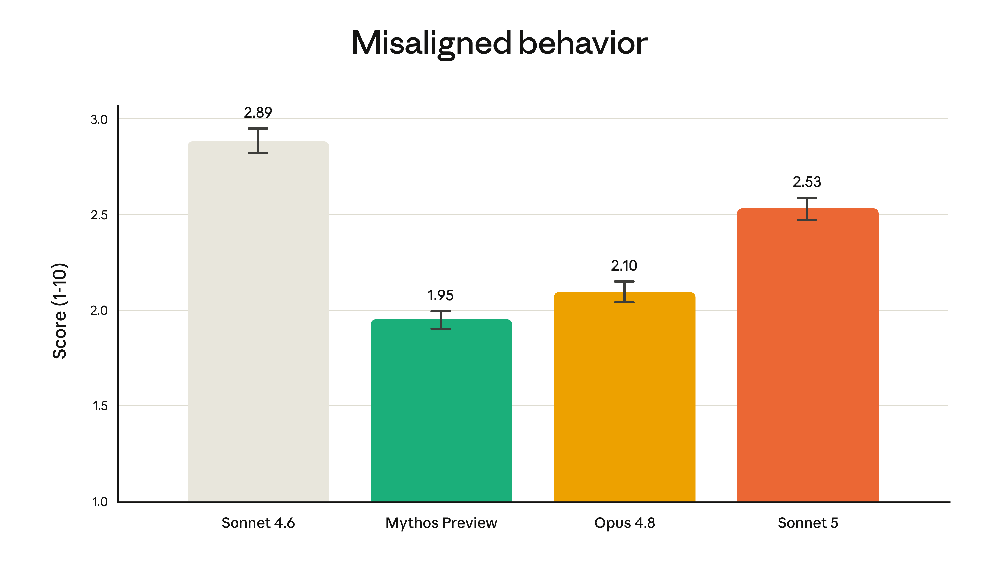
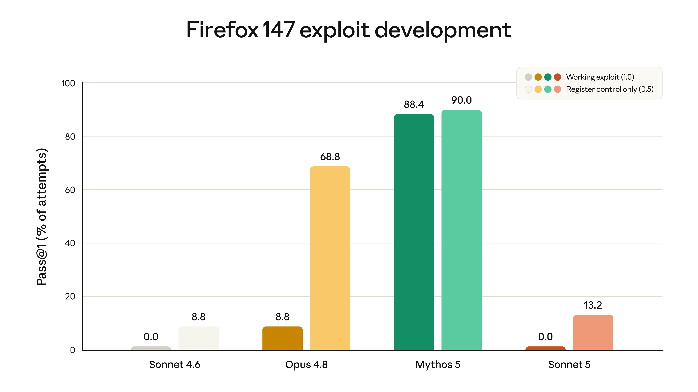

> [!info] 한 줄 요약
> **Claude Sonnet 5는 ‘가장 에이전트다운 Sonnet’** 이다. Anthropic의 메시지는 명확하다. Opus급 모델이 담당하던 장기 계획·도구 사용·코딩 후속 검증 능력을 더 싼 Sonnet 가격대로 끌어내렸다는 것이다.

Anthropic이 [Claude Sonnet 5](https://www.anthropic.com/news/claude-sonnet-5)를 공개했다. 공식 표현을 그대로 옮기면, Sonnet 5는 “몇 달 전만 해도 더 크고 비싼 모델이 필요했던 수준”의 자율 계획, 브라우저·터미널 도구 사용, 장기 실행 능력을 Sonnet 라인으로 가져온 모델이다.

이번 발표의 핵심은 단순한 벤치마크 상승이 아니다. **AI 제품의 기본 단위가 ‘대화형 챗봇’에서 ‘일을 끝까지 밀어붙이는 에이전트’로 바뀌고 있다는 신호** 에 가깝다. Sonnet 5는 그 전환을 고급 모델 전용 기능이 아니라 일상적 개발·업무 자동화 가격대로 내리는 포지션이다.

---

## 무엇이 달라졌나

Anthropic은 Sonnet 5를 Sonnet 4.6 대비 다음 네 축에서 큰 개선으로 설명한다.

1. **추론** — 더 긴 작업을 계획하고 중간 상태를 유지한다.
2. **도구 사용** — 브라우저, 터미널, API 같은 외부 도구를 더 안정적으로 다룬다.
3. **코딩** — 복잡한 코드베이스에서 디버깅, 테스트 작성, 수정 검증까지 이어간다.
4. **지식 작업** — 검색·정리·분석형 업무에서 더 높은 완주율을 보인다.

중요한 표현은 “성능이 Opus 4.8에 가깝지만 더 낮은 가격”이라는 부분이다. 기존에는 복잡한 에이전트 워크플로우에 Opus급 모델을 붙이는 것이 자연스러웠다면, Sonnet 5는 **대부분의 제품·개발 자동화에서 기본 실행 모델로 고려할 수 있는 지점** 을 노린다.

TechCrunch 보도도 같은 축으로 해석한다. 에이전트 능력이 이제 프런티어 모델 회사들의 기본 경쟁 조건이 됐고, 차별점은 “누가 더 잘하느냐”뿐 아니라 **누가 더 싸고 안정적으로 수행하느냐** 로 이동하고 있다는 것이다.

---

## 가격: 8월 31일까지는 전환 보조 가격

Claude Platform 기준 가격은 다음과 같다.

| 기간 | 입력 100만 토큰 | 출력 100만 토큰 |
|---|---:|---:|
| 2026년 8월 31일까지 | $2 | $10 |
| 이후 표준 가격 | $3 | $15 |

주의할 점이 하나 있다. Sonnet 5는 업데이트된 tokenizer를 사용한다. Anthropic은 같은 입력이 콘텐츠 유형에 따라 **약 1.0–1.35배 더 많은 토큰** 으로 계산될 수 있다고 설명한다. 그래서 8월 말까지의 할인 가격은 전환 비용을 대략 중립적으로 맞추기 위한 장치에 가깝다.

즉, “표면 단가가 싸다”만 보면 안 되고, 실제 워크로드에서는 다음을 같이 봐야 한다.

- 기존 Sonnet 4.6 대비 토큰 수가 얼마나 늘어나는지
- effort level을 올렸을 때 품질 향상이 비용 증가를 정당화하는지
- Opus 4.8로 보내던 작업 중 Sonnet 5로 내려도 되는 비율이 얼마나 되는지

내 생각엔 이 모델의 진짜 가성비는 **단일 요청 단가** 가 아니라 **Opus로 라우팅하던 작업을 얼마나 Sonnet으로 흡수할 수 있느냐** 에서 나온다.

---

## Effort level: 성능을 ‘모델 선택’이 아니라 ‘예산 조절’로 다룬다

발표에서 눈에 띄는 부분은 [effort](https://platform.claude.com/docs/en/build-with-claude/effort) 수준에 따른 비용-성능 곡선이다. Anthropic은 BrowseComp 같은 agentic search 평가와 OSWorld-Verified 같은 computer use 평가에서 Sonnet 5가 Sonnet 4.6보다 명확히 개선됐고, 일부 고 effort 설정에서는 Opus 4.8에 근접한다고 말한다.

이건 제품 설계 관점에서 꽤 중요하다. 예전에는 보통 이렇게 라우팅했다.

- 가벼운 일 → Haiku / Flash급
- 일반 작업 → Sonnet급
- 어려운 에이전트 작업 → Opus급

Sonnet 5 이후에는 다음 구조가 더 자연스러워진다.

- 기본 실행 → Sonnet 5 low/medium effort
- 복잡한 멀티스텝 작업 → Sonnet 5 high effort
- 정말 판단이 어려운 연구·설계·최종 검토 → Opus 4.8

모델 라우팅이 “어떤 모델이냐”에서 “같은 모델에 얼마만큼 사고 예산을 줄 것이냐”로 조금 더 이동하는 셈이다.

---

## Claude Code에 주는 의미

이번 발표에서 개발자들이 가장 바로 체감할 부분은 Claude Code다. Anthropic은 Sonnet 5를 Claude Code와 Claude Platform에 동시에 제공한다고 밝혔다.

Sonnet 5의 포지션은 Claude Code 사용자에게 특히 잘 맞는다.

- 버그를 재현하는 테스트를 먼저 작성한다.
- 수정 후 테스트로 검증한다.
- 필요하면 변경을 되돌려 원인이 맞는지 확인한다.
- 코드베이스 컨벤션을 따라 여러 파일을 건드린다.
- 중간에 멈추지 않고 끝까지 마무리한다.

공식 발표에 인용된 초기 사용자 피드백도 대체로 이 지점을 말한다. 이전 Sonnet 모델은 중간에 멈추거나 “여기까지 했으니 다음은 사람이 하라”는 식으로 끝나는 경우가 있었는데, Sonnet 5는 더 자주 **tested, verified result** 까지 간다는 이야기다.

이건 코딩 에이전트에서 매우 큰 차이다. 코딩 모델의 체감 품질은 “정답을 아는가”보다 **끝까지 검증 루프를 닫는가** 에서 갈리는 경우가 많다. 그래서 Sonnet 5는 단순 코드 생성기라기보다 **저렴한 실행 레이어(execution layer)** 에 가깝다.

관련해서 이전에 정리한 [[claude-code-dynamic-workflows-harness-2026-06-03|Claude Code 동적 워크플로우]] 글과 함께 보면 좋다. Sonnet 5는 그 워크플로우의 기본 작업자 모델로 들어갈 가능성이 높다.

---

## 안전성: 더 에이전트다워졌지만, 사이버 쪽은 Opus보다 낮게 유지

Anthropic은 Sonnet 5가 Sonnet 4.6보다 전반적으로 더 안전하다고 주장한다.

공식 발표에서 언급된 개선점은 다음과 같다.

- 악의적 요청 거부가 더 일관적이다.
- prompt injection 공격에 대한 저항성이 개선됐다.
- hallucination과 sycophancy 비율이 Sonnet 4.6보다 낮다.
- 자동 행동 감사에서 misaligned behavior가 전반적으로 줄었다.

다만 모든 안전 지표에서 최상위는 아니다. Anthropic은 Sonnet 5가 Opus 4.8이나 Claude Mythos Preview보다 일부 misaligned behavior 평가에서는 높게 나왔다고 적었다. 대신 위험한 사이버 능력은 현재 Opus 모델보다 낮다고 강조한다.

특히 Mozilla와 협력한 Firefox 147 취약점 평가에서 Sonnet 계열은 완전 작동 exploit을 만들지 못했고, Sonnet 5도 full exploit 성공률은 0.0%로 보고됐다. 다만 Sonnet 4.6보다 partial success가 소폭 높아졌기 때문에, Anthropic은 Sonnet 5에도 실시간 사이버 safeguards를 기본 적용한다.

요약하면 이렇다.

> Sonnet 5는 더 강한 에이전트 모델이지만, Anthropic은 위험한 사이버 작업 능력은 Opus 계열보다 낮은 단계로 유지하면서 safeguards로 막는 전략을 택했다.

---

## 그래서 누구에게 중요한가

### 1. Claude Code를 많이 쓰는 개발자

가장 직접적인 수혜자다. Opus를 항상 켜기 부담스러웠던 작업 — 리팩터링, 테스트 보강, 중간 규모 버그 수정, 코드베이스 탐색 — 에 Sonnet 5 high effort를 먼저 붙여볼 만하다.

### 2. 업무 자동화·RPA·노코드 에이전트 제품

Zapier 사례처럼 “Salesforce 계정 등급을 갱신하고, 엔터프라이즈 연락처에 런칭 메일을 보내라” 같은 두세 단계 업무를 끝까지 수행하는 능력이 중요하다. 이 영역에서는 모델의 최고 지능보다 **실행 안정성, 거부 정확도, 비용** 이 더 중요하다.

### 3. 에이전트 제품을 만드는 스타트업

Sonnet 5는 기본 worker 모델로 매력적이다. Opus를 모든 요청에 쓰지 않고도 꽤 높은 완주율을 얻을 수 있다면, 제품 마진 구조가 달라진다.

### 4. 연구·분석 워크플로우 운영자

BrowseComp류 agentic search 개선은 리서치 자동화에 직접 연결된다. 다만 중요한 최종 판단이나 장기 전략 수립은 여전히 Opus 4.8 또는 별도 검증 루프를 붙이는 편이 안전하다.

---

## 내 결론: “Opus 대체”보다 “Sonnet 기본값의 상향”이 핵심

Sonnet 5를 “Opus 4.8을 대체하나?”로 보면 조금 빗나간다. Anthropic의 메시지는 그보다 미묘하다.

- 최고 정확도와 어려운 판단은 여전히 Opus.
- 하지만 대부분의 에이전트 실행은 이제 Sonnet으로 충분해지는 방향.
- effort level로 비용-성능을 조절하면서 Opus 호출을 줄인다.

그래서 실무적으로는 이렇게 접근하는 게 좋아 보인다.

1. 기존 Sonnet 4.6 워크로드는 Sonnet 5로 바로 A/B 테스트한다.
2. 기존 Opus 4.8 워크로드 중 “실행형 작업”은 Sonnet 5 high effort로 내려본다.
3. 최종 판단, 고위험 변경, 깊은 연구 요약은 Opus 또는 별도 검증 모델을 유지한다.
4. tokenizer 변화 때문에 실제 토큰 사용량과 비용을 반드시 로그로 비교한다.

Sonnet 5는 화려한 “최강 모델” 발표라기보다, 더 중요하게는 **에이전트 경제의 단가를 낮추는 모델** 이다. AI 제품을 만드는 입장에서는 이쪽이 훨씬 실질적이다.

---

## 참고 자료

- Anthropic, [Introducing Claude Sonnet 5](https://www.anthropic.com/news/claude-sonnet-5)
- Anthropic, [Claude Sonnet 5 System Card](https://www.anthropic.com/claude-sonnet-5-system-card)
- TechCrunch, [Anthropic launches Claude Sonnet 5 as a cheaper way to run agents](https://techcrunch.com/2026/06/30/anthropic-launches-claude-sonnet-5-as-a-cheaper-way-to-run-agents/)
