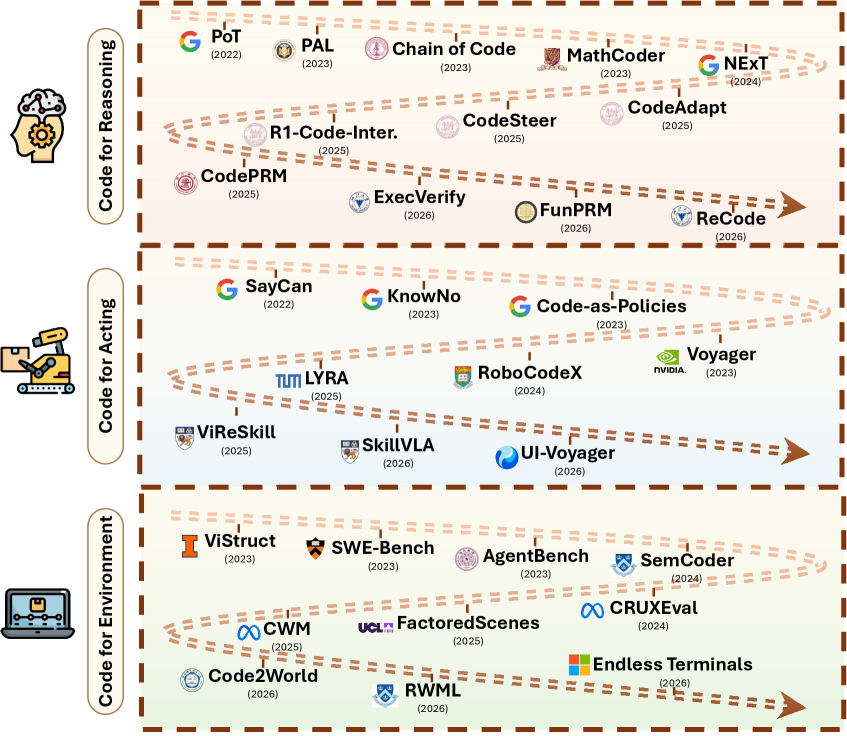
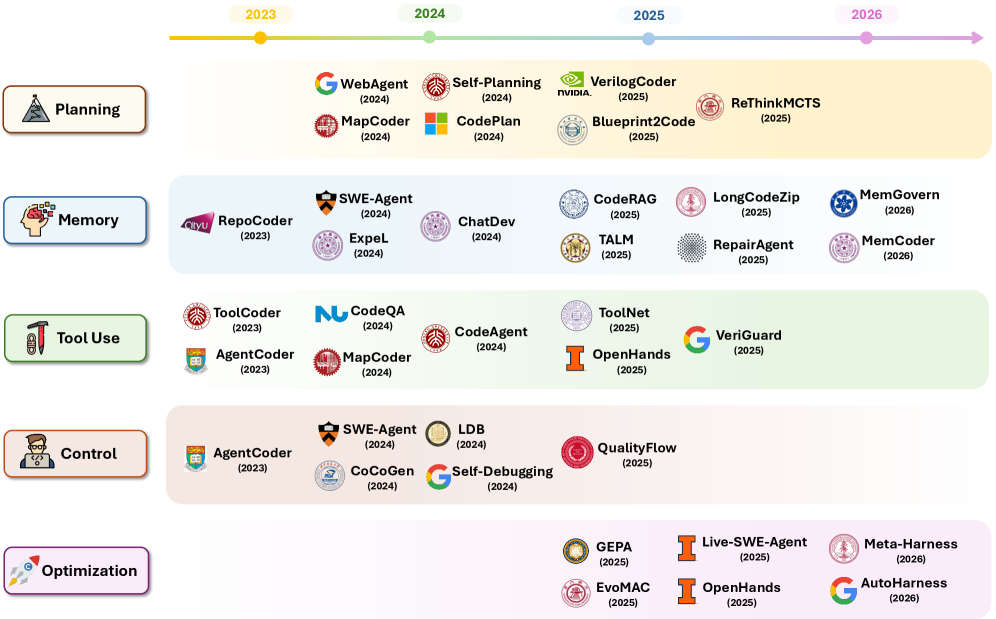
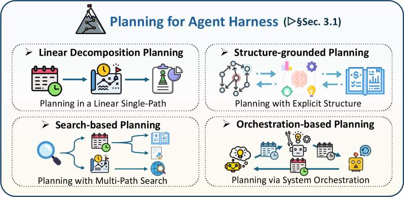
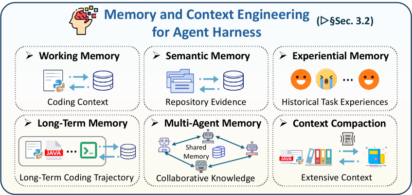
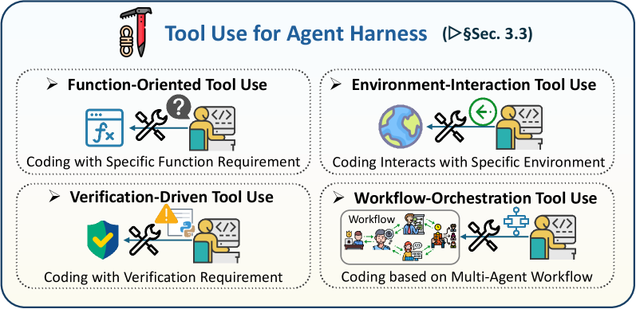
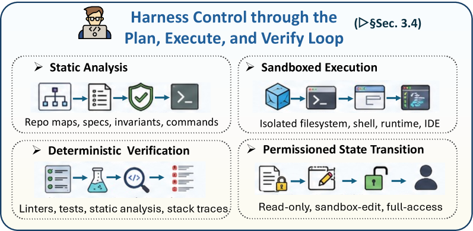
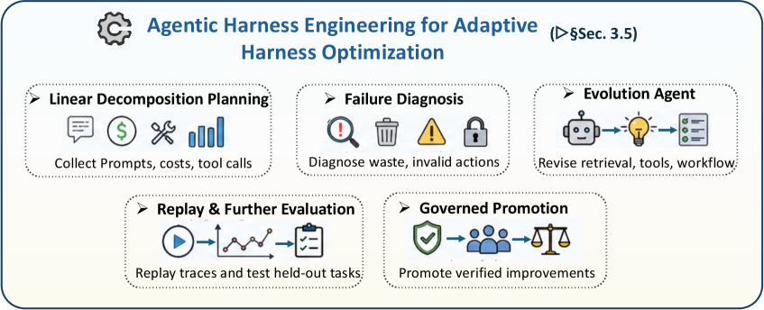
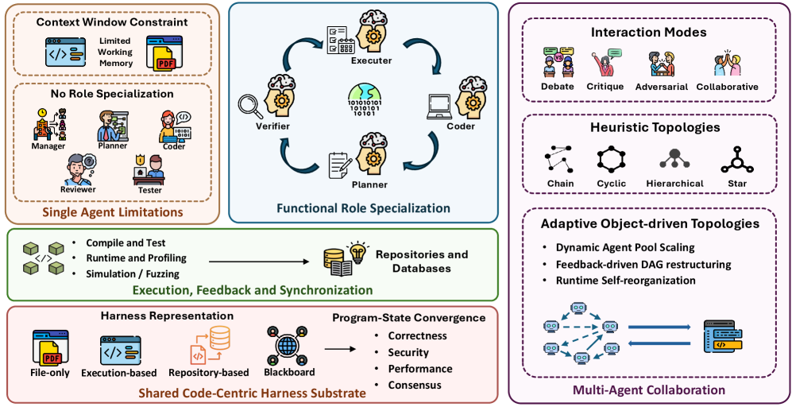
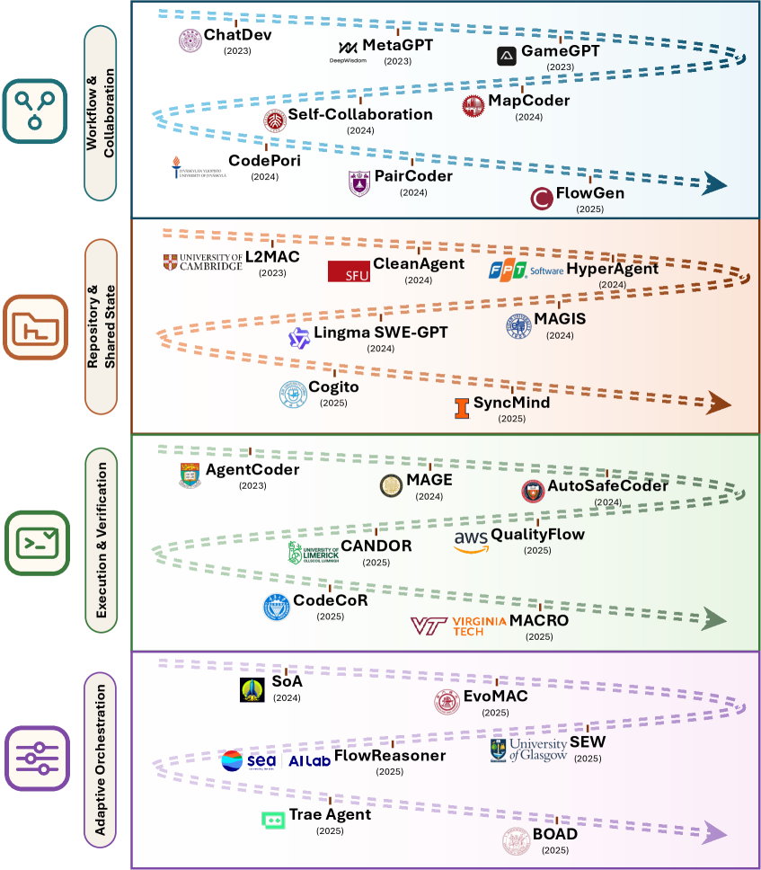
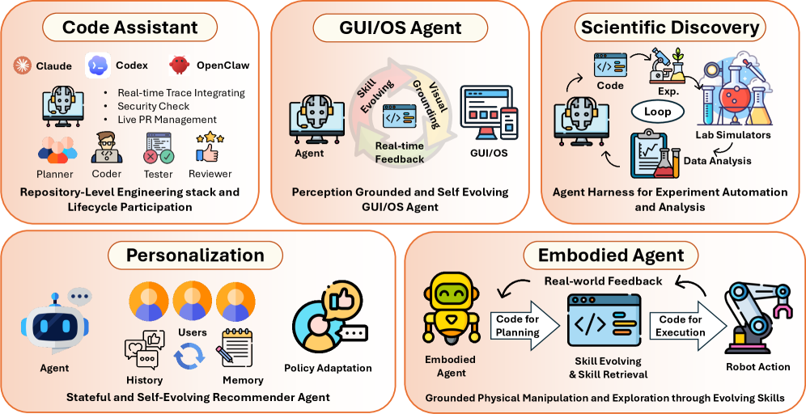

> 원문: [Code as Agent Harness: Toward Executable, Verifiable, and Stateful Agent Systems](https://arxiv.org/abs/2605.18747) (arXiv:2605.18747)
> 저자: Xuying Ning, Katherine Tieu, Dongqi Fu, Tianxin Wei 외 (UIUC / Meta / Stanford)
> GitHub: [Awesome-Code-as-Agent-Harness-Papers](https://github.com/YennNing/Awesome-Code-as-Agent-Harness-Papers)

## 한 문장 요약

> **코드는 더 이상 LLM이 "생성하는 결과물"이 아니다. 에이전트가 추론하고, 행동하고, 환경을 모델링하고, 피드백을 받아 수정하는 "실행 가능한 인프라"다.**

이 논문은 이 관점을 **Code as Agent Harness**라는 이름으로 정의하고, 102쪽에 걸쳐 체계적으로 정리합니다.

## 왜 이 논문이 중요한가

Claude Code, Codex, Cursor 같은 코딩 에이전트를 써보면, 단순히 "코드를 잘 짜주는" 게 아니라는 걸 느낍니다. 에이전트는 파일을 읽고, 테스트를 돌리고, 에러를 보고 수정하고, 다시 실행합니다. 이 **루프 전체**를 감싸는 소프트웨어 레이어가 바로 **harness(하네스)**입니다.

이 논문은 그 하네스 안에서 **코드가 어떤 역할을 하는지**를 세 가지 레이어로 나눕니다:

1. **Harness Interface** — 코드가 에이전트와 환경을 연결하는 인터페이스
2. **Harness Mechanisms** — 계획, 기억, 도구 사용, 피드백 루프
3. **Scaling the Harness** — 멀티에이전트 협업에서 코드의 역할

## 레이어 1: Harness Interface — 코드가 연결하는 세 가지

### 코드로 추론하기 (Code for Reasoning)

LLM이 머릿속에서 계산하는 대신, **코드로 계산을 외부화**합니다. PAL(Program-Aided Language models)이 대표적인 예입니다. 복잡한 수학 문제를 파이썬으로 풀게 만들어서, 중간 계산 과정을 실행으로 검증합니다.

여기서 핵심은 **검증 가능하다**는 점입니다. 자연어로 "따라서 답은 42다"라고 하는 것과, 코드를 실행해서 42가 나오는 건 완전히 다른 신뢰도입니다.

### 코드로 행동하기 (Code for Acting)

에이전트가 환경에 행동할 때, 자연어 지시 대신 **실행 가능한 프로그램**을 생성합니다. 로봇이 움직이는 궤적을 코드로 짜고, GUI 자동화가 DOM 조작 스크립트를 만들고, 코딩 에이전트가 파일을 직접 수정합니다.

Voyager(마인크래프트 에이전트)가 좋은 예입니다. 게임 내 행동을 자바스크립트 함수로 만들어서 실행하고, 성공하면 "스킬 라이브러리"에 저장합니다. 실패하면 에러 메시지를 보고 수정합니다.

### 코드로 환경 모델링하기 (Code for Environment)

에이전트가 세상을 이해하는 방식도 코드로 바뀝니다. SWE-bench 같은 벤치마크에서는 코드베이스 전체가 환경입니다. 실행 트레이스, 테스트 결과, 커밋 히스토리가 환경의 상태가 되고, 에이전트는 그걸 읽고 수정합니다.

## 레이어 2: Harness Mechanisms — 에이전트를 지속 가능하게

인터페이스만으로는 부족합니다. 긴 작업을 안정적으로 수행하려면 **계획, 기억, 도구, 피드백 루프**가 필요합니다.

### 계획 (Planning)

에이전트가 "이걸 어떻게 해결하지?"를 결정하는 방식:

- **선형 분해**: 큰 작업을 순차적 서브태스크로 쪼갬
- **구조 기반 계획**: 코드 구조(AST, 파일 트리)에 맞춰 계획
- **탐색 기반 계획**: 여러 경로를 시도해보고 최적 선택
- **오케스트레이션**: 워크플로우 엔진이 단계를 관리

### 기억 (Memory)

에이전트가 맥락을 유지하는 방식:

- **작업 기억**: 현재 작업 중인 코드, 실행 결과, 에러 로그
- **의미 기억**: 레포지토리의 구조, 함수 시그니처, API 문서
- **경험 기억**: 과거에 성공/실패한 패턴
- **장기 기억**: 여러 세션에 걸쳐 축적된 지식

### 도구 사용 (Tool Use)

에이전트가 외부 도구를 어떻게 찾고, 선택하고, 만드는지:

- 함수 호출(API, CLI)
- 환경 상호작용(파일 시스템, 브라우저)
- 검증 도구(린터, 테스트 러너)
- 워크플로우 오케스트레이션

### PEV 루프: Plan → Execute → Verify

이 논문의 핵심 개념 중 하나가 **PEV 루프**입니다. 에이전트가 계획을 세우고(Plan), 실행하고(Execute), 결과를 검증(Verify)하는 사이클을 반복합니다.

이게 단순한 "코딩 → 실행 → 디버깅"과 다른 이유는, **하네스 레벨에서 통제**한다는 점입니다. 샌드박스에서 실행하고, 권한 경계를 설정하고, 롤백 가능하게 관리합니다.

### 하네스 엔지니어링 (Harness Engineering)

가장 흥미로운 부분 중 하나입니다. 하네스 자체를 자동으로 개선하는 **진화 에이전트(Evolution Agent)** 개념을 소개합니다.

텔레메트리(실행 로그, 성공률, 에러 패턴)를 수집하고, 그걸 기반으로 하네스 설정(프롬프트, 도구 구성, 실행 파라미터)을 자동으로 튜닝합니다. CI/CD 파이프라인처럼, 하네스 자체도 지속적으로 개선되는 구조입니다.

## 레이어 3: Scaling the Harness — 멀티에이전트

단일 에이전트에서 **여러 에이전트가 코드를 공유하며 협업**하는 구조로 확장됩니다.

### 역할 분담

- **Manager**: 작업을 할당하고 우선순위 결정
- **Planner**: 아키텍처를 설계하고 서브태스크 분해
- **Coder**: 실제 코드 작성
- **Reviewer**: 코드 리뷰, 버그 발견
- **Tester**: 테스트 케이스 작성 및 실행

MetaGPT, ChatDev, AutoGen 같은 시스템이 여기에 해당합니다.

### 협업 모드

- **협력적**: 같은 목표를 위해 코드를 작성하고 리뷰
- **적대적**: 레드팀/디베이트를 통해 코드 품질 향상
- **검증 중심**: 테스트와 코드를 별도 에이전트가 작성

### 공유 코드 기반

멀티에이전트 시스템에서 가장 어려운 문제는 **일관된 상태 유지**입니다. 여러 에이전트가 같은 레포지토리를 동시에 수정할 때, Git의 브랜치/PR/머지 프로세스가 그대로 적용됩니다. 코드가 곧 "공유 상태"가 됩니다.

## 5가지 응용 분야

1. **코드 어시스턴트**: SWE-bench, Claude Code, Codex — 라이브 레포 위에서 패치, 테스트, 이슈 해결
2. **GUI/OS 에이전트**: 웹/데스크톱 자동화 — DOM 트리와 접근성 API를 코드로 조작
3. **임베디드 에이전트**: 로봇 제어 — 실행 가능한 정책과 시뮬레이터 피드백
4. **과학 발견**: 가설-실험-분석 파이프라인을 코드로 구성
5. **개인화/추천**: 사용자 프로필과 피드백을 코드 기반 정책으로 관리

## 남은 과제 (Open Problems)

논문이 던지는 중요한 질문들:

- **평가**: 최종 결과만으로 충분한가? 과정 자체를 어떻게 평가할 것인가?
- **검증**: 실행 피드백만으로 "올바른 코드"를 보장할 수 없는 경우
- **무회귀 개선**: 하네스를 개선하다가 기존 기능이 망가지는 문제
- **공유 상태**: 멀티에이전트 간 의미 충돌 해결
- **안전**: 인간 개입(human-in-the-loop)이 필수적인 영역에서의 제어
- **멀티모달**: 코드+이미지+오디오가 결합되는 환경으로의 확장

## 내 생각

이 논문은 **"코딩 에이전트"**라는 주제를 단순히 "LLM이 코드를 잘 짜는 기술"로 보지 않고, **"코드가 에이전트 시스템의 인프라가 되는 패러다임 전환"**으로 프레이밍합니다.

실제로 Claude Code나 Codex를 쓰면서 느끼는 건, 모델 자체의 코딩 능력보다 **주변 인프라(하네스)의 완성도**가 체감 품질을 더 크게 좌우한다는 점입니다. 좋은 에러 메시지, 빠른 피드백 루프, 안전한 샌드박싱 — 이게 다 하네스입니다.

Sebastian Raschka의 [Components of A Coding Agent](https://magazine.sebastianraschka.com/p/components-of-a-coding-agent)와 맥락이 통하는 논문인데, 훨씬 더 학술적이고 포괄적인 프레임워크를 제공합니다. 코딩 에이전트 생태계를 한눈에 이해하고 싶다면 이 102쪽을 꼭 읽어보시길.

---

**참고 링크:**
- 논문: <https://arxiv.org/abs/2605.18747>
- PDF: <https://arxiv.org/pdf/2605.18747>
- GitHub: <https://github.com/YennNing/Awesome-Code-as-Agent-Harness-Papers>
